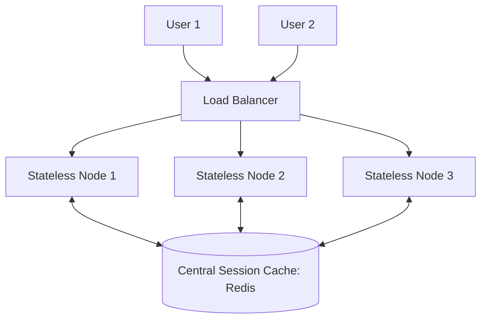
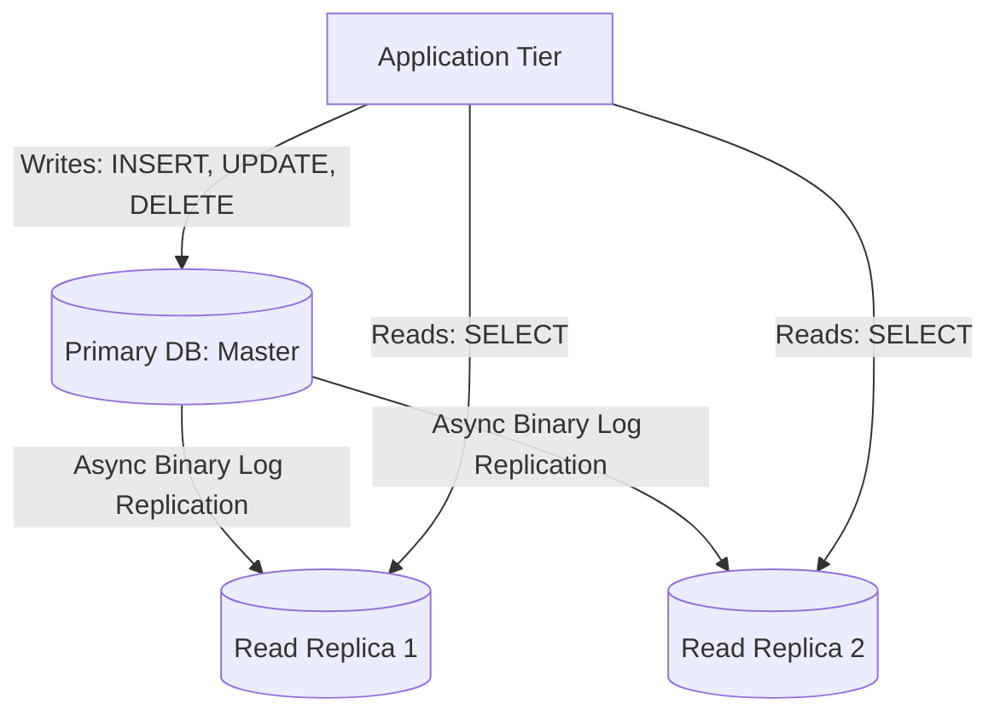
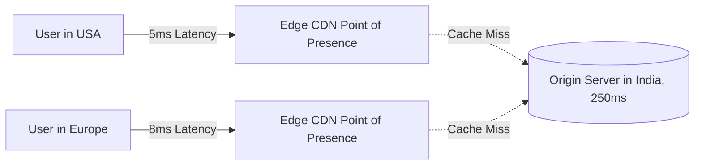
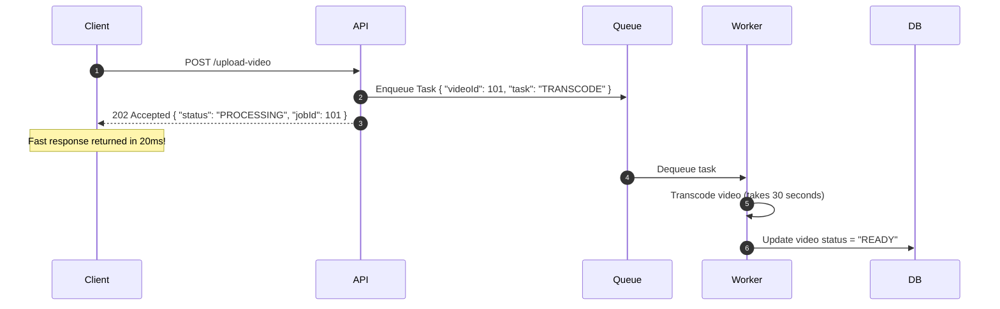
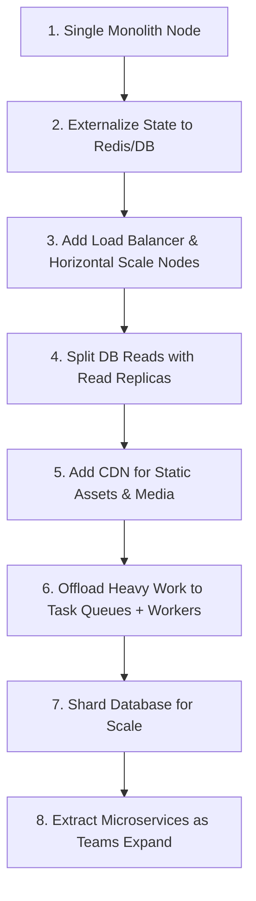

# 📈 Backend Scaling & Performance — Part 2

> **Core Philosophy**: Scaling beyond a single server requires a fundamental shift: **make servers completely stateless → balance incoming load → scale reads via replicas → scale writes/storage via sharding → push static content & edge computation to CDNs → offload non-critical paths to async background workers**.

---

## 📑 Table of Contents
1. [Stateless Application Servers](#1-stateless-application-servers)
2. [Load Balancing Algorithms & Health Checks](#2-load-balancing-algorithms--health-checks)
3. [Database Scaling: Read Replicas & Replication Lag](#3-database-scaling-read-replicas--replication-lag)
4. [Database Sharding & Sharding Keys](#4-database-sharding--sharding-keys)
5. [Content Delivery Networks (CDN) & Edge Computing](#5-content-delivery-networks-cdn--edge-computing)
6. [Asynchronous Processing & Background Workers](#6-asynchronous-processing--background-workers)
7. [Monolith vs. Microservices Architecture](#7-monolith-vs-microservices-architecture)
8. [Serverless Computing & Event-Driven Architecture](#8-serverless-computing--event-driven-architecture)
9. [Architecture Evolution Map & Interview Cheat Sheet](#9-architecture-evolution-map--interview-cheat-sheet)

---

## 1. Stateless Application Servers

To scale horizontally behind a load balancer, application servers **must be stateless**.

```
❌ Stateful Server: User session stored in Server A's RAM. If Server A crashes, User is logged out.
✅ Stateless Server: User session stored in Shared Redis or JWT Token. Any server can handle any request.
```



---

## 2. Load Balancing Algorithms & Health Checks

A **Load Balancer (LB)** acts as a reverse proxy distributing incoming requests across healthy servers.

### Core Load Balancing Algorithms:

| Algorithm | Mechanism | Best Use Case |
| :--- | :--- | :--- |
| **Round Robin** | Sequential distribution ($1 \rightarrow 2 \rightarrow 3 \rightarrow 1$) | Homogeneous servers with equal request processing times. |
| **Least Connections** | Routes to server with the fewest active TCP connections | Long-lived requests, WebSocket servers, complex DB queries. |
| **Weighted Round Robin** | Allocates higher proportion to more powerful servers | Heterogeneous hardware fleets. |
| **IP / Consistent Hash** | Hashes client IP to ensure same client hits same node | Caching affinity (when state cannot be externalized). |

### Health Checks (Liveness & Readiness):
- Load balancers periodically send heartbeat probes (e.g., `GET /health` every 5s).
- If a server fails 3 consecutive health checks, it is **automatically removed from the routing pool**.

---

## 3. Database Scaling: Read Replicas & Replication Lag

Most web applications have a **read-heavy workload** ($90\%$ reads, $10\%$ writes).



### The Replication Lag Problem:
Because replication is asynchronous, a small delay exists ($\approx 10\text{ms} - 500\text{ms}$) before a write appears in the read replica.

#### The "Read-Your-Own-Writes" Inconsistency:
```
1. User posts a tweet (Write to Primary DB)
2. App redirects user to Profile Page (Read from Read Replica)
3. Replica hasn't received replication event yet!
4. User sees empty profile and thinks tweet was deleted!
```

### Solutions for Replication Lag:
1. **Read from Primary after Write**: Route user's reads to Primary for the first 5 seconds after a write.
2. **Track Version / Monotonic Timestamps**: Client sends transaction timestamp; replica waits until caught up.

---

## 4. Database Sharding & Sharding Keys

When data volume exceeds the storage capacity of a single machine or write throughput bottlenecks on the Primary, we **shard (horizontally partition)** the database.

```
                  Router / Shard Key (user_id)
                   /           |           \
                  ↓            ↓            ↓
             [Shard 1]     [Shard 2]    [Shard 3]
             (Users 1-1M) (Users 1M-2M) (Users 2M-3M)
```

### Choosing the Sharding Key:
- **Good Sharding Key (`user_id`)**: Distributes queries uniformly across all shards.
- **Bad Sharding Key (`created_at`)**: All new writes hit the latest shard, causing a massive **hotspot**.

### Sharding Trade-offs:
- ❌ Cross-shard `JOIN` operations become extremely slow and complex.
- ❌ Distributed transactions across shards require 2-Phase Commit (2PC) or Saga patterns.

---

## 5. Content Delivery Networks (CDN) & Edge Computing



- **CDN (Content Delivery Network)**: Geographically distributed cache for static assets (images, CSS, JS, videos).
- **Edge Computing (Cloudflare Workers, Lambda@Edge)**: Running lightweight code/functions at edge PoPs (e.g., A/B testing, JWT auth validation, geolocation routing).

---

## 6. Asynchronous Processing & Background Workers

Never block a user-facing HTTP request with long-running operations.



### Standard Async Use Cases:
- Sending transactional emails & SMS notifications
- Video transcoding & image thumbnail generation
- Heavy report generation & PDF exports
- Third-party webhook deliveries

---

## 7. Monolith vs. Microservices Architecture

```
        Modular Monolith                           Microservices
   ┌───────────────────────────┐         ┌──────────┐     ┌──────────┐
   │ ┌───────┐ ┌─────────────┐ │         │  Users   │     │  Orders  │
   │ │ Users │ │   Orders    │ │         └────┬─────┘     └────┬─────┘
   │ └───────┘ └─────────────┘ │              │ (gRPC/HTTP)    │
   │ ┌───────┐ ┌─────────────┐ │         ┌────┴─────┐     ┌────┴─────┐
   │ │Payment│ │Notifications│ │         │ Payments │     │  Notify  │
   │ └───────┘ └─────────────┘ │         └──────────┘     └──────────┘
   └───────────────────────────┘
```

| Dimension | Monolith | Microservices |
| :--- | :--- | :--- |
| **Codebase & Deployment** | Single repository, 1 build artifact | Multiple repositories, independent CI/CD pipelines |
| **Communication** | In-memory function calls (0ms) | Network RPC / HTTP ($2-20\text{ms}$) |
| **Failure Domain** | Memory leak can crash entire app | Fault isolated to single microservice |
| **Team Scaling** | Merge conflicts in large teams | Independent team ownership & velocity |
| **Operational Overhead**| Low | Very high (Kubernetes, Tracing, Service Mesh) |

> [!IMPORTANT]
> **Interview Rule**: Start with a clean Modular Monolith. Only transition to Microservices when organizational team size, independent scaling, or deployment velocity justifies the distributed complexity.

---

## 8. Serverless Computing & Event-Driven Architecture

**Serverless (e.g., AWS Lambda, Google Cloud Functions)** abstracts server provisioning:

```
Trigger (File uploaded to S3 / Message in SQS) ──▶ Spawn Function Container ──▶ Execute ──▶ Destroy
```

- **Pros**: Zero idle cost, automatic scaling from 0 to 10,000 instances.
- **Cons**: Cold starts ($\approx 100\text{ms}-2\text{s}$), execution time limits (max 15 minutes), statelessness constraints.

---

## 9. Architecture Evolution Map & Interview Cheat Sheet



### 🎯 Placement Problem-to-Solution Matrix:
- **Server state prevents horizontal scaling?** $\rightarrow$ Externalize sessions to Redis / use JWTs.
- **Heavy read volume on DB?** $\rightarrow$ Add Read Replicas + Caching.
- **Data too big for single DB disk?** $\rightarrow$ Database Sharding.
- **High latency for global users?** $\rightarrow$ Edge CDN + Edge compute.
- **API timeouts on heavy operations?** $\rightarrow$ Async message queues + worker pools.
