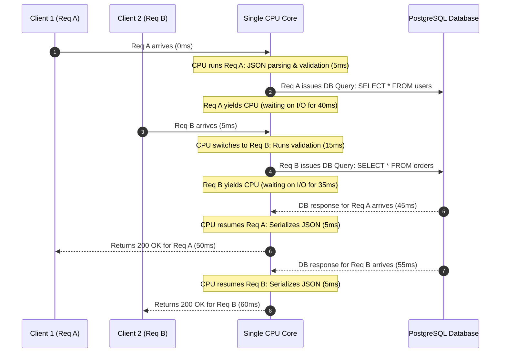
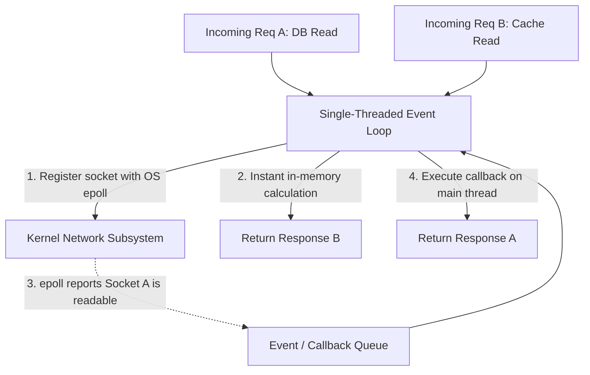
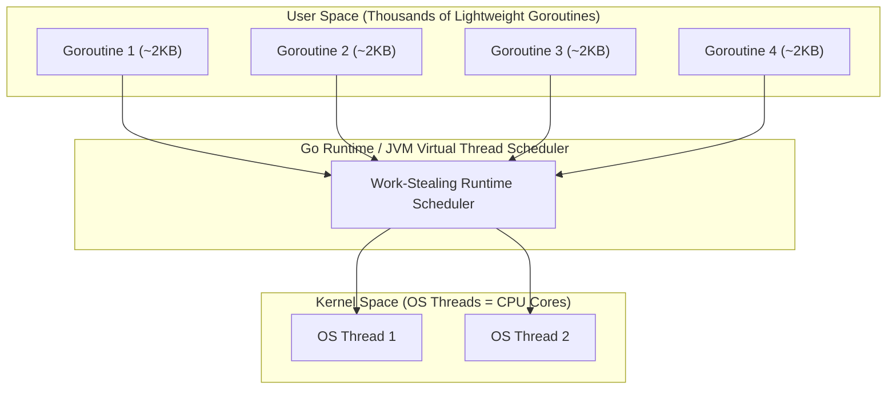

# ⚡ Concurrency & Parallelism in Backend Systems

> **Core Philosophy**: Concurrency is about **dealing with lots of things at once** (structure); Parallelism is about **doing lots of things at once** (execution).  
> In modern backend systems, **I/O-bound operations account for over 70%–90% of latency**. Concurrency reclaims idle CPU cycles while waiting on databases and network calls.

---

## 📑 Table of Contents

- [1. Why Concurrency Matters: The Cost of Synchronous I/O](#1-why-concurrency-matters-the-cost-of-synchronous-io)
- [2. I/O-Bound vs. CPU-Bound Workloads](#2-io-bound-vs-cpu-bound-workloads)
- [3. Concurrency vs. Parallelism](#3-concurrency-vs-parallelism)
- [4. Visualizing Concurrent Request Handling (1-Core Interleaving)](#4-visualizing-concurrent-request-handling-1-core-interleaving)
- [5. The OS Threading Model & Its Overhead](#5-the-os-threading-model--its-overhead)
- [6. The Event Loop Architecture (Non-Blocking I/O)](#6-the-event-loop-architecture-non-blocking-io)
- [7. Async/Await Under the Hood: Compiler State Machines](#7-asyncawait-under-the-hood-compiler-state-machines)
- [8. Goroutines & Virtual Threads (M:N User-Space Scheduling)](#8-goroutines--virtual-threads-mn-user-space-scheduling)
- [9. Race Conditions & Shared Mutable State (Threads vs. Async/Await)](#9-race-conditions--shared-mutable-state-threads-vs-asyncawait)
- [10. Synchronization Solutions: Mutexes, Locks & Channels](#10-synchronization-solutions-mutexes-locks--channels)
- [11. Optimistic vs. Pessimistic Locking in Databases](#11-optimistic-vs-pessimistic-locking-in-databases)
- [12. 1-Page Master Revision Cheat Sheet & Placement Q&A](#12-1-page-master-revision-cheat-sheet--placement-qa)

---

## 1. Why Concurrency Matters: The Cost of Synchronous I/O

> 💡 **Quick Revision Anchor (2-3 Words)**: `Reclaim Idle CPU`

### The Problem with Synchronous Servers
If a web server processes requests strictly **synchronously** (one at a time):
- When a user sends a request requiring a database query, the server sends bytes over the socket and sits **completely idle** waiting for database network packets.
- Latency scales with distance:
  - **Localhost DB**: $\approx 1 - 2\text{ ms}$
  - **Same Cloud Region / Availability Zone**: $\approx 20 - 30\text{ ms}$
  - **Cross-Region / Remote Data Center**: $\approx 90 - 100\text{ ms}$

### Quantifying the Waste (The Hardware Perspective)
- A modern server CPU operates at roughly **$3\text{ GHz}$**, executing **$\approx 3\text{ billion instructions per second}$** ($\mathbf{3\text{ million instructions per millisecond}}$).
- If your server sits idle for $100\text{ ms}$ waiting for a database response:
  $$\text{Wasted CPU Potential} = 100\text{ ms} \times 3,000,000\text{ instructions/ms} = \mathbf{300,000,000\text{ instructions!}}$$
- Instead of executing $300\text{ million}$ instructions from other waiting users, the CPU executed **zero**.

### The 95% Idle Reality of Backend APIs
A standard enterprise API endpoint typically executes:
1. 3 to 5 database queries (User lookup, permissions, fetch records).
2. 1 to 2 external network calls (Redis cache, third-party payment/email API).

```
Total Request Duration: ~260 ms
┌──────────────────────────────────────────────────────────┬────────┐
│  Network / Database I/O Wait Time: ~250 ms (96.1%)       │CPU:10ms│
└──────────────────────────────────────────────────────────┴────────┘
▲                                                          ▲
Waiting for network packets (CPU idle)                     JSON parsing, validation
```

$$\text{CPU Idle Ratio} = \frac{250\text{ ms (Waiting)}}{260\text{ ms (Total)}} \approx \mathbf{96\%\text{ Wasted Resources}}$$

> [!IMPORTANT]
> **Core Goal of Concurrency**: Concurrency is NOT about making a single database query finish faster. It is about **putting the CPU to work on other requests while Request A is waiting on I/O**, driving CPU utilization from 5% to 80%+.

[⬆ Back to Top](#📑-table-of-contents)

---

## 2. I/O-Bound vs. CPU-Bound Workloads

> 💡 **Quick Revision Anchor (2-3 Words)**: `Waiting vs Calculating`

| Dimension | I/O-Bound Workloads | CPU-Bound Workloads |
|---|---|---|
| **Bottleneck** | Database, Network, Disk, External APIs, File uploads. | CPU clock speed, ALU cores, RAM bandwidth. |
| **Typical Tasks** | Web APIs, DB queries, Microservice orchestration, Logging. | Cryptography / JWT signing, Video/Image encoding, ML matrix math. |
| **Server Behavior** | CPU idle $>90\%$ of the time, waiting for socket bytes. | CPU pinned at $100\%$, actively executing instructions. |
| **Primary Solution** | **Concurrency** (Async/Await, Event Loops, Virtual Threads). | **Parallelism** (Multi-core CPUs, Worker Pools, GPU offloading). |

[⬆ Back to Top](#📑-table-of-contents)

---

## 3. Concurrency vs. Parallelism

> 💡 **Quick Revision Anchor (2-3 Words)**: `Dealing vs Doing`

- **Parallelism is about DOING multiple things at once**:
  - Requires **hardware support** (at least 2 physical or logical CPU cores).
  - Two instructions execute at the exact same physical clock cycle.
- **Concurrency is about DEALING with multiple things at once**:
  - Can be achieved on a **single CPU core**.
  - About program **structure**: decomposing tasks so they can be started, paused, interleaved, and resumed.

```
Concurrency (1 CPU Core, Interleaved Time-Slicing)
Time ──▶
Core 1: [Task A][Task B][Task A][Task B][Task A]

Parallelism (Multiple CPU Cores, Simultaneous Execution)
Core 1 ──▶ [Task A][Task A][Task A]
Core 2 ──▶ [Task B][Task B][Task B]
```

> [!NOTE]
> *"Concurrency is about structure; Parallelism is about execution. Concurrency is dealing with a lot of things at once; Parallelism is doing a lot of things at once."* — Rob Pike (Co-creator of Go)

[⬆ Back to Top](#📑-table-of-contents)

---

## 4. Visualizing Concurrent Request Handling (1-Core Interleaving)

> 💡 **Quick Revision Anchor (2-3 Words)**: `Interleaved Request Lifecycle`

Even with only **one CPU core**, a backend server can handle multiple requests concurrently without blocking:



- At any single millisecond, the single CPU core executes only **one** instruction.
- However, from the clients' perspective, **both requests are actively in progress simultaneously**.
- Zero CPU cycles are wasted while waiting for the database to return data.

[⬆ Back to Top](#📑-table-of-contents)

---

## 5. The OS Threading Model & Its Overhead

> 💡 **Quick Revision Anchor (2-3 Words)**: `Kernel Thread Cost`

An Operating System **Thread** is the smallest execution unit managed directly by the OS kernel.

```
Process (Isolated Memory Space, Heap, File Descriptors)
 ├── Thread 1 (Program Counter, CPU Registers, Call Stack: ~1MB)
 ├── Thread 2 (Program Counter, CPU Registers, Call Stack: ~1MB)
 └── Thread 3 (Program Counter, CPU Registers, Call Stack: ~1MB)
```

### Preemptive Scheduling
- The OS scheduler assigns each thread a **time-slice** (quantum, $\approx 1-2\text{ ms}$).
- When the quantum expires, the OS scheduler **preempts** (forcibly pauses) the thread, saves its state, and switches to another thread.
- If a thread calls a blocking socket read, it notifies the kernel and transitions to the **BLOCKED** state until network packets arrive.

### Why "1 Thread Per Request" Fails at Scale (The 3 Overheads):
1. **Memory Allocation Overhead**:
   - Each OS thread allocates a dedicated call stack ($\approx 1\text{MB}$ in Linux/Java).
   - $10,000\text{ concurrent requests} \times 1\text{MB stack} = \mathbf{10\text{ GB RAM}}$ just for idle thread stacks!
2. **Thread Creation Overhead**:
   - Spawning an OS thread requires a kernel system call (`clone`/`pthread_create`), allocating kernel data structures and instruction pointers ($\approx 100\mu\text{s} - 1\text{ms}$).
3. **Context Switching CPU Waste**:
   - To switch threads, the CPU must:
     - Save current CPU registers and Program Counter to memory.
     - Flush translation lookaside buffers (TLB) and invalidate L1/L2 CPU caches.
     - Restore the new thread's registers.
   - Cost: $\approx 1 - 10\mu\text{s}$ per switch. With thousands of active threads, the CPU spends more time switching contexts than executing actual code!

[⬆ Back to Top](#📑-table-of-contents)

---

## 6. The Event Loop Architecture (Non-Blocking I/O)

> 💡 **Quick Revision Anchor (2-3 Words)**: `Single-Thread Multiplexing`

Instead of creating thousands of threads, an **Event Loop** (Node.js, NGINX, Redis, Python asyncio) uses **a single thread** combined with OS-level I/O multiplexing:
- **Linux**: `epoll`
- **macOS**: `kqueue`
- **Windows**: `IOCP`



### ⚠️ The Golden Rule of Event Loops: NEVER BLOCK THE EVENT LOOP
Because the event loop runs on a **single thread**, any long CPU-bound operation blocks all other waiting connections:
```javascript
// ❌ DISASTER in Node.js: Blocks the entire server for 5 seconds!
app.get("/compute", (req, res) => {
    const end = Date.now() + 5000;
    while (Date.now() < end) {} // Event loop completely frozen! 10,000 other users timed out!
    res.send("Done");
});
```

[⬆ Back to Top](#📑-table-of-contents)

---

## 7. Async/Await Under the Hood: Compiler State Machines

> 💡 **Quick Revision Anchor (2-3 Words)**: `Compiler State Machine`

`async` and `await` do **NOT** spawn background threads. They are syntactic sugar that the compiler transforms into a **State Machine**.

### Developer Code:
```javascript
async function fetchUserData(userId) {
    const user = await db.getUser(userId);      // Await point 1
    const orders = await db.getOrders(user.id);  // Await point 2
    return { user, orders };
}
```

### What the Compiler Generates (State Machine Representation):
```javascript
function fetchUserDataStateMachine(userId) {
    let state = 0;
    let user = null;
    let orders = null;

    return function step(lastResult) {
        switch (state) {
            case 0:
                state = 1;
                // Issue non-blocking query, register step as callback, yield CPU!
                return db.getUser(userId).then(step);

            case 1:
                user = lastResult;
                state = 2;
                // Issue second query, register step as callback, yield CPU!
                return db.getOrders(user.id).then(step);

            case 2:
                orders = lastResult;
                return { user, orders }; // Finished!
        }
    };
}
```

### Two Essential Insights:
1. **Why `await` is only allowed inside `async`**: The compiler can only transform functions explicitly marked as `async` into state machine closures.
2. **Why yielding is cheap**: At each `await`, the function simply returns control to the event loop. No OS registers or stack pointers need saving.

[⬆ Back to Top](#📑-table-of-contents)

---

## 8. Goroutines & Virtual Threads (M:N User-Space Scheduling)

> 💡 **Quick Revision Anchor (2-3 Words)**: `Lightweight User Threads`

Languages like Go (Goroutines) and modern Java 21+ (Virtual Threads / Project Loom) bridge the gap between simple synchronous syntax and non-blocking performance using **M:N User-Space Schedulers**:

$$M \text{ User Goroutines (Tiny } \approx 2\text{KB stack)} \xrightarrow[\text{Runtime Scheduler}]{\text{Multiplexed onto}} N \text{ OS Kernel Threads (Matching CPU Cores)}$$



### How Go's Standard Library Scales (`net/http`)
In Go, `http.ListenAndServe` automatically spawns a brand-new Goroutine for **every incoming connection**:
```go
// Inside Go standard library (net/http/server.go):
for {
    rw, err := l.Accept()
    if err != nil { continue }
    c := s.newConn(rw)
    go c.serve(connCtx) // 👈 Spawns new Goroutine for EVERY HTTP request!
}
```
- Because a Goroutine starts with only **$\approx 2\text{KB}$ of stack** (compared to $1\text{MB}$ for an OS thread), a server can easily hold **$100,000+$ concurrent Goroutines** in memory without crashing!
- When a Goroutine blocks on a database query, the Go runtime intercepts the call in user space, parks the Goroutine, and immediately swaps another Goroutine onto the OS thread without invoking the kernel scheduler.

[⬆ Back to Top](#📑-table-of-contents)

---

## 9. Race Conditions & Shared Mutable State (Threads vs. Async/Await)

> 💡 **Quick Revision Anchor (2-3 Words)**: `Shared State Traps`

A **Race Condition** occurs when multiple concurrent operations read and modify shared data without proper synchronization, producing unpredictable bugs depending on exact execution timing.

### 1. Multi-Threaded Lost Update Problem
Incrementing a shared counter requires 3 CPU instructions:
$$\text{1. Read into Register} \longrightarrow \text{2. Increment Register} \longrightarrow \text{3. Write back to Memory}$$

```
Timeline of Lost Update:
Thread A: Read counter (0) ───────▶ Add 1 (Reg=1) ────────▶ Write counter (1)
Thread B: ────▶ Read counter (0) ───────▶ Add 1 (Reg=1) ────────▶ Write counter (1)

Expected: 2
Actual: 1 (One update was completely lost!)
```

---

### 2. The Single-Threaded Async/Await Race Condition (The Check-Then-Act Trap)
> [!WARNING]
> **Placement Interview Trap**: *"Does single-threaded JavaScript/Node.js prevent race conditions?"*  
> **Answer: NO!** While JavaScript has no parallel memory corruption, **logical race conditions** occur whenever execution is interleaved across `await` points!

```javascript
// Shared account balance
let balance = 100;

async function withdraw(amount) {
    if (balance >= amount) {                      // 1. Check
        await processDatabaseTransaction(amount);  // 2. Yield control to Event Loop!
        balance -= amount;                         // 3. Act (Deduct)
    }
}

// Client triggers two withdrawals simultaneously:
withdraw(100); // Call 1 passes check (100 >= 100), yields at await
withdraw(100); // Call 2 runs while Call 1 is waiting! Passes check (balance is still 100!), yields at await

// Result: Both complete -> balance = 100 - 100 - 100 = -100! (Overdrawn account!)
```

[⬆ Back to Top](#📑-table-of-contents)

---

## 10. Synchronization Solutions: Mutexes, Locks & Channels

> 💡 **Quick Revision Anchor (2-3 Words)**: `Protect Critical Sections`

### 1. Mutex (Mutual Exclusion)
Ensures that **only one thread** can enter a critical section at any given time:

```python
import threading

lock = threading.Lock()
counter = 0

def safe_increment():
    global counter
    with lock: # Only 1 thread can enter this block at a time
        counter += 1
```

### 2. Read-Write Mutex (`RWMutex`)
- Multiple concurrent **Readers** are allowed simultaneously.
- Only **one Writer** is allowed (blocks all readers and writers during modification).
- Ideal for read-heavy caches (99% reads, 1% writes).

### 3. Semaphore (Counting Semaphore)
Limits concurrent access to a resource pool to at most **$K$ workers** (e.g. limiting connection pool concurrency to 10).

### 4. Message-Passing Channels (Go Model)
Instead of communicating by sharing memory with locks, threads pass data through typed channels:
> *"Do not communicate by sharing memory; instead, share memory by communicating."*

```go
func worker(jobs <-chan int, results chan<- int) {
    for n := range jobs {
        results <- n * 2 // Safe: ownership passes through channel
    }
}
```

[⬆ Back to Top](#📑-table-of-contents)

---

## 11. Optimistic vs. Pessimistic Locking in Databases

> 💡 **Quick Revision Anchor (2-3 Words)**: `Lock vs Validate`

| Dimension | Pessimistic Locking | Optimistic Locking |
|---|---|---|
| **Philosophy** | *"Conflicts will happen; lock early."* | *"Conflicts are rare; validate before commit."* |
| **Mechanism** | `SELECT ... FOR UPDATE` (Holds physical row lock). | Version numbers / Timestamps (`WHERE version = 1`). |
| **Lock Duration** | Entire transaction duration (holds DB connection). | Zero locks held during read and processing. |
| **Best For** | High contention (Ticket booking, bank transfers). | Low contention (Editing user profiles, CMS articles). |

```sql
-- Optimistic Locking in SQL:
UPDATE accounts 
SET balance = balance - 100, version = version + 1 
WHERE id = 42 AND version = 1;

-- If rows affected == 0, a concurrent transaction updated the account first! Rollback & retry.
```

[⬆ Back to Top](#📑-table-of-contents)

---

## 12. 1-Page Master Revision Cheat Sheet & Placement Q&A

```text
==================================================================================================
                        CONCURRENCY & PARALLELISM MASTER CHEAT SHEET
==================================================================================================

1. CONCURRENCY VS. PARALLELISM:
   - Concurrency = DEALING with multiple things at once (Structure, interleaving on 1+ cores).
   - Parallelism = DOING multiple things at once (Simultaneous physical execution on 2+ cores).

2. WORKLOAD CLASSIFICATION:
   - I/O-Bound (90%+ of backend): Waiting on DB/network. Optimize via Event Loops / Async / Goroutines.
   - CPU-Bound: Number crunching / crypto / encoding. Optimize via Parallelism on multiple cores.

3. HARDWARE NUMBERS:
   - Modern CPUs execute ~3 billion instructions/sec (~3 million/ms).
   - 100ms idle DB wait = 300 million wasted CPU instructions! Concurrency reclaims this waste.

4. THREADING MODELS:
   - OS Threads: Heavy (~1MB stack, kernel syscall creation, expensive context switching).
   - Event Loop: Single thread + non-blocking OS multiplexing (epoll/kqueue). Rule: NEVER BLOCK THE LOOP!
   - Virtual Threads / Goroutines: M:N user-space scheduling (~2KB stack, multiplexed onto N OS threads).

5. ASYNC / AWAIT UNDER THE HOOD:
   - Does NOT spawn OS threads. Syntactic sugar for a compiler-generated State Machine.
   - Yields execution back to the event loop at each 'await' point.

6. RACE CONDITIONS:
   - Multi-threaded: Lost updates when reading/modifying shared memory without locks.
   - Single-threaded (Node.js/Python): Check-then-act bugs across 'await' yield points.
   - Solutions: Mutexes, RWMutex, Semaphores, Channels, Database Optimistic Locking.
==================================================================================================
```

[⬆ Back to Top](#📑-table-of-contents)
