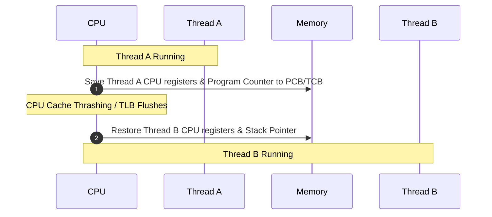
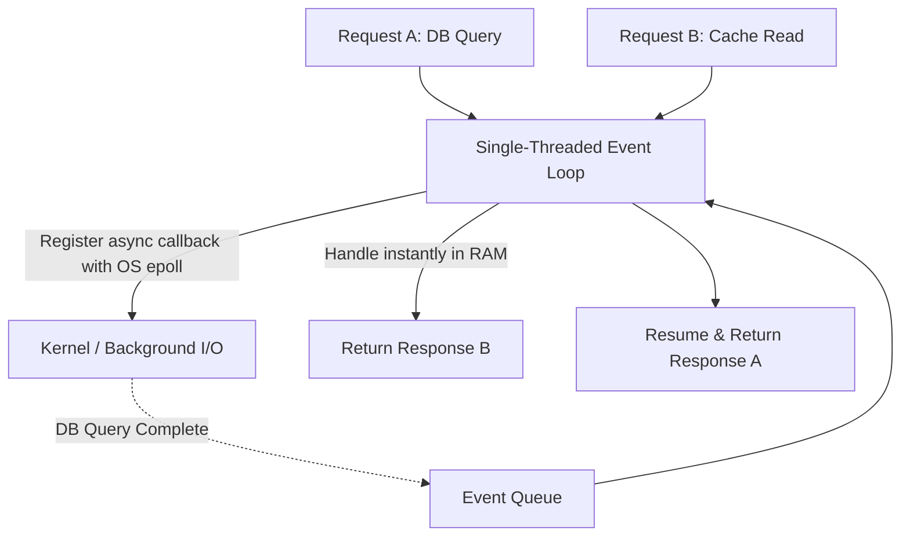

# ⚡ Concurrency & Parallelism in Backend Systems

> **Core Philosophy**: Concurrency is about **dealing with lots of things at once** (structure); Parallelism is about **doing lots of things at once** (execution). 
> I/O-bound workloads benefit strongly from **concurrency and event-driven non-blocking I/O**, while CPU-bound workloads require **multi-core hardware parallelism**.

---

## 📑 Table of Contents
1. [I/O-Bound vs. CPU-Bound Workloads](#1-io-bound-vs-cpu-bound-workloads)
2. [Concurrency vs. Parallelism](#2-concurrency-vs-parallelism)
3. [The Operating System Threading Model](#3-the-operating-system-threading-model)
4. [Context Switching & Thread Overhead](#4-context-switching--thread-overhead)
5. [The Event Loop Model (Non-Blocking I/O)](#5-the-event-loop-model-non-blocking-io)
6. [Async/Await & State Machine Under the Hood](#6-asyncawait--state-machine-under-the-hood)
7. [Goroutines & Virtual Threads (M:N Scheduling)](#7-goroutines--virtual-threads-mn-scheduling)
8. [Race Conditions & Shared Mutable State](#8-race-conditions--shared-mutable-state)
9. [Synchronization Primitives: Mutexes, Locks & Semaphores](#9-synchronization-primitives)
10. [Optimistic vs. Pessimistic Locking](#10-optimistic-vs-pessimistic-locking)
11. [Placement Interview Cheat Sheet & Key Questions](#11-placement-interview-cheat-sheet)

---

## 1. I/O-Bound vs. CPU-Bound Workloads

| Workload Type | Bottleneck | Behavior | Primary Optimization |
| :--- | :--- | :--- | :--- |
| **I/O-Bound** | Disk, Network, Database, External APIs | Spends $95\%+$ of time **waiting** for data | **Concurrency** (Event loops, Async/Await, Non-blocking I/O) |
| **CPU-Bound** | CPU cycles, ALU, Memory bandwidth | Spends $95\%+$ of time **calculating** (Crypto, Compression, Video Encoding) | **Parallelism** (Multi-core scaling, GPU acceleration) |

---

## 2. Concurrency vs. Parallelism

```
Concurrency (1 CPU Core, Time-Slicing)         Parallelism (Multiple CPU Cores)
Time ──▶                                       Core 1 ──▶ [Task A][Task A][Task A]
Core 1: [Task A][Task B][Task A][Task B]       Core 2 ──▶ [Task B][Task B][Task B]
```

- **Concurrency**: Interleaved execution of tasks on a single or multiple cores. Deals with task scheduling and waiting.
- **Parallelism**: Simultaneous physical execution on multiple distinct CPU cores.

---

## 3. The Operating System Threading Model

An OS **Thread** is the smallest schedulable unit of execution managed by the kernel:

```
Process (Isolated Memory Space, Heap)
 ├── Thread 1 (Program Counter, Registers, Stack: ~1MB)
 ├── Thread 2 (Program Counter, Registers, Stack: ~1MB)
 └── Thread 3 (Program Counter, Registers, Stack: ~1MB)
```

- Threads inside the same process share the **Heap, global variables, and open file descriptors**.
- Each thread possesses its own private **Call Stack and CPU Registers**.

---

## 4. Context Switching & Thread Overhead

Creating an OS thread for every incoming HTTP connection (e.g., traditional Apache Web Server) fails at scale due to three costs:



### The 3 Core Overhead Factors:
1. **Memory Allocation**: $10,000\text{ threads} \times 1\text{MB stack} \approx \mathbf{10\text{ GB RAM}}$ just for idle stacks!
2. **Context-Switch CPU Waste**: The CPU spends more time swapping register contexts than executing business logic.
3. **CPU Cache Invalidation**: Switching threads invalidates L1/L2 CPU caches, forcing slow RAM fetches.

---

## 5. The Event Loop Model (Non-Blocking I/O)

Instead of spawning 10,000 threads, an **Event Loop (Node.js, Python asyncio, NGINX, Redis)** uses **a single thread** with OS-level multiplexing (`epoll` in Linux, `kqueue` in macOS).



> [!WARNING]
> **The Golden Rule of Event Loops**: **NEVER BLOCK THE EVENT LOOP.**  
> If you run a heavy CPU calculation (e.g., synchronous bcrypt hash or complex loop) on the main thread, all other 10,000 waiting requests freeze!

---

## 6. Async/Await & State Machine Under the Hood

`async` / `await` does **NOT** spawn background threads. It is syntactic sugar for compiler-generated **State Machines**.

```javascript
async function handleOrder(userId) {
    const user = await getUser(userId);      // State 0 -> Yield execution
    const orders = await getOrders(user.id);  // State 1 -> Yield execution
    return orders;                           // State 2 -> Resolve
}
```

```
Compiler-Generated State Machine:
┌───────────┐    I/O wait    ┌───────────┐    I/O wait    ┌───────────┐
│  State 0  │ ─────────────▶ │  State 1  │ ─────────────▶ │  State 2  │
│(Get User) │ (Yield to Loop)│(Get Order)│ (Yield to Loop)│ (Return)  │
└───────────┘                └───────────┘                └───────────┘
```

---

## 7. Goroutines & Virtual Threads (M:N Scheduling)

Modern languages bridge the gap between simple synchronous syntax and non-blocking scale using **M:N User-Space Schedulers** (Go Goroutines, Java 21 Virtual Threads):

$$M \text{ User Goroutines (Tiny ~2KB initial stack)} \xrightarrow[\text{Runtime Scheduler}]{\text{Multiplexed onto}} N \text{ OS Kernel Threads}$$

```
Go / Java Virtual Threads:
[Goroutine 1] [Goroutine 2] [Goroutine 3] ... [Goroutine 100,000]
                      ↓ (User-space Runtime Scheduler)
                [OS Thread 1]  [OS Thread 2]  [OS Thread 3]
                      ↓
                 [CPU Core 1]   [CPU Core 2]   [CPU Core 3]
```

- When a Goroutine blocks on I/O, the Go runtime parks it in user space and swaps another Goroutine onto the OS thread in nanoseconds without kernel context switching.

---

## 8. Race Conditions & Shared Mutable State

A **Race Condition** occurs when multiple concurrent execution threads access and modify shared data without synchronization, producing results dependent on non-deterministic thread interleaving.

### The Classic Lost Update Bug:
```
Initial Shared State: balance = $100

Thread 1 (Withdraw $50)                 Thread 2 (Withdraw $50)
-----------------------                 -----------------------
1. Read balance ($100)                  1. Read balance ($100)
2. Compute new balance ($50)            2. Compute new balance ($50)
3. Write balance = $50                  3. Write balance = $50

Result: balance = $50 (One $50 withdrawal was completely lost!)
```

$$\text{Shared Mutable State} + \text{Concurrency} = \mathbf{\text{Race Conditions}}$$

---

## 9. Synchronization Primitives

### 1. Mutex (Mutual Exclusion Lock)
Guarantees that **only 1 thread** can execute inside the critical section at any given time:

```go
var mu sync.Mutex

mu.Lock()
balance = balance - 50 // Critical Section: Thread-safe
mu.Unlock()
```

### 2. Counting Semaphore
Maintains a set of permits allowing at most **$K$ concurrent threads** to access a resource (e.g., limiting max 10 concurrent database connections).

### 3. Read-Write Mutex (`RWMutex`)
- Multiple concurrent **Readers** allowed ($N$ threads can read simultaneously).
- Only **1 Writer** allowed (locks out all readers and writers during mutation).

---

## 10. Optimistic vs. Pessimistic Locking

| Dimension | Pessimistic Locking | Optimistic Locking |
| :--- | :--- | :--- |
| **Philosophy** | *"Conflicts will happen; lock early."* | *"Conflicts are rare; validate before commit."* |
| **Mechanism** | `SELECT ... FOR UPDATE` (Database row lock) | Version numbers / Timestamps (`WHERE version = 1`) |
| **Lock Duration** | Throughout the entire transaction duration | Zero row locks held during reading/computation |
| **Best For** | High contention (Ticket booking, bank transfers) | Low contention (Editing user profile, CMS articles) |

```sql
-- Optimistic Locking in SQL:
UPDATE Accounts 
SET balance = balance - 50, version = version + 1 
WHERE id = 101 AND version = 1;

-- If rows_affected == 0, conflict detected! Rollback & retry.
```

---

## 11. Placement Interview Cheat Sheet

### 🎯 5 Core Takeaways:
1. **I/O-Bound** $\rightarrow$ Waiting on network/disk $\rightarrow$ Optimize via **Concurrency / Event loops**.
2. **CPU-Bound** $\rightarrow$ Active computation $\rightarrow$ Optimize via **Parallel multi-core processing**.
3. **Context switching** consumes CPU cycles and invalidates CPU cache lines.
4. **`async/await`** is a compiler state machine; it does not magically spawn OS threads.
5. **Protect shared state** with Mutexes, Atomic operations, or Optimistic version checks.
