# 🐳 Docker — Placement & Technical Interview Master Guide (SWE / SDE / Backend)

> **Target Audience**: Software Development Engineers (SDE / SWE), Backend Developers, and Distributed Systems candidates.  
> **Core Focus**: Core fundamentals, Docker internals (namespaces & cgroups), Dockerfile optimization, multi-stage Java/Spring Boot builds, container networking (DNS & service discovery), volumes & persistence, Docker Compose orchestration, system debugging scenarios, and deep architectural defense for full-stack/microservices projects.

---

## 📑 Table of Contents

- [1. Why Docker? & The Problem It Solves](#1-why-docker--the-problem-it-solves)
- [2. What is Docker? (Core Mechanics)](#2-what-is-docker-core-mechanics)
- [3. Docker Image vs. Docker Container](#3-docker-image-vs-docker-container)
- [4. Docker Engine Architecture](#4-docker-engine-architecture)
- [5. Docker Registry & Hub Workflow](#5-docker-registry--hub-workflow)
- [6. High-Yield Docker CLI Commands](#6-high-yield-docker-cli-commands)
- [7. Dockerfile Essentials & Instruction Deep-Dive](#7-dockerfile-essentials--instruction-deep-dive)
  - [FROM, WORKDIR, COPY, RUN](#from-workdir-copy-run)
  - [CMD vs. ENTRYPOINT (Interview Gold)](#cmd-vs-entrypoint-interview-gold)
  - [EXPOSE vs. Port Mapping (`-p`)](#expose-vs-port-mapping--p)
- [8. Multi-Stage Docker Builds (Java 17 / Spring Boot)](#8-multi-stage-docker-builds-java-17--spring-boot)
- [9. Docker Image Layers, Build Context & Caching](#9-docker-image-layers-build-context--caching)
- [10. `.dockerignore` Best Practices](#10-dockerignore-best-practices)
- [11. Container vs. Virtual Machine (Deep Comparison)](#11-container-vs-virtual-machine-deep-comparison)
- [12. Container Storage: Volumes vs. Bind Mounts](#12-container-storage-volumes-vs-bind-mounts)
- [13. Docker Networking & DNS Service Discovery](#13-docker-networking--dns-service-discovery)
  - [The `localhost` Trap vs. Service Name Resolution](#the-localhost-trap-vs-service-name-resolution)
- [14. Docker Compose Orchestration](#14-docker-compose-orchestration)
  - [Dockerfile vs. Docker Compose](#dockerfile-vs-docker-compose)
  - [`build` vs. `image`](#build-vs-image)
  - [Environment Variables & `.env` Substitution](#environment-variables--env-substitution)
  - [`depends_on` vs. Actual Readiness](#depends_on-vs-actual-readiness)
- [15. Career OS Microservices Docker Architecture (Resume Defense)](#15-career-os-microservices-docker-architecture-resume-defense)
  - [System Topology & Request Flow](#system-topology--request-flow)
  - [Spring Boot Service Discovery & Eureka](#spring-boot-service-discovery--eureka)
  - [PostgreSQL Persistence Flow](#postgresql-persistence-flow)
  - [Frontend Containerization (Vite / React)](#frontend-containerization-vite--react)
- [16. Systematic Docker Debugging Runbook](#16-systematic-docker-debugging-runbook)
- [17. Placement Question Bank & Scenario Drills](#17-placement-question-bank--scenario-drills)
- [18. 1-Page Mental Revision Cheat Sheet](#18-1-page-mental-revision-cheat-sheet)

---

## 1. Why Docker? & The Problem It Solves

### The Classic Problem: *"It works on my machine!"*
In traditional development, running a backend service requires:
1. Target Language Runtime (e.g., JDK 17, Node.js 20).
2. Underlying System Libraries & OS-level packages (e.g., `libssl`, `glibc`, Alpine vs. Ubuntu headers).
3. Configuration files and environmental dependencies.
4. Database server and cache instances running locally with exact matching versions.

Differences between developer machines (macOS, Windows, Linux) and target production servers frequently trigger **environment drift**, dependency version mismatches, and subtle runtime bugs.

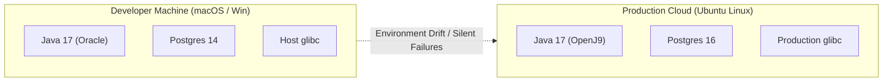

### The Docker Solution
Docker solves this by **bundling the entire application stack**—application code, runtime, system tools, libraries, and default configurations—into a single immutable, portable artifact called a **Docker Image**. This image runs inside an isolated environment called a **Container**.

> [!NOTE]
> **Key Benefit**: The exact same image tested locally runs identically across QA, Staging, and Production environments without modifying host system configurations.

---

## 2. What is Docker? (Core Mechanics)

**Standard Interview Definition**:
> Docker is an open-source containerization platform that packages an application and all its dependencies into an immutable, portable artifact called an **image**, and runs that image as an isolated lightweight process called a **container**.

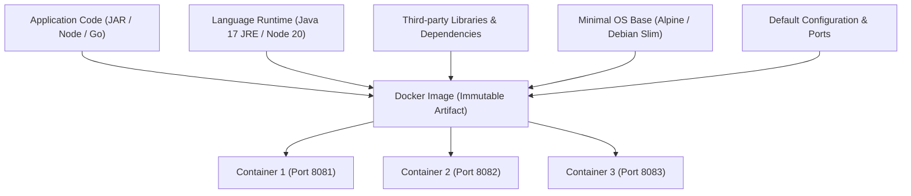

---

## 3. Docker Image vs. Docker Container

This is among the most frequently asked Docker questions in SWE/Backend interviews.

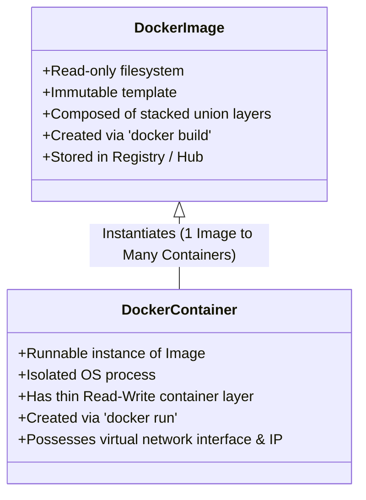

### The Java Object-Oriented Analogy

| OOP Concept | Docker Equivalent | Mental Model |
|---|---|---|
| **Class** | **Docker Image** | A defined blueprint or template with structure and specifications. Cannot execute on its own. |
| **Object** | **Docker Container** | A live, instantiated entity running in memory. Multiple objects can be instantiated from one class. |

### Technical Distinction Matrix

| Dimension | Docker Image | Docker Container |
|---|---|---|
| **State** | Passive / Immutable / Read-Only artifact | Active / Running or Stopped isolated process |
| **Filesystem** | Set of read-only stacked union filesystem layers | Read-only image layers + **1 thin writable top layer** |
| **Lifecycle** | Built (`docker build`), pulled (`docker pull`), pushed (`docker push`) | Created (`create`), started (`start`), stopped (`stop`), destroyed (`rm`) |
| **Resource Usage** | Disk space storage only | CPU, Memory, I/O, Network socket, Process ID (PID) |
| **Process Model** | Static package without active PID | Active process running on host OS kernel namespace |

> [!TIP]
> **One-Sentence Placement Answer**:  
> *"An image is an immutable, read-only template containing the application code, runtime, libraries, and configuration layers; a container is a live, isolated running process instantiated from that template with an added thin writable layer."*

---

## 4. Docker Engine Architecture

Docker uses a **Client-Server architecture**. The client talks to the Docker daemon, which does the heavy lifting of building, running, and distributing your Docker containers.

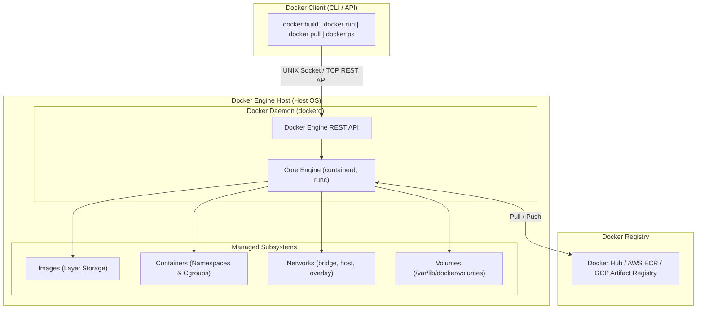

### Key Components

1. **Docker CLI (`docker`)**:
   - The user-facing command-line interface.
   - Converts user commands into HTTP REST API calls to the Docker daemon.
2. **Docker Daemon (`dockerd`)**:
   - Background persistent service running on the host system.
   - Listens for Docker API requests and manages Docker objects (images, containers, networks, and volumes).
3. **`containerd` & `runc`**:
   - `containerd` is the industry-standard container runtime that manages complete container lifecycles.
   - `runc` is the OCI (Open Container Initiative) compliant lightweight CLI tool for spawning and running containers using Linux kernel primitives (`namespaces` and `cgroups`).

---

## 5. Docker Registry & Hub Workflow

A **Docker Registry** is a centralized, stateless, highly scalable server application that stores and distributes Docker images.

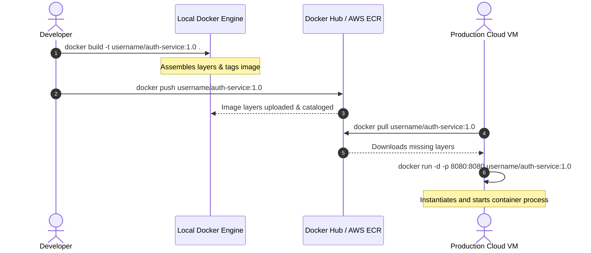

- **Docker Hub**: Public default registry hosted by Docker.
- **Private Registries**: Amazon ECR, Google Artifact Registry, Azure Container Registry, Harbor (on-prem).

---

## 6. High-Yield Docker CLI Commands

Commands tested continuously in technical interviews and production debugging:

| Command | Purpose & Practical Syntax | Interview Watch-Out / Gotcha |
|---|---|---|
| `docker build` | `docker build -t myapp:1.0 .` | The `.` denotes the **build context** (files sent to daemon), not just where the Dockerfile is. |
| `docker run` | `docker run -d --name my-app -p 8080:8080 myapp:1.0` | Creates a **brand-new** container from an image and starts it. |
| `docker start` | `docker start <container_name_or_id>` | Re-starts an **existing, stopped** container (does NOT create a new one). |
| `docker ps` | `docker ps` (active) / `docker ps -a` (all including stopped) | If your container exits immediately, `docker ps` shows nothing. Always run `docker ps -a` to see exit codes. |
| `docker stop` | `docker stop <container>` | Sends `SIGTERM` (graceful shutdown for 10s default), followed by `SIGKILL` if process fails to terminate. |
| `docker kill` | `docker kill <container>` | Sends immediate `SIGKILL` without allowing graceful cleanup. |
| `docker rm` | `docker rm <container>` / `docker rm -f <container>` | Removes stopped container. `-f` forces removal of running container. |
| `docker rmi` | `docker rmi <image_id>` | Removes an image from local host layer store. Cannot delete if containers exist from it. |
| `docker logs` | `docker logs -f --tail 100 <container>` | Essential debugging tool. Streams stdout/stderr from inside the container. |
| `docker exec` | `docker exec -it <container> sh` | Enters a running container interactively with a TTY terminal (`-i` interactive, `-t` TTY). |
| `docker inspect`| `docker inspect <container>` | Dumps full JSON metadata (IP address, volume mounts, env variables, health status). |
| `docker system prune` | `docker system prune -a --volumes` | Reclaims disk space by deleting dangling images, stopped containers, and unused volumes. |

---

## 7. Dockerfile Essentials & Instruction Deep-Dive

A `Dockerfile` is an automated text script containing sequentially ordered instructions to assemble a Docker image.

```dockerfile
# 1. Specify minimal base image
FROM eclipse-temurin:17-jre-alpine

# 2. Establish isolated container working directory
WORKDIR /app

# 3. Copy compiled application artifact from build context
COPY target/backend-service.jar app.jar

# 4. Document container network listening port
EXPOSE 8080

# 5. Define non-overridable process entrypoint
ENTRYPOINT ["java", "-jar", "app.jar"]
```

### FROM, WORKDIR, COPY, RUN

1. **`FROM`**:
   - Defines the base image for subsequent instructions.
   - Must be the first non-comment instruction in a Dockerfile.
   - *Best Practice*: Use lightweight official base images like Alpine Linux (`eclipse-temurin:17-jre-alpine` or `node:20-alpine`) to reduce attack surface and download sizes.
2. **`WORKDIR`**:
   - Sets the working directory for all subsequent `RUN`, `CMD`, `ENTRYPOINT`, `COPY`, and `ADD` instructions.
   - If directory does not exist, Docker automatically creates it.
   - *Best Practice*: Avoid using root `/`; use `/app` or `/workspace`.
3. **`COPY` vs. `ADD`**:
   - `COPY <src> <dest>`: Copies files or folders from the local build context into the container filesystem.
   - `ADD <src> <dest>`: Similar to `COPY`, but also automatically unpacks local `.tar.gz` archives and can fetch remote URLs.
   - *Best Practice*: Always prefer `COPY` for predictability and security unless tar auto-extraction is explicitly needed.
4. **`RUN`**:
   - Executes shell commands during the **image build phase** and commits the result as a new immutable image layer.
   - Example: `RUN mvn clean package` or `RUN apk add --no-cache curl`.

---

### CMD vs. ENTRYPOINT (Interview Gold)

Interviewers frequently probe whether you understand how container processes are initialized and overridden:

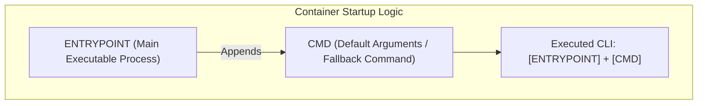

| Parameter | `ENTRYPOINT` | `CMD` |
|---|---|---|
| **Core Role** | Configures the container to run as an executable. | Provides default arguments for an `ENTRYPOINT` or sets a default command. |
| **Overridability** | Difficult to override at runtime. Requires explicit flag: `docker run --entrypoint <binary>`. | Easily overridden by passing arguments at the end of `docker run`. |
| **Standard Usage** | `ENTRYPOINT ["java", "-jar", "app.jar"]` | `CMD ["--spring.profiles.active=prod"]` |
| **Combined Behavior** | If both are specified, `CMD` values are passed as parameters into the `ENTRYPOINT` executable. |

#### Concrete Demonstration:
```dockerfile
ENTRYPOINT ["java", "-jar", "app.jar"]
CMD ["--server.port=8080"]
```
- Running `docker run myapp` executes:  
  `java -jar app.jar --server.port=8080`
- Running `docker run myapp --server.port=9090` overrides `CMD` and executes:  
  `java -jar app.jar --server.port=9090`

---

### EXPOSE vs. Port Mapping (`-p`)

> [!WARNING]
> **Common Placement Trap**: Writing `EXPOSE 8080` in a Dockerfile does **NOT** expose or publish the port to your host machine!

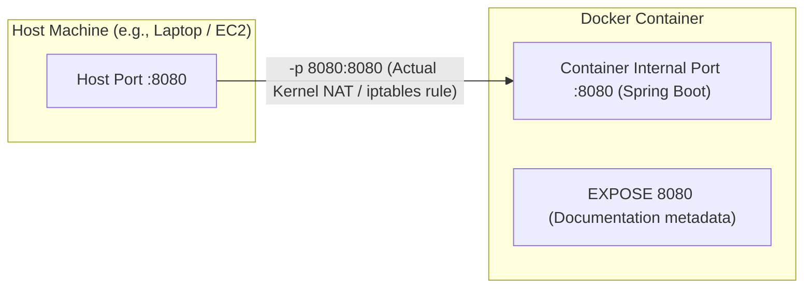

- **`EXPOSE 8080`**:
  - Acts merely as **internal documentation / metadata** between the image author and user.
  - Indicates which port the process is intended to listen on.
  - Does *not* bind to host interfaces.
- **`docker run -p <host_port>:<container_port>`**:
  - Configures **kernel-level port forwarding (Linux iptables / NAT)**.
  - `-p 9000:8080` routes external host traffic hitting `localhost:9000` directly into container port `8080`.

---

## 8. Multi-Stage Docker Builds (Java 17 / Spring Boot)

### Why Single-Stage Builds Fail in Production
A single-stage build includes the full JDK (Java Development Kit), Maven/Gradle build tools, local source code, test reports, and intermediate `.class` files.
- **Problem**: Huge image size (~800MB–1.2GB), slower deployment downloads, and dangerous security vulnerabilities (compilers and build tools left in production).

### The Multi-Stage Solution
Multi-stage builds allow you to use multiple `FROM` statements in a single Dockerfile. You can selectively copy artifacts from one stage to another, leaving behind everything you don't want in the final image.

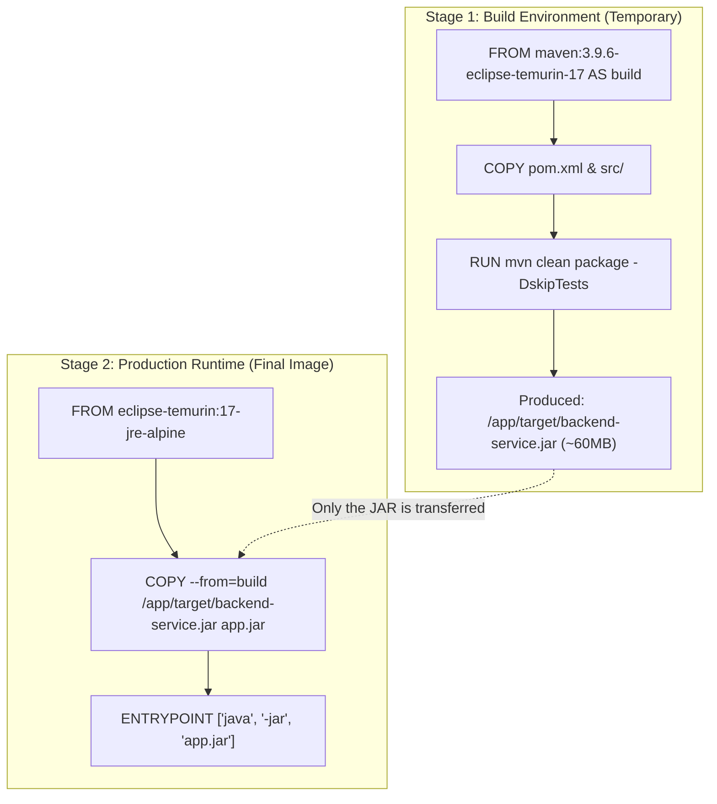

### Production Spring Boot Multi-Stage Dockerfile
```dockerfile
# =========================================================
# STAGE 1: Compilation & Packaging (Heavyweight Build Container)
# =========================================================
FROM maven:3.9.6-eclipse-temurin-17 AS build
WORKDIR /app

# Optimize layer caching: copy pom.xml first to cache Maven dependency downloads
COPY pom.xml .
RUN mvn dependency:go-offline -B

# Copy actual source code and build executable JAR
COPY src ./src
RUN mvn clean package -DskipTests

# =========================================================
# STAGE 2: Lightweight Production Runtime Container
# =========================================================
FROM eclipse-temurin:17-jre-alpine
WORKDIR /app

# Run as non-root user for enterprise container security
RUN addgroup -S appgroup && adduser -S appuser -G appgroup
USER appuser

# Extract only the final compiled artifact from the build stage
COPY --from=build --chown=appuser:appgroup /app/target/*.jar app.jar

EXPOSE 8080

ENTRYPOINT ["java", "-XX:+UseContainerSupport", "-XX:MaxRAMPercentage=75.0", "-jar", "app.jar"]
```

> [!TIP]
> **Interview Answer**:  
> *"I use multi-stage builds to decouple the build environment from the execution environment. Stage 1 utilizes a full Maven + JDK image to compile the source code into a fat JAR. Stage 2 copies solely the final `.jar` artifact into a minimal Alpine JRE image. This slashes image size from ~900MB down to ~160MB, eliminates compiler attack vectors, and accelerates deployment pipelines."*

---

## 9. Docker Image Layers, Build Context & Caching

Every instruction in a Dockerfile creates a read-only filesystem layer. Docker uses an aggressive **build cache mechanism**: if an instruction and the files it references haven't changed, Docker reuses the existing cached layer.

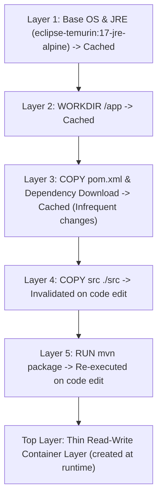

### Layer Caching Best Practice
**Always order instructions from least-frequently changing to most-frequently changing.**

❌ **Inefficient Caching**:
```dockerfile
COPY . .
RUN npm install   # Invalidated every single time ANY source code file changes!
```

✅ **Optimal Caching**:
```dockerfile
COPY package*.json ./
RUN npm install   # Reuses cached node_modules layer unless package.json changed!
COPY . .          # Only rebuilds fast source copy layer
```

---

## 10. `.dockerignore` Best Practices

When you trigger `docker build -t app .`, Docker tars up the current directory and sends it to the Docker daemon as the **Build Context**.

Without a `.dockerignore` file:
- Gigantic directories like `node_modules/`, `target/`, and `.git/` are transferred to the daemon, causing slow build startups.
- Dangerous secret files like `.env`, `id_rsa`, and local logs risk getting baked into public image layers.

### Standard Production `.dockerignore`
```gitignore
# VCS & System
.git
.gitignore
.idea
.vscode
*.sublime-project

# Java / Maven artifacts
target/
*.class
*.jar

# Node.js artifacts
node_modules/
npm-debug.log

# Environment & Credentials (CRITICAL FOR SECURITY)
.env
.env.local
*.pem
*.key
credentials.json

# Local logs & caches
logs/
*.log
.DS_Store
```

---

## 11. Container vs. Virtual Machine (Deep Comparison)

One of the fundamental placement questions to test operating system internals:

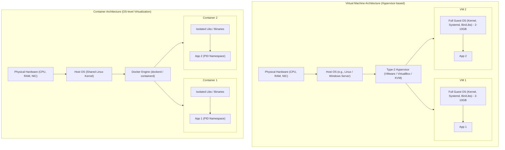

### Direct Feature Comparison

| Feature | Virtual Machine (VM) | Docker Container |
|---|---|---|
| **Virtualization Level** | **Hardware Virtualization** (Simulates CPU, memory, virtual BIOS) | **OS-Level Virtualization** (Shares the host operating system kernel) |
| **Underlying Tech** | Hypervisor (Type 1: ESXi/Xen, Type 2: KVM/VirtualBox) | Linux Kernel **Namespaces** (isolation) & **Cgroups** (resource limits) |
| **Operating System** | Each VM runs an entire independent **Guest OS** | Containers share the **Host OS Kernel**; no guest kernel overhead |
| **Startup Time** | Minutes (Bootstraps entire OS, kernel, drivers, systemd) | Milliseconds to seconds (Just starts a single host process) |
| **Resource Overhead** | Heavy memory & CPU reservation (GBs per VM) | Ultra-lightweight (MBs; only overhead of application process itself) |
| **Isolation Level** | Hard hardware isolation (Extremely secure boundary) | Process isolation (Kernel vulnerabilities can theoretically compromise host) |

> [!NOTE]
> **Kernel Primitives Behind Docker**:
> - **Linux Namespaces**: Provides process isolation (`PID` = process IDs, `NET` = network interfaces, `MNT` = mount points, `IPC` = inter-process communication, `UTS` = hostname).
> - **Control Groups (cgroups)**: Enforces resource metering and limits (restricting container to e.g., max 2 CPUs, 1GB RAM).

---

## 12. Container Storage: Volumes vs. Bind Mounts

Containers are designed to be **stateless and ephemeral**. When a container is removed (`docker rm`), any data written inside its default writable layer is permanently deleted.

To persist state (especially databases like PostgreSQL, MySQL, Redis), Docker provides two primary storage mechanisms:

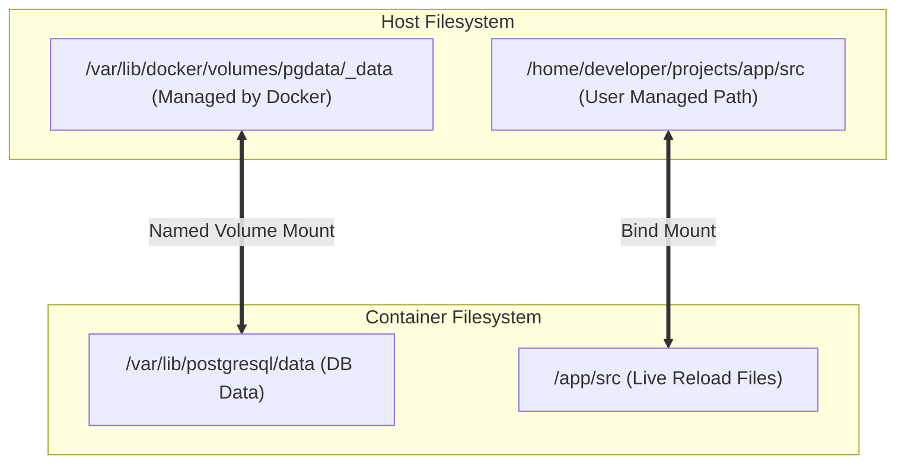

### Comparison Matrix

| Storage Type | Managed By | Path Syntax in Compose | Best Use Case |
|---|---|---|---|
| **Named Volume** | Docker Engine (`/var/lib/docker/volumes/`) | `volumes: [ pgdata:/var/lib/postgresql/data ]` | **Production Databases**, stateful backend services, data persistence across container updates. |
| **Bind Mount** | Host OS file system (Specific absolute/relative path) | `volumes: [ ./src:/app/src ]` | **Local Development** (live code reloading in React/Vite/Spring DevTools without rebuilding images). |
| **tmpfs Mount** | Host System Memory (RAM) | `tmpfs: /tmp` | Highly sensitive temporary data (keys, passwords) that should never touch persistent disk. |

---

## 13. Docker Networking & DNS Service Discovery

Docker containers are network-isolated by default. To communicate with one another or the internet, they attach to virtual Docker networks.

### Default Network Types
1. **Bridge (`bridge`)**: The default network driver. Creates an internal private software switch allowing containers on the same bridge network to communicate while providing isolation from external networks.
2. **Host (`host`)**: Removes network isolation between container and host machine. The container shares the host's network namespace directly (useful for ultra-high throughput with no NAT overhead).
3. **None (`none`)**: Completely disables all networking for the container.
4. **Overlay (`overlay`)**: Connects multiple Docker daemons across different physical machines (used in Docker Swarm and Kubernetes).

---

### The `localhost` Trap vs. Service Name Resolution

> [!CAUTION]
> **The #1 Backend Placement Trap**:  
> In your Spring Boot application properties, you write:  
> `spring.datasource.url=jdbc:postgresql://localhost:5432/mydb`  
> When launched inside Docker, the backend crashes with: `Connection refused: localhost:5432`!

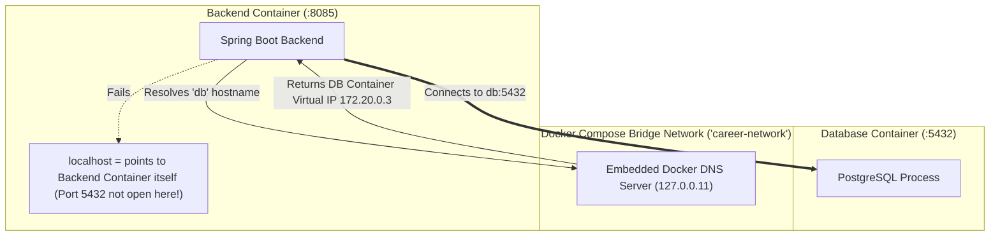

### Why it happens:
- Inside a Docker container, **`localhost` (127.0.0.1) refers strictly to that individual container's loopback network namespace**.
- The database is running in a completely separate network namespace.

### The Fix: Docker Compose DNS Service Discovery
In Docker Compose, the **service name** acts as the automatic domain name:
```yaml
services:
  db:
    image: postgres:15-alpine
  backend:
    environment:
      - DB_URL=jdbc:postgresql://db:5432/event_tracker_db   # 'db' resolves via Docker DNS!
```
Docker runs an embedded DNS server at `127.0.0.11` inside every container on a custom network. When `backend` requests `db`, Docker DNS immediately maps `db` to the dynamic IP assigned to the database container.

---

## 14. Docker Compose Orchestration

Docker Compose is a declarative tool for defining and running multi-container Docker applications via YAML specification files (`compose.yaml` or `docker-compose.yml`).

### Dockerfile vs. Docker Compose

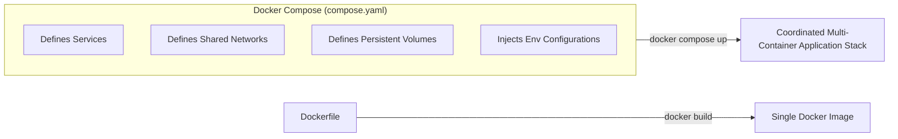

- **Dockerfile**: Defines **how to build a single container image** (OS, packages, commands, artifacts).
- **Docker Compose**: Defines **how multiple containers interact at runtime** (dependencies, ports, networks, volumes, environments).

---

### `build` vs. `image`

In Compose configurations:
- **`image: postgres:15-alpine`**: Instructs Compose to pull and run a pre-built official image directly from Docker Hub.
- **`build: ./apps/backend`**: Instructs Compose to navigate to the specified directory, locate its local `Dockerfile`, compile a custom image, and run it.

---

### Environment Variables & `.env` Substitution

Never hardcode credentials or database passwords directly into Dockerfiles or git commits! Use Compose variable substitution:

```yaml
services:
  backend:
    environment:
      - DB_USERNAME=postgres
      - DB_PASSWORD=${DB_PASSWORD:-postgres}   # Uses host/env variable, fallbacks to 'postgres'
      - JWT_SECRET=${JWT_SECRET}               # Strictly injected from .env file
```

- If `DB_PASSWORD` exists in your host environment or `.env` file, Compose injects that value.
- If missing, the syntax `:-postgres` provides a safe fallback for local development.

---

### `depends_on` vs. Actual Readiness

```yaml
services:
  backend:
    build: ./apps/backend
    depends_on:
      - db
```

> [!WARNING]
> **Critical Production Nuance**:  
> `depends_on` only guarantees **startup order**, NOT **application readiness**!  
> It instructs Docker to launch the `db` container before `backend`. However, PostgreSQL requires several seconds to initialize database files, start listeners, and create schemas. If `backend` tries connecting instantly, it will crash.

#### Production Solution: Health Checks
```yaml
services:
  db:
    image: postgres:15-alpine
    healthcheck:
      test: ["CMD-SHELL", "pg_isready -U postgres"]
      interval: 5s
      timeout: 5s
      retries: 5

  backend:
    build: ./apps/backend
    depends_on:
      db:
        condition: service_healthy    # Waits until Postgres is truly accepting connections!
```

---

## 15. Career OS Microservices Docker Architecture (Resume Defense)

This section maps directly to real-world full-stack microservice systems (e.g., **Career OS**) often presented in placement interviews.

### System Topology & Request Flow

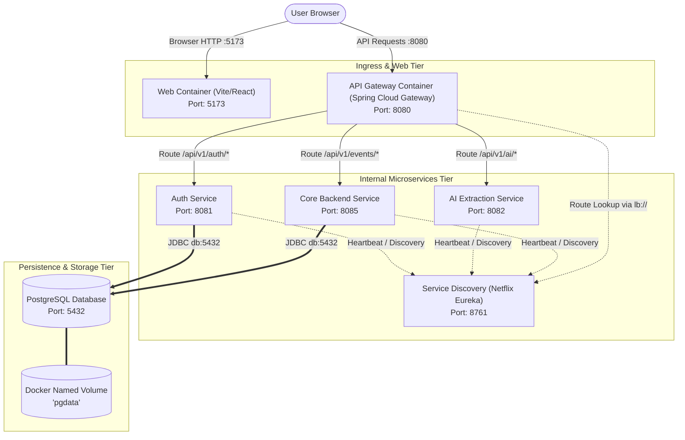

---

### Spring Boot Service Discovery & Eureka

In Dockerized microservices, containers receive dynamic IP addresses upon restart. Hardcoding IPs is impossible.
- The `service-discovery` container exposes Eureka on port `8761`.
- Microservices declare:
  ```env
  EUREKA_SERVER_URL=http://service-discovery:8761/eureka/
  ```
- Because all containers share the Compose bridge network, `service-discovery` resolves instantly to the Eureka container. Services register their presence and retrieve peer locations dynamically.

---

### PostgreSQL Persistence Flow

```yaml
services:
  db:
    image: postgres:15-alpine
    environment:
      POSTGRES_DB: event_tracker_db
      POSTGRES_USER: postgres
      POSTGRES_PASSWORD: ${DB_PASSWORD:-postgres}
    volumes:
      - pgdata:/var/lib/postgresql/data

volumes:
  pgdata:
```
- **Interview Defense**:  
  *"Even if the `db` container is stopped, deleted, or upgraded with `docker compose down`, the underlying database tables and indexes persist intact inside the `pgdata` named volume managed by Docker on the host storage engine. When `docker compose up` is executed again, the new container mounts the exact same volume."*

---

### Frontend Containerization (Vite / React)

```dockerfile
FROM node:20-alpine
WORKDIR /app

# Optimize layer caching for dependencies
COPY package*.json ./
RUN npm install --legacy-peer-deps

COPY . .

EXPOSE 5173

# Note: '--host' is mandatory to bind Vite to 0.0.0.0 instead of 127.0.0.1 inside container
CMD ["npm", "run", "dev", "--", "--host"]
```

> [!IMPORTANT]
> **The `--host` flag nuance**:  
> By default, Vite binds strictly to `localhost` (`127.0.0.1`). Inside a container, that means requests coming through Docker's port mapping from your host machine will be rejected! Adding `--host` forces Vite to bind to `0.0.0.0` (all interfaces), enabling host browser access via `http://localhost:5173`.

---

## 16. Systematic Docker Debugging Runbook

In interview scenarios, interviewers often present a failure symptom rather than asking definitions. Use this structured decision tree:

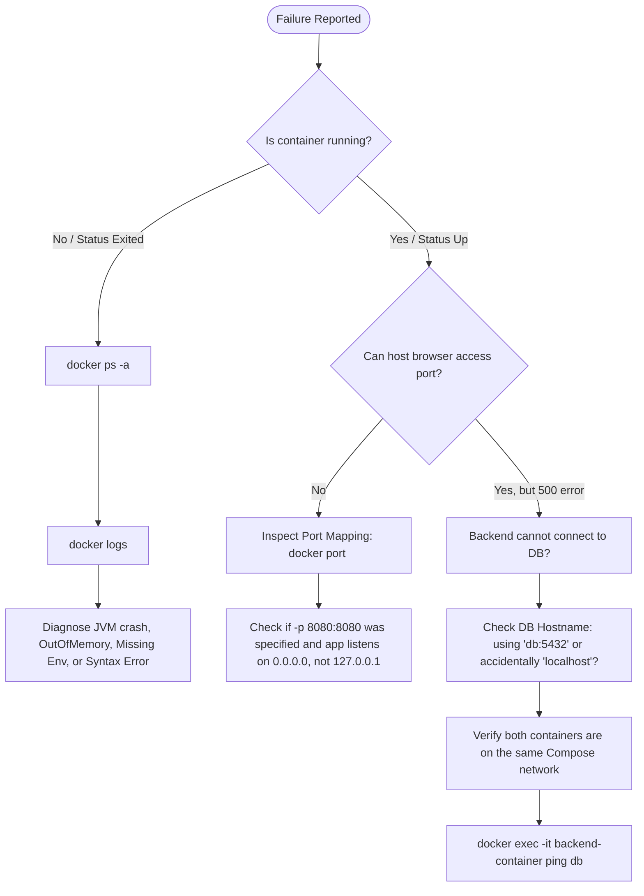

### Scenario Diagnostic Playbook

#### Scenario 1: Container starts and immediately terminates (`Exit 1` or `Exit 137`)
1. Run `docker ps -a` to inspect the exact termination status and exit code.
   - **Exit 137**: Process was killed by Linux kernel **OOM (Out Of Memory) Killer**. Increase container memory limit or tune JVM heap flags (`-XX:MaxRAMPercentage=75.0`).
   - **Exit 0**: Container main process finished execution (e.g., container ran a shell script that terminated). Remember: A container only lives as long as its PID 1 root process is running!
2. Inspect application startup crash logs:
   ```bash
   docker logs --tail 200 <container_name>
   ```

#### Scenario 2: Backend container fails to reach PostgreSQL database
1. Verify database container health: `docker ps`.
2. Inspect connection string in environment: Ensure it uses the Compose service name (`jdbc:postgresql://db:5432/...`) and **NOT** `localhost`.
3. Check shared network:
   ```bash
   docker network inspect <network_name>
   ```
   Confirm both `backend` and `db` are listed under `Containers`.
4. Test connectivity directly from inside the backend container:
   ```bash
   docker exec -it <backend_container> nc -zv db 5432
   ```

---

## 17. Placement Question Bank & Scenario Drills

### Tier 1: Must-Know Core Fundamentals (Instant Recall)

#### Q1: What happens under the hood when you run `docker run hello-world`?
1. The Docker CLI sends a REST API request to `dockerd` (Docker Daemon).
2. The daemon checks the local image store for `hello-world:latest`.
3. If not found locally, the daemon downloads (pulls) the image layers from Docker Hub.
4. The daemon calls `containerd` and `runc` to create isolated namespaces (PID, NET, MNT, IPC, UTS) and cgroup resource limits.
5. The daemon mounts a read-write top container layer above the immutable image layers.
6. The container process executes, writes "Hello from Docker!" to stdout, and exits.

#### Q2: Can a container run without an operating system?
Yes. A container does not need its own operating system kernel because it **shares the host machine's Linux kernel**. The base image (like Alpine or Debian) only provides minimal user-space binaries, system libraries (`glibc` or `musl`), and package managers. In fact, Go or Rust binaries can run inside a completely empty image called `scratch` (0 MB base OS!).

#### Q3: Why is `docker run` different from `docker start`?
- `docker run`: Reads an image, provisions a **new container**, creates a new container ID, allocates a new writable layer, and starts execution.
- `docker start`: Resumes execution of an **already existing, stopped container**, preserving its previously written local state and container ID.

---

### Tier 2: Real-World Architecture & Career OS Scenarios

#### Q4: "Why did you use Docker for your Career OS project?"
> *"Career OS is a distributed microservices platform featuring seven independent components: React frontend, Spring Cloud API Gateway, Authentication service, AI resume extraction service, Core Backend, Eureka discovery, and PostgreSQL. Running this locally without Docker requires setting up Node 20, Java 17, Maven, Python/AI dependencies, and PostgreSQL natively on every developer machine, inviting environment drift and port collisions.*  
> *Docker packages each service with its exact runtime, while Docker Compose allows bootstrapping the entire seven-service ecosystem with a single command (`docker compose up -d`), orchestrating DNS networking and volume persistence automatically."*

#### Q5: "What happens to your PostgreSQL data if you run `docker compose down` vs. `docker compose down -v`?"
- `docker compose down`: Stops and removes all containers, networks, and internal links created by Compose. However, **named volumes (like `pgdata`) are left intact on disk**. Your database data is 100% safe.
- `docker compose down -v`: The `-v` flag explicitly instructs Docker to delete attached named volumes as well. **This will wipe all database records.**

#### Q6: "How do you optimize Docker build times in CI/CD pipelines?"
1. **Leverage Docker Layer Caching**: Copy dependency descriptors (`pom.xml`, `package.json`) and trigger download steps before copying application source code.
2. **Use Multi-Stage Builds**: Keep build tools out of production images to ensure slim final layers.
3. **Maintain a strict `.dockerignore`**: Prevent uploading gigabytes of `.git`, `node_modules`, and local `target/` binaries in the build context.
4. **Use Minimal Base Images**: Choose Alpine (`alpine`) or distroless images over heavy general-purpose distros (e.g., Ubuntu).

---

## 18. 1-Page Mental Revision Cheat Sheet

```
                           THE DOCKER ARCHITECTURAL CHAIN
========================================================================================
Dockerfile           Image               Container            Compose Stack
[Build Recipe]  ==>  [Read-Only Blue]  ==>  [Live Process]  ==>  [Multi-Service Network]
Instructions:        Stacked Layers      Namespaces + cgroup  YAML Orchestrator
FROM, COPY, RUN      Cached in Hub       Thin Writable Layer  Services, Nets, Volumes
========================================================================================

1. IMAGE vs CONTAINER:
   - Image = Class (Read-only blueprint)
   - Container = Object (Running process with writable layer)

2. CMD vs ENTRYPOINT:
   - ENTRYPOINT = Immutable executable (e.g., `java -jar app.jar`)
   - CMD = Default overridable parameters (e.g., `--server.port=8080`)

3. EXPOSE vs -p:
   - EXPOSE = Metadata / documentation only (No host access)
   - -p 8080:8080 = Host NAT port forward (Makes app accessible to browser)

4. NETWORKING RULE:
   - Localhost inside container = That container ONLY.
   - Inter-container communication = Use Compose Service Name (`db:5432`, `service-discovery:8761`).

5. STORAGE:
   - Named Volumes (`pgdata:/var/lib/postgresql/data`) = Persistent, independent of container lifecycle.
   - Bind Mounts (`./src:/app/src`) = Live code editing / local dev syncing.

6. MULTI-STAGE BUILDS:
   - Stage 1 (Maven/JDK) -> Build JAR -> Discarded
   - Stage 2 (Alpine JRE) -> Copy JAR only -> Shrunk, hardened production image (~160MB vs 900MB)

7. DEBUGGING COMMANDS:
   - `docker ps -a` (Check container exit code)
   - `docker logs -f <container>` (Inspect stdout/stderr crashes)
   - `docker exec -it <container> sh` (Inspect internal container state)
```
