# 🐳 Docker — Placement Notes for SWE / SDE / Backend

> **Placement Focus**: High-frequency questions asked in campus placements and SDE 1 / Backend interviews.  
> **Core Concepts**: What is Docker, Image vs Container, Docker vs VM, Dockerfile instructions (`CMD` vs `ENTRYPOINT`, `EXPOSE` vs `-p`), Multi-stage Java builds, Docker Compose, Networking (`localhost` vs Service Name `db:5432`), Volumes (`pgdata`), Debugging scenarios, and Career OS project defense.

---

## 📑 Table of Contents

- [1. Why Docker? & What is Docker?](#1-why-docker--what-is-docker)
- [2. Image vs Container (The #1 Question)](#2-image-vs-container-the-1-question)
- [3. Container vs Virtual Machine (VM)](#3-container-vs-virtual-machine-vm)
- [4. Docker Engine Architecture](#4-docker-engine-architecture)
- [5. Docker Hub / Registry](#5-docker-hub--registry)
- [6. Must-Know Docker Commands](#6-must-know-docker-commands)
  - [`docker run` vs `docker start`](#docker-run-vs-docker-start)
- [7. Dockerfile & Core Instructions](#7-dockerfile--core-instructions)
  - [FROM, WORKDIR, COPY, RUN](#from-workdir-copy-run)
  - [CMD vs ENTRYPOINT (Very Common)](#cmd-vs-entrypoint-very-common)
  - [EXPOSE vs Port Mapping (`-p`) (Very Common)](#expose-vs-port-mapping--p-very-common)
- [8. Multi-Stage Docker Build (Java 17 / Spring Boot)](#8-multi-stage-docker-build-java-17--spring-boot)
- [9. Docker Image Layers & Caching](#9-docker-image-layers--caching)
- [10. `.dockerignore`](#10-dockerignore)
- [11. Storage & Persistence: Volumes vs Bind Mounts](#11-storage--persistence-volumes-vs-bind-mounts)
- [12. Docker Networking & The `localhost` Trap](#12-docker-networking--the-localhost-trap)
  - [Why `localhost:5432` fails and `db:5432` works](#why-localhost5432-fails-and-db5432-works)
- [13. Docker Compose](#13-docker-compose)
  - [Dockerfile vs Docker Compose](#dockerfile-vs-docker-compose)
  - [`build` vs `image`](#build-vs-image)
  - [Environment Variables & `.env` (`${DB_PASSWORD:-postgres}`)](#environment-variables--env-db_password-postgres)
  - [`depends_on`](#depends_on)
- [14. Career OS Docker Architecture (Resume Project Defense)](#14-career-os-docker-architecture-resume-project-defense)
- [15. Scenario-Based Debugging Questions](#15-scenario-based-debugging-questions)
- [16. High-Priority Interview Q&A Cheatsheet](#16-high-priority-interview-qa-cheatsheet)
- [17. 1-Page Mental Revision](#17-1-page-mental-revision)

---

## 1. Why Docker? & What is Docker?

### Why Docker?
In traditional setups, running a Java or Spring Boot project requires installing the exact Java version (e.g., Java 17), build tools, operating system packages, environment variables, and databases locally. If another developer uses a different OS (Windows vs. macOS vs. Linux) or different versions, the application often fails: **"It works on my machine!"**

Docker solves this by packaging the application together with its runtime, libraries, configuration, and dependencies into a single package so it runs identically anywhere.

### What is Docker?
> **Interview Definition**:  
> Docker is a containerization platform that packages an application and all its dependencies into a portable **image** and runs that image as an isolated process called a **container**.

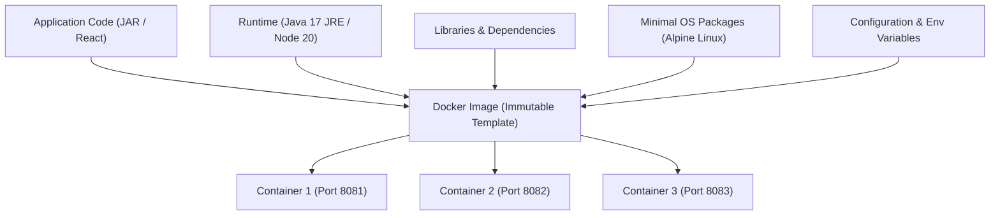

---

## 2. Image vs Container (The #1 Question)

This is one of the most frequently asked Docker questions in interviews.

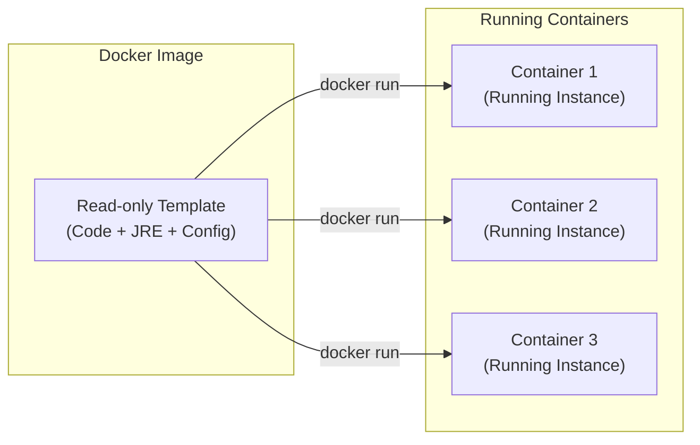

### The Java OOP Analogy (Best Way to Answer in Interviews)

| OOP Concept | Docker Equivalent | Meaning |
|---|---|---|
| **Class** | **Docker Image** | A blueprint/template. Defines structure, code, and dependencies. Not actively running. |
| **Object** | **Docker Container** | A live, running instance of the class in memory. Multiple objects can be created from one class. |

### Key Differences Table

| Feature | Docker Image | Docker Container |
|---|---|---|
| **Definition** | A read-only template used to create containers. | A running instance of an image. |
| **State** | Static, read-only, immutable artifact. | Active, isolated running process with a writable layer. |
| **Creation** | Created using `docker build`. | Created using `docker run`. |
| **Lifecycle** | Stored on disk or in a Registry (Docker Hub). | Can be started, stopped, restarted, or deleted. |

> [!TIP]
> **1-Sentence Interview Answer**:  
> *"An image is a packaged, read-only blueprint containing the application and its dependencies, while a container is a live, runnable instance of that image."*

---

## 3. Container vs Virtual Machine (VM)

Another classic interview question.

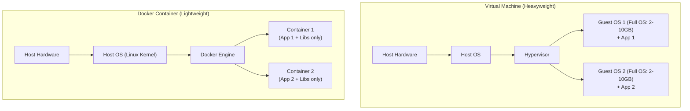

| Feature | Virtual Machine (VM) | Docker Container |
|---|---|---|
| **Architecture** | Runs a complete **Guest OS** on top of a Hypervisor. | Shares the **Host OS Kernel** directly. |
| **Size** | Gigabytes (GBs) due to full OS files. | Megabytes (MBs), contains only app + dependencies. |
| **Startup Time** | Minutes (boots full operating system). | Seconds or milliseconds (starts a single process). |
| **Resource Usage** | Heavy (pre-allocates fixed RAM and CPU). | Lightweight (uses only what the process actually needs). |
| **Isolation** | Hardware-level isolation via Hypervisor. | Process-level isolation using Linux kernel features. |

> [!TIP]
> **1-Sentence Interview Answer**:  
> *"A virtual machine virtualizes hardware and runs a complete guest operating system, whereas containers isolate application processes while sharing the host OS kernel, making containers much faster, lighter, and resource-efficient."*

---

## 4. Docker Engine Architecture

Docker uses a simple **Client-Server architecture**:

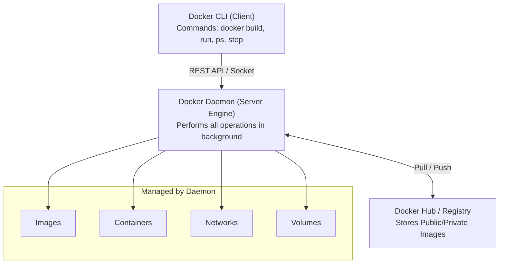

1. **Docker CLI (Client)**: The command-line tool you interact with (`docker run`, `docker build`). It sends requests to the Docker daemon.
2. **Docker Daemon (`dockerd`)**: The background engine that actually builds images, runs containers, manages networks, and mounts volumes.
3. **Docker Registry**: Stores and distributes Docker images (e.g., Docker Hub).

---

## 5. Docker Hub / Registry

A **Registry** stores Docker images so they can be shared across machines.

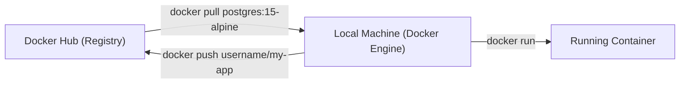

- **`docker pull <image>`**: Downloads an image from Docker Hub to your local machine.
- **`docker push <image>`**: Uploads your locally built image to Docker Hub so production servers can pull it.

---

## 6. Must-Know Docker Commands

Memorize these high-frequency commands for coding rounds and system design interviews:

| Command | What it does | Example |
|---|---|---|
| `docker --version` | Checks installed Docker version | `docker --version` |
| `docker pull` | Downloads an image from registry | `docker pull postgres:15-alpine` |
| `docker images` | Lists all images saved locally | `docker images` |
| `docker build` | Builds a Docker image from a Dockerfile | `docker build -t myapp .` |
| `docker run` | Creates a **new container** and starts it | `docker run -d -p 8080:8080 myapp` |
| `docker ps` | Lists all **currently running** containers | `docker ps` |
| `docker ps -a` | Lists **all** containers (including stopped/exited ones) | `docker ps -a` |
| `docker stop` | Gracefully stops a running container | `docker stop <container_name_or_id>` |
| `docker start` | Starts an **already existing stopped container** | `docker start <container_name_or_id>` |
| `docker rm` | Deletes a stopped container | `docker rm <container_name_or_id>` |
| `docker rmi` | Deletes a local image | `docker rmi <image_name_or_id>` |
| `docker logs` | Shows console logs (System.out / Spring logs) | `docker logs -f <container_name_or_id>` |
| `docker exec` | Opens an interactive terminal inside a running container | `docker exec -it <container> sh` |

---

### `docker run` vs `docker start`

> [!IMPORTANT]
> **Very Common Placement Question**: What is the difference between `docker run` and `docker start`?

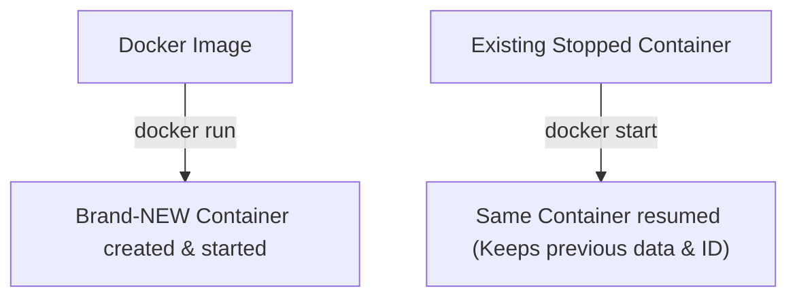

- **`docker run`**: Reads the image, creates a **brand-new container** with a fresh container ID, and starts it.
- **`docker start`**: Starts an **already existing, stopped container** without creating a new one.

---

## 7. Dockerfile & Core Instructions

A `Dockerfile` is a text file containing instructions to build a Docker image.

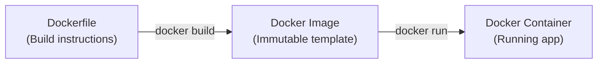

### Basic Example (Spring Boot):
```dockerfile
FROM eclipse-temurin:17-jre-alpine
WORKDIR /app
COPY app.jar app.jar
EXPOSE 8080
ENTRYPOINT ["java", "-jar", "app.jar"]
```

---

### FROM, WORKDIR, COPY, RUN

1. **`FROM`**:
   - Specifies the **base image** (e.g., `FROM eclipse-temurin:17-jre-alpine`).
   - Every Dockerfile starts with `FROM`. Alpine is preferred because it is tiny (~5MB Linux base).
2. **`WORKDIR`**:
   - Sets the working directory inside the container (e.g., `WORKDIR /app`).
   - All subsequent commands run relative to this directory.
3. **`COPY`**:
   - Copies files from your computer (build context) into the container (e.g., `COPY app.jar app.jar` or `COPY . .`).
4. **`RUN`**:
   - Runs a command **during image build time** (e.g., `RUN mvn clean package` or `RUN npm install`).
   - *Key distinction*: `RUN` happens at **build time**, while `CMD` / `ENTRYPOINT` happen at **container runtime**.

---

### CMD vs ENTRYPOINT (Very Common)

Interviewers test whether you know the difference between the main process and default arguments:

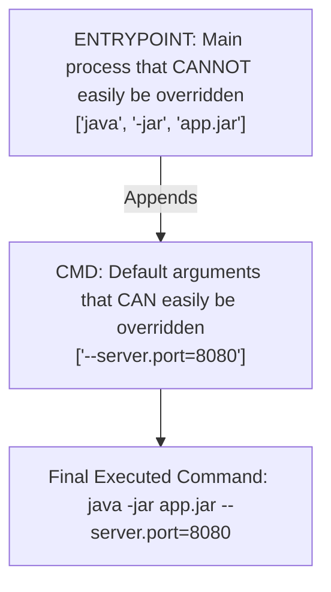

| Instruction | What it does | Can it be overridden easily? | Example |
|---|---|---|---|
| **`ENTRYPOINT`** | Defines the **main fixed executable** for the container. | **No** (requires `--entrypoint` flag). | `ENTRYPOINT ["java", "-jar", "app.jar"]` |
| **`CMD`** | Provides **default arguments** or default fallback command. | **Yes** (simply pass arguments at end of `docker run`). | `CMD ["--server.port=8080"]` |

- Running: `docker run myapp` $\rightarrow$ executes `java -jar app.jar --server.port=8080`
- Running: `docker run myapp --server.port=9090` $\rightarrow$ executes `java -jar app.jar --server.port=9090` (`CMD` is overridden!)

> [!TIP]
> **Simple Placement Answer**:  
> *"ENTRYPOINT defines the main fixed process to run inside the container, while CMD provides default arguments that can easily be overridden at startup."*

---

### EXPOSE vs Port Mapping (`-p`) (Very Common)

> [!WARNING]
> **Common Trap**: Writing `EXPOSE 8080` in your Dockerfile does **NOT** make `localhost:8080` available in your browser!

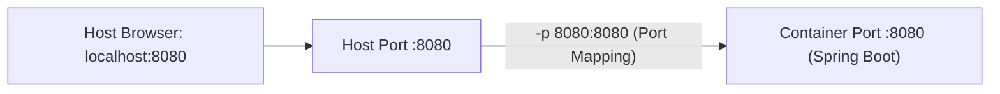

- **`EXPOSE 8080`**:
  - Simply **documentation** / metadata.
  - Tells developers which port the application listens on inside the container. It does *not* open the port to the host.
- **`-p 8080:8080` (`host_port : container_port`)**:
  - **Actually publishes** and maps the container port to your host machine.
  - `-p 9000:8080` allows you to access the app in your host browser at `http://localhost:9000`.

---

## 8. Multi-Stage Docker Build (Java 17 / Spring Boot)

This is a **star topic** for Java / Spring Boot backend interviews.

### The Problem with Single-Stage Builds
If you build your project inside a single Docker image:
- You need Maven + full JDK (Java Development Kit) + source code files.
- The final image becomes huge (~800MB to 1GB+) and contains unnecessary build tools.

### The Multi-Stage Solution
Use **two stages** in the same Dockerfile:
1. **Stage 1 (Build stage)**: Uses Maven + JDK to compile code and build the JAR.
2. **Stage 2 (Runtime stage)**: Uses a tiny JRE image. Copies **only the generated JAR** from Stage 1. Discards Maven and source code!

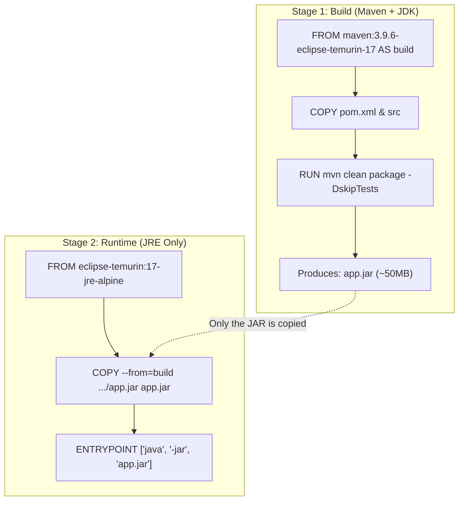

### Production Multi-Stage Dockerfile:
```dockerfile
# Stage 1: Build JAR
FROM maven:3.9.6-eclipse-temurin-17 AS build
WORKDIR /app
COPY pom.xml .
COPY src ./src
RUN mvn clean package -DskipTests

# Stage 2: Run JAR
FROM eclipse-temurin:17-jre-alpine
WORKDIR /app
COPY --from=build /app/target/*.jar app.jar
EXPOSE 8080
ENTRYPOINT ["java", "-jar", "app.jar"]
```

> [!TIP]
> **Interview Answer**:  
> *"I use a multi-stage build so Maven and the JDK are only present during compilation. The final runtime image contains only the minimal JRE and the JAR file. This drops image size from ~900MB down to ~150MB and keeps build tools out of production."*

---

## 9. Docker Image Layers & Caching

Docker images are built in sequential **layers**. Every instruction (`FROM`, `COPY`, `RUN`) creates a new layer.

Docker caches each layer during `docker build`. If a layer and its files haven't changed, Docker reuses the cached layer, making builds ultra-fast.

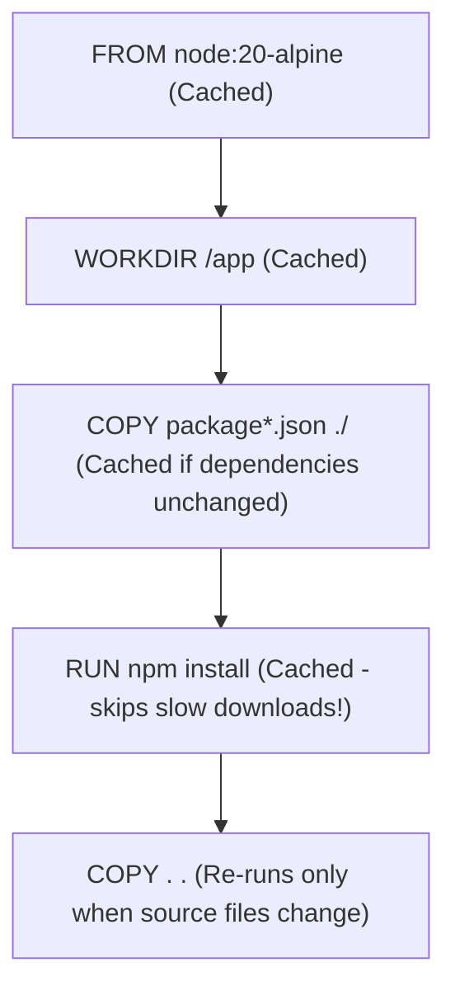

### Why Layer Order Matters:
❌ **Slow build (Bad)**:
```dockerfile
COPY . .
RUN npm install   # Re-installs all dependencies on EVERY tiny code edit!
```

✅ **Fast build (Good)**:
```dockerfile
COPY package*.json ./
RUN npm install   # Cached! Only runs if package.json changes.
COPY . .          # Only copies source code.
```

---

## 10. `.dockerignore`

`.dockerignore` works just like `.gitignore`. It tells Docker which files **NOT** to send into the build context.

```
node_modules
target
.git
.env
*.log
```

### Why use `.dockerignore`?
1. **Faster builds**: Avoids copying huge directories like `node_modules` or `target` into the build context.
2. **Security**: Prevents sensitive files like `.env` (passwords, secrets) from accidentally getting baked into images.

---

## 11. Storage & Persistence: Volumes vs Bind Mounts

Containers are **ephemeral** (disposable). When a container is deleted (`docker rm`), all data written inside it is lost!

For databases (PostgreSQL, MySQL), data must survive even if containers are destroyed and recreated.

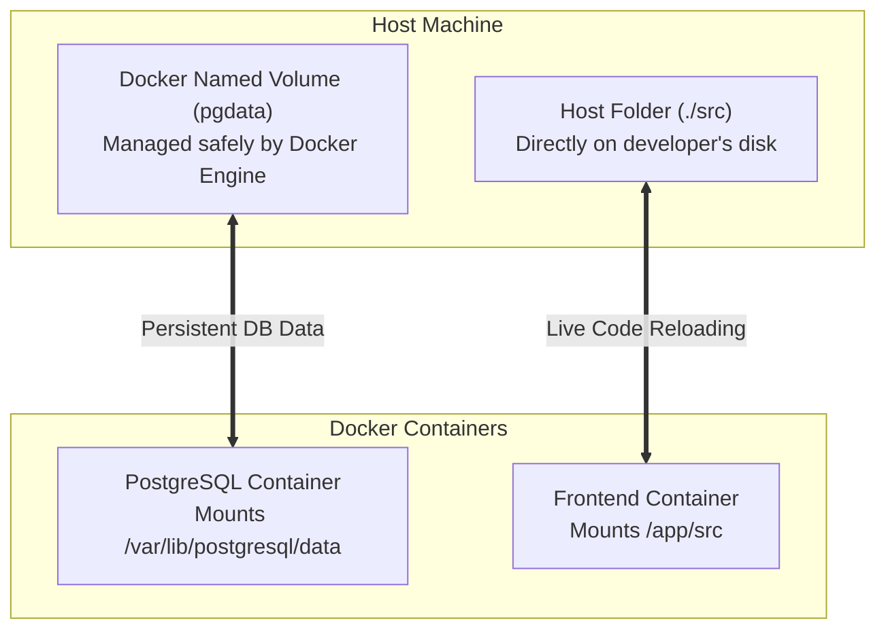

### Named Volume vs Bind Mount

| Type | Syntax in Compose | Managed By | Primary Use Case |
|---|---|---|---|
| **Named Volume** | `pgdata:/var/lib/postgresql/data` | **Docker Engine** | **Database persistence**. Survives `docker compose down`. |
| **Bind Mount** | `./src:/app/src` | **You (Host Path)** | **Local Development** (syncing code changes live without rebuilding images). |

> [!TIP]
> **Placement Question**: *"What happens to database data when a PostgreSQL container is stopped or recreated?"*  
> **Answer**: *"Because we attach a Docker named volume (`pgdata`), the database files are stored independently on the host by Docker. When a new container is created, it mounts the same `pgdata` volume, and all tables and data remain intact."*

---

## 12. Docker Networking & The `localhost` Trap

### Why `localhost:5432` fails and `db:5432` works

> [!CAUTION]
> **The #1 Backend Placement Bug Question**:  
> In your Spring Boot configuration, you write:  
> `spring.datasource.url=jdbc:postgresql://localhost:5432/mydb`  
> When running inside Docker, why does Spring Boot throw **"Connection refused: localhost:5432"**?

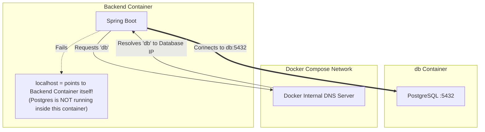

### The Explanation:
1. Inside a container, **`localhost` refers strictly to that specific container itself**, not your host machine and not other containers.
2. PostgreSQL runs in its **own separate container**.
3. In Docker Compose, all services are automatically placed on a shared virtual network.
4. Compose provides **automatic DNS service discovery**: each container can reach another container using its **service name** (e.g., `db:5432` or `service-discovery:8761`).

> [!TIP]
> **Interview Answer**:  
> *"Inside a container, localhost points to the container's own loopback interface. For container-to-container communication in Compose, we use the service name (`db:5432`) because Docker Compose provides built-in DNS service discovery."*

---

## 13. Docker Compose

Docker Compose is a tool for defining and running **multi-container applications** using a single YAML file (`compose.yaml` or `docker-compose.yml`).

Instead of running 6 different `docker run` commands manually:
```bash
docker compose up -d
```
starts the entire stack (Frontend, Backend, Database, Gateway, Eureka) in the background.

```bash
docker compose down
```
stops and removes the containers and networks (while keeping named volumes intact).

---

### Dockerfile vs Docker Compose

| Dockerfile | Docker Compose |
|---|---|
| Builds a **single** image. | Runs and coordinates **multiple** containers together. |
| Defines OS, dependencies, and build steps. | Defines services, ports, networks, volumes, and environment variables. |
| Command: `docker build` | Command: `docker compose up` |

---

### `build` vs `image`

In your `compose.yaml`:
- **`build: ./apps/backend`**: Tells Compose to find the `Dockerfile` in `./apps/backend` and build a custom image from your source code.
- **`image: postgres:15-alpine`**: Tells Compose to pull an already existing official image from Docker Hub (no custom Dockerfile needed).

---

### Environment Variables & `.env` (`${DB_PASSWORD:-postgres}`)

Instead of hardcoding passwords in source code, Compose injects environment variables at runtime:

```yaml
services:
  backend:
    environment:
      - DB_USERNAME=postgres
      - DB_PASSWORD=${DB_PASSWORD:-postgres}
      - JWT_SECRET=${JWT_SECRET}
```

- **`${DB_PASSWORD:-postgres}`** means:
  - If `DB_PASSWORD` is defined in `.env` or system environment, use that value.
  - If not defined, fallback to `"postgres"`.

---

### `depends_on`

```yaml
services:
  backend:
    build: ./apps/backend
    depends_on:
      - db
```
Tells Compose to start the `db` container before starting `backend`.

> [!NOTE]
> **Interview Nuance**: `depends_on` only controls **startup order**, not whether PostgreSQL is ready to accept connections. If the backend connects before the DB finishes initializing, it may retry or fail unless a healthcheck is configured.

---

## 14. Career OS Docker Architecture (Resume Project Defense)

This is how Docker is applied in your actual microservices project (**Career OS**):

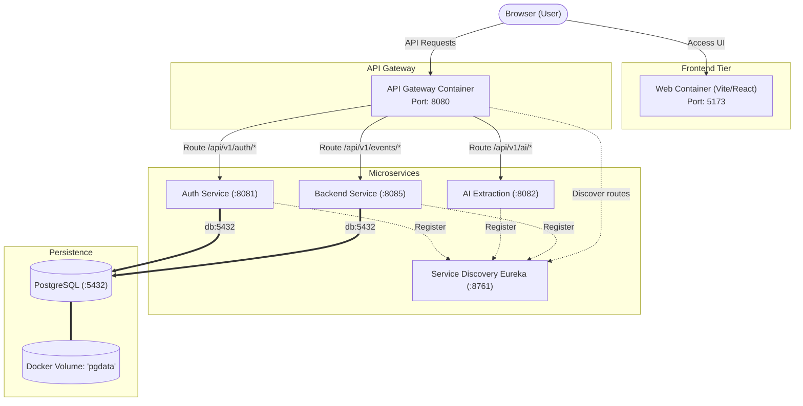

### How to Explain This Project in an Interview:

1. **"Why did you Dockerize Career OS?"**  
   *"Career OS has multiple services—React frontend, Spring Cloud Gateway, Auth, AI extraction, Core Backend, Eureka discovery, and PostgreSQL. Dockerizing allows each service to run in its own isolated environment with its exact Java/Node runtime, and Docker Compose lets any developer boot the whole system with a single `docker compose up` command without manual setup."*

2. **"How do services communicate?"**  
   *"The frontend talks to the API Gateway on port `8080`. The Gateway routes requests to backend services. All services communicate with PostgreSQL using the service name `db:5432` over the shared Compose bridge network."*

3. **"How is database data persisted?"**  
   *"We use a named volume `pgdata:/var/lib/postgresql/data`. Even if the PostgreSQL container is removed via `docker compose down`, the data persists in the volume and re-attaches when restarted."*

4. **"Why use Multi-Stage builds for the Java services?"**  
   *"We use Maven and JDK in Stage 1 to build the JAR, then run it in a lightweight Alpine JRE in Stage 2. This keeps compiler and build tools out of the final image, reducing image size from ~900MB to ~150MB."*

---

## 15. Scenario-Based Debugging Questions

Interviewers love testing practical troubleshooting skills:

### Scenario 1: Container starts and immediately stops (`Exit 0` or `Exit 1`)
1. Run `docker ps -a` to check the status and exit code.
2. Run `docker logs <container>` to see why it crashed (e.g., missing environment variable, port already in use, or database connection error).
3. *Key Rule*: A container stays alive only as long as its main process (`PID 1`) is running. If the process finishes or crashes, the container stops immediately.

### Scenario 2: Backend cannot connect to Database
Checklist to explain to the interviewer:
1. Is the database container running? (`docker ps`).
2. Are you using `db:5432` instead of `localhost:5432`?
3. Are both containers on the same Docker network?
4. Are database username/password environment variables matching?

### Scenario 3: Application works on your machine but fails in Docker
Common causes:
1. Missing environment variables (e.g., `.env` was ignored and not passed).
2. Hardcoded `localhost` instead of Docker service names.
3. For Vite/React: Missing `--host` flag in `npm run dev -- --host` (Vite defaults to `127.0.0.1` instead of `0.0.0.0`).

---

## 16. High-Priority Interview Q&A Cheatsheet

#### Q1: What is the difference between an Image and a Container?
**Answer**: An image is a read-only, immutable template containing application code, runtime, and libraries. A container is a live, running instance of that image with a thin writable layer on top.

#### Q2: What is the difference between Docker and a Virtual Machine?
**Answer**: A VM virtualizes hardware and runs a full, independent Guest OS on top of a hypervisor. A Docker container shares the host OS kernel and isolates processes, making it much faster, lighter, and smaller.

#### Q3: What is the difference between `CMD` and `ENTRYPOINT`?
**Answer**: `ENTRYPOINT` defines the main fixed command that will always run. `CMD` provides default parameters that can easily be overridden from the command line.

#### Q4: What is the difference between `EXPOSE` and `-p`?
**Answer**: `EXPOSE` is only documentation inside the Dockerfile. `-p` (publish) actually maps the host port to the container port so external traffic can reach it.

#### Q5: Why use Multi-Stage builds?
**Answer**: To separate the build environment (Maven/JDK) from the runtime environment (JRE). It keeps source code and build tools out of production and drastically reduces image size.

#### Q6: Why can't a container use `localhost` to connect to another container?
**Answer**: Because `localhost` refers strictly to that individual container. In Docker Compose, we use the service name (e.g., `db:5432`) because Compose provides internal DNS resolution.

#### Q7: What is the difference between a Named Volume and a Bind Mount?
**Answer**: A named volume is managed by Docker in its internal directory (best for databases). A bind mount maps an exact folder on your host machine to the container (best for local live code reloading).

---

## 17. 1-Page Mental Revision

```
========================================================================================
                          DOCKER PLACEMENT REVISION CHEATSHEET
========================================================================================

1. CORE DEFINITIONS:
   - Image      = Blueprint / Class (Read-only, immutable)
   - Container  = Live Instance / Object (Isolated running process)
   - Dockerfile = Recipe to build an image (`docker build`)
   - Compose    = Orchestrator for multi-container stacks (`docker compose up`)

2. INSTRUCTIONS:
   - FROM       = Base image (use alpine for small size)
   - WORKDIR    = Working directory inside container (/app)
   - COPY       = Copy files from host into image
   - RUN        = Executes command at BUILD time (e.g. `mvn package`)
   - ENTRYPOINT = Fixed main executable (`java -jar app.jar`)
   - CMD        = Default overridable parameters (`--server.port=8080`)
   - EXPOSE     = Documentation port only; use `-p 8080:8080` to publish to host

3. STORAGE & NETWORKING:
   - Volumes    = `pgdata:/var/lib/postgresql/data` (persists DB data across restarts)
   - Network    = Don't use `localhost:5432`! Use Compose service name: `db:5432`

4. MULTI-STAGE BUILDS (JAVA):
   - Stage 1: `maven:3.9-temurin-17` -> builds JAR
   - Stage 2: `eclipse-temurin:17-jre-alpine` -> runs JAR
   - Benefit: Cuts size from ~900MB to ~150MB, leaves build tools out of prod

5. DEBUGGING TRIAD:
   - `docker ps -a`  -> Check if container is running or exited
   - `docker logs`   -> Check stdout / stderr exceptions
   - `docker exec`   -> Enter container shell to test connectivity (`nc -zv db 5432`)
========================================================================================
```
