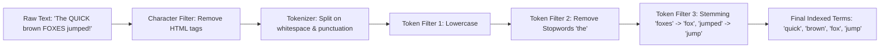
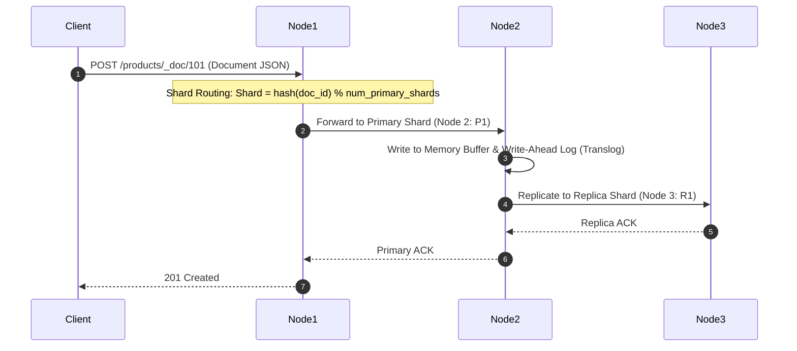

# 🔍 Elasticsearch & Distributed Full-Text Search

> **Core Philosophy**: Relational databases excel at exact lookups and ACID transactions, but perform terribly on full-text search ($O(N)$ wildcard scans with `LIKE '%term%'`). 
> Elasticsearch provides distributed, near real-time full-text search and analytical aggregation using the **Inverted Index** and the **Apache Lucene** storage engine.

---

## 📑 Table of Contents
1. [Why Relational DBs Fail at Search](#1-why-relational-dbs-fail-at-search)
2. [The Inverted Index Architecture](#2-the-inverted-index-architecture)
3. [The Analysis Pipeline (Tokenization & Filtering)](#3-the-analysis-pipeline)
4. [Elasticsearch Cluster Architecture (Shards & Replicas)](#4-elasticsearch-cluster-architecture)
5. [Cluster Node Roles (Master, Data, Coordinating)](#5-cluster-node-roles)
6. [The Write Path (Indexing Documents)](#6-the-write-path)
7. [The Read Path (Query & Fetch Phases)](#7-the-read-path)
8. [Lucene Segments & Immutability](#8-lucene-segments--immutability)
9. [RDBMS vs. Elasticsearch (Placement Comparison)](#9-rdbms-vs-elasticsearch)

---

## 1. Why Relational DBs Fail at Search

In an RDBMS:
```sql
SELECT * FROM articles WHERE content LIKE '%distributed system%';
```
- **B-Tree Index Useless**: Leading wildcards (`%...`) prevent B-Tree index traversal, forcing a **Full Table Scan ($O(N)$)** across gigabytes of text.
- **No Relevance Scoring**: RDBMS cannot easily rank results by relevance (TF-IDF / BM25), typos, or synonym expansion.

---

## 2. The Inverted Index Architecture

The **Inverted Index** is a mapping from unique words (terms) to the list of document IDs that contain them.

### Input Documents:
- **Doc 1**: *"Kafka is a distributed message queue"*
- **Doc 2**: *"RabbitMQ is also a message queue"*
- **Doc 3**: *"Elasticsearch is a distributed search engine"*

### Resulting Inverted Index:

| Term | Frequency | Posting List (Document IDs) |
| :--- | :---: | :--- |
| `distributed` | 2 | `[Doc 1, Doc 3]` |
| `elasticsearch`| 1 | `[Doc 3]` |
| `engine` | 1 | `[Doc 3]` |
| `kafka` | 1 | `[Doc 1]` |
| `message` | 2 | `[Doc 1, Doc 2]` |
| `queue` | 2 | `[Doc 1, Doc 2]` |
| `rabbitmq` | 1 | `[Doc 2]` |
| `search` | 1 | `[Doc 3]` |

> When searching for `"distributed queue"`, Elasticsearch computes the set intersection:  
> `[Doc 1, Doc 3] ∩ [Doc 1, Doc 2] = [Doc 1]` in $O(1)$ dictionary lookup time!

---

## 3. The Analysis Pipeline

Before text is added to the inverted index, it passes through an **Analyzer**:



---

## 4. Elasticsearch Cluster Architecture

```mermaid
flowchart TD
    subgraph ES Cluster [Elasticsearch Index: 'products' (3 Primary Shards, 1 Replica)]
        subgraph Node1 [Node 1]
            P0[Primary Shard 0]
            R1[Replica Shard 1]
        end
        subgraph Node2 [Node 2]
            P1[Primary Shard 1]
            R2[Replica Shard 2]
        end
        subgraph Node3 [Node 3]
            P2[Primary Shard 2]
            R0[Replica Shard 0]
        end
    end
```

### Core Concepts:
- **Index**: A logical namespace (equivalent to a Database Table in SQL).
- **Document**: A JSON object (equivalent to a Row in SQL).
- **Primary Shard**: A self-contained Lucene instance holding a horizontal partition of the data.
- **Replica Shard**: An exact copy of a primary shard for high availability and read throughput.

---

## 5. Cluster Node Roles

1. **Master Node**: Manages cluster state, tracks which nodes are active, and handles shard allocation.
2. **Data Node**: Holds shards and executes CRUD, search, and aggregation operations (RAM & I/O heavy).
3. **Coordinating (Client) Node**: Routes incoming HTTP requests to appropriate data nodes and aggregates multi-shard search responses.

---

## 6. The Write Path (Indexing Documents)



- **Near Real-Time (NRT)**: Changes become searchable only after an in-memory buffer is flushed to a Lucene segment during **Refresh** (default: every $1\text{s}$).

---

## 7. The Read Path (Query & Fetch Phases)

Searching across a sharded index uses a 2-phase process:

```
                  Coordinating Node
                   /      |      \
                  ↓       ↓       ↓
               Shard 0 Shard 1 Shard 2
```

1. **Query Phase**: The coordinating node broadcasts the query to all shards. Each shard executes search locally and returns only **document IDs and relevance scores (Top K)**.
2. **Fetch Phase**: The coordinating node merges and sorts all shard scores, selects the overall Top K, and requests full document JSON payloads only for the winning IDs.

---

## 8. Lucene Segments & Immutability

- Lucene writes inverted indexes in immutable chunk files called **Segments**.
- **Why Immutability?** Eliminates write lock contention, allows aggressive OS page cache read caching.
- **Deletions/Updates**: Updates do not modify segments in-place. An update marks the old document ID in a `.del` bitmap file and appends the new document version to a new segment.
- **Segment Merging**: Background worker threads periodically merge smaller segments into large ones, purging deleted records.

---

## 9. RDBMS vs. Elasticsearch

| Feature | Relational Database (RDBMS) | Elasticsearch |
| :--- | :--- | :--- |
| **Primary Data Structure** | B+ Tree | **Inverted Index + BKD Trees** |
| **Primary Strength** | Strict ACID transactions, Relations | Full-text fuzzy search, Relevance ranking |
| **Search Performance** | $O(N)$ table scans on wildcards | $O(1)$ term postings lookup |
| **ACID Compliance** | Full ACID guarantees | Eventual consistency, No distributed joins |
| **Best Used As** | Primary system of record | Secondary search index / Log analytics |
