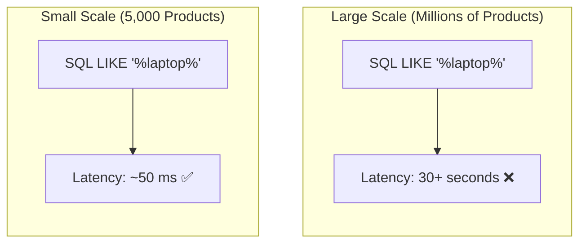
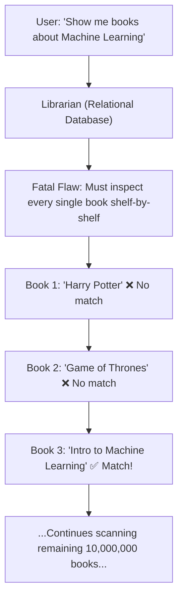
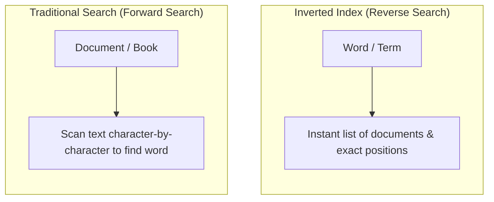
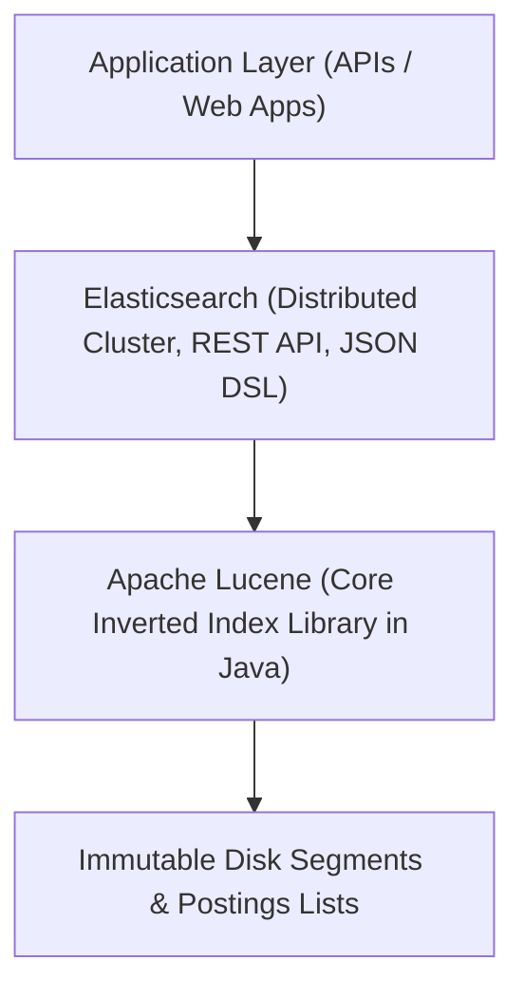
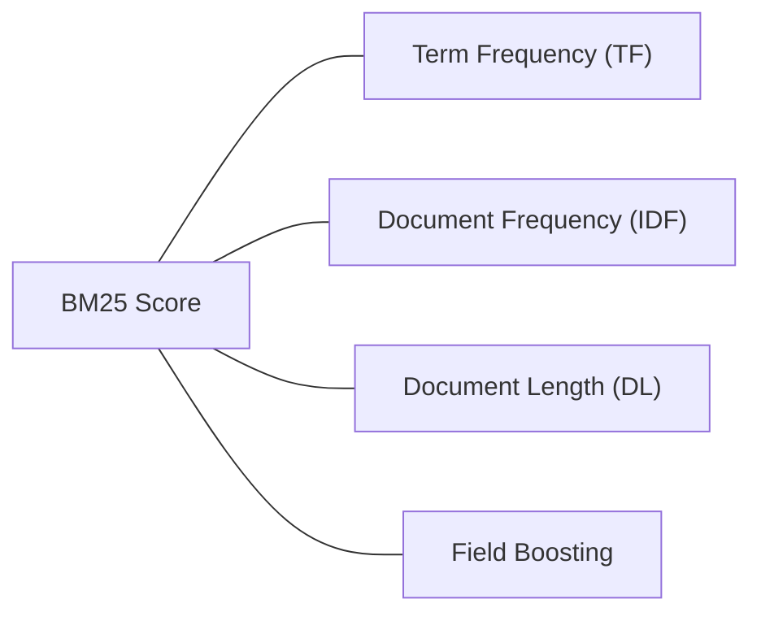
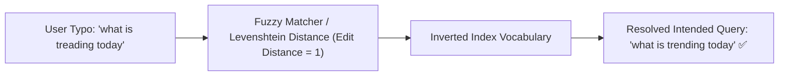
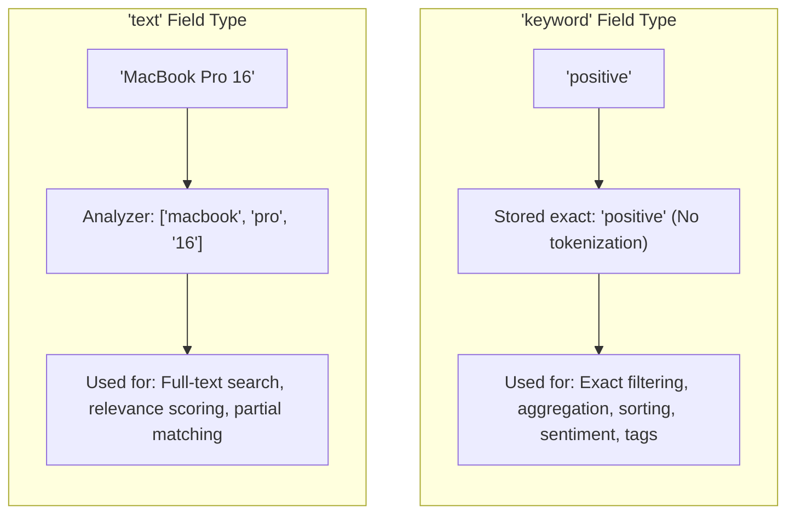
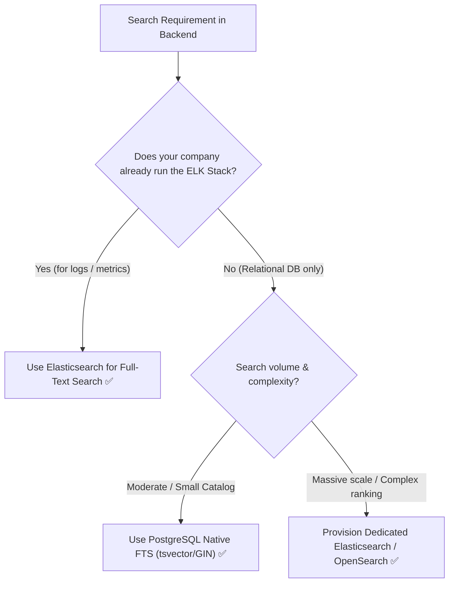
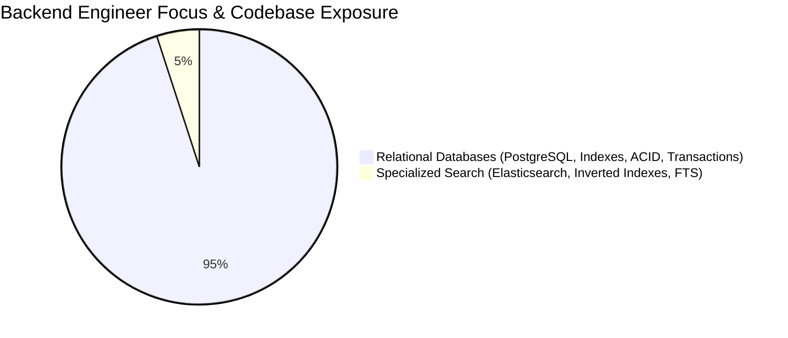

# 🔍 Full-Text Search & Elasticsearch — Complete Engineering Guide

> **Core Philosophy**: Relational databases excel at structured ACID transactions and exact B-Tree lookups, but break down completely when handling full-text search ($O(N)$ sequential wildcard scans with `LIKE '%term%'`). 
> Search engines like **Elasticsearch** (powered by **Apache Lucene**) solve this by inverting the problem into an **Inverted Index**, unlocking sub-second response times, relevance scoring (BM25), typo tolerance, and smart search capabilities.

---

## 📑 Table of Contents
- [1. The 2005 Search Crisis: Why Traditional Databases Break at Scale](#1-the-2005-search-crisis-why-traditional-databases-break-at-scale)
- [2. The Librarian Analogy: The Fatal Flaws of Relational Search](#2-the-librarian-analogy-the-fatal-flaws-of-relational-search)
- [3. The Core Innovation: The Inverted Index](#3-the-core-innovation-the-inverted-index)
- [4. Underlying Technology: Apache Lucene & The Search Ecosystem](#4-underlying-technology-apache-lucene--the-search-ecosystem)
- [5. Relevance Scoring & The BM25 Algorithm](#5-relevance-scoring--the-bm25-algorithm)
- [6. Typo Tolerance, Fuzzy Matching & Type-Ahead](#6-typo-tolerance-fuzzy-matching--type-ahead)
- [7. Elasticsearch Data Modeling: `text` vs. `keyword`](#7-elasticsearch-data-modeling-text-vs-keyword)
- [8. Architectural Decision: PostgreSQL FTS vs. Elasticsearch & The ELK Stack](#8-architectural-decision-postgresql-fts-vs-elasticsearch--the-elk-stack)
- [9. Real-World Benchmark: PostgreSQL `ILIKE` vs. Elasticsearch (50,000 Records)](#9-real-world-benchmark-postgresql-ilike-vs-elasticsearch-50000-records)
- [10. Backend Engineering Mindset: What You Must Master](#10-backend-engineering-mindset-what-you-must-master)
- [11. 1-Page Master Revision Cheat Sheet & Placement Q&A](#11-1-page-master-revision-cheat-sheet--placement-qa)

---

## 1. The 2005 Search Crisis: Why Traditional Databases Break at Scale

> 💡 **Quick Revision Anchor (2-3 Words)**: `Scaling Search Crisis`

### The Scenario (Year 2005)
Imagine it is the year 2005. You are a software engineer at a rapidly growing e-commerce company during the post-dot-com expansion. 
- Your company initially has around **5,000 products** in the catalog.
- You are tasked with building a search API that takes user input and queries the database for relevant products.

In a traditional relational database (e.g., PostgreSQL or MySQL), you implement this using standard SQL pattern matching:

```sql
SELECT * FROM products 
WHERE name LIKE '%laptop%' 
   OR description LIKE '%laptop%';
```

- The `%` wildcards match any sequence of characters before and after the term `"laptop"`.
- At **5,000 products**, the query executes in **~50 milliseconds**. Life is simple, and users get results quickly.

---

### The Scale Explosion
As the company grows rapidly, your catalog expands from 5,000 products to **millions of products** (similar to Amazon cataloging millions of items, Google crawling billions of web pages, or LinkedIn indexing millions of profiles).

Suddenly, the exact same query breaks down:
- Query latency explodes from **50 ms to 30 seconds**.
- Customers abandon the site (in modern systems, even a **2-second delay** is considered unacceptable latency that directly destroys user conversion and revenue).
- Your manager and customers are frustrated, demanding immediate optimization.



---

### The Three New Requirements
Optimization is not just about raw query speed. Modern e-commerce search introduces three strict requirements:

| Requirement | Description | Real-World Example |
| :--- | :--- | :--- |
| **1. Millisecond Latency** | Results must return in milliseconds, even across millions/billions of records. | Returning search results in under 500 ms under heavy concurrent traffic. |
| **2. Smart Relevance Scoring** | Results must be ranked by business and semantic relevance, not arbitrary database order. | When searching `"laptop"`, show the **MacBook Pro** or **Dell XPS** first, rather than a **laptop bag** or random cable accessory. |
| **3. Typo Tolerance & Robustness** | Queries must tolerate spelling errors and typos, especially during flash sales when users type in a hurry. | If a user searches for `"laptp"` or `"treading"`, return results for `"laptop"` or `"trending"` seamlessly. |

Relational databases using `LIKE '%...%'` fail on **all three** of these requirements.

[⬆ Back to Top](#📑-table-of-contents)

---

## 2. The Librarian Analogy: The Fatal Flaws of Relational Search

> 💡 **Quick Revision Anchor (2-3 Words)**: `The Flawed Librarian`

To build intuition for why relational databases fail at search, consider the **Librarian Analogy**.

A relational database (like PostgreSQL) behaves like a traditional library librarian who knows the exact physical location of every book on every shelf:



---

### Fatal Flaw 1: Exhaustive Sequential Scanning ($O(N)$)
When you ask for books about `"Machine Learning"`, the librarian starts walking through the entire library:
1. Inspects Book 1: *"Harry Potter and the Philosopher's Stone"* $
ightarrow$ No mention of "Machine Learning". Moves on.
2. Inspects Book 2: *"Game of Thrones"* $
ightarrow$ No mention. Moves on.
3. Inspects Book 3: *"Introduction to Machine Learning"* $
ightarrow$ Match found!
4. **The librarian cannot stop here**: They must examine every single remaining book in every shelf across the entire library to find all matching titles.

In a library of 10 million or 1 billion books, this sequential scan takes **minutes, hours, or days**.

#### The Database Equivalent:
```sql
SELECT * FROM products WHERE description ILIKE '%laptop%';
```
- `ILIKE` performs a case-insensitive search.
- Because of the leading wildcard (`%laptop%`), standard B-Tree indexes **cannot** be used.
- The database engine is forced to perform a **Full Table Scan (Sequential Scan)**: reading every single row from disk, examining every character in the text field, and performing character-by-character pattern matching.
- It is thorough, but **painfully, cripplingly slow**.

---

### Fatal Flaw 2: Zero Sense of Relevance
Suppose the librarian finishes the scan and finds two books:
- **Book A**: Titled *"Introduction to Machine Learning"*.
- **Book B**: A history novel where the phrase `"machine learning"` is casually mentioned once in a footnote on the very last page.

A relational database returns matching rows in arbitrary or physical disk order:
- It might return **Book B** first and **Book A** second (or bury Book A at row #10,000).
- The database has **no understanding of context or relevance**: it only knows a binary match (`true` or `false`).

[⬆ Back to Top](#📑-table-of-contents)

---

## 3. The Core Innovation: The Inverted Index

> 💡 **Quick Revision Anchor (2-3 Words)**: `Terms To Documents`

### Inverting the Search Problem
Computer scientists in the field of Information Retrieval (IR) had researched this problem since the 1960s. The breakthrough revelation was simple yet revolutionary:

> **Instead of searching through documents to find terms, invert the problem: search through terms to find documents.**



---

### How the Inverted Index Works
When a new book or document arrives, you **index all its words upfront**. Instead of storing documents and their text, you build a dictionary of **every unique term**, mapping each term to the documents and page numbers where it appears.

#### Example Corpus:
- **Book 1**: *"Introduction to Machine Learning"*
- **Book 2**: *"The Machine Age"*
- **Book 3**: *"Coffee Machine Manual"*
- **Book 4**: *"Learning to Cook"*
- **Book 5**: *"Deep Learning Fundamentals"*

#### The Resulting Inverted Index:

| Term (Token) | Document Occurrences & Locations (Postings List) |
| :--- | :--- |
| **`machine`** | • *Introduction to Machine Learning* (Pages 1, 15, 23)<br>• *The Machine Age* (Pages 5, 89)<br>• *Coffee Machine Manual* (Page 1) |
| **`learning`** | • *Introduction to Machine Learning* (Pages 1, 16, 24)<br>• *Learning to Cook* (Pages 2, 40)<br>• *Deep Learning Fundamentals* (Pages 3, 12, 55) |

---

### Executing a Search on the Inverted Index
When a user searches for `"machine learning"`:
1. The search engine looks up `"machine"` in the inverted index $
ightarrow$ returns `{Book 1, Book 2, Book 3}`.
2. The search engine looks up `"learning"` in the inverted index $
ightarrow$ returns `{Book 1, Book 4, Book 5}`.
3. It performs a set intersection:
   $$\{Book\ 1, Book\ 2, Book\ 3\} \cap \{Book\ 1, Book\ 4, Book\ 5\} = \{Book\ 1\}$$

Instead of reading millions of documents, search time drops to an **$O(1)$ dictionary lookup and postings list intersection** in memory!

[⬆ Back to Top](#📑-table-of-contents)

---

## 4. Underlying Technology: Apache Lucene & The Search Ecosystem

> 💡 **Quick Revision Anchor (2-3 Words)**: `Apache Lucene Core`

Elasticsearch is **not** a completely new search algorithm built from scratch. It is a distributed, horizontally scalable engine built on top of **Apache Lucene**.



### Key Ecosystem Facts:
1. **Apache Lucene**: The foundational open-source Java information retrieval library created by Doug Cutting. It handles tokenization, inverted indexing, term dictionaries, and low-level scoring.
2. **Elasticsearch**: Wraps Lucene into a distributed, document-oriented system with a RESTful JSON API, horizontal sharding, clustering, replication, and high availability.
3. **Relational Databases & Full-Text Search**: Modern relational databases (notably PostgreSQL) have also implemented full-text search capabilities (such as `tsvector`, `tsquery`, and GIN inverted indexes) to provide native full-text capabilities within SQL.

[⬆ Back to Top](#📑-table-of-contents)

---

## 5. Relevance Scoring & The BM25 Algorithm

> 💡 **Quick Revision Anchor (2-3 Words)**: `BM25 Scoring Factors`

Full-text search is not a binary match (`yes` or `no`). It is fundamentally about **Relevance Scoring**: ranking documents so the most meaningful and contextually appropriate results appear at the top.

Elasticsearch uses the **Okapi BM25** (Best Matching 25) ranking algorithm.



---

### The Key Scoring Factors in BM25:

#### 1. Term Frequency (TF)
- **Concept**: How often does the search term appear inside a specific document?
- **Intuition**: If the word `"machine"` appears 100 times in *Introduction to Machine Learning* and only 2 times in *The Machine Age*, the first book receives a significantly higher score.

#### 2. Document Frequency (DF) / Inverse Document Frequency (IDF)
- **Concept**: How common or rare is the term across **all** documents in the entire corpus?
- **Intuition**: 
  - Common words (like `"the"`, `"is"`, or `"manual"`) appear in almost every document and carry very low informational value.
  - Rare words (like `"quantum"`, `"kubernetes"`, or `"neuroscience"`) appear in few documents and carry high informational weight. Matches on rare terms boost the score substantially.

#### 3. Document Length Normalization
- **Concept**: How long is the document compared to the average document length?
- **Intuition**: A term match in a short 50-word product description represents a higher density of relevance than a single mention inside an 800-page encyclopedia.

#### 4. Field Boosting
- **Concept**: Assigning different weights to different document fields during query execution.
- **Hierarchy of Relevance**:
  $$\text{Title Match} > \text{Description Match} > \text{Body / Content Match}$$
- If the term `"machine"` appears in the **Title** on page 1, that document gets a major relevance boost over a document where `"machine"` only appears deep within the text content.

#### Elasticsearch DSL Query with Field Boosting:
```json
{
  "query": {
    "multi_match": {
      "query": "machine learning",
      "fields": [
        "title^3",
        "description^1.5",
        "content"
      ]
    }
  }
}
```
> `title^3` boosts matches in the `title` field by 3x compared to matches in `content`.

[⬆ Back to Top](#📑-table-of-contents)

---

## 6. Typo Tolerance, Fuzzy Matching & Type-Ahead

> 💡 **Quick Revision Anchor (2-3 Words)**: `Fuzzy Typo Tolerance`

### Real-World Search Experiences
In modern user interfaces (like Google Search or Amazon):
1. **Type-Ahead / Autocomplete**: As you begin typing `"what is "`, suggested queries instantly appear.
2. **Typo Tolerance**: Users in a hurry (especially during flash sales or on mobile devices) frequently make typos.

---

### The `"treading"` vs. `"trending"` Example
Consider the user typing:
> **User Input**: `"what is treading today"`

- In a standard relational database with `WHERE query = 'what is treading today'`, the search returns **0 results** because there is no exact string match.
- In **Elasticsearch**:
  - The query analyzer utilizes **Fuzzy Matching** based on **Levenshtein Edit Distance** (insertions, deletions, substitutions, transpositions).
  - It recognizes that `"treading"` has an edit distance of 1 from `"trending"`.
  - Contextual inverted index frequency confirms that `"trending today"` is an overwhelmingly popular phrase.
  - It automatically corrects the typo or provides results for:
    > *"Showing results for: **what is trending today**"*



[⬆ Back to Top](#📑-table-of-contents)

---

## 7. Elasticsearch Data Modeling: `text` vs. `keyword`

> 💡 **Quick Revision Anchor (2-3 Words)**: `Analyzed vs Exact`

In Elasticsearch, data entities are stored as **JSON documents** (analogous to documents in MongoDB). When defining an index mapping, understanding the distinction between `text` and `keyword` is fundamental:



---

### Comparison Matrix: `text` vs. `keyword`

| Feature | `text` Field | `keyword` Field |
| :--- | :--- | :--- |
| **Analysis / Tokenization** | Passed through an **Analyzer** (split into lowercase tokens). | Stored **as-is** without analysis or token splitting. |
| **Search Method** | Full-text query (`match`, fuzzy, wildcard, relevance). | Exact term match (`term`, `terms`). |
| **Relevance Scoring** | Computes BM25 score based on term frequency and position. | Binary match (score = 1.0 or filter context). |
| **Use Cases** | Product titles, customer reviews, blog contents, descriptions. | Status flags (`"active"`), sentiments (`"positive"`), tags, user IDs. |
| **Aggregations & Sorting** | Expensive / disabled by default (requires fielddata). | Extremely fast, optimized for sorting and aggregations. |

#### Index Mapping Example:
```json
{
  "mappings": {
    "properties": {
      "review": {
        "type": "text"
      },
      "sentiment": {
        "type": "keyword"
      }
    }
  }
}
```

[⬆ Back to Top](#📑-table-of-contents)

---

## 8. Architectural Decision: PostgreSQL FTS vs. Elasticsearch & The ELK Stack

> 💡 **Quick Revision Anchor (2-3 Words)**: `Postgres vs ELK`

When tasked with building a search feature in a backend system, engineers typically face two architectural paths:



---

### Option 1: PostgreSQL Native Full-Text Search
- Modern PostgreSQL includes built-in full-text search using `tsvector` (tokenized document representation), `tsquery` (query representation), and **GIN (Generalized Inverted Index)** indexes.
- **When to use**:
  - If your primary database is PostgreSQL and search volume/catalog size is moderate.
  - Avoids introducing and managing an additional distributed distributed cluster.

---

### Option 2: Elasticsearch & The ELK Stack
- In many production engineering environments, Elasticsearch is already widely deployed as part of the **ELK Stack**:
  - **E**lasticsearch: Distributed search and analytics engine.
  - **L**ogstash: Data processing and log ingestion pipeline.
  - **K**ibana: Data visualization, dashboards, and metrics exploration.
- **Architectural Guideline**:
  - If your infrastructure already manages an ELK cluster for centralized log management and observability, adopting Elasticsearch for your application's full-text search requirements is a natural, high-leverage choice.

[⬆ Back to Top](#📑-table-of-contents)

---

## 9. Real-World Benchmark: PostgreSQL `ILIKE` vs. Elasticsearch (50,000 Records)

> 💡 **Quick Revision Anchor (2-3 Words)**: `50k Row Benchmark`

To demonstrate the real-world performance difference, consider the benchmark experiment comparing PostgreSQL and Elasticsearch under identical conditions:

### Architecture & Experimental Setup
- **Application**: Full-stack Next.js application with a streaming API route (`/api/search`).
- **PostgreSQL Instance**: Serverless PostgreSQL hosted on **Neon Cloud** (Region: `US-West`).
- **Elasticsearch Instance**: Managed cluster hosted on **Elastic Cloud** (Region: `US-West`).
- **Network Bias Control**: Both services situated in the same cloud region (`US-West`) to ensure network latency is identical.
- **Dataset**: A CSV containing **50,000 customer reviews** with two fields:
  1. `review` (Text): The raw text review.
  2. `sentiment` (Keyword): Review sentiment (`positive` or `negative`).

---

### Population Script Mechanics (Node.js)
1. **PostgreSQL Setup**:
   ```sql
   CREATE TABLE IF NOT EXISTS reviews (
       id SERIAL PRIMARY KEY,
       review TEXT,
       sentiment VARCHAR(50)
   );
   ```
   - Populated using batch inserts of **1,000 records per batch** to respect network payload limits.
2. **Elasticsearch Setup**:
   - Creates index `reviews` with mapping: `review` $
ightarrow$ `text`, `sentiment` $
ightarrow$ `keyword`.
   - Populated using the bulk insertion API for all 50,000 JSON documents.

---

### The Streaming API Search Implementation
To evaluate the speed without one database delaying the other, the API endpoint **streams results to the frontend as soon as each database responds**:

```javascript
// PostgreSQL Search Query
const pgStartTime = Date.now();
const pgResult = await pgClient.query(
  `SELECT id, review, sentiment FROM reviews 
   WHERE review ILIKE $1`, 
  [`%${searchTerm}%`]
);
sendStreamResult("postgres", { timeMs: Date.now() - pgStartTime, count: pgResult.rowCount });

// Elasticsearch Query
const esStartTime = Date.now();
const esResult = await esClient.search({
  index: 'reviews',
  query: {
    query_string: {
      query: `*${searchTerm.toLowerCase()}*`,
      default_field: 'review'
    }
  }
});
sendStreamResult("elasticsearch", { timeMs: Date.now() - esStartTime, count: esResult.hits.total.value });
```

---

### Empirical Benchmark Results

```mermaid
gantt
    title Search Latency on 50,000 Records (Query: 'only')
    dateFormat X
    axisFormat %s s
    section Elasticsearch
    500ms :active, 0, 500
    section PostgreSQL ILIKE
    7500ms :crit, 0, 7500
```



| Search Query | Matched Rows | Elasticsearch Latency | PostgreSQL `ILIKE` Latency | Performance Multiplier |
| :--- | :---: | :---: | :---: | :---: |
| **`"laptop"`** | ~100 records | **~1.0 second** | **~3.5 – 4.0 seconds** | **~3.5x Faster** |
| **`"only"`** | ~8,000 records | **~500 ms (0.5 s)** | **~7.5 seconds** | **~15x Faster!** |

### Benchmark Takeaway:
Even with an identical number of matched results and identical lowercase wildcard conditions, PostgreSQL's full sequential scan is **up to 15 times slower** on a modest dataset of just 50,000 records. At enterprise scale (millions of rows), the relational query times out completely.

[⬆ Back to Top](#📑-table-of-contents)

---

## 10. Backend Engineering Mindset: What You Must Master

> 💡 **Quick Revision Anchor (2-3 Words)**: `Master The Database`

As a backend software engineer, it is critical to balance your learning priorities:



### 1. Master Your Primary Database (95%+ Priority)
- Relational databases (PostgreSQL, MySQL) form the operational foundation for **95%+ of your backend codebase**.
- You **must** master:
  - B-Tree indexes, compound indexes, and partial indexes.
  - Query execution plans (`EXPLAIN ANALYZE`).
  - Transaction isolation levels and ACID guarantees.
  - Normalization vs. denormalization trade-offs.
  - Connection pooling and connection limits.

### 2. Treat Elasticsearch as a Purpose-Built Tool
- You do **not** need to reinvent or master all internal mathematical theory behind Lucene unless you are developing search engines from scratch.
- Understand the core mental models:
  - **Inverted Index** mechanics.
  - **BM25 Relevance Scoring** (TF, IDF, Document Length, Field Boosting).
  - Mapping types (`text` vs. `keyword`).
  - Typo tolerance and fuzzy querying.
- When search requirements emerge, use standard official Elasticsearch / OpenSearch SDKs, read the documentation, and implement the feature pragmatically.

[⬆ Back to Top](#📑-table-of-contents)

---

## 11. 1-Page Master Revision Cheat Sheet & Placement Q&A

> 💡 **Quick Revision Anchor (2-3 Words)**: `Interview Master Sheet`

### High-Yield Placement Summary

| Topic | Relational Database (SQL) | Elasticsearch (Lucene) |
| :--- | :--- | :--- |
| **Primary Data Structure** | B-Tree / Heap tables | Inverted Index / Postings lists |
| **Full-Text Search Mechanism** | Character-by-character scan (`LIKE '%...%'`) | Direct term dictionary lookup ($O(1)$) |
| **Full Table Scan Complexity** | $O(N)$ across all rows and text bytes | $O(\text{term occurrences})$ in postings list |
| **Relevance Ranking** | None (arbitrary disk or sort order) | BM25 (TF, IDF, Doc Length, Field Boosts) |
| **Typo Tolerance** | None (exact string matching only) | Fuzzy matching via Levenshtein distance |
| **Data Format** | Relational rows and columns | Schemaless / Mapped JSON documents |
| **Primary Strength** | ACID transactions, exact lookups, joins | Ultra-fast search, relevance ranking, log analytics |

---

### High-Yield Placement Interview Questions

#### Q1: Why does `SELECT * FROM table WHERE col LIKE '%query%'` result in a full table scan even if a B-Tree index exists?
> **Answer**: Standard B-Tree indexes store keys in sorted lexicographical order. When a wildcard `%` appears at the beginning of the search pattern (`'%query%'`), the database engine cannot determine the starting prefix to traverse the tree. As a result, the B-Tree index is completely bypassed, forcing an $O(N)$ sequential scan across every row in the table.

#### Q2: What is an Inverted Index, and why does it make full-text search orders of magnitude faster?
> **Answer**: A traditional index maps documents to their content (Forward Index). An **Inverted Index** flips this relationship: it maps every unique word (term) to a list of document IDs and positions where that word appears (Postings List). When searching for terms, the engine performs constant-time dictionary lookups and fast set intersections across postings lists, avoiding document scans entirely.

#### Q3: How does the BM25 algorithm determine search relevance?
> **Answer**: BM25 ranks documents using three core criteria:
> 1. **Term Frequency (TF)**: How often the search term appears in the document (with diminishing returns).
> 2. **Inverse Document Frequency (IDF)**: How rare the term is across the entire corpus (rarer words grant higher scores).
> 3. **Document Length Normalization**: Matches in shorter documents are weighted more heavily than in long documents.
> Additionally, **Field Boosting** allows weighting specific fields (e.g., matching the `title` field by $3\times$ over `description`).

#### Q4: In Elasticsearch, what is the difference between `text` and `keyword` fields?
> **Answer**: 
> - **`text`**: Analyzed and tokenized into individual terms by an analyzer. Used for full-text search, fuzzy matching, and relevance scoring.
> - **`keyword`**: Stored exactly as-is without tokenization. Used for exact string matching, filtering, sorting, and aggregations (e.g., status flags, sentiments, IDs).

#### Q5: If your relational database is slow on search, should you immediately deploy Elasticsearch?
> **Answer**: Not necessarily. First assess infrastructure complexity. If you already run the **ELK Stack** for log management, leveraging Elasticsearch is straightforward. If you only operate PostgreSQL and have moderate search needs, PostgreSQL's native Full-Text Search (`tsvector`, `tsquery`, GIN indexes) can provide strong search performance without the operational overhead of managing a separate distributed cluster.

[⬆ Back to Top](#📑-table-of-contents)
