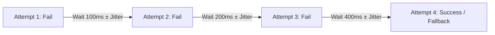
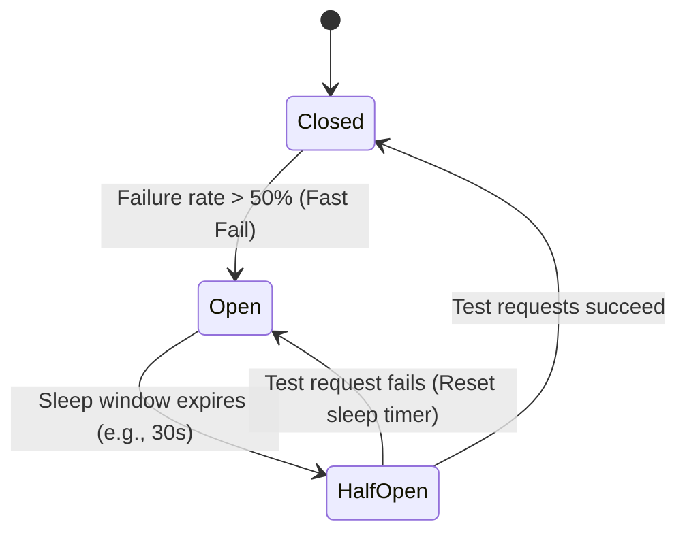
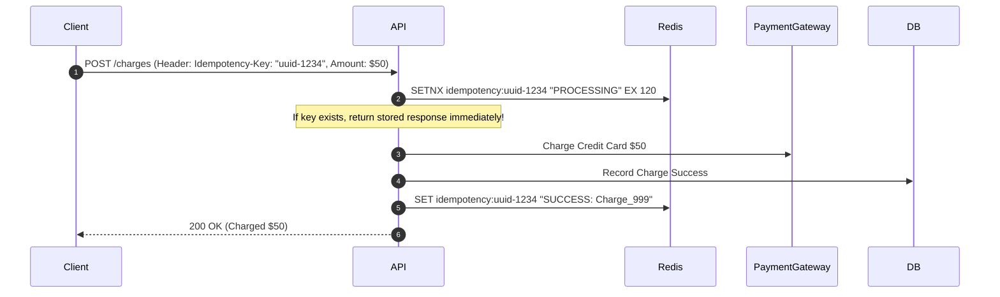

# 🛡️ Error Handling & Fault-Tolerant Distributed Systems

> **Core Philosophy**: In distributed systems, **failures are inevitable**. Hardware will fail, networks will partition, and downstream APIs will time out. 
> Resilience is not about preventing failures, but **isolating faults, failing fast, preventing cascading disasters, and recovering gracefully**.

---

## 📑 Table of Contents
1. [The Anatomy of Cascading Failures](#1-the-anatomy-of-cascading-failures)
2. [Timeouts & Deadline Propagation](#2-timeouts--deadline-propagation)
3. [Retries, Exponential Backoff & Full Jitter](#3-retries-exponential-backoff--full-jitter)
4. [The Circuit Breaker Pattern (Closed, Open, Half-Open)](#4-the-circuit-breaker-pattern)
5. [Fallback Strategies & Graceful Degradation](#5-fallback-strategies--graceful-degradation)
6. [The Bulkhead Pattern (Resource Isolation)](#6-the-bulkhead-pattern)
7. [Idempotency & Idempotent API Design](#7-idempotency--idempotent-api-design)
8. [Rate Limiting Algorithms (Token Bucket, Leaky Bucket, Sliding Window)](#8-rate-limiting-algorithms)
9. [Placement Interview Checklist & System Design Patterns](#9-placement-interview-checklist)

---

## 1. The Anatomy of Cascading Failures

Without defensive boundaries, a single minor outage in Service C can bring down the entire company:

```
Service A (User API) ──▶ Service B (Order Service) ──▶ Service C (Payment Gateway - HANGS)
     │                         │                                  │
All 500 worker threads    All 500 worker threads            Server unresponsive
blocked waiting for B     blocked waiting for C             (Taking 60s per call)
     ↓                         ↓                                  ↓
Service A crashes! 💥     Service B crashes! 💥             System Offline! 💥
```

---

## 2. Timeouts & Deadline Propagation

Every network call **MUST** have an explicit timeout. Never rely on OS socket default timeouts ($\approx 2-15\text{ minutes}$).

- **Connect Timeout**: Max time allowed to establish TCP/TLS handshake ($\approx 500\text{ms} - 2\text{s}$).
- **Read Timeout**: Max time allowed to wait for the next data packet ($\approx 1\text{s} - 5\text{s}$).
- **End-to-End Deadline Propagation**: If an API gateway has a 2-second timeout, pass the remaining budget in headers (`X-Request-Deadline: 1200ms`) so downstream services abort work if time has already expired.

---

## 3. Retries, Exponential Backoff & Full Jitter

Blind immediate retries create a **Retry Storm** that finishes off a struggling downstream server.

```
❌ Bad Retry: Immediate retry 3 times -> 10,000 requests * 3 = 30,000 instant requests on failing service!
✅ Good Retry: Exponential backoff with randomized jitter.
```



### Mathematical Formula (Full Jitter):
$$\text{Backoff} = \text{random}\left(0, \, \min\left(\text{MaxCap}, \, \text{Base} \times 2^{\text{retry\_count}}\right)\right)$$

> [!IMPORTANT]
> **Retry Rule**: Only retry **transient, idempotent errors** (e.g., HTTP 503, 504, TCP Connection Drops). **NEVER** retry non-idempotent operations without an Idempotency Key!

---

## 4. The Circuit Breaker Pattern

Prevents an application from repeatedly trying to execute an operation that is almost certain to fail.



| State | Behavior |
| :--- | :--- |
| **CLOSED** | Normal operations. All requests pass through. Tracks failure metrics. |
| **OPEN** | **Fast Fail**. Requests do not hit the downstream service; returns fallback immediately. |
| **HALF-OPEN**| Allows a small probe batch ($5-10\%$ traffic) through to test if service has recovered. |

---

## 5. Fallback Strategies & Graceful Degradation

When the circuit breaker is **OPEN** or a call times out:
1. **Cache Fallback**: Return slightly stale cached data (e.g., yesterday's product recommendations).
2. **Default Stub**: Return empty list or static placeholder (e.g., "Trending Items temporarily unavailable").
3. **Async Offload**: Accept the user's order, save to local disk/queue, and confirm: *"Order received, confirming shortly."*

---

## 6. The Bulkhead Pattern

Named after the watertight partition compartments in ships (Titanic design). If one compartment floods, the others remain buoyant.

```
Shared Thread Pool (Danger):
[ All 100 Worker Threads Allocated to Broken Payment Gateway ] -> Entire Server Freezes!

Bulkhead Isolation (Safe):
┌─────────────────────────┐  ┌─────────────────────────┐  ┌─────────────────────────┐
│ Search Pool (50 threads)│  │ Auth Pool (30 threads)  │  │ Payment Pool (20 threads)│
└─────────────────────────┘  └─────────────────────────┘  └─────────────────────────┘
```
If Payment Gateway hangs, only its 20 threads get exhausted. Search and Auth continue functioning at $100\%$ speed.

---

## 7. Idempotency & Idempotent API Design

An operation is **idempotent** if applying it multiple times produces the exact same result as applying it once:
$$f(f(x)) = f(x)$$

### The `X-Idempotency-Key` Pattern (Payment Systems):


---

## 8. Rate Limiting Algorithms

Protects backends against DDoS attacks, brute-force bots, and noisy neighbors.

| Algorithm | Mechanism | Pros | Cons |
| :--- | :--- | :--- | :--- |
| **Token Bucket** | Tokens added to bucket at constant rate; each request consumes 1 token. | Handles **bursts** smoothly; memory efficient. | Token refill math on high concurrency. |
| **Leaky Bucket** | Requests enter FIFO queue; processed at fixed constant rate. | Smooths output traffic rate. | Drops bursty requests if queue is full. |
| **Sliding Window Log** | Stores timestamp of each request in a Redis Sorted Set (`ZSET`). | $100\%$ precise window boundary. | High memory consumption ($O(N)$ timestamps). |
| **Sliding Window Counter** | Blends count of previous window with current window: $\text{Count} = C_{\text{curr}} + C_{\text{prev}} \times (1 - \text{overlap})$. | Low memory ($O(1)$) + smooth boundary. | Minor approximation error ($\approx 0.05\%$). |

---

## 9. Placement Interview Checklist

- [ ] **Timeout**: Did you define both connection and read timeouts?
- [ ] **Retries**: Are retries using exponential backoff with full randomized jitter?
- [ ] **Circuit Breaker**: Does the system fail fast when a downstream dependency is down?
- [ ] **Bulkheads**: Are critical resources (thread pools, DB connections) isolated per service?
- [ ] **Idempotency**: Can the user safely retry a payment or order POST without double-charging?
- [ ] **Rate Limiting**: Are public API endpoints protected with Token Bucket / Sliding Window algorithms?
