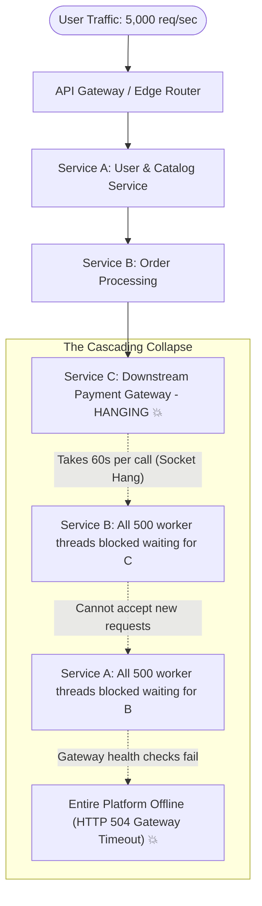
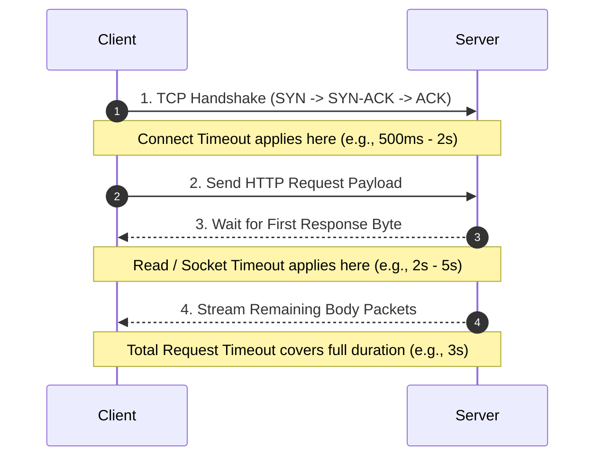
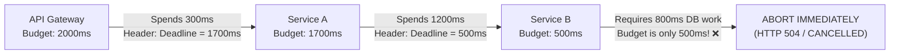
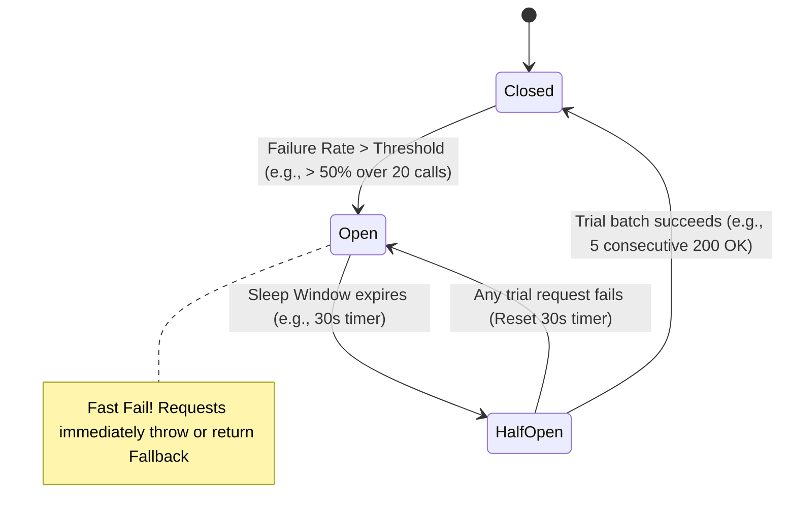
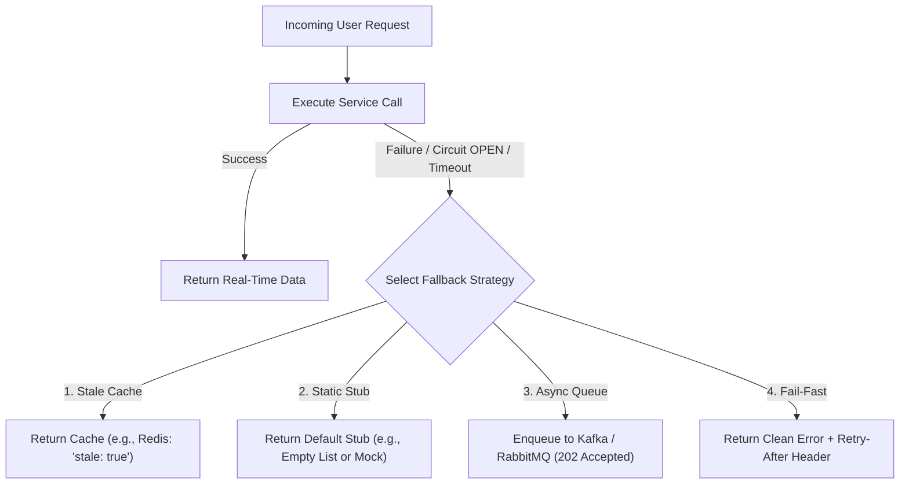
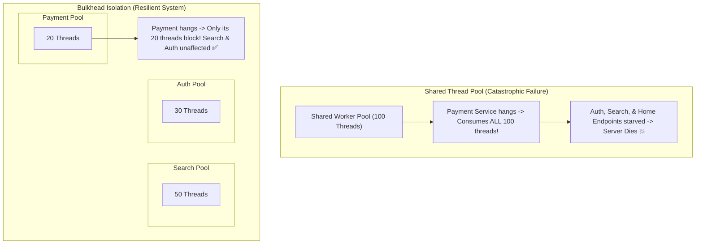
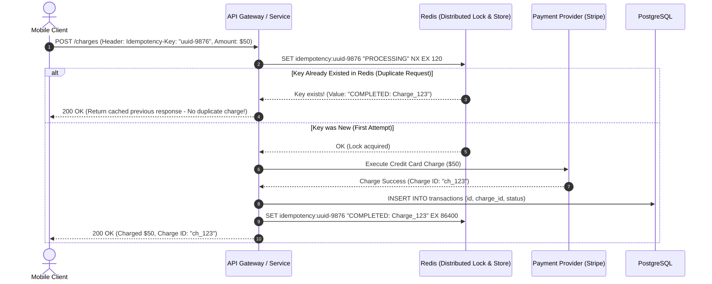
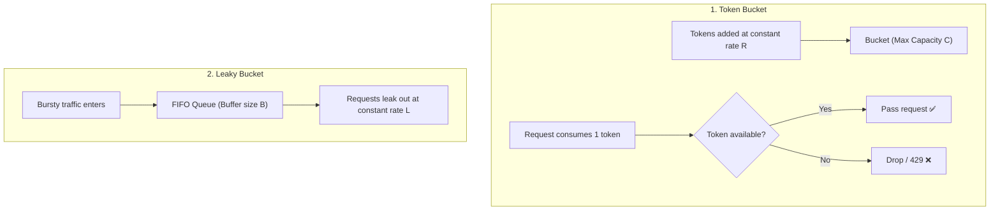

# 🛡️ Error Handling & Fault-Tolerant Distributed Systems

> **Core Philosophy**: In distributed systems, **failures are inevitable**. Hardware will fail, networks will partition, downstream third-party APIs will time out, and garbage collection pauses will cause latency spikes. 
> Resilience is not about preventing failures, but **isolating faults, failing fast, preventing cascading disasters, and recovering gracefully**.

---

## 📑 Table of Contents
- [1. The Anatomy of Cascading Failures](#1-the-anatomy-of-cascading-failures)
- [2. Timeouts & Deadline Propagation](#2-timeouts--deadline-propagation)
- [3. Retries, Exponential Backoff & Full Jitter](#3-retries-exponential-backoff--full-jitter)
- [4. The Circuit Breaker Pattern (Closed, Open, Half-Open)](#4-the-circuit-breaker-pattern-closed-open-half-open)
- [5. Fallback Strategies & Graceful Degradation](#5-fallback-strategies--graceful-degradation)
- [6. The Bulkhead Pattern (Resource Isolation)](#6-the-bulkhead-pattern-resource-isolation)
- [7. Idempotency & Idempotent API Design](#7-idempotency--idempotent-api-design)
- [8. Rate Limiting Algorithms (Token Bucket, Leaky Bucket, Sliding Window)](#8-rate-limiting-algorithms-token-bucket-leaky-bucket-sliding-window)
- [9. Placement Interview Checklist & System Design Patterns](#9-placement-interview-checklist--system-design-patterns)

---

## 1. The Anatomy of Cascading Failures

> 💡 **Quick Revision Anchor (2-3 Words)**: `Cascading Outage Chain`

In a microservice or multi-tier architecture, services depend on one another. Without defensive fault isolation boundaries, **a single minor failure in a peripheral service can bring down the entire company's infrastructure**.



---

### The Thread Exhaustion Death Spiral
1. **The Downstream Stall**: Service C (e.g., an external third-party payment partner) experiences a network partition or heavy database lock, causing API calls that normally take 100 ms to take **60 seconds**.
2. **Upstream Thread Starvation**: Service B uses a standard synchronous thread pool (e.g., Tomcat with 200–500 worker threads). Each incoming request spawns or occupies a thread that blocks on socket read I/O waiting for Service C.
3. **Queue Overflow & Resource Collapse**: Within seconds, all 500 threads in Service B are exhausted. Incoming requests pile up in the OS socket backlog queue until memory runs out or requests get dropped.
4. **Upstream Infection**: Service A calls Service B. Since Service B is unresponsive, Service A's threads now block waiting for B. Service A exhausts its own thread pool.
5. **Total Outage**: Load balancers detect that health check endpoints on Service A and B are timing out, marking all instances as unhealthy and routing traffic nowhere.

---

### Latency Amplification & GC Pressure
- **Memory Pressure**: While hundreds of threads sit blocked, their call stacks, request payloads, and allocated database objects remain pinned in memory, preventing Garbage Collection (GC).
- **Stop-the-World GC Pauses**: Memory pressure triggers full GC cycles, which pause all threads on the host, causing healthy, unrelated API endpoints on the same node to time out.

[⬆ Back to Top](#📑-table-of-contents)

---

## 2. Timeouts & Deadline Propagation

> 💡 **Quick Revision Anchor (2-3 Words)**: `Explicit Socket Budgets`

The foundational rule of resilient distributed systems: **Every network call MUST have an explicit, bounded timeout.** Never rely on default operating system socket timeouts, which typically range from **2 to 15 minutes**.

---

### The Three Essential Network Timeouts



| Timeout Type | Typical Value | What It Guards Against |
| :--- | :---: | :--- |
| **Connect Timeout** | `500 ms – 2 s` | Server offline, routing black-holes, dropped SYN packets, firewall packet drops. |
| **Read (Socket) Timeout** | `1 s – 5 s` | Remote server accepted TCP connection but is hung on a slow DB query or deadlocked. |
| **Total Call Timeout** | `2 s – 6 s` | Total elapsed budget from initiating the call to completely reading the response body. |

---

### End-to-End Deadline Propagation
In deep call chains ($A 
ightarrow B 
ightarrow C 
ightarrow D$), fixed timeouts at each hop lead to **wasted compute on doomed requests**.

If the API Gateway has a total client SLA of **2.0 seconds**, and the request has already spent 1.8 seconds traveling through Service A and B, Service C should **not** begin a 3-second database transaction for a request whose client has already hung up!



#### Production Implementation (HTTP Header / gRPC Context):
- **HTTP Header**: `X-Request-Deadline: 1695048123456` (epoch timestamp) or `X-Remaining-Budget-Ms: 500`.
- **gRPC**: Native `Context.withDeadlineAfter(duration, TimeUnit.MILLISECONDS)`. Downstream nodes automatically cancel their context and release threads if the deadline is exceeded.

[⬆ Back to Top](#📑-table-of-contents)

---

## 3. Retries, Exponential Backoff & Full Jitter

> 💡 **Quick Revision Anchor (2-3 Words)**: `Backoff With Jitter`

When an API call fails, the natural human reaction is to try again immediately. In distributed systems, **immediate retries create a Retry Storm that crushes struggling services**.

```
❌ The Retry Storm Disaster:
10,000 clients fail during a temporary database spike.
Each client immediately retries 3 times without waiting:
10,000 requests * 3 retries = 30,000 new requests hammering a server already at 100% CPU!
```

---

### Backoff Strategies Compared

```mermaid
gantt
    title Retry Backoff Strategies Over Time
    dateFormat X
    axisFormat %s s
    section Immediate (Bad)
    R1 :crit, 0, 10
    R2 :crit, 10, 20
    R3 :crit, 20, 30
    section Fixed Interval
    R1 :active, 0, 10
    R2 :active, 1000, 1010
    R3 :active, 2000, 2010
    section Exponential
    R1 :done, 0, 10
    R2 :done, 1000, 1010
    R3 :done, 3000, 3010
    R4 :done, 7000, 7010
    section Full Jitter (Best)
    R1 :milestone, 0, 0
    R2 :done, 420, 430
    R3 :done, 1850, 1860
    R4 :done, 5100, 5110
```



---

### The AWS Full Jitter Algorithm
Pure exponential backoff still causes **thundering herd synchronization** because all clients retry at predictable wave intervals ($2^1, 2^2, 2^3$). 

**Full Jitter** breaks synchronization by introducing a random uniform distribution between $0$ and the calculated exponential ceiling:

$$\text{Sleep} = \text{random}\left(0, \, \min\left(\text{MaxCap}, \, \text{Base} \times 2^{\text{attempt}}\right)\right)$$

#### Java Production Implementation:
```java
public class ResilientRetryer {
    private static final long BASE_MS = 100;
    private static final long MAX_CAP_MS = 3000;
    private static final int MAX_ATTEMPTS = 4;
    private static final ThreadLocalRandom RANDOM = ThreadLocalRandom.current();

    public <T> T executeWithRetry(Supplier<T> operation) throws Exception {
        int attempt = 0;
        while (true) {
            try {
                return operation.get();
            } catch (TransientException ex) { // ONLY retry transient errors!
                attempt++;
                if (attempt >= MAX_ATTEMPTS) {
                    throw ex; // Exceeded budget, fail fast
                }
                long exponentialCeiling = Math.min(MAX_CAP_MS, BASE_MS * (1L << attempt));
                long sleepMs = RANDOM.nextLong(0, exponentialCeiling + 1);
                Thread.sleep(sleepMs);
            }
        }
    }
}
```

---

### The Golden Rule of Retries: Idempotency & Error Codes
> [!IMPORTANT]
> **What to Retry**: Only retry **transient, network-level, or server-overload errors**:
> - HTTP `503 Service Unavailable`, `504 Gateway Timeout`, `429 Too Many Requests`.
> - TCP connection resets (`ECONNRESET`), socket timeouts.
> 
> **What NEVER to Retry**:
> - HTTP `400 Bad Request`, `401 Unauthorized`, `403 Forbidden`, `404 Not Found`, `422 Unprocessable Entity` (these are client bugs; retrying will produce the exact same error).
> - **Non-idempotent operations** (e.g., `POST /payments`) without an **Idempotency Key**!

[⬆ Back to Top](#📑-table-of-contents)

---

## 4. The Circuit Breaker Pattern (Closed, Open, Half-Open)

> 💡 **Quick Revision Anchor (2-3 Words)**: `Circuit Breaker States`

The **Circuit Breaker** pattern prevents an application from repeatedly attempting an operation that is almost guaranteed to fail, saving CPU cycles, thread capacity, and downstream infrastructure.



---

### The Three State Transitions Explained

| State | Influx Behavior | Downstream Network Call? | Next State Trigger |
| :--- | :--- | :---: | :--- |
| **CLOSED** (Normal) | All traffic passes through. Maintains a sliding window ring buffer of success/failure counts. | **Yes** | If failure rate exceeds threshold (e.g., $> 50\%$) or slow-call rate exceeds threshold $
ightarrow$ **OPEN**. |
| **OPEN** (Tripped) | **Fast Fail**. All incoming calls are immediately aborted with `CallNotPermittedException` or routed to a fallback method. | **No** (Zero network traffic) | A sleep duration timer starts (e.g., 30 seconds). Upon expiration $
ightarrow$ **HALF-OPEN**. |
| **HALF-OPEN** (Probing) | A small, controlled probe batch (e.g., 5 to 10 requests) is allowed through to test downstream health. | **Yes** (Limited trial batch) | • If probe requests **succeed** $
ightarrow$ **CLOSED** (Healed).<br>• If any probe request **fails** $
ightarrow$ **OPEN** (Still broken). |

---

### Production Resilience4j Configuration (Spring Boot `application.yml`):
```yaml
resilience4j.circuitbreaker:
  instances:
    paymentService:
      slidingWindowType: COUNT_BASED
      slidingWindowSize: 20                  # Monitor last 20 requests
      minimumNumberOfCalls: 10              # Must record 10 calls before calculating rate
      failureRateThreshold: 50.0            # Open if >= 50% fail
      slowCallDurationThreshold: 2000ms     # Calls taking > 2s count as failures
      slowCallRateThreshold: 75.0           # Open if >= 75% calls are slow
      waitDurationInOpenState: 30000ms      # Wait 30s in OPEN before going HALF_OPEN
      permittedNumberOfCallsInHalfOpenState: 5 # Allow 5 trial calls in HALF_OPEN
```

[⬆ Back to Top](#📑-table-of-contents)

---

## 5. Fallback Strategies & Graceful Degradation

> 💡 **Quick Revision Anchor (2-3 Words)**: `Graceful Fallback Tactics`

When a circuit breaker trips **OPEN** or a timeout fires, the system should not present a raw error or white screen to the user. Instead, apply **Graceful Degradation**:



---

### The Four Primary Fallback Patterns:

#### 1. Stale Cache Fallback
- **Mechanism**: Return previously cached data from local memory or Redis, even if its TTL has expired.
- **Example**: If the Personalized Recommendation Service fails, display yesterday's cached recommendations with an invisible header or subtle label.

#### 2. Default Stub / Static Placeholder
- **Mechanism**: Return a harmless empty response or a statically compiled asset.
- **Example**: If the Customer Reviews Service fails on an e-commerce product page, render the product details normally and replace the review section with: *"Customer reviews temporarily unavailable."*

#### 3. Asynchronous Buffer Offload (Store-and-Forward)
- **Mechanism**: Accept the transaction into a durable local write-ahead log (WAL) or Kafka topic and respond with HTTP `202 Accepted`.
- **Example**: If the Notification Service or Order Analytics pipeline is down, append the event to a disk-backed queue and process it once the downstream recovers.

#### 4. Fail-Fast with Client Guidance
- **Mechanism**: Return an immediate structured JSON response with a standard HTTP status code and actionable retry headers.
- **Example**:
  ```http
  HTTP/1.1 503 Service Unavailable
  Retry-After: 30
  Content-Type: application/json

  {
    "error": "PAYMENT_GATEWAY_BUSY",
    "message": "Payment provider is currently undergoing maintenance. Please retry in 30 seconds."
  }
  ```

[⬆ Back to Top](#📑-table-of-contents)

---

## 6. The Bulkhead Pattern (Resource Isolation)

> 💡 **Quick Revision Anchor (2-3 Words)**: `Bulkhead Resource Isolation`

The **Bulkhead Pattern** is named after the watertight compartments in maritime ships (such as submarines and cargo vessels). If the hull is breached and one compartment floods, the bulkhead walls isolate the leak, keeping the remainder of the ship buoyant and afloat.



---

### Bulkhead Implementations: Thread Pool vs. Semaphore

| Feature | Thread Pool Isolation | Semaphore / Concurrency Isolation |
| :--- | :--- | :--- |
| **How it Works** | Each service runs tasks in a dedicated, bounded `ThreadPoolExecutor`. | Uses an atomic counter (`Semaphore`) to limit concurrent in-flight calls on the current thread. |
| **Thread Context Switching** | **High** (Requests switch from container thread to bulkhead thread). | **Zero** (Executes directly on the incoming container thread). |
| **Timeout Handling** | Can actively interrupt and kill hanging threads. | Cannot interrupt hanging socket reads; relies on underlying socket timeouts. |
| **Memory Overhead** | Higher (Thread stacks allocate 512KB - 1MB each). | Extremely low (Single integer counter in memory). |
| **Best Used For** | External remote I/O calls with high variance (Third-party payments). | Low-latency internal microservice calls or memory caches. |

---

### Database Connection Pool Bulkheads
Never share a single database connection pool between user-facing customer checkout flows and heavy background reporting jobs:
- **Pool 1 (Online OLTP Pool)**: 50 connections reserved strictly for checkout and order placement. Max lifetime: 100ms.
- **Pool 2 (Batch / Reporting Pool)**: 10 connections for admin dashboards, exports, and analytics. If an admin runs a heavy multi-table join, it can never exhaust the customer checkout pool.

[⬆ Back to Top](#📑-table-of-contents)

---

## 7. Idempotency & Idempotent API Design

> 💡 **Quick Revision Anchor (2-3 Words)**: `Idempotency Key Design`

An API operation is **idempotent** if performing it multiple times produces the exact same side-effects and server state as performing it once:

$$f(f(x)) = f(x)$$

### HTTP Method Idempotency Specifications:
- **Idempotent by Spec**: `GET`, `PUT`, `DELETE`, `HEAD`, `OPTIONS`. (Calling `DELETE /orders/42` five times leaves order 42 deleted each time).
- **Non-Idempotent by Spec**: `POST`, `PATCH`. (Calling `POST /charges` five times without safeguards charges the customer credit card five times!).

---

### The `X-Idempotency-Key` Pattern (Payment Systems)



---

### Critical Implementation Details
1. **Atomic Lock Acquisition (`SET NX EX`)**: The lock must be set atomically with an expiration TTL (e.g., 120 seconds) so that if the server crashes mid-flight, the lock will automatically release.
2. **Handle In-Flight Collisions (`409 Conflict`)**: If a second request arrives while the first request is still in `"PROCESSING"` state, return `409 Conflict` or poll for up to 2 seconds for completion.
3. **Store the Exact Result Payload**: Store the serialized HTTP response body and status code in Redis so the duplicate request receives the exact same response as the original request.
4. **Database Unique Constraints**: As a second line of defense, add a unique database index on `idempotency_key` in the `payments` table to guarantee that relational ACID consistency prevents duplicate rows.

[⬆ Back to Top](#📑-table-of-contents)

---

## 8. Rate Limiting Algorithms (Token Bucket, Leaky Bucket, Sliding Window)

> 💡 **Quick Revision Anchor (2-3 Words)**: `Rate Limiting Algorithms`

Rate limiting protects backend APIs against denial-of-service (DDoS) attacks, brute-force password spraying, noisy neighbors, and runaway infinite client retry loops.

---

### The Four Primary Algorithms



---

### Comparison Matrix of Algorithms

| Algorithm | How it Works | Burst Handling | Memory Footprint | Best Used For |
| :--- | :--- | :---: | :---: | :--- |
| **Token Bucket** | Tokens refill at fixed rate up to capacity $C$. Each request consumes a token. | **Handles bursts** up to capacity $C$. | $O(1)$ per user (Stores last timestamp + token count). | General API rate limiting (AWS API Gateway, Stripe). |
| **Leaky Bucket** | Requests enter a fixed-size FIFO queue and leak out to the backend at a smooth, constant rate. | **Smooths bursts** into a flat output stream; drops if queue is full. | $O(\text{Queue Size})$ | Traffic shaping, downstream services that cannot tolerate sudden spikes. |
| **Fixed Window Counter** | Counts requests in fixed time blocks (e.g., 12:00:00–12:01:00). Resets to 0 at minute mark. | **Vulnerable to $2\times$ boundary spikes** (e.g., 100 calls at 12:00:59 and 100 calls at 12:01:01). | $O(1)$ (Single counter per window). | Simple coarse rate limiting where boundary spikes are acceptable. |
| **Sliding Window Log** | Stores timestamp of every request in a Redis Sorted Set (`ZSET`). Prunes logs older than $(now - window)$. | **Perfect accuracy**, zero boundary spikes. | **High $O(N)$** (Stores every single request timestamp). | High-security endpoints (Login, Password Reset, Banking transfers). |
| **Sliding Window Counter** | Blends count of previous window with current window based on time overlap percentage. | **Smooth boundary transitions** with negligible approximation error ($< 0.05\%$). | **$O(1)$** (Stores only two integers per client). | Large-scale, high-concurrency enterprise edge routers (Cloudflare, Kong). |

---

### Mathematical Formula: Sliding Window Counter Approximation
$$\text{Estimated Count} = \text{Count}_{\text{current}} + \text{Count}_{\text{previous}} \times \left(1 - \frac{\text{Time Elapsed in Current Window}}{\text{Window Duration}}\right)$$

```
Example: Limit = 100 req/min
- Previous window (Minute 1): 80 requests
- Current window (Minute 2): 30 requests
- Current time: 15 seconds into Minute 2 (25% elapsed -> 75% overlap with previous window)

Estimated Count = 30 + (80 * 0.75) = 30 + 60 = 90 requests.
Since 90 <= 100, the request is ALLOWED!
```

---

### Production Redis Token Bucket (Atomic Lua Script)
Because rate limit checks require reading and updating counters atomically, execute the logic as a single **Redis Lua Script**:

```lua
-- KEYS[1]: Rate limit key (e.g., "ratelimit:user_123")
-- ARGV[1]: Max bucket capacity
-- ARGV[2]: Refill rate per millisecond
-- ARGV[3]: Current timestamp in milliseconds
-- ARGV[4]: Requested tokens (usually 1)

local key = KEYS[1]
local capacity = tonumber(ARGV[1])
local refill_rate = tonumber(ARGV[2])
local now = tonumber(ARGV[3])
local requested = tonumber(ARGV[4])

local data = redis.call("HMGET", key, "tokens", "last_updated")
local tokens = tonumber(data[1])
local last_updated = tonumber(data[2])

if tokens == nil then
    tokens = capacity
    last_updated = now
else
    local elapsed = now - last_updated
    tokens = math.min(capacity, tokens + (elapsed * refill_rate))
    last_updated = now
end

if tokens >= requested then
    tokens = tokens - requested
    redis.call("HMSET", key, "tokens", tokens, "last_updated", last_updated)
    redis.call("PEXPIRE", key, math.ceil(capacity / refill_rate))
    return 1 -- ALLOWED
else
    redis.call("HMSET", key, "tokens", tokens, "last_updated", last_updated)
    return 0 -- REJECTED (HTTP 429)
end
```

[⬆ Back to Top](#📑-table-of-contents)

---

## 9. Placement Interview Checklist & System Design Patterns

> 💡 **Quick Revision Anchor (2-3 Words)**: `Resilience Interview Checklist`

### System Design Architecture Review Checklist
When designing distributed systems (e.g., Uber, Netflix, Amazon Checkout) in technical interviews, run through this resilience mental checklist:

- [ ] **Timeouts**: Are both connect and socket read timeouts explicitly configured on all HTTP/gRPC clients?
- [ ] **Deadline Propagation**: Does the edge gateway pass the remaining deadline header (`X-Request-Deadline`) downstream to prevent wasted compute?
- [ ] **Retries with Jitter**: Do retry policies use exponential backoff with full randomized jitter to prevent retry storms?
- [ ] **Idempotent Retries**: Is retry logic restricted to idempotent methods or guarded by unique `Idempotency-Key` headers?
- [ ] **Circuit Breakers**: Does the system fail fast when a downstream dependency exceeds error or latency thresholds?
- [ ] **Bulkheads**: Are critical worker thread pools, database connection pools, and memory buffers isolated per service domain?
- [ ] **Graceful Degradation**: Does the service fall back to stale cache, static stubs, or asynchronous message buffering when down?
- [ ] **Rate Limiting**: Are public APIs protected by Token Bucket or Sliding Window algorithms with HTTP `429 Too Many Requests` responses?

---

### Top 5 Placement Interview System Design Scenarios

#### Scenario 1: "How do you prevent duplicate charges when a customer clicks 'Pay Now' twice in rapid succession?"
> **Answer**: Implement the **Idempotency Key Pattern**. The frontend generates a UUID v4 idempotency key per checkout session and passes it in the `Idempotency-Key` header. The payment service uses an atomic Redis `SETNX` lock on `idempotency:<uuid>` with a 120-second TTL. If a duplicate request arrives while the first is in-flight, it returns `409 Conflict`. Once complete, the charge response is stored in Redis for 24 hours. Subsequent duplicate requests immediately return the cached response without hitting the payment gateway.

#### Scenario 2: "What is the difference between a retry storm and a thundering herd, and how do you mitigate both?"
> **Answer**: 
> - **Retry Storm**: Occurs when thousands of clients immediately retry failed requests simultaneously against a failing service, multiplying the load ($N \times \text{retries}$) and preventing recovery. Mitigated via **Exponential Backoff with Full Jitter** and circuit breakers.
> - **Thundering Herd**: Occurs when a high-traffic cached key expires, causing hundreds of concurrent requests to miss the cache simultaneously and hammer the underlying database with identical queries. Mitigated via **Mutex locking (Singleflight)** or **probabilistic early cache renewal (XFetch)**.

#### Scenario 3: "Why should you prefer the Token Bucket algorithm over Fixed Window Counter for public API rate limiting?"
> **Answer**: The Fixed Window Counter suffers from the **boundary burst vulnerability**: if a user has a limit of 100 requests/minute, they can send 100 requests at 11:59:59 and another 100 requests at 12:00:01, pushing 200 requests in a 2-second window (2x allowed rate). The **Token Bucket** prevents this by enforcing a continuous token refill rate while smoothly accommodating bursts up to bucket capacity $C$ with $O(1)$ memory overhead.

#### Scenario 4: "Why is a Circuit Breaker preferable to a simple timeout?"
> **Answer**: A timeout only aborts an individual call after waiting the full timeout duration (e.g., 3 seconds). If 1,000 requests arrive per second to a dead service, all 1,000 threads will hang for 3 seconds each, completely exhausting server thread pools. A **Circuit Breaker** tracks failure rates; once tripped **OPEN**, it **fails fast in 0 milliseconds**, immediately returning a fallback without creating socket connections or wasting thread capacity.

#### Scenario 5: "How does the Bulkhead pattern protect an application server when one downstream database query runs slowly?"
> **Answer**: Without bulkheads, all incoming requests share a common thread pool or database connection pool. A single slow query can occupy all available connections or worker threads, starving completely unrelated features (e.g., login or search). Bulkheads partition resources into dedicated pools (e.g., 20 connections for Payments, 50 for Catalog, 30 for Auth). If Payments stall, only its 20 connections are saturated; Catalog and Auth continue running with zero degradation.

---

### 1-Page Master Summary Table

| Fault-Tolerance Pattern | Primary Failure It Solves | Key Implementation Tactic | Common Framework / Tool |
| :--- | :--- | :--- | :--- |
| **Timeouts** | Threads hanging indefinitely on dead connections. | Connect (1s) + Read (3s) + Deadline headers. | OkHttp, HttpClient, gRPC Context. |
| **Exponential Backoff & Jitter** | Retry storms finishing off struggling servers. | $Sleep = \text{random}(0, \text{Base} \times 2^{\text{attempt}})$. | Resilience4j, Spring Retry, AWS SDK. |
| **Circuit Breaker** | Repeatedly hammering broken downstream services. | Closed $
ightarrow$ Open (Fast Fail) $
ightarrow$ Half-Open. | Resilience4j, Envoy, Istio. |
| **Graceful Degradation** | Complete outages and white error screens. | Stale cache, static stubs, async queue buffer. | Redis cache, Kafka, Local WAL. |
| **Bulkheads** | Single slow dependency starving all thread pools. | Dedicated thread pools or connection limits. | Resilience4j Bulkhead, HikariCP pools. |
| **Idempotency** | Double charges and duplicated orders on retries. | Unique key + Redis atomic `SETNX` + DB constraint. | Redis, PostgreSQL Unique Index. |
| **Rate Limiting** | DDoS, brute-force bots, and noisy neighbors. | Token Bucket / Sliding Window Counter. | Redis Lua script, Cloudflare, Kong. |

[⬆ Back to Top](#📑-table-of-contents)
