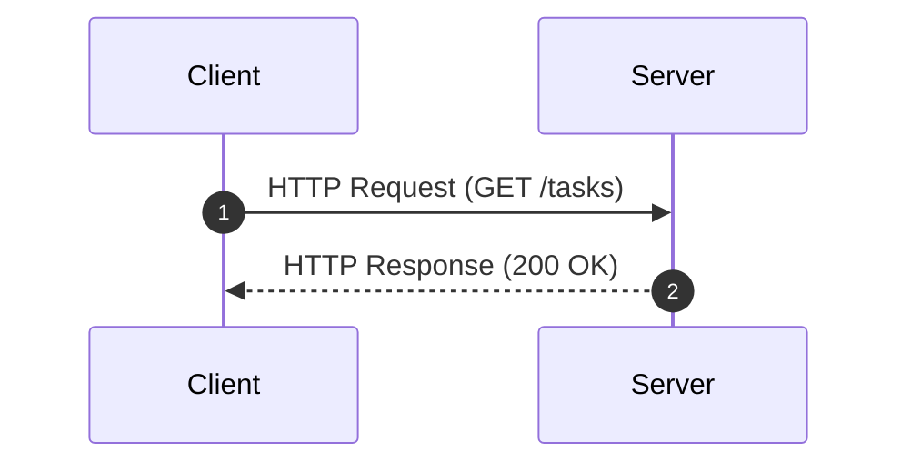
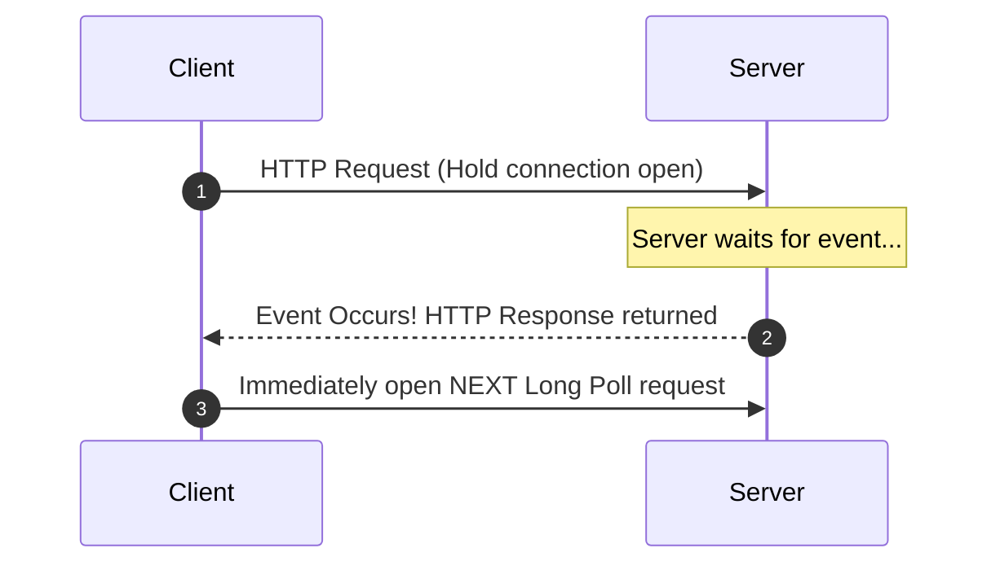
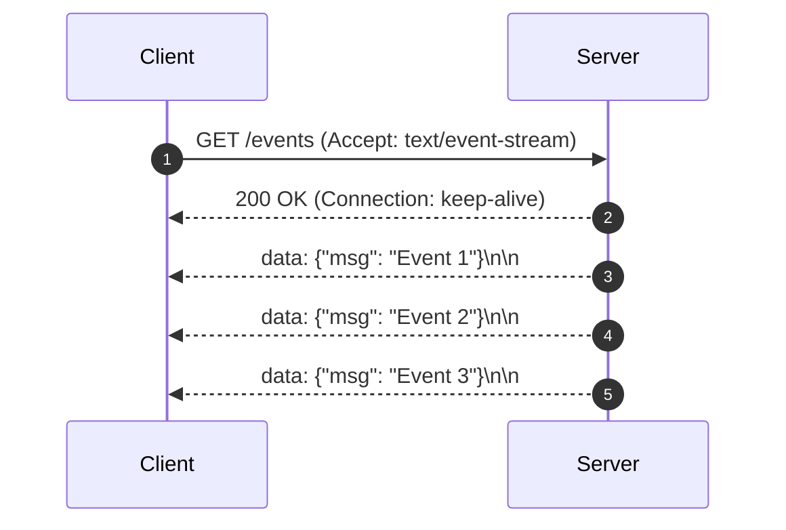
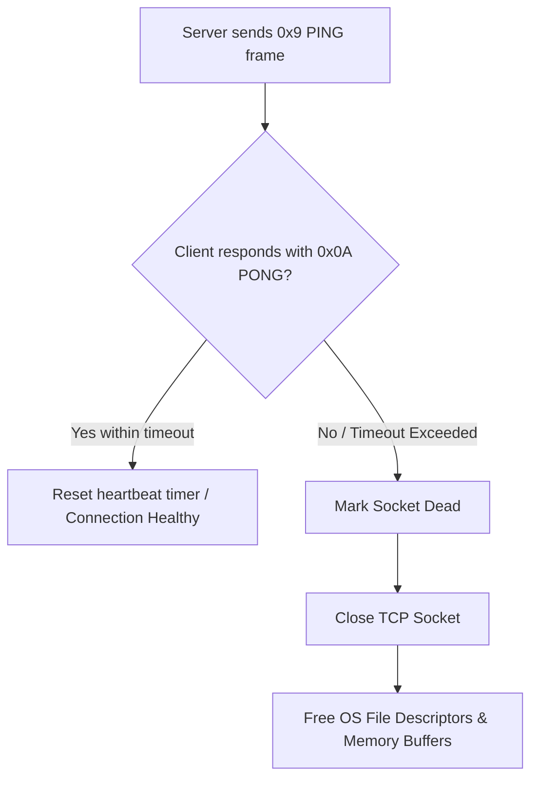
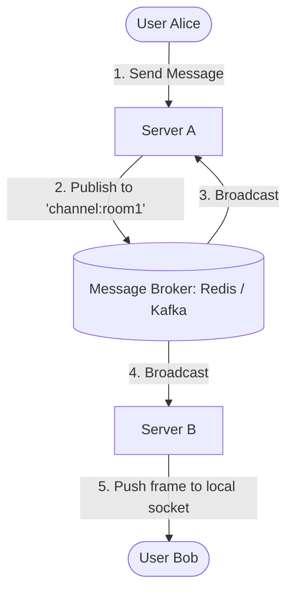

# ⚡ Real-Time Backend Systems & Architecture

> **Core Philosophy**: Real-time communication evolves through four primary paradigms: **Short Polling → Long Polling → Server-Sent Events (SSE) → WebSockets**. 
> At enterprise production scale, the primary engineering challenges shift from connection handling to **multi-server event distribution, durable event logs, disconnect replay/catch-up, fan-out bottlenecks, and reconnect storm resilience**.

---

## 📑 Table of Contents
1. [The Fundamental Client-Server Problem](#1-the-fundamental-problem)
2. [Short Polling](#2-short-polling)
3. [Long Polling](#3-long-polling)
4. [Server-Sent Events (SSE)](#4-server-sent-events-sse)
5. [WebSockets (Bidirectional TCP)](#5-websockets)
6. [The WebSocket Protocol Internals (Handshake, Frames, Masking)](#6-websocket-protocol-internals)
7. [Connection Management (Ping/Pong & Liveness)](#7-connection-management-pingpong--liveness)
8. [Operating System Scaling (File Descriptors, TCP 4-Tuple, Memory)](#8-operating-system-scaling)
9. [Distributed Multi-Server Architecture](#9-distributed-multi-server-architecture)
10. [Event Distribution: Redis Pub/Sub vs. Kafka / Durable Streams](#10-event-distribution-redis-pubsub-vs-kafka--durable-streams)
11. [Disconnect Recovery & Replay Offsets](#11-disconnect-recovery--replay-offsets)
12. [High Fan-Out & Reconnection Storm Mitigation](#12-high-fan-out--reconnection-storm-mitigation)
13. [Presence & Collaborative Editing (CRDT vs. OT)](#13-presence--collaborative-editing)
14. [Technology Comparison & Interview Cheat Sheet](#14-technology-comparison--interview-cheat-sheet)

---

## 1. The Fundamental Problem

Standard HTTP request-response follows a strict **client-pull** model:



In collaborative applications (e.g., Trello, Figma, Slack, Uber):
```
User A updates a resource  ───▶  Database state updates on Server
                                                │
                                 How does User B receive this update instantly
                                 without refreshing the page?
```

> [!IMPORTANT]
> **Core Objective**: Enable **Server $\rightarrow$ Client** data delivery with minimal latency, low bandwidth overhead, and high concurrency.

---

## 2. Short Polling

The client repeatedly asks the server for updates on a fixed timer interval.

```
Client ── "Any updates?" ──▶ Server ── "No"  (HTTP 200/304)
              [Wait 3 seconds]
Client ── "Any updates?" ──▶ Server ── "No"  (HTTP 200/304)
              [Wait 3 seconds]
Client ── "Any updates?" ──▶ Server ── "Yes (Task #42 Moved)"
```

### 🔴 Core Drawbacks:
- **Excessive Overhead**: 95%+ of requests return empty responses, wasting CPU, network headers, and TLS handshakes.
- **Inherent Latency**: Events occurring right after a poll must wait until the next cycle:
  $$\text{Average Latency} = \frac{\text{Polling Interval}}{2} \quad (\text{e.g., } 3\text{s interval} \implies 1.5\text{s delay})$$
- **Poor Scaling Ratio**: Traffic scales with the **number of active users**, *not* the volume of actual events:
  $$10,000 \text{ active users polling every } 3\text{s} = \mathbf{3,333 \text{ QPS}} \text{ on backend/DB even with ZERO activity!}$$

---

## 3. Long Polling

Instead of returning an immediate empty response, the server **holds the HTTP request open** until an event occurs or a timeout is reached.



### Key Trade-offs:
- ✅ **Pros**: Dramatically lower latency than short polling; works over standard HTTP/1.1 infrastructure and corporate firewalls.
- ⚠️ **Cons**: 
  - **The Re-poll Gap**: A brief window exists between receiving a response and establishing the next request where events can be delayed.
  - **Server Resource Drain**: Thousands of suspended threads/connections on traditional synchronous web servers (e.g., Apache Tomcat thread-per-request).

---

## 4. Server-Sent Events (SSE)

SSE maintains a **single, long-lived unidirectional HTTP response stream** (`Server → Client`) using the standard `text/event-stream` MIME type.



### Wire Format:
```http
id: 101
event: task-updated
retry: 5000
data: {"taskId": 42, "status": "COMPLETED"}

```

| Field | Purpose |
| :--- | :--- |
| `id` | Unique sequential event identifier (used for reconnection catch-up). |
| `event` | Custom event name (listened to via `addEventListener('task-updated', ...)` in browser). |
| `data` | Stringified JSON or text payload. |
| `retry` | Milliseconds the browser waits before auto-reconnecting on disconnect. |

### Built-in Reconnection Protocol:
1. Browser receives events with IDs: `101`, `102`, `103`.
2. Network drops $\rightarrow$ Browser automatically reconnects sending header:
   ```http
   Last-Event-ID: 103
   ```
3. Server reads `Last-Event-ID` and replays missed events (`104`, `105`) before streaming live events.

> [!TIP]
> **When to Choose SSE over WebSockets**:
> - Stock tickers, live sports scoreboards, social media feeds, system status dashboards.
> - **LLM Token Streaming** (e.g., OpenAI / ChatGPT streaming responses).
> - Native browser auto-reconnect + HTTP/2 multiplexing out of the box.

---

## 5. WebSockets

WebSockets provide a **persistent, bidirectional, full-duplex TCP connection** over a single socket where both client and server can send messages simultaneously at any time.

```
Client  ◀═══════════════════════════════════════▶  Server
             Persistent Bidirectional TCP Pipe
```

### Ideal Use Cases:
- Real-time multiplayer gaming
- Instant messaging / Team chat apps (Slack, Discord)
- Collaborative whiteboards / editing tools (Figma, Miro, Google Docs)
- High-frequency trading & live auction platforms

---

## 6. WebSocket Protocol Internals

### The Upgrade Handshake (HTTP 101)

WebSocket begins as a standard HTTP/1.1 request containing upgrade headers:

#### 1. Client Handshake Request:
```http
GET /chat HTTP/1.1
Host: api.example.com
Upgrade: websocket
Connection: Upgrade
Sec-WebSocket-Key: dGhlIHNhbXBsZSBub25jZQ==
Sec-WebSocket-Version: 13
```

#### 2. Server Response (Protocol Switch):
```http
HTTP/1.1 101 Switching Protocols
Upgrade: websocket
Connection: Upgrade
Sec-WebSocket-Accept: s3pPLMBiTxaQ9kYGzzhZRbK+xOo=
```

> 🔑 **What is `Sec-WebSocket-Key`?**
> - The client sends a random 16-byte base64 nonce.
> - The server appends a standard fixed GUID (`258EAFA5-E914-47DA-95CA-C5AB0DC85B11`), hashes it with **SHA-1**, and encodes it in Base64 $\rightarrow$ `Sec-WebSocket-Accept`.
> - **Purpose**: Confirms the server understands the WebSocket RFC 6455 protocol (avoids proxy/cache corruption). **It is NOT data encryption.**

---

### Frame Structure & Framing Opcodes

Once upgraded, communication switches from HTTP text to lightweight binary **frames**:

| Opcode | Type | Description |
| :---: | :--- | :--- |
| `0x1` | **Text Frame** | UTF-8 encoded text / JSON payload. |
| `0x2` | **Binary Frame** | Raw binary buffers, images, protocol buffers. |
| `0x8` | **Connection Close** | Initiates clean TCP close handshake. |
| `0x9` | **Ping** | Heartbeat probe sent to test liveness. |
| `0xA` | **Pong** | Heartbeat response sent back immediately. |

### Minimal Header Overhead:
- Small payloads ($< 126$ bytes) require only **2 to 6 bytes** of framing overhead.
- Compare this with HTTP/1.1 requests that carry **500–1,500 bytes of headers per message**.

---

### Frame Masking (Client $\rightarrow$ Server)
- **RFC 6455 Requirement**: All frames sent from *Client to Server* **MUST** be masked with a random 4-byte key using XOR:
  $$\text{MaskedByte}[i] = \text{OriginalByte}[i] \oplus \text{MaskKey}[i \pmod 4]$$
- **Why Mask?** Prevents malicious scripts in the browser from crafting packets that look like HTTP requests to confuse transparent proxies or poison shared caches.
- **Encryption**: Masking $\neq$ Encryption. Always use `wss://` (WebSocket over TLS/SSL on Port 443) in production.

---

## 7. Connection Management (Ping/Pong & Liveness)

TCP connections can silently become **half-open / dead** (e.g., client switches from Wi-Fi to Mobile data, battery dies, OS goes to sleep) without sending a `FIN` packet.



---

## 8. Operating System Scaling

How many concurrent WebSocket connections can a single server support?

### A. File Descriptors Limit
On Linux/Unix, **every TCP socket is a File Descriptor (FD)**.
- Default per-process limit is often `1024` (`ulimit -n`).
- Production servers must configure `/etc/security/limits.conf`:
  ```bash
  * soft nofile 1000000
  * hard nofile 1000000
  ```

### B. The TCP 4-Tuple
Every TCP connection is identified by:
$$\text{Connection ID} = (\text{Source IP}, \text{Source Port}, \text{Destination IP}, \text{Destination Port})$$

> ❌ **Myth**: *"A server can only accept 65,535 connections because there are 65,535 ports."*  
> ✅ **Fact**: The server listens on **1 port** (e.g., 443) and can handle **millions** of connections as long as client IPs/ports differ.  
> ⚠️ **Limitation**: A *single load-generator machine* hitting one server IP can exhaust its ephemeral port range ($\approx 60,000$).

### C. Memory Footprint per Connection
A persistent connection consumes RAM for kernel TCP read/write buffers, SSL session state, and language runtime structures:
- Average idle WebSocket footprint: $\approx 10\text{ KB} - 30\text{ KB}$.
- **100,000 connections** $\approx 1\text{ GB} - 3\text{ GB RAM}$.
- **1,000,000 connections** $\approx 10\text{ GB} - 30\text{ GB RAM}$.
- Modern architectures use **non-blocking I/O event loops** (`epoll` in Linux, Netty in Java, Tokio in Rust, Goroutines in Go) rather than thread-per-connection.

---

## 9. Distributed Multi-Server Architecture

WebSockets are **stateful**. A client's socket lives in the RAM of one specific server instance.

```
                   Load Balancer
                  /             \
                 ↓               ↓
            Server A          Server B
               │                 │
           User Alice        User Bob
```

- If **Alice** sends a chat message destined for **Bob**, Server A receives it.
- **Server B has no knowledge of Alice's event**, so Bob never gets the message.

> [!WARNING]
> **Why Sticky Sessions Don't Fix This**: Sticky sessions only ensure a reconnecting client returns to the same server. They **cannot** route messages between different users connected to different servers.

---

## 10. Event Distribution: Redis Pub/Sub vs. Kafka / Durable Streams

To bridge servers, instances publish events to a centralized message bus:



### Broker Comparison Matrix:

| Feature | Redis Pub/Sub | Kafka / Redis Streams / NATS JetStream |
| :--- | :--- | :--- |
| **Model** | Ephemeral Fire-and-Forget | **Durable Append-Only Log** |
| **Persistence** | In-memory only (No disk storage) | Persisted to disk with configurable retention |
| **Offline Clients** | ❌ Messages sent while offline are **lost** | ✅ Messages saved; clients replay from offset |
| **Latency** | Sub-millisecond ($< 1\text{ms}$) | Low ($5\text{ms} - 15\text{ms}$) |
| **Best For** | Live cursor tracking, typing indicators | Chat history, financial ledgers, document edits |

---

## 11. Disconnect Recovery & Replay Offsets

In production, mobile devices frequently switch networks (Wi-Fi $\leftrightarrow$ 5G). A robust real-time system must guarantee **gapless message delivery**.

```
Durable Stream:  [Msg 101] ── [Msg 102] ── [Msg 103] ── [Msg 104] ── [Msg 105]

1. Client received up to Msg 102.
2. Network drops. Msg 103 & 104 are published while client is offline.
3. Client reconnects: WebSocket Handshake with header/auth `last_msg_id: 102`.
4. Server queries Kafka/Redis Stream for messages where `id > 102`.
5. Server replays [Msg 103, Msg 104] to client.
6. Client switches to live real-time stream.
```

$$\text{Production Real-Time} = \text{Live Broadcast} + \text{Durable Replay/Catch-Up}$$

---

## 12. High Fan-Out & Reconnection Storm Mitigation

### 1. The Fan-Out Bottleneck
When an event occurs in a channel with 50,000 subscribers (e.g., live match update, Elon Musk tweet):
$$1 \text{ incoming event} \implies \mathbf{50,000 \text{ outbound socket writes}}$$
- **Solution**: Distribute subscriber lists across worker clusters; use edge connection proxies (e.g., Cloudflare Workers, AWS API Gateway WebSocket, Centrifugo).

---

### 2. Reconnection Storms (Thundering Herd)
When a WebSocket server node holding 50,000 connections restarts:
```
Server crashes  ──▶  50,000 clients disconnect simultaneously
                                  │
                     50,000 clients attempt instant reconnection
                                  │
                     Massive spike in TLS Handshakes, Auth DB queries
                                  │
                     Remaining healthy servers get overwhelmed and crash!
```

### Mitigation Strategies:
1. **Exponential Backoff with Full Jitter**:
   $$\text{Backoff Delay} = \text{random}(0, \min(\text{MaxCap}, \text{Base} \times 2^{\text{retry\_attempt}}))$$
2. **Stateless JWT Handshake Verification**: Verify cryptographic signature in-memory without querying user databases.
3. **Connection Throttling / Rate Limiting**: Limit the maximum new handshakes allowed per second at the reverse proxy (NGINX/Envoy).

---

## 13. Presence & Collaborative Editing

### Real-Time Presence (Who is Online?)
- Sockets send periodic heartbeats (every 30s).
- Server updates Redis with a short TTL:
  ```redis
  SET user:42:presence "online" EX 45
  ```
- If heartbeats stop for $> 45\text{s}$, the key expires automatically, marking the user offline without explicit disconnect messages.

### Collaborative Document Editing
When multiple users type simultaneously:
- **Operational Transformation (OT)**: Centralized server transforms string index offsets (Used by *Google Docs*).
- **CRDTs (Conflict-free Replicated Data Types)**: Commutative, associative data structures that merge deterministically across all nodes without a central authority (Used by *Figma*, *Apple Notes*).

---

## 14. Technology Comparison & Interview Cheat Sheet

| Metric | Short Polling | Long Polling | Server-Sent Events (SSE) | WebSockets |
| :--- | :--- | :--- | :--- | :--- |
| **Protocol** | HTTP/1.1 or HTTP/2 | HTTP/1.1 or HTTP/2 | HTTP (`text/event-stream`) | WebSocket (`ws://`, `wss://`) |
| **Directionality** | Client $\rightarrow$ Server | Client $\leftrightarrow$ Server | **Server $\rightarrow$ Client** (Unidirectional) | **Client $\leftrightarrow$ Server** (Bidirectional) |
| **Connection Lifespan**| Ephemeral | Medium (Holds until event) | **Persistent** | **Persistent** |
| **Framing Overhead** | High (Full HTTP headers) | High (Full HTTP headers) | Very Low (Text stream) | **Minimal** (2–6 byte binary frames) |
| **Auto-Reconnection**| Manual client retry | Manual client retry | **Built-in native browser feature** | Manual client implementation |
| **Firewall / Proxy** | 100% Compatible | 100% Compatible | 100% Compatible (Standard HTTP) | Requires HTTP Upgrade support |
| **Primary Placement Use Cases** | Infrequent sync | Legacy fallbacks | Stock quotes, news tickers, **LLM stream** | Chat, Gaming, Live collaboration |

---

### 💡 1-Sentence Mental Anchors for Interviews:
- **Polling**: *"Repeatedly ask 'Did anything happen?' $\rightarrow$ Wastes bandwidth."*
- **Long Polling**: *"Ask once and wait on hold until an event happens $\rightarrow$ Bridge solution."*
- **SSE**: *"Keep one HTTP pipe open for continuous server-to-client streaming $\rightarrow$ Simple & native."*
- **WebSocket**: *"Open a full-duplex TCP tunnel where both sides speak anytime $\rightarrow$ Maximum performance."*
- **Pub/Sub Bus**: *"Ensures servers broadcast events to clients connected on other instances."*
- **Durable Streams**: *"Enables offline clients to catch up without data loss."*
- **Jittered Backoff**: *"Prevents 50,000 reconnecting clients from killing the recovery server."*
