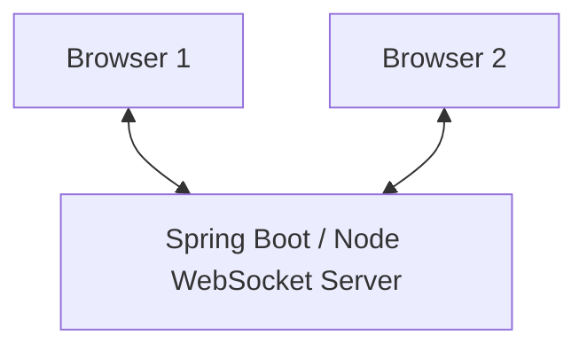
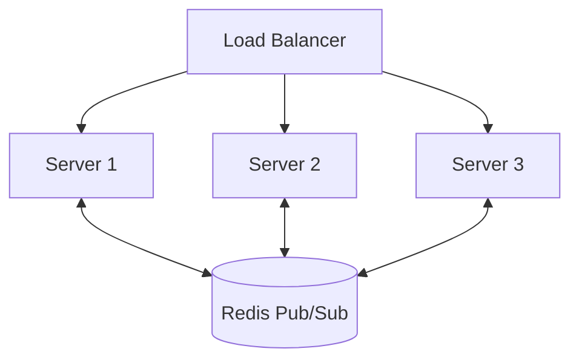
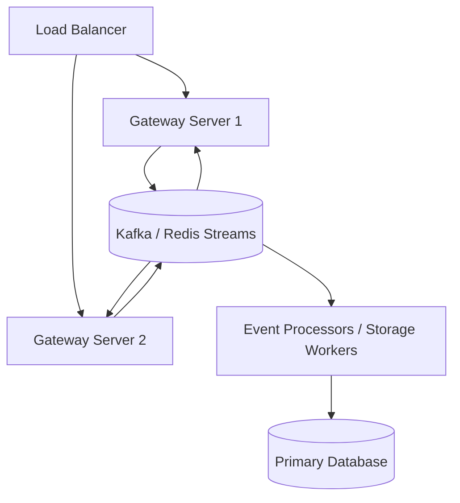

# ⚡ Real-Time Backend Systems

> **Core idea:** Real-time systems evolve from **Polling → Long Polling → SSE → WebSockets**. At production scale, the problems become **multi-server event distribution, durable events, replay/catch-up, fan-out, and reconnect storms**.

---

## 1. The Fundamental Problem

Normal HTTP follows:

```
Client → Request → Server
Client ← Response ← Server
```

The **client initiates communication**.

Example:

```
User A moves task
       ↓
Server state changes
       ↓
How does User B see it immediately?
```

A refresh works, but it is not real-time.

### The goal

We want:

```
Server → Client
```

without the client repeatedly asking:

> "Did anything change?"

---

## 2. Polling

The client repeatedly asks the server for changes.

```
Client → "Anything changed?"
Server → "No"

3 seconds later

Client → "Anything changed?"
Server → "No"

3 seconds later

Client → "Anything changed?"
Server → "Yes — task moved"
```

### Problems

- Most requests are unnecessary.
- Updates have latency.
- More users = more requests.
- Repeated requests increase backend/database load.
- Mobile clients consume additional battery/data.

### Latency

If polling every 3 seconds:

$$\text{Average delay} \approx \frac{3}{2} = 1.5 \text{ seconds}$$

### Scaling example

10,000 users polling every 3 seconds:

$$\frac{10,000}{3} \approx 3,333 \text{ requests/sec}$$

Even if **nothing happens**, the backend still processes those requests.

### Key insight

> **Polling scales with the number of users, not the number of events.**

---

## 3. Long Polling

Instead of immediately answering, the server keeps the HTTP request open.

```
Client ─────────────→ Server
                     │
                     │ wait...
                     │
                     │ event occurs
                     ↓
Client ←──────── response
```

After receiving the response, the client opens another request.

### Advantages

- Less waste than normal polling.
- Lower latency.
- Still works over HTTP.

### Problem

There is a gap:

```
Response received
      ↓
Client processes response
      ↓
New request created
```

During this period, there is no active request.

---

## 4. Server-Sent Events — SSE

SSE keeps one HTTP response open.

```
Client ───────────────────────→ Server
          persistent HTTP

Client ←──────── event 1 ───────
Client ←──────── event 2 ───────
Client ←──────── event 3 ───────
```

The server continuously sends events over the same HTTP connection.

```http
Content-Type: text/event-stream
```

### Example

```
id: 101
event: task-moved
data: {"taskId":42,"status":"IN_PROGRESS"}
```

### SSE fields

| Field | Purpose |
| --- | --- |
| `id` | Unique event ID |
| `event` | Event type |
| `data` | Actual payload |
| `retry` | Reconnection delay |

---

## SSE Reconnection

Suppose client received:

```
101
102
103
```

Connection dies.

Client reconnects with:

```http
Last-Event-ID: 103
```

Server can send:

```
104
105
106
```

Then continue with live events.

### Advantages

- Server can push data.
- Persistent HTTP connection.
- Native browser support.
- Automatic browser reconnection.
- Can resume using event IDs.
- Good for notifications, dashboards, streaming, and LLM token streaming.

### Limitation

SSE is **one-way**:

```
Server ─────────→ Client
```

The client cannot send application messages through the same SSE connection.

It would use normal HTTP:

```
Client ──POST──→ Server
```

### Important

> **SSE is not an inferior WebSocket.**

If the application mainly needs:

```
Server → Client
```

SSE can be simpler and more appropriate.

---

## 5. WebSockets

WebSockets provide persistent **bidirectional** communication.

```
Client ←────────────────→ Server
       persistent connection
```

Both sides can send whenever they want.

### Examples

- Chat
- Live task boards
- Typing indicators
- Multiplayer games
- Collaborative applications
- Presence
- Real-time notifications

---

## 6. WebSocket Handshake

WebSocket initially starts as HTTP.

### Client

```http
GET /ws HTTP/1.1
Host: server.example.com
Upgrade: websocket
Connection: Upgrade
Sec-WebSocket-Key: dGhlIHNhbXBsZSBub25jZQ==
Sec-WebSocket-Version: 13
```

### Server

```http
HTTP/1.1 101 Switching Protocols
Upgrade: websocket
Connection: Upgrade
Sec-WebSocket-Accept: s3pPLMBiTxaQ9kYGzzhZRbK+xOo=
```

`101 Switching Protocols` means:

```
HTTP ──Upgrade──→ WebSocket
```

After the handshake:

```
HTTP request/response ❌
WebSocket frames     ✅
```

### Why `Sec-WebSocket-Key`?

The client sends a random key.

The server derives:

```
Sec-WebSocket-Accept = Base64(SHA-1(Sec-WebSocket-Key + GUID))
```

according to the WebSocket specification.

It helps verify that the responder understood the WebSocket upgrade.

> **It is not encryption.**

---

## 7. WebSocket Frames

After the handshake, communication happens using **frames**.

### Important opcodes

| Opcode | Meaning |
| --- | --- |
| `0x0` | Continuation |
| `0x1` | Text |
| `0x2` | Binary |
| `0x8` | Close |
| `0x9` | Ping |
| `0xA` | Pong |

### Payload length

- `< 126 bytes` $\rightarrow$ length stored directly in 7 bits
- `126` $\rightarrow$ actual length stored in next 2 bytes
- `127` $\rightarrow$ actual length stored in next 8 bytes

This makes small WebSocket messages have very little protocol overhead (as low as 2–6 bytes) compared with creating HTTP requests with large headers repeatedly.

---

## 8. WebSocket Masking

Client $\rightarrow$ server frames are masked.

Conceptually:

$$\text{masked payload} = \text{payload} \oplus \text{masking key}$$

The masking key is 4 bytes.

### Masking ≠ Encryption

Masking does **not** hide the message from someone inspecting the network.

Its purpose is primarily to prevent cache-poisoning attacks on intermediate proxy servers where WebSocket frames might be misinterpreted as HTTP requests.

For security and encryption:

- `ws://` $\rightarrow$ unencrypted (Port 80)
- `wss://` $\rightarrow$ WebSocket over TLS (Port 443)

---

## 9. Ping / Pong & Liveness Management

A TCP connection can look idle whether the client is:

- **A.** Alive but idle
- **B.** Dead because the network disconnected (e.g., Wi-Fi $\rightarrow$ Mobile Data switch)

The server may not immediately know that the connection is dead (half-open connection).

Therefore:

```
Server ──PING──→ Client
Client ──PONG──→ Server
```

If no response arrives within the configured timeout:

```
No PONG → Connection considered dead → Close socket → Free resources
```

> **Persistent connections require active liveness management.**

---

## 10. How Many Connections Can One Server Hold?

A WebSocket connection consumes OS and application resources.

### File Descriptors

On Unix/Linux:

$$\text{Socket} \longrightarrow \text{File Descriptor}$$

Therefore:

$$\text{Connections} \uparrow \implies \text{File descriptors} \uparrow$$

If the process reaches its `ulimit -n` limit:

```
Error: Too many open files
```

New connections will be rejected.

---

## 11. TCP 4-Tuple

A TCP connection is uniquely identified by four values:

```
(Source IP, Source Port, Destination IP, Destination Port)
```

Example:

```
10.0.0.5:50001 → 10.0.0.10:8080
10.0.0.5:50002 → 10.0.0.10:8080
```

These are two different connections because the source port differs.

### Common misconception

> *"A server can only have 65,535 connections because there are 65,535 ports."*

**False.** The server listens on 1 port (e.g., 8080) and can accept millions of connections as long as the 4-tuple is unique and OS resources allow.

However, a **single load tester / client IP** can exhaust ephemeral source ports (~65k) when testing against a single server IP.

---

## 12. Memory Per Connection

Persistent connections consume memory for:

- TCP socket read/write buffers
- Kernel socket data structures
- Runtime structures (Goroutines, Threads, Event loops)
- Application-specific state (User profile, subscriptions)

At scale:

```
~10 KB application heap / idle connection
100,000 connections  ≈ 1 GB RAM
1,000,000 connections ≈ 10 GB RAM
```

Systems use **event-driven non-blocking I/O (`epoll` / `kqueue` / Netty)** rather than thread-per-connection architectures.

---

## 13. Multiple WebSocket Servers

A WebSocket connection is stateful and tied to a specific machine:

```
                 Load Balancer
                 /           \
                ↓             ↓
           Server A       Server B
              │               │
          Browser A        Browser B
```

- Browser A connects to Server A.
- Browser B connects to Server B.

If User A moves a card:
- Server A receives the event.
- Server B has no idea.
- Browser B receives nothing!

> **WebSockets are stateful.** Connection state lives in the specific server instance holding the socket.

---

## 14. Sticky Sessions vs Inter-Server Distribution

Sticky sessions tell the load balancer:

```
Client A → always route to Server A
```

### Why Sticky Sessions Don't Solve the Problem:

Sticky sessions only keep a client on the same server. They do **not** route messages across servers when User A and User B are on different instances.

We need **event distribution between servers**.

---

## 15. Pub/Sub Architecture

Use a centralized message broker.

```
                     Redis / NATS / Kafka
                            │
             ┌──────────────┼──────────────┐
             ↓              ↓              ↓
         Server A       Server B       Server C
             ↓              ↓              ↓
        WebSockets     WebSockets     WebSockets
```

### Event Flow:

```
User moves task
      ↓
Server A receives command
      ↓
Publish event to Broker channel: "board:123"
      ↓
Message broker broadcasts to all subscribed instances (A, B, C)
      ↓
Server B inspects its local WebSocket connection map for "board:123"
      ↓
Browser B receives real-time update!
```

---

## 16. Redis Pub/Sub vs Kafka / Redis Streams

### Redis Pub/Sub (Transient Broadcast)
```
Publisher → Redis → Active Subscribers
```
- If a server or client is disconnected, **the event is permanently lost** (fire-and-forget).
- **Best for:** Ephemeral signals, typing indicators, live cursor positions.

---

### Kafka / Redis Streams (Durable Event Log)
```
Producer → Durable Append-Only Log → Consumer (Offset tracking)
```
- Events are persisted to disk with timestamps and sequence offsets.
- Reconnecting consumers replay missed messages from `last_offset`.
- **Best for:** Chat messages, financial transactions, collaborative document mutations.

---

## 17. Catch-Up After Disconnect (Replay)

Connections drop frequently (Wi-Fi $\leftrightarrow$ 5G handovers, sleep mode, server deployments).

```
Durable Event Log: [100, 101, 102, 103, 104, 105]

Client had received up to: 102
Connection drops.
Client reconnects sending: last_received_id = 102

Server sends delta: [103, 104, 105]
Client catches up, then switches to live stream.
```

> **Production Real-Time = Live Broadcast + Gap Recovery (Catch-up).**

---

## 18. Fan-Out

When 30,000 users watch the same live stream or channel:

$$1 \text{ event} \times 30,000 \text{ subscribers} = 30,000 \text{ outbound socket writes}$$

The bottleneck is rarely ingestion; it is **fan-out capacity**.

### Mitigation:
- Distribute subscribers across worker nodes.
- Localized batch socket flushing.
- Edge gateways / CDNs with WebSocket proxy capabilities.

---

## 19. Reconnection Storms

When a server holding 50,000 WebSocket connections crashes or restarts:

```
Server dies
    ↓
50,000 clients disconnect simultaneously
    ↓
50,000 clients attempt immediate reconnection
    ↓
Massive spike in TLS Handshakes, Auth, and DB initializations
    ↓
Surviving servers crash (Cascading Failure)
```

### Mitigations:
1. **Exponential Backoff with Jitter**:
   $$\text{Delay} = \min(\text{cap}, \text{base} \times 2^{\text{attempt}}) \pm \text{random\_jitter}$$
2. **Rate Limiting**: Protect websocket handshake endpoints.
3. **Lightweight Auth**: Validate JWTs locally without hitting DB on each reconnect.
4. **Connection Throttling**: Limit maximum handshakes per second per instance.

---

## 20. Presence & Online Status

Tracks *who is currently online*.

### Architecture:
- Clients send periodic heartbeats (e.g., every 30s).
- Heartbeats update a TTL key in Redis: `SET user:123:presence "online" EX 45`.
- If no heartbeat arrives before TTL expires, user is marked offline.
- Use Redis Keyspace Notifications or heartbeat checkers to broadcast status changes.

---

## 21. Collaborative Editing (CRDT vs OT)

Simultaneous multi-user document editing cannot use simple broadcast due to race conditions.

```
User A types "X" at pos 5
User B deletes char at pos 3
Both mutations fly concurrently across the network!
```

### Solutions:
- **Operational Transformation (OT)**: Central server transforms operation indices (used in Google Docs).
- **Conflict-free Replicated Data Types (CRDT)**: Mathematically proven data structures that merge deterministically without central coordination (used in Figma, Apple Notes).

---

## 22. Complete Evolution Summary

```
Normal HTTP (Client Pull)
    ↓
Short Polling (Repeated HTTP requests, high latency & waste)
    ↓
Long Polling (Hold HTTP request until event occurs)
    ↓
Server-Sent Events / SSE (Persistent HTTP, Server → Client push)
    ↓
WebSockets (Persistent bidirectional TCP connection)
    ↓
Pub/Sub Broker (Redis / NATS for multi-server fan-out)
    ↓
Durable Event Log (Kafka / Streams for disconnect replay & offsets)
    ↓
Resilience Engineering (Jittered reconnects, rate limiting, heartbeat management)
```

---

## 23. Protocol Comparison Matrix

| Feature | Polling | Long Polling | Server-Sent Events (SSE) | WebSockets |
| :--- | :--- | :--- | :--- | :--- |
| **Protocol** | HTTP / REST | HTTP / REST | HTTP (`text/event-stream`) | WebSocket (`ws://`, `wss://`) |
| **Connection** | New TCP each time | Long-lived HTTP | Persistent HTTP | Persistent Full-Duplex TCP |
| **Direction** | Client $\rightarrow$ Server | Client $\leftrightarrow$ Server | Server $\rightarrow$ Client (Uni) | Client $\leftrightarrow$ Server (Bi) |
| **Overhead** | Very High (Headers) | High | Very Low | Minimal (2–6 byte frames) |
| **Reconnection** | N/A | Manual in client | **Native / Automatic** | Manual (Custom client logic) |
| **Best Used For** | Infrequent checks | Legacy fallbacks | Stock tickers, AI LLM streaming | Chat, games, collaborative boards |

---

## 24. Production Architectures

### Tier 1: Single Node / Small Scale


### Tier 2: Multi-Server with Redis Pub/Sub (Live Broadcast)


### Tier 3: Enterprise Durable Real-Time (Catch-up + Pipelines)


---

## 🧠 25. Mental Model Cheat Sheet

- **Polling**: *"Keep asking whether anything happened."*
- **Long Polling**: *"Ask once and wait until something happens."*
- **SSE**: *"Keep HTTP open so the server can continuously stream to me."*
- **WebSockets**: *"Keep a two-way pipe open so both of us talk anytime."*
- **Pub/Sub**: *"Bridge multiple server instances so all sockets hear the event."*
- **Durable Streams**: *"Persist events so disconnected clients can replay."*
- **Offsets / Event IDs**: *"Tell the server what I saw last so it fills the gap."*
- **Fan-Out**: *"One event sent to tens of thousands of open connections."*
- **Reconnect Jitter**: *"Prevent 50,000 clients from crashing the server at the same second."*
