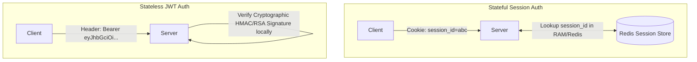
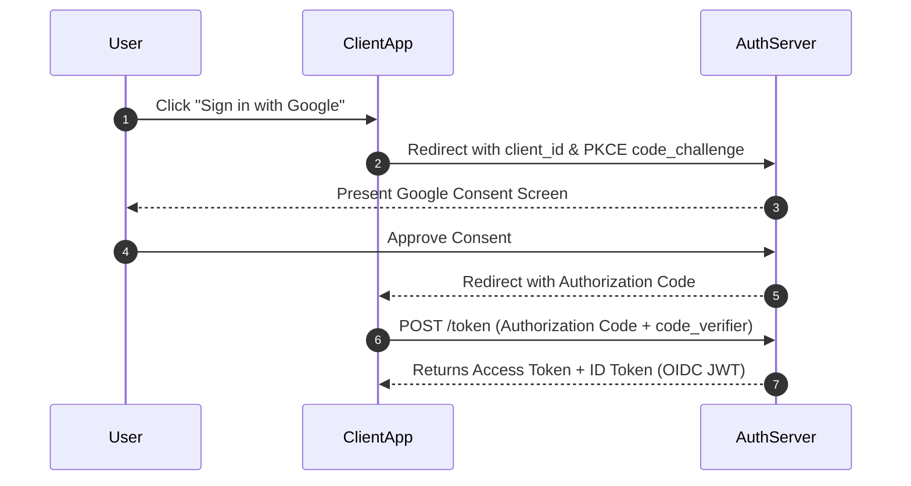
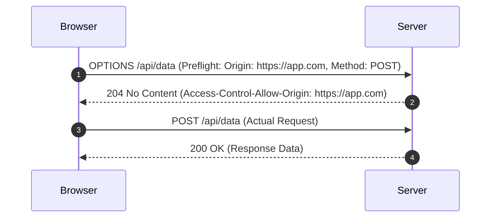

# 🔐 Web Security & Backend Defense Architecture

> **Core Philosophy**: Security is not an afterthought or an external plugin—it is **defense in depth**. Assume every network packet is hostile, every client input is untrusted, and internal microservice boundaries must authenticate and authorize every single operation.

---

## 📑 Table of Contents
1. [Authentication vs. Authorization (401 vs. 403)](#1-authentication-vs-authorization)
2. [Secure Password Storage (Bcrypt, Argon2, Salt & Pepper)](#2-secure-password-storage)
3. [Session-Based Auth vs. JWT (JSON Web Tokens)](#3-session-based-auth-vs-jwt)
4. [OAuth 2.0 & OpenID Connect (OIDC Flow)](#4-oauth-20--openid-connect)
5. [SQL Injection (SQLi) & Parameterized Queries](#5-sql-injection-sqli)
6. [Cross-Site Scripting (XSS) & Content Security Policy (CSP)](#6-cross-site-scripting-xss)
7. [Cross-Site Request Forgery (CSRF) & SameSite Cookies](#7-cross-site-request-forgery-csrf)
8. [Cross-Origin Resource Sharing (CORS) & Preflight Requests](#8-cross-origin-resource-sharing-cors)
9. [HTTPS, TLS Handshake & Man-in-the-Middle (MitM)](#9-https-tls-handshake--mitm)
10. [OWASP Top 10 Placement Quick Reference](#10-owasp-top-10-placement-quick-reference)

---

## 1. Authentication vs. Authorization

```
            Authentication (AuthN)                    Authorization (AuthZ)
       ┌──────────────────────────────┐          ┌──────────────────────────────┐
       │   "Who are you?"             │          │   "What are you allowed      │
       │                              │          │    to do?"                   │
       │   Verifying identity         │          │   Checking permissions       │
       │   (Password, OTP, FaceID)    │          │   (Admin, User, Role-Based)  │
       └──────────────────────────────┘          └──────────────────────────────┘
```

### HTTP Status Codes:
- `401 Unauthorized`: Actually means **Unauthenticated** (No valid token or login credentials provided).
- `403 Forbidden`: Authenticated successfully, but you **lack permission** to access this specific resource.

---

## 2. Secure Password Storage

> ❌ **Never use fast cryptographic hashes (MD5, SHA-1, SHA-256) for passwords!** GPUs can compute billions of SHA-256 hashes per second, making dictionary/rainbow table attacks trivial.

### Modern Password Hashing:
1. **Salt**: A cryptographically random string generated per user and appended to password before hashing (defends against Rainbow Tables).
2. **Work Factor / Iterations**: Slows down computation (e.g., $100\text{ms}$ per check).
3. **Pepper**: A secret key stored outside the database (in Hardware Security Module or KMS).

$$\text{Password Hash} = \mathbf{\text{Argon2id}} \text{ or } \mathbf{\text{Bcrypt}}(\text{Password} + \text{Salt} + \text{Pepper}, \text{Cost}=12)$$

---

## 3. Session-Based Auth vs. JWT (JSON Web Tokens)



### JWT Structure (`Header.Payload.Signature`):
1. **Header**: Algorithm (`HS256`, `RS256`) and Token Type (`JWT`).
2. **Payload**: Claims (`user_id`, `role`, `exp` timestamp). *Note: Base64 encoded, NOT encrypted!*
3. **Signature**: `HMACSHA256(Base64(Header) + "." + Base64(Payload), SecretKey)`.

### Production Token Strategy:
- **Short-Lived Access Token (JWT)**: Valid for 15 minutes (stored in memory or `HttpOnly` cookie).
- **Long-Lived Refresh Token (Opaque String)**: Valid for 7–30 days (stored in Database with revocation capability).

---

## 4. OAuth 2.0 & OpenID Connect

- **OAuth 2.0**: Protocol for **Delegated Authorization** (*"Allow App X to access my Google Drive files"*).
- **OpenID Connect (OIDC)**: Identity layer built on top of OAuth 2.0 for **Authentication** (*"Sign in with Google"*).



---

## 5. SQL Injection (SQLi)

Occurs when untrusted user input is directly concatenated into SQL query strings:

```sql
-- Vulnerable Code:
SELECT * FROM users WHERE email = 'user@example.com' AND password = '' OR '1'='1'; -- Returns all records!

-- Secure Code (Parameterized / Prepared Statement):
SELECT * FROM users WHERE email = ? AND password = ?;
```
> **Defense**: Always use **Prepared Statements / Parameterized Queries** or ORMs. User input is treated strictly as data literals, never as executable SQL code.

---

## 6. Cross-Site Scripting (XSS)

Occurs when an attacker injects malicious JavaScript that executes in victim browsers.

### Types of XSS:
1. **Stored XSS**: Malicious script saved in the database (e.g., in a comment field) and served to all viewers.
2. **Reflected XSS**: Script embedded in URL query parameters (`/search?q=<script>...`) reflected back in response.
3. **DOM-based XSS**: Vulnerability inside client-side JS modifying DOM unsafely (`element.innerHTML = location.hash`).

### Defenses:
- **Context-Aware Output Encoding**: Convert `<` to `&lt;`, `>` to `&gt;`.
- **`HttpOnly` Cookie Flag**: Prevents JavaScript `document.cookie` from reading session tokens.
- **Content Security Policy (CSP)**: HTTP header restricting allowed script execution domains:
  ```http
  Content-Security-Policy: default-src 'self'; script-src https://trustedscripts.com;
  ```

---

## 7. Cross-Site Request Forgery (CSRF)

An attacker tricks a victim's browser into executing unwanted actions on a trusted site where the user is currently authenticated.

```
Attacker Site (evil.com) ──▶ 
                                            │
                             Browser automatically includes bank.com session cookies!
```

### Defenses:
1. **`SameSite` Cookie Attribute**:
   - `SameSite=Strict`: Cookies never sent on cross-site requests.
   - `SameSite=Lax`: Cookies sent only on safe top-level navigations (`GET`).
2. **Anti-CSRF Tokens (Synchronizer Token Pattern)**: A cryptographically random token injected into HTML forms and validated on `POST` requests.

---

## 8. Cross-Origin Resource Sharing (CORS)

CORS is a **browser security mechanism** that restricts web pages from making AJAX/Fetch requests to a different origin (domain, protocol, or port).



> [!NOTE]
> CORS is a **browser-enforced protection**, not a server firewall. Postman or cURL will always bypass CORS because they are not browsers.

---

## 9. HTTPS, TLS Handshake & MitM

HTTPS encrypts HTTP traffic over **Transport Layer Security (TLS 1.3)** on Port 443:

```
Client ──[TLS 1.3 Handshake: Server Certificate + ECDHE Key Exchange]──▶ Server
Client ◀══════════ Encrypted Symmetric AES-GCM Channel ══════════════▶ Server
```
- **Confidentiality**: Prevents eavesdropping on public Wi-Fi.
- **Integrity**: Detects packet tampering via HMAC.
- **Authentication**: Validates server identity via Certificate Authorities (CA).

---

## 10. OWASP Top 10 Placement Quick Reference

| Vulnerability | Attack Vector | Primary Mitigation |
| :--- | :--- | :--- |
| **SQL Injection** | Dynamic SQL string concatenation | **Prepared Statements (Parameterized Queries)** |
| **Broken Auth** | Weak passwords, predictable tokens | **Argon2id/Bcrypt + Refresh Token Rotation** |
| **XSS** | Untrusted HTML/JS injection | **Output Encoding + CSP + `HttpOnly` Cookies** |
| **CSRF** | Cross-site unauthorized form POST | **`SameSite=Lax/Strict` + Anti-CSRF Tokens** |
| **Sensitive Data Exposure** | Plaintext transmission/storage | **TLS 1.3 + AES-256-GCM at rest** |
| **Security Misconfiguration** | Default passwords, verbose stack traces | **Hardened configs, Disable debug mode in prod** |
