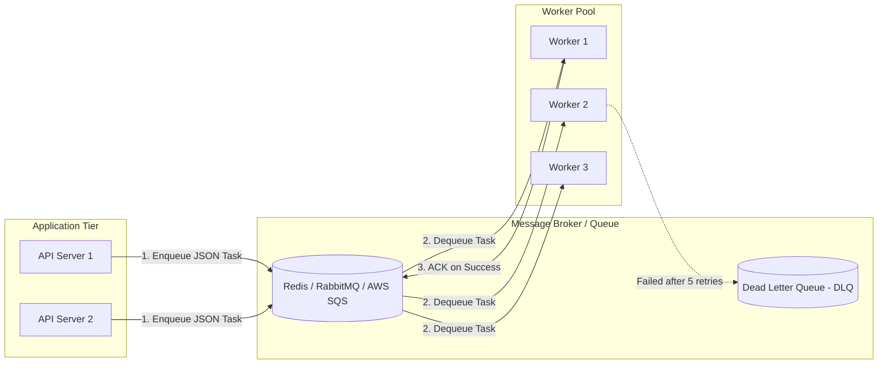
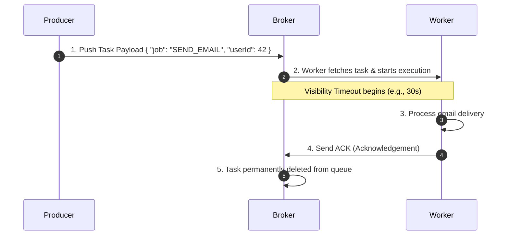

# ⚙️ Task Queues & Asynchronous Background Jobs

> **Core Philosophy**: A **Background Job** executes non-critical, time-consuming operations **outside the synchronous HTTP request-response lifecycle**. 
> Decoupling tasks with a message queue ensures sub-50ms API response times, shields backends from traffic spikes, and provides automated retry resilience.

---

## 📑 Table of Contents
1. [Why Background Jobs are Essential](#1-why-background-jobs-are-essential)
2. [Task Queue Core Architecture (Producer, Broker, Consumer)](#2-task-queue-core-architecture)
3. [The Complete Task Lifecycle](#3-the-complete-task-lifecycle)
4. [Critical Concepts: ACK, Visibility Timeout & DLQ](#4-critical-concepts)
5. [Task Execution Types (One-Off, Cron, Chained, Batch)](#5-task-execution-types)
6. [Delivery Guarantees & Idempotency](#6-delivery-guarantees--idempotency)
7. [Broker Technology Comparison (RabbitMQ, SQS, Redis, Kafka)](#7-broker-technology-comparison)
8. [Monitoring & Production Best Practices](#8-monitoring--production-best-practices)
9. [Placement Interview Quick Revision](#9-placement-interview-quick-revision)

---

## 1. Why Background Jobs are Essential

### Synchronous (Blocking) vs. Asynchronous (Queue) Flow:

```
❌ Synchronous Flow (Slow & Fragile):
User ──▶ Backend ──▶ Save DB ──▶ Call Slow Email API (3s) ──▶ Generate PDF (5s) ──▶ Response (8.2s Total!)

✅ Asynchronous Flow (Fast & Resilient):
User ──▶ Backend ──▶ Save DB ──▶ Enqueue Task to Redis/RabbitMQ ──▶ Return 202 Accepted (25ms!)
                                             │
                                     Background Worker
                                             │
                                 Executes Email & PDF in background
```

### Key Advantages:
- **Instant Response Times**: Users don't wait for downstream network I/O.
- **Fault Isolation**: If third-party SMS/Email gateways go down, jobs wait safely in the queue instead of throwing 500 errors to users.
- **Traffic Spike Smoothing**: Queues buffer sudden bursts of 10,000 tasks and process them at a steady, sustainable rate without crashing databases.

---

## 2. Task Queue Core Architecture



### Core Components:
1. **Producer**: Web backend that serializes parameters into a JSON message and pushes it to the queue.
2. **Broker**: Persistent storage managing task scheduling, visibility timers, and routing.
3. **Consumer (Worker)**: Autonomous background processes continuously listening for pending jobs.

---

## 3. The Complete Task Lifecycle



---

## 4. Critical Concepts

### 1. ACK (Acknowledgement) & NACK
- **ACK**: Worker tells broker the job finished successfully $\rightarrow$ Broker removes task.
- **NACK / Timeout**: If worker crashes mid-execution, no ACK is received $\rightarrow$ Broker re-queues the message.

### 2. Visibility Timeout
The duration a broker hides a message after a worker dequeues it:
- If Worker A finishes in 5s $\rightarrow$ sends ACK $\rightarrow$ Task deleted.
- If Worker A crashes at 10s $\rightarrow$ Visibility timeout (e.g., 30s) expires $\rightarrow$ Task becomes visible again $\rightarrow$ Worker B picks it up!

### 3. Dead Letter Queue (DLQ)
If a task fails repeatedly (e.g., 5 consecutive retries with exponential backoff), sending it back to the queue causes an infinite poison-pill loop. The broker routes the failed message to a **Dead Letter Queue (DLQ)** for engineering inspection and alert triggers.

---

## 5. Task Execution Types

| Task Type | Behavior | Example |
| :--- | :--- | :--- |
| **One-Off** | Triggered immediately by user event | Welcome email, password reset, SMS OTP. |
| **Recurring (Cron)** | Scheduled periodic execution | Nightly database backups, weekly invoice generation. |
| **Chained (Pipeline)**| Step $N+1$ executes only after Step $N$ succeeds | Video Upload $\rightarrow$ Transcode $\rightarrow$ Thumbnail $\rightarrow$ Notify. |
| **Batch (Fan-Out)** | 1 parent task splits into 10,000 sub-tasks | Account deletion (Delete photos, delete posts, delete logs). |

---

## 6. Delivery Guarantees & Idempotency

### Message Delivery Guarantees:
- **At-Most-Once**: Fire-and-forget; message may be lost, but never duplicated.
- **At-Least-Once (Standard)**: Messages are never lost, but network retries can cause duplicate execution.
- **Exactly-Once**: Requires end-to-end transactional deduplication.

### Designing Idempotent Workers:
Because *At-Least-Once* delivery can re-deliver messages, workers **must be idempotent**:

```python
def process_payout(payout_id, amount, account_id):
    # Check if payout was already processed
    if db.payouts.exists(id=payout_id, status="COMPLETED"):
        logger.info(f"Payout {payout_id} already completed. Skipping.")
        return
    
    # Process payment atomically
    with db.transaction():
        stripe.transfer(amount, account_id)
        db.payouts.mark_completed(payout_id)
```

---

## 7. Broker Technology Comparison

| Technology | Architecture | Persistence | Throughput | Best Used For |
| :--- | :--- | :--- | :--- | :--- |
| **RabbitMQ** | AMQP Message Broker | Disk + RAM | $\approx 20\text{k}-50\text{k}$ msg/s | Complex topic/routing keys, enterprise workflows |
| **Redis + BullMQ / Celery** | In-Memory Data Store | Optional RDB/AOF | $\approx 100\text{k}+$ msg/s | Fast delayed jobs, Node.js / Python lightweight queues |
| **AWS SQS** | Fully Managed Cloud Queue | Multi-AZ Cloud Storage | Unlimited | Zero-maintenance serverless architectures |
| **Apache Kafka** | Distributed Event Log | Append-Only Commit Log | $\approx 1\text{M}+$ msg/s | Event streaming, audit trails, analytics pipelines |

---

## 8. Monitoring & Production Best Practices

1. **Monitor Queue Lag / Depth**: Alert if pending task count grows faster than worker consumption rate.
2. **Keep Payloads Small**: Pass entity IDs (`{"orderId": 1234}`) rather than full binary blobs or huge JSON objects.
3. **Respect Third-Party Rate Limits**: Configure worker concurrency (e.g., max 10 concurrent requests to SendGrid).
4. **Graceful Worker Shutdown**: Listen for `SIGTERM` and finish active jobs before terminating containers during deploys.

---

## 9. Placement Interview Quick Revision

- **What is a background job?** An asynchronous task executed outside the client HTTP request path.
- **What is Visibility Timeout?** Period a broker hides an in-progress job to prevent duplicate pickups while allowing crash recovery.
- **Why is idempotency mandatory for workers?** Because distributed networks use *at-least-once* delivery where network retries can deliver duplicate tasks.
- **What is a DLQ?** A Dead Letter Queue storing permanently failing poison-pill tasks for manual debugging.
