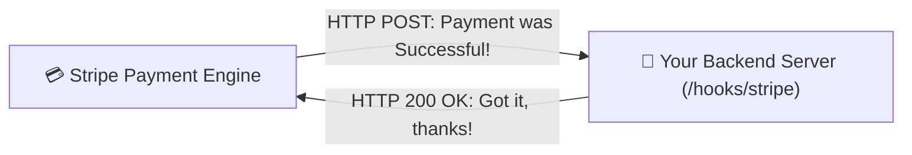
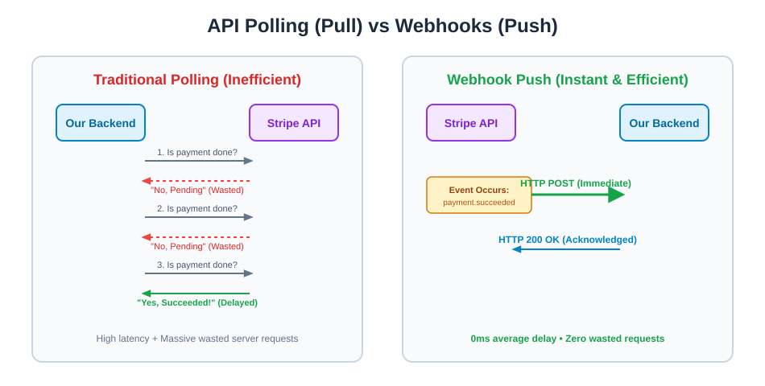
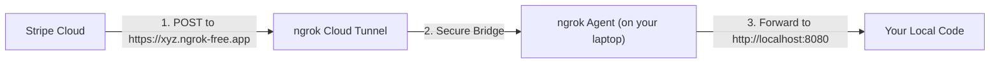
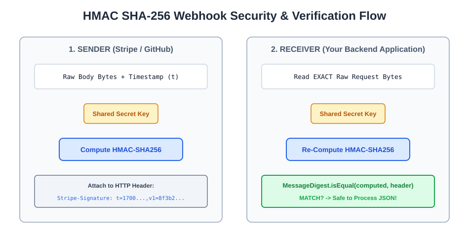
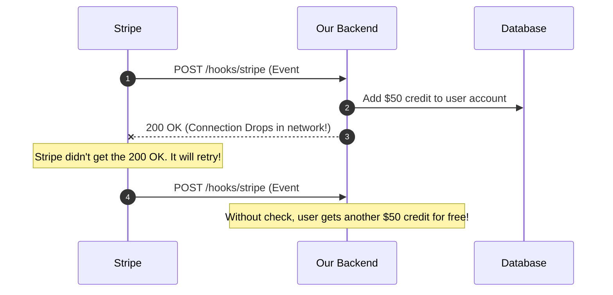
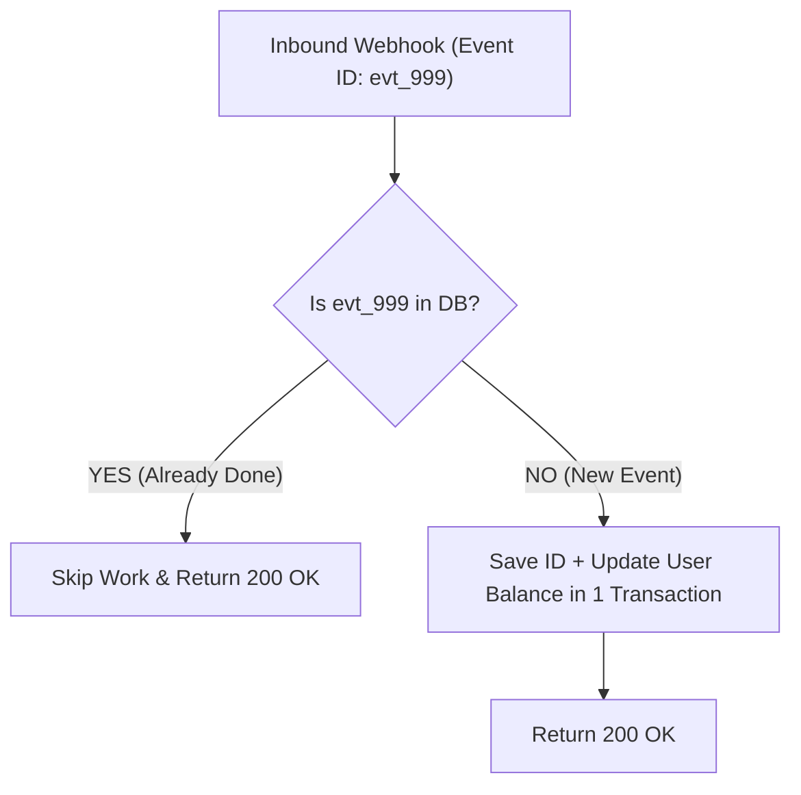
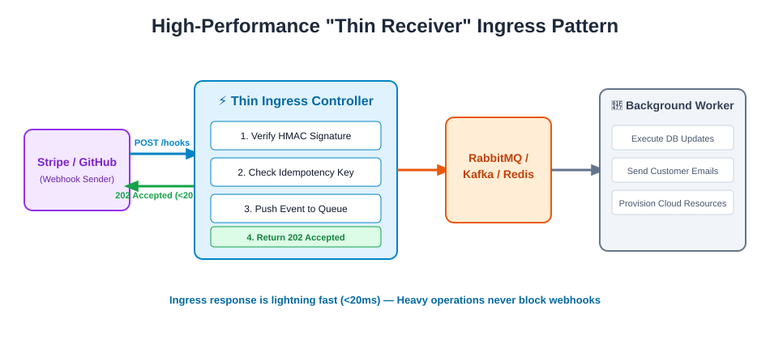
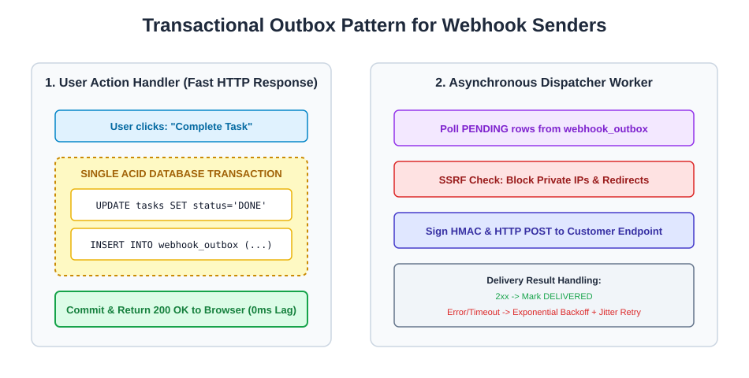
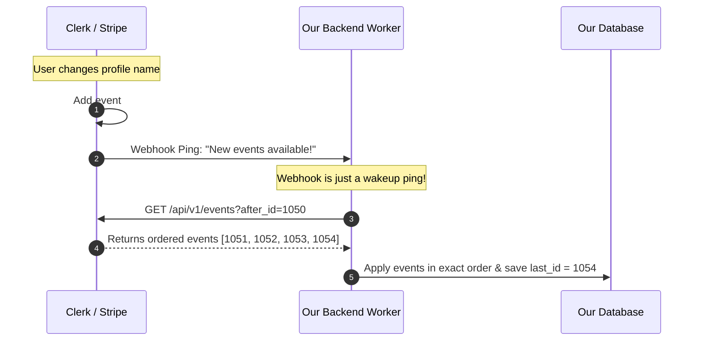

# 🪝 Complete Beginner-Friendly Guide to Webhooks

> **Learning Goal**: Understand what Webhooks are, why they are used, how they work in real applications (like Stripe and GitHub), and the fundamental concepts you need to know for interviews and practical development — explained in plain, simple terms with diagrams and illustrations!

---

## 📑 Quick Navigation
1. [What is a Webhook? (The "Don't Call Us, We'll Call You" Pattern)](#1-what-is-a-webhook-the-dont-call-us-well-call-you-pattern)
2. [Why Not Polling? (The Problem Webhooks Solve)](#2-why-not-polling-the-problem-webhooks-solve)
3. [Key Concepts & Vocabulary You Must Know](#3-key-concepts--vocabulary-you-must-know)
4. [Anatomy of a Webhook (What Does It Look Like?)](#4-anatomy-of-a-webhook-what-does-it-look-like)
5. [How to Test Webhooks Locally (The Tunnel Trick)](#5-how-to-test-webhooks-locally-the-tunnel-trick)
6. [Security 101: How Do You Know the Request is Real?](#6-security-101-how-do-you-know-the-request-is-real)
7. [The HMAC Signature & The "Raw Body" Rule](#7-the-hmac-signature--the-raw-body-rule)
8. [Replay Attacks & Fast String Checks](#8-replay-attacks--fast-string-checks)
9. [Provider Security: SSRF (Blocking Malicious URLs)](#9-provider-security-ssrf-blocking-malicious-urls)
10. [At-Least-Once Delivery & Idempotency (Handling Duplicates)](#10-at-least-once-delivery--idempotency-handling-duplicates)
11. [Handling Out-of-Order Deliveries](#11-handling-out-of-order-deliveries)
12. [Automatic Retries, Exponential Backoff & Jitter](#12-automatic-retries-exponential-backoff--jitter)
13. [The "Thin Receiver" Pattern (Handling Huge Traffic Spikes)](#13-the-thin-receiver-pattern-handling-huge-traffic-spikes)
14. [Building Your Own Webhook Sender: The Transactional Outbox](#14-building-your-own-webhook-sender-the-transactional-outbox)
15. [When Webhooks Are the WRONG Choice (The Syncing Trap)](#15-when-webhooks-are-the-wrong-choice-the-syncing-trap)
16. [The Event Log: The Right Way to Sync Data](#16-the-event-log-the-right-way-to-sync-data)
17. [Interview Quick-Reference Summary & Official References](#17-interview-quick-reference-summary--official-references)
18. [*(Optional Deep Dive)* Java Spring Boot Code Reference](#18-optional-deep-dive-java-spring-boot-code-reference)

---

## 1. What is a Webhook? (The "Don't Call Us, We'll Call You" Pattern)

In standard web browsing, your browser always asks the server for data first (*Client calls Server*):

```
Client (Browser/App)  ----[ "Give me data" ]---->  Server
Client (Browser/App)  <---[ "Here is data" ]----  Server
```

A **Webhook** flips this completely. It is **Server-to-Server communication** where an external service calls *your* server directly when an event occurs:



> 📖 **Verified Reference**: For a real webhook request example, see [GitHub's official Webhook Events and Payloads documentation](https://docs.github.com/en/webhooks/webhook-events-and-payloads). It shows an actual HTTP POST, delivery ID, event header, signature header, and JSON payload.

### Why can't the user's browser just tell our backend?
Suppose a customer buys a subscription on your site. The payment happens on Stripe's checkout. Why can't the user's browser simply tell our server *"Hey, I paid!"*?
1. **Network drops**: The user's phone might lose signal or switch to airplane mode.
2. **Closed tabs**: The user might close the browser tab the exact millisecond payment finishes.
3. **Cheating & Fraud**: A hacker could easily fake a browser message to get free access!

> 💡 **Takeaway**: Webhooks give our backend an **official, tamper-proof signal** directly from the payment provider so we can safely unlock the user's account.

---

## 2. Why Not Polling? (The Problem Webhooks Solve)

What if we didn't have webhooks? Our backend would have to repeatedly ask Stripe: *"Is payment done yet? Is it done now? What about now?"* (This is called **Polling**).



### Why Polling Fails at Scale:
* **Annoying Latency**: If you check every 30 seconds, the user waits an average of 15 seconds after paying before their account unlocks.
* **Wasted Resources**: 99% of requests return "pending", burning CPU, database, and bandwidth.
* **The Rate-Limit Problem**: If 10,000 merchants poll Stripe every second, Stripe gets **10,000 requests every second** just for status checks. Stripe will block and rate-limit your server!

### The Webhook Solution (Push instead of Pull):
We give Stripe our URL once. Stripe calls us **immediately** the moment payment succeeds. **Zero wasted requests, zero delay!**

---

## 3. Key Concepts & Vocabulary You Must Know

| Term | What it Means in Plain English | Real-World Example |
| :--- | :--- | :--- |
| **Provider (Sender)** | The external service where the event happened. | Stripe, GitHub, Shopify, Discord |
| **Consumer (Receiver)** | Your backend server that listens for events. | Your Spring Boot / Node.js application |
| **Endpoint** | The specific public URL you set up to receive the POST request. | `https://myapi.com/hooks/stripe` |
| **Event** | The thing that actually happened. | `payment.succeeded`, `git.push`, `order.created` |
| **Delivery** | A single HTTP POST attempt sent to your endpoint. | Attempt #1 at 10:00 AM, Attempt #2 at 10:05 AM |
| **Subscription** | Registering your URL with the provider. | Telling GitHub: *"Send push events to my URL"* |

> ⚠️ **Important Concept**: **One Event can have Multiple Deliveries**. If your server is restarting when Stripe calls you, Stripe will try again later. That is 1 event, but 2 deliveries.

---

## 4. Anatomy of a Webhook (What Does It Look Like?)

A webhook is nothing more than a standard **HTTP POST request** with a JSON body and special headers:

```http
POST /hooks/github HTTP/1.1
Host: api.mysite.com
Content-Type: application/json
X-GitHub-Event: push
X-GitHub-Delivery: 72d3162e-cc78-11e3-81ab-4c9367dc0958
X-Hub-Signature-256: sha256=d57c68d10b93d8650aedb3fdd58daec5ffab406f680ce907620ac7d77c38f73a

{
  "repository": { "name": "super-project" },
  "pusher": { "name": "rohit" },
  "commits": [...]
}
```

### Provider Response Timeouts (You Must Be Fast!)
If your server takes too long to answer, the provider assumes your server crashed and cancels the connection:
* **GitHub**: 10 seconds max
* **Shopify**: 5 seconds max
* **Slack**: 3 seconds max

### Best Practice: Separate URLs for Separate Providers
* ❌ **Bad**: `/hooks/callback` (Trying to handle Stripe, GitHub, and Shopify in one messy endpoint).
* ✅ **Good**:
  * `/hooks/stripe`
  * `/hooks/github`
  * `/hooks/shopify`

---

## 5. How to Test Webhooks Locally (The Tunnel Trick)

When you write code on your computer, your server runs on `http://localhost:8080`.  
GitHub or Stripe **cannot** send a request to `localhost` because your laptop is behind your home router/Wi-Fi firewall.



### Free Tools to Create a Tunnel:
* **ngrok**: `ngrok http 8080` (gives you a temporary public HTTPS URL).
* **Cloudflare Tunnel**: Free, persistent tunnels.
* **Stripe CLI**: `stripe listen --forward-to localhost:8080/hooks/stripe`.

---

## 6. Security 101: How Do You Know the Request is Real?

Because your webhook endpoint is public on the internet, anyone who guesses your URL could send a fake POST request:
`{"event": "payment.succeeded", "user": "hacker123"}`

If your server blindly trusts this, the hacker gets free access!

### How Providers Prove Identity:
1. **Token in URL** *(Weak)*: Putting `?token=secret` in the URL. (Bad because tokens get leaked in logs).
2. **IP Allowlist** *(Okay)*: Only accepting requests from Stripe's IP addresses.
3. **HMAC Signature** *(Industry Standard & Most Popular)*: The provider cryptographically signs the message with a shared secret key.

---

## 7. The HMAC Signature & The "Raw Body" Rule

> 📖 **Verified Reference**: [GitHub — Validating webhook deliveries](https://docs.github.com/en/webhooks/using-webhooks/validating-webhook-deliveries). GitHub documents HMAC-SHA256, `X-Hub-Signature-256`, raw-payload verification, and constant-time comparison.



### How HMAC Works:
1. When you register your webhook, you and the provider share a secret password (e.g. `whsec_secret123`).
2. The provider calculates a cryptographic hash (HMAC-SHA256) of the message using this secret and puts it in the header.
3. Your server calculates the exact same hash using the secret and checks if they match.

### 🚨 The "Raw Body" Trap (Common Beginner Bug!)
Never parse the JSON into an object *before* checking the signature!

```
Incoming:          {"amount":100,"currency":"usd"}         --> Hash = 0xABC123
Parsed & Re-saved: {"amount": 100, "currency": "usd"}       --> Hash = 0xXYZ999 (FAILED!)
```
Even an extra space or changed key order will change the entire hash. **Always verify the exact raw bytes first!**

---

## 8. Replay Attacks & Fast String Checks

### 1. Replay Attacks
If a hacker intercepts a genuine signed request, they could replay it 100 times to your server.
* **Solution**: Providers include a timestamp in the signature (e.g., `t=1700000000`). If the request timestamp is older than **5 minutes**, reject it immediately!

### 2. Constant-Time Equality
When comparing secret signatures, never use regular string equality (`sig1 == sig2`), because standard equality stops checking at the first wrong letter (revealing timing clues to hackers).
* Use constant-time comparison methods:
  * **Java**: `MessageDigest.isEqual(a, b)`
  * **Node.js**: `crypto.timingSafeEqual(a, b)`
  * **Python**: `hmac.compare_digest(a, b)`

---

## 9. Provider Security: SSRF (Blocking Malicious URLs)

If you build a SaaS that lets customers type a Webhook URL, a hacker might type:  
`http://169.254.169.254/latest/meta-data/` (AWS Cloud Metadata Service).

If your server blindly calls this, the hacker could steal your AWS passwords!

```
[ Hacker ] ---> Registers URL: http://169.254.169.254 ---> [ Your Dispatcher ] ---> [ Internal AWS Metadata ]
                                                                                <--- [ Leaks Cloud Secret Keys! ]
```

### How to Protect Your System:
* **Block private IPs**: Reject `localhost`, `127.0.0.1`, `10.x.x.x`, `192.168.x.x`, and `169.254.169.254`.
* **Never follow 3xx redirects**: Attackers often redirect a public URL to an internal private IP.

---

## 10. At-Least-Once Delivery & Idempotency (Handling Duplicates)

In cloud networking, acknowledgments can drop:



### The Solution: Idempotency (Save the Event ID)
Store the unique `event_id` in your database in the **same transaction** as your work:



---

## 11. Handling Out-of-Order Deliveries

Events can arrive out of order due to retries:
1. `order.created` is sent, but fails and waits 5 minutes to retry.
2. `order.cancelled` is sent 10 seconds later and succeeds.
3. 5 minutes later, `order.created` arrives and creates an active order for a cancelled item!

### How to Fix It:
1. **Signal-Only Pattern**: When you get an event, call Stripe/GitHub's API to fetch the *current, live state* instead of trusting the webhook payload.
2. **Version Numbers**: Only update database rows if the incoming `version` or timestamp is newer than what you currently have.

---

## 12. Automatic Retries, Exponential Backoff & Jitter

> 📖 **Verified Reference**: [Stripe — Webhooks Documentation](https://docs.stripe.com/webhooks). Provider retry schedules vary, so the exact delays below should be treated as a conceptual example unless tied to a specific provider's current documentation.

When your server is down or returning errors, providers retry with **Exponential Backoff**:
* **Attempt 1**: Wait 5 seconds
* **Attempt 2**: Wait 25 seconds
* **Attempt 3**: Wait 2 minutes
* **Attempt 4**: Wait 15 minutes

```mermaid
gantt
    title Exponential Backoff Schedule
    dateFormat X
    axisFormat %s sec
    section Retry Delays
    Attempt 1 (Fails)     :crit, 0, 1
    Wait 5s + Jitter      :active, 1, 6
    Attempt 2 (Fails)     :crit, 6, 7
    Wait 25s + Jitter     :active, 7, 32
    Attempt 3 (Succeeds)  :done, 32, 33
```



> 💡 **What is Jitter?** Jitter means adding a few random seconds (e.g. 5s + 1.4s random). This prevents 10,000 failed retries from hitting your server at the exact same millisecond when your server comes back online.

---

## 13. The "Thin Receiver" Pattern (Handling Huge Traffic Spikes)

> 📖 **Verified Reference**: [Stripe — Webhooks Documentation](https://docs.stripe.com/webhooks). Stripe documents returning a successful 2xx response quickly and handling webhook work asynchronously when appropriate.



On the 1st of every month, Stripe renews millions of subscriptions at once.  
If your webhook controller verifies signatures, runs 5 heavy database queries, and sends emails synchronously, your server will freeze and time out!

### The Thin Receiver Solution:
1. Check the HMAC signature.
2. Save the raw event into a background queue (RabbitMQ / Kafka / Redis) or Inbox table.
3. Return `202 Accepted` immediately (in $<50$ms).
4. Background worker processes the actual heavy logic at its own pace.

---

## 14. Building Your Own Webhook Sender: The Transactional Outbox

> 📖 **Verified Reference**: [AWS Prescriptive Guidance — Transactional Outbox Pattern](https://docs.aws.amazon.com/en_en/prescriptive-guidance/latest/cloud-design-patterns/transactional-outbox.html). AWS provides official architecture diagrams and explains the dual-write problem, outbox table, and asynchronous event processing.



If you want to send webhooks to your customers when they move a task:  
❌ **Don't do this**: Send the HTTP POST directly inside your web controller. If the customer's server is slow, your app freezes.

✅ **The Transactional Outbox Pattern**:
1. Update the task in your DB AND insert a row into a `webhook_outbox` table in the **same database transaction**.
2. A separate background dispatcher worker reads from `webhook_outbox` and sends the HTTP POST requests.

---

## 15. When Webhooks Are the WRONG Choice (The Syncing Trap)

Webhooks are great for **notifications** (*"Send an email"*, *"Start a build"*, *"Unlock account"*).

They are **NOT** meant to keep a 100% exact live clone of an entire external database (e.g., syncing all Clerk users or Shopify catalog products into your DB solely via webhooks).

### Why Pure Webhook Syncing Breaks:
* Missed events or network drops leave ghost data in your database.
* Events arriving out of order cause updates to overwrite newer data.

---

## 16. The Event Log: The Right Way to Sync Data

To sync data reliably, modern companies use **Webhooks + Ordered Event Logs**:



---

## 17. Interview Quick-Reference Summary & Official References

```
+----------------------------------------------------------------------------------------------------+
|                                    WEBHOOKS CHEAT SHEET                                            |
+----------------------------------------------------------------------------------------------------+
| What is it?            | Server-to-server push notification via HTTP POST                          |
| Security               | HMAC-SHA256 with a shared secret key                                      |
| Raw Body Rule          | ALWAYS verify raw bytes before JSON parsing                               |
| Replay Defense         | Sign timestamp; reject requests older than 5 minutes                      |
| Idempotency            | Store unique event_id + execute domain logic in 1 ACID transaction        |
| Ingress Best Practice  | Thin Receiver: Verify HMAC -> Push to Queue -> Return 202 in < 50ms        |
| Provider Best Practice | Transactional Outbox Pattern + Asynchronous Retry Dispatcher              |
| Retries                | Exponential backoff with random Jitter                                    |
| Data Sync Rule         | Don't sync raw DBs with webhooks alone; use Webhook + Event Log API       |
+----------------------------------------------------------------------------------------------------+
```

### Verified Official References:
These are the external sources used to validate the important webhook concepts in this guide. Prefer these sources over unverified diagrams when revising for placements:
* [GitHub — Validating webhook deliveries](https://docs.github.com/en/webhooks/using-webhooks/validating-webhook-deliveries) — HMAC-SHA256, raw body, signature validation, constant-time comparison.
* [GitHub — Webhook events and payloads](https://docs.github.com/en/webhooks/webhook-events-and-payloads) — Real webhook POST structure, headers, delivery IDs, and payloads.
* [Stripe — Webhooks Documentation](https://docs.stripe.com/webhooks) — Receiving webhooks, fast 2xx responses, and provider-specific delivery behavior.
* [AWS — Transactional Outbox Pattern](https://docs.aws.amazon.com/en_en/prescriptive-guidance/latest/cloud-design-patterns/transactional-outbox.html) — Official transactional-outbox architecture and implementation guidance.

---

## 18. *(Optional Deep Dive)* Java Spring Boot Code Reference

> 💡 *Note: This section is optional reference code for Java/Spring Boot developers. You can skip this if you are focusing on the concepts!*

### 1. Thin Receiver Controller (HMAC + Idempotency Check)
```java
@RestController
@RequestMapping("/hooks")
public class StripeWebhookController {

    private static final String SECRET = "whsec_test_secret_123";
    private final ProcessedEventRepository eventRepo;
    private final QueueProducer queueProducer;

    public StripeWebhookController(ProcessedEventRepository eventRepo, QueueProducer queueProducer) {
        this.eventRepo = eventRepo;
        this.queueProducer = queueProducer;
    }

    @PostMapping("/stripe")
    @Transactional
    public ResponseEntity<String> handleWebhook(
            @RequestHeader("Stripe-Signature") String sigHeader,
            @RequestBody byte[] rawBytes) {

        // 1. Verify HMAC on RAW bytes
        if (!SignatureVerifier.verify(rawBytes, sigHeader, SECRET)) {
            return ResponseEntity.status(HttpStatus.UNAUTHORIZED).body("Invalid Signature");
        }

        // 2. Idempotency Check (Prevent duplicate handling)
        String eventId = SignatureVerifier.extractEventId(rawBytes);
        if (eventRepo.existsById(eventId)) {
            return ResponseEntity.ok("Already processed");
        }

        // 3. Mark processed & push to background queue
        eventRepo.save(new ProcessedEvent(eventId));
        queueProducer.enqueue(rawBytes);

        // 4. Return fast response (under 50ms)
        return ResponseEntity.status(HttpStatus.ACCEPTED).body("Queued");
    }
}
```

### 2. Transactional Outbox Service
```java
@Service
public class TaskService {
    private final TaskRepository taskRepo;
    private final OutboxRepository outboxRepo;

    public TaskService(TaskRepository taskRepo, OutboxRepository outboxRepo) {
        this.taskRepo = taskRepo;
        this.outboxRepo = outboxRepo;
    }

    @Transactional
    public void completeTask(Long taskId) {
        // 1. Update task in DB
        Task task = taskRepo.findById(taskId).orElseThrow();
        task.setStatus("DONE");
        taskRepo.save(task);

        // 2. Save event in Outbox table (Same transaction!)
        OutboxEvent event = new OutboxEvent("task.completed", "{"taskId":" + taskId + "}");
        outboxRepo.save(event);
    }
}
```
