# 🪝 Mastering Webhooks & Event-Driven Delivery Architecture

> **Complete Engineering Guide & System Design Architecture**  
> Covers Client vs Server Connection Paradigms, Polling vs Webhook Push Mechanics, Delivery Anatomy & HTTP Handshakes, Cryptographic HMAC Signatures, Replay Attacks, SSRF Mitigations, At-Least-Once Delivery & Database Idempotency, Out-of-Order Mitigations, Retry Backoff with Jitter, Thin Receivers with Background Queues, The Transactional Outbox Pattern, and Ordered Event Log Data Syncing.

---

## 📑 Table of Contents
1. [What is a Webhook? (The Architectural Paradigm Shift)](#1-what-is-a-webhook-the-architectural-paradigm-shift)
2. [Polling vs. Webhook Push (Latency & Scale Analysis)](#2-polling-vs-webhook-push-latency--scale-analysis)
3. [Origin, Evolution & Core Terminology](#3-origin-evolution--core-terminology)
4. [Anatomy of a Webhook Delivery & Provider Timeout Budgets](#4-anatomy-of-a-webhook-delivery--provider-timeout-budgets)
5. [Handshakes, Health Verification & Local Tunneling](#5-handshakes-health-verification--local-tunneling)
6. [Security Threat Modeling & Proof Mechanisms](#6-security-threat-modeling--proof-mechanisms)
7. [HMAC Signatures & The Critical Raw-Body Trap](#7-hmac-signatures--the-critical-raw-body-trap)
8. [Replay Attack Mitigation & Constant-Time String Comparison](#8-replay-attack-mitigation--constant-time-string-comparison)
9. [Provider-Side SSRF (Server-Side Request Forgery) Defense](#9-provider-side-ssrf-server-side-request-forgery-defense)
10. [At-Least-Once Delivery & Atomic Transactional Idempotency](#10-at-least-once-delivery--atomic-transactional-idempotency)
11. [Handling Out-of-Order Webhook Delivery](#11-handling-out-of-order-webhook-delivery)
12. [Retry Schedules, Exponential Backoff & Jitter Calculation](#12-retry-schedules-exponential-backoff--jitter-calculation)
13. [Thin Receiver Architecture (Protecting Ingress Under Bursts)](#13-thin-receiver-architecture-protecting-ingress-under-bursts)
14. [Building a Webhook Provider: The Transactional Outbox Pattern](#14-building-a-webhook-provider-the-transactional-outbox-pattern)
15. [Production Dispatcher Engine: Sign, POST, Record, Retry & Circuit Breaking](#15-production-dispatcher-engine-sign-post-record-retry--circuit-breaking)
16. [When Webhooks are the WRONG Tool (The Syncing Pitfall)](#16-when-webhooks-are-the-wrong-tool-the-syncing-pitfall)
17. [The Event Log Architecture: The Right Way to Sync Distributed State](#17-the-event-log-architecture-the-right-way-to-sync-distributed-state)
18. [Production Java Spring Boot 3 Implementation](#18-production-java-spring-boot-3-implementation)
19. [Interview & Architecture Quick-Reference Cheat Sheet](#19-interview--architecture-quick-reference-cheat-sheet)

---

## 1. What is a Webhook? (The Architectural Paradigm Shift)

In traditional client-server communication (REST HTTP APIs, SSE, WebSockets), the **client always initiates the connection**. Even in real-time systems where a server pushes data down an open socket, the initial TCP/HTTP handshake was established by the client.

A **Webhook** breaks this paradigm by introducing **asynchronous, backend-to-backend (service-to-service) communication** where the **server calls your server**:

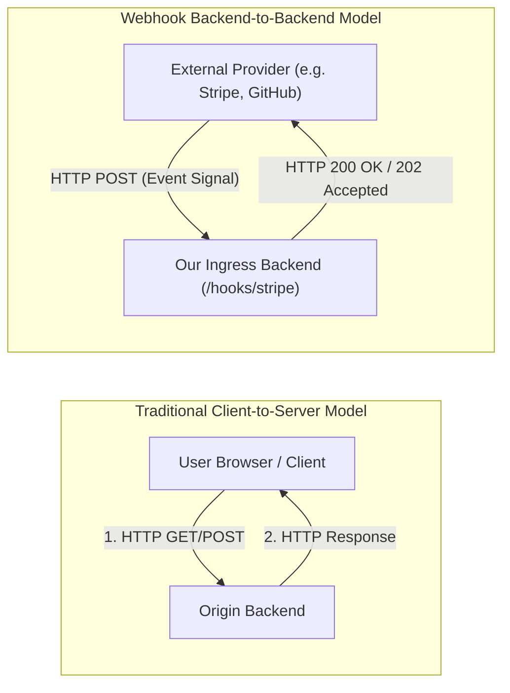

### Why Can't We Rely on the User's Browser for Critical Signals?
Suppose a customer purchases a subscription on your platform. Checkout happens inside Stripe's hosted checkout or an embedded iframe. Why can't the browser simply notify our backend when Stripe displays "Payment Successful"?

```
+-----------------------------------------------------------------------------------+
|                           WHY BROWSER SIGNALS FAIL                                |
+-----------------------------------------------------------------------------------+
| 1. Network Vulnerability  : Mobile network drops, WiFi switching, packet loss     |
| 2. User Actions           : User accidentally closes tab / laptop lid immediately|
| 3. Client-Side Tampering  : Malicious users can intercept JS/HTTP and fake success|
| 4. Out-of-Process Latency : Webhook is the ONLY authoritative source of truth     |
+-----------------------------------------------------------------------------------+
```

> [!IMPORTANT]
> The server that receives the webhook is the **source of truth**. Critical domain logic (unlocking subscriptions, provisioning cloud resources, merging PRs) must strictly depend on backend-to-backend webhooks, never client-side callbacks.

---

## 2. Polling vs. Webhook Push (Latency & Scale Analysis)

To detect state changes in an external provider without webhooks, the naive approach is **Periodic Polling**:

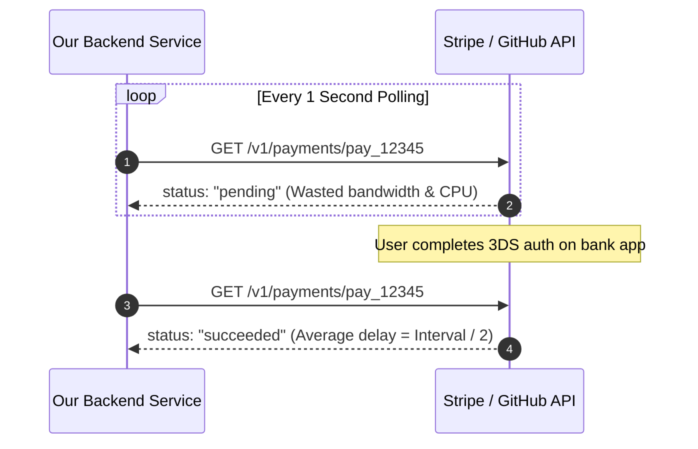

### Mathematical & Infrastructure Flaws of Polling:
1. **Inherent Delay**: For a polling interval $T$, the average latency to detect an event is $T / 2$. If you poll every 60s, users wait an average of 30 seconds for order confirmation.
2. **Wasted Requests**: 99%+ of polling requests return `"pending"`, burning outbound egress and CPU cycles.
3. **The 10,000 Merchant Scale Crisis**:
   $$	ext{Total QPS} = rac{N 	imes 	ext{Active Orders}}{T}$$
   If a payment gateway has $10,000$ merchants, each polling once per second for pending checkouts, the gateway receives **$10,000+$ requests per second** just for status checks! Payment providers will aggressively rate-limit polling clients.

### The Webhook Solution: Inverted Communication
Instead of asking 1,000 times *"Is it ready?"*, we register our endpoint once. The provider pushes a single HTTP POST request the exact millisecond the state transition occurs:

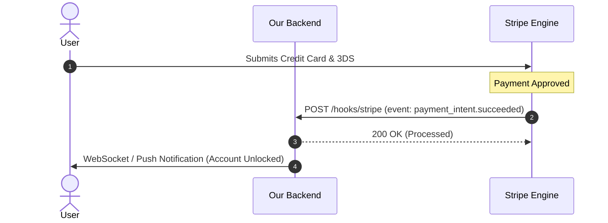

---

## 3. Origin, Evolution & Core Terminology

### Brief History
* **2007**: **Jeff Lindsay** coined the term *"Webhook"*, conceptualizing it as the web's equivalent to the **Unix Pipe (`|`)** — a programmable mechanism to reroute standard output of one web service directly into another service via HTTP POST.
* **2009**: Google engineers standardized this pattern for real-time blog and RSS feeds under the protocol **PubSubHubbub** (now WebSub).

### Webhook Terminology Reference
| Term | Definition | Real-World Example |
| :--- | :--- | :--- |
| **Provider (Sender)** | System where the state transition originates | Stripe, GitHub, Shopify, Clerk, Polar |
| **Consumer (Receiver)** | System receiving and reacting to the event | Your Spring Boot / Node.js backend |
| **Endpoint** | Public HTTPS URL exposed by the consumer | `https://api.yourdomain.com/hooks/stripe` |
| **Event** | Structured data payload representing a business domain occurrence | `payment.succeeded`, `push`, `task.moved` |
| **Delivery** | A single HTTP POST transmission attempt of an event | Attempt #1 at 12:00:00, Attempt #2 at 12:05:00 |
| **Subscription** | Registration record binding event types to a specific target URL | URL + Secret Key + Event list filter |

> [!NOTE]
> **One Event $
eq$ One Delivery**. Due to transient network drops, 500 errors, or gateway timeouts, a single business event may produce **multiple delivery attempts**.

---

## 4. Anatomy of a Webhook Delivery & Provider Timeout Budgets

### Structure of an Inbound Webhook HTTP Request
```http
POST /hooks/github HTTP/1.1
Host: api.myapp.com
Content-Type: application/json
User-Agent: GitHub-Hookshot/707c91a
X-GitHub-Event: push
X-GitHub-Delivery: 72d3162e-cc78-11e3-81ab-4c9367dc0958
X-Hub-Signature-256: sha256=d57c68d10b93d8650aedb3fdd58daec5ffab406f680ce907620ac7d77c38f73a

{
  "ref": "refs/heads/main",
  "after": "0000000000000000000000000000000000000000",
  "repository": {
    "id": 1296269,
    "name": "Hello-World",
    "owner": { "login": "octocat" }
  },
  "pusher": { "name": "octocat", "email": "octocat@github.com" }
}
```

### Provider Strict Timeout Budgets
Providers will forcefully terminate the HTTP connection and mark the delivery as failed if your backend does not respond with `2xx` within their strict budget:

```
+-----------------------------------------------------------------------------------+
|                        PROVIDER HTTP TIMEOUT THRESHOLDS                           |
+-----------------------------------------------------------------------------------+
| GitHub             : 10 Seconds                                                   |
| Shopify            : 5 Seconds                                                    |
| Slack              : 3 Seconds                                                    |
| Microsoft Graph    : 3 Seconds                                                    |
| Stripe             : ~10-15 Seconds                                               |
+-----------------------------------------------------------------------------------+
```

### Multi-Provider Architecture Rule: Never Generalize Callback URLs
❌ **Anti-Pattern**: Using a single shared endpoint `/api/v1/hooks/callback` for Stripe, GitHub, Shopify, and Slack.  
✅ **Best Practice**: Provide isolated, dedicated ingress endpoints for each provider:
* `/hooks/stripe`
* `/hooks/github`
* `/hooks/shopify`

**Why?** Every provider uses distinct cryptographic signature headers, timestamp formats, payload schemas, and retry semantics. Dedicated controllers maintain modularity and isolation.

---

## 5. Handshakes, Health Verification & Local Tunneling

### The Registration Handshake (Preventing Ingress DDoS Attacks)
Why do modern providers require an upfront handshake upon registering a URL?
Without verification, an attacker could register a victim's URL (`https://victim-bank.com/api`) across hundreds of high-volume GitHub repos or Stripe accounts, unleashing a devastating **Provider-Amplified DDoS Attack**.

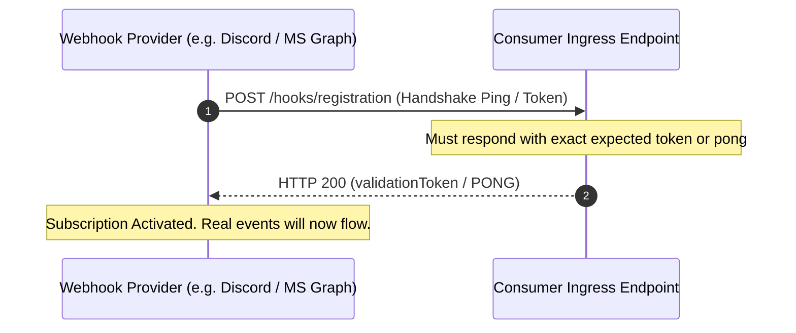

* **Microsoft Graph**: Sends `validationToken` query parameter; consumer must return it in plain text within 3s.
* **Discord**: Sends `PING` interaction; consumer must return `{"type": 1}` (`PONG`).
* **Amazon SNS**: Sends `SubscriptionConfirmation` containing `SigningCertURL`; consumer must issue an HTTP GET to confirm.

### Local Development: The Router & NAT Barrier
During development, your server runs on `http://localhost:8080`. External web services cannot route packets to `localhost` or through consumer NAT firewalls.

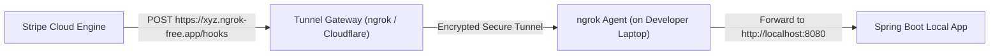

---

## 6. Security Threat Modeling & Proof Mechanisms

Because webhook endpoints are public URLs, attackers can attempt to forge requests:

```
Attacker ---> POST /hooks/stripe {"event":"payment.succeeded", "user_id":"attacker_99"} ---> Your App
```

If your app blindly parses this JSON, the attacker receives a free lifetime subscription!

### The 5 Ways to Prove Identity:
1. **Secret Token in URL Query Param** *(Weakest)*: Token gets logged in proxy logs, CDN logs, browser histories, and CloudWatch.
2. **IP Allowlisting** *(Partial)*: Firewall blocks all IPs except provider CIDRs. Good defense-in-depth, but vulnerable to IP spoofing, shared cloud IP pools, and does not verify message integrity.
3. **Mutual TLS (mTLS)** *(Complex)*: Client and server present x509 certificates. Highly secure, but complex PKI certificate rotation overhead.
4. **HMAC SHA-256 Signature Header** *(Industry Standard - 80%+ of Providers)*: Shared symmetric secret generates a cryptographic hash of the raw payload.
5. **Asymmetric Public/Private Key Signatures** *(High Security - Discord/Ed25519)*: Provider signs with private key; consumers verify with public key.

---

## 7. HMAC Signatures & The Critical Raw-Body Trap

### How HMAC (Hash-based Message Authentication Code) Works
1. **Shared Secret**: During webhook registration, provider generates a secret `whsec_abc123` known only to provider and consumer.
2. **Sender Hash**: Provider computes `HMAC_SHA256(Raw_Body_Bytes, Shared_Secret)` and sends it in header `X-Hub-Signature-256`.
3. **Receiver Verification**: Consumer computes the identical hash over the incoming raw bytes and compares them.

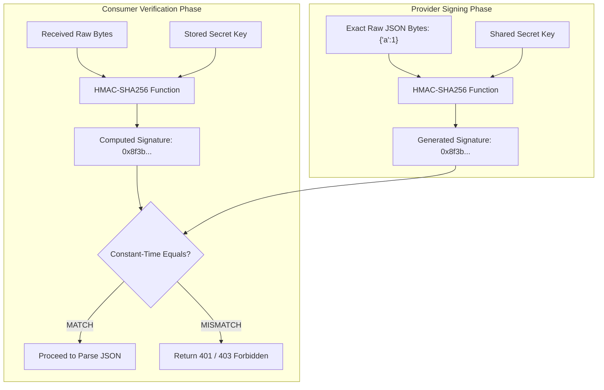

### The Critical Raw-Body Trap (Why Framework Parsers Break Signatures)
A common beginner mistake is letting web frameworks parse JSON into an object first, and then re-stringifying it to verify HMAC:

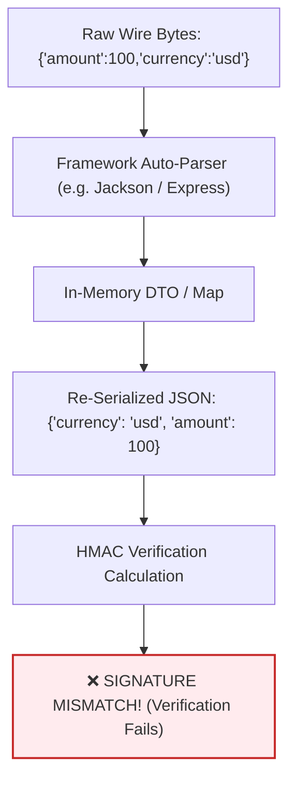

> [!CAUTION]
> **Golden Rule of Webhook Receivers**:  
> Always capture and verify the **exact raw byte stream** before passing bytes to any JSON parser. Minor whitespace differences, key ordering, or Unicode escape characters will completely alter the SHA-256 digest!

---

## 8. Replay Attack Mitigation & Constant-Time String Comparison

### 1. Replay Attacks & Timestamp Tolerances
If an attacker snoops network traffic and intercepts a valid, signed webhook request, they could replay that identical request 1,000 times to your server. Because the signature matches the body, naive HMAC validation passes every time.

**Solution: Signed Timestamps (e.g., Stripe & Standard Webhooks)**
Stripe signs both the timestamp and body together:
$$	ext{Signed Payload} = t + "." + 	ext{raw\_body}$$
$$	ext{Signature} = 	ext{HMAC\_SHA256}(	ext{Signed Payload}, 	ext{Secret})$$

The consumer verifies:
1. The HMAC signature matches.
2. $	ext{Current Time} - t < 300	ext{ seconds (5 minutes tolerance)}$.  
If an attacker replays the payload after 5 minutes, it is instantly rejected.

### 2. Preventing Timing Attacks: Constant-Time Comparison
Standard string equality (`str1.equals(str2)` or `str1 == str2`) terminates immediately upon the first non-matching character:

```
Standard Equals:
"abcde" vs "axxxx" -> Fails at char 1 (Takes 1ns)
"abcde" vs "abxxx" -> Fails at char 2 (Takes 2ns)
"abcde" vs "abcde" -> Checks all 5   (Takes 5ns)
```
Attackers measuring microsecond latency differences across millions of requests can reverse-engineer signatures byte-by-byte.

**Solution**: Use constant-time equality checks that always scan every byte regardless of mismatch position:
* **Java**: `java.security.MessageDigest.isEqual(a, b)`
* **Node.js**: `crypto.timingSafeEqual(a, b)`
* **Go**: `hmac.Equal(a, b)`
* **Python**: `hmac.compare_digest(a, b)`

---

## 9. Provider-Side SSRF (Server-Side Request Forgery) Defense

When you build a platform that sends webhooks to user-defined URLs, you are vulnerable to **SSRF attacks**:

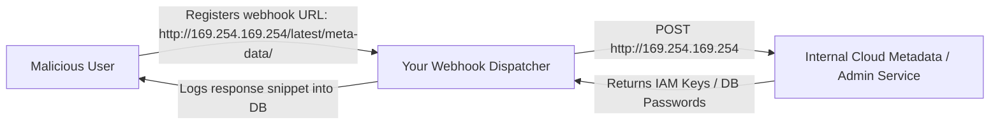

### Defense-in-Depth Checklist for Webhook Providers:
1. **Pre-Flight DNS Resolution**: Resolve domain to IP before connecting. Block all private IPv4/IPv6 ranges:
   * `10.0.0.0/8`, `172.16.0.0/12`, `192.168.0.0/16` (RFC 1918 Private Networks)
   * `127.0.0.0/8` (Loopback / Localhost)
   * `169.254.169.254` (Cloud Instance Metadata Service)
   * `::1` and `fc00::/7` (IPv6 Loopback & Unique Local)
2. **Never Follow Redirects (`3xx`)**: An attacker's public URL (`https://legit.com`) could respond with `302 Found -> http://169.254.169.254`. Webhook dispatchers must disable auto-redirects and treat `3xx` as delivery failure.
3. **Re-Check on Every Dispatch**: Attackers can change DNS records (DNS Rebinding) after registration. DNS must be resolved and filtered on **every single delivery attempt**.
4. **Egress Proxies**: Route outbound webhook traffic through dedicated proxy networks (e.g., Stripe's open-source *Smokescreen* proxy).

---

## 10. At-Least-Once Delivery & Atomic Transactional Idempotency

### Why Exactly-Once Webhook Delivery is Impossible in Distributed Networks
In distributed systems, the **Two Generals' Problem** guarantees network acknowledgments can be lost:

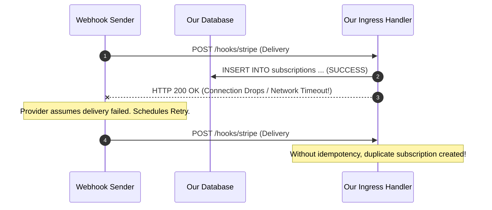

### The Atomic Transactional Idempotency Solution
To make receiving idempotent, the receiver stores the unique `delivery_id` (or `event_id`) in an `idempotency_keys` table **within the exact same database transaction** as the business logic:

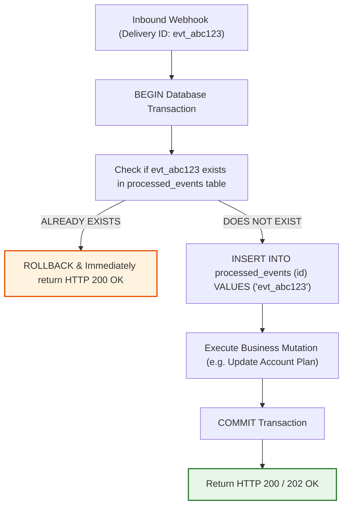

> [!IMPORTANT]
> If you perform business logic first and save the ID second, a server crash between steps causes duplicate processing on retry. If you save the ID first and do logic second, a business error skips processing forever. **Both must execute within one ACID transaction.**

---

## 11. Handling Out-of-Order Webhook Delivery

Consider this real-world race condition highlighted in Stripe's architecture:
1. User creates a subscription $
ightarrow$ Provider emits `customer.subscription.created`.
2. Delivery #1 fails due to a deployment restart and is queued for retry in 5 minutes.
3. User immediately cancels $
ightarrow$ Provider emits `customer.subscription.deleted`.
4. Delivery for `deleted` succeeds in 1 second.
5. 5 minutes later, Delivery #1 retry for `created` arrives and succeeds.  
**Result**: Your database now has an active subscription for a deleted customer!

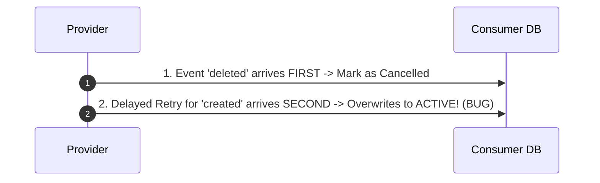

### 3 Solutions to Solve Out-of-Order Deliveries:
1. **Fetch Authoritative State on Event (Signal-Only Pattern)**:
   Treat webhooks as a **notification signal**, not data source. Upon receiving any subscription event, immediately call `GET /v1/subscriptions/{id}` against the provider's API.
2. **Optimistic Versioning / Fencing Tokens**:
   Include an incrementing `version` or timestamp (`updated_at`) on database rows:
   ```sql
   UPDATE subscriptions 
   SET status = 'active', version = 5 
   WHERE id = 'sub_123' AND version < 5;
   ```
   If a delayed `created` (version 1) arrives after `deleted` (version 2), the SQL update modifies 0 rows.
3. **State Buffering**: Hold events in a temporary buffer until preceding sequence numbers arrive.

---

## 12. Retry Schedules, Exponential Backoff & Jitter Calculation

When an endpoint fails or times out, providers apply **Exponential Backoff with Jitter**:

$$	ext{Delay} = \min(	ext{MaxDelay}, 	ext{InitialDelay} 	imes 2^{	ext{attempt}}) + 	ext{RandomJitter}$$

```mermaid
gantt
    title Webhook Retry Exponential Schedule with Backoff
    dateFormat X
    axisFormat %s sec
    section Delivery Attempts
    Attempt 1 (Immediate Failure) :crit, 0, 1
    Wait 5s + Jitter              :active, 1, 6
    Attempt 2 (Failed)            :crit, 6, 7
    Wait 25s + Jitter             :active, 7, 32
    Attempt 3 (Failed)            :crit, 32, 33
    Wait 120s + Jitter            :active, 33, 153
    Attempt 4 (Success 200 OK)    :done, 153, 154
```

### Why Jitter is Essential (Preventing the Thundering Herd)
If a major cloud provider (e.g. AWS us-east-1) goes down for 10 minutes and recovers, thousands of failed webhook retries without jitter would hit consumer backends at the exact same second, immediately crashing them again. Jitter spreads retry attempts uniformly across time.

### Provider Retry Policies Comparison
| Provider | Max Attempts | Duration / Schedule | Exhaustion Action |
| :--- | :--- | :--- | :--- |
| **Stripe** | Multiple | Exponential backoff up to **3 days** | Disables endpoint & sends email |
| **Svix** | Up to 14 | Immediate, 5s, 5m, 30m, 2h, 5h, 10h... | Marked exhausted |
| **Shopify** | 19 Attempts | Every few minutes over **48 hours** | Endpoint removed |
| **GitHub** | **0 Retries** | No automatic retries! Single shot only | Manual click or API redelivery |

---

## 13. Thin Receiver Architecture (Protecting Ingress Under Bursts)

### The Ingress Bottleneck Problem
On the 1st of the month, payment providers charge hundreds of thousands of recurring subscriptions simultaneously. If your webhook handler verifies HMAC, executes complex SQL joins, queries 3rd party APIs, and sends emails synchronously, response latency exceeds timeout budgets ($>5	ext{s}$), triggering cascading retry storms.

### Production Thin Receiver Architecture:
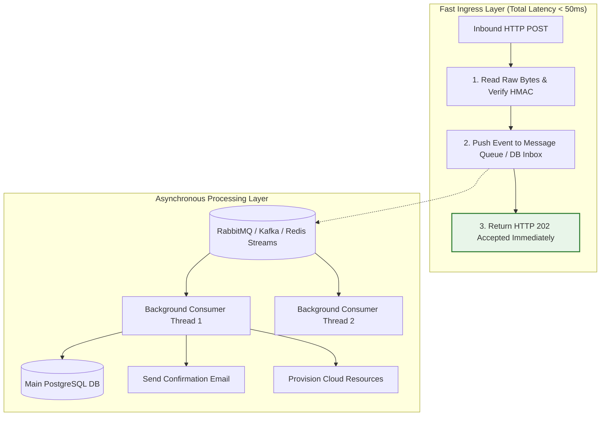

---

## 14. Building a Webhook Provider: The Transactional Outbox Pattern

When you build your own SaaS and need to emit webhooks to customers:

### The 3 Direct POST Failure Modes:
1. **Network Latency**: Slow customer URLs slow down your core API endpoints.
2. **Crash After DB Commit**: DB changes committed, but server crashes before HTTP POST is sent $
ightarrow$ Event lost forever.
3. **Crash After HTTP POST**: HTTP POST sent successfully, but DB transaction rolls back $
ightarrow$ Customer notified of an action that never happened.

### The Solution: Transactional Outbox Pattern
Write domain entities and outbox events in a **single ACID transaction**:

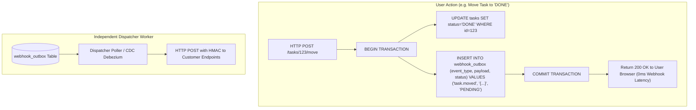

---

## 15. Production Dispatcher Engine: Sign, POST, Record, Retry & Circuit Breaking

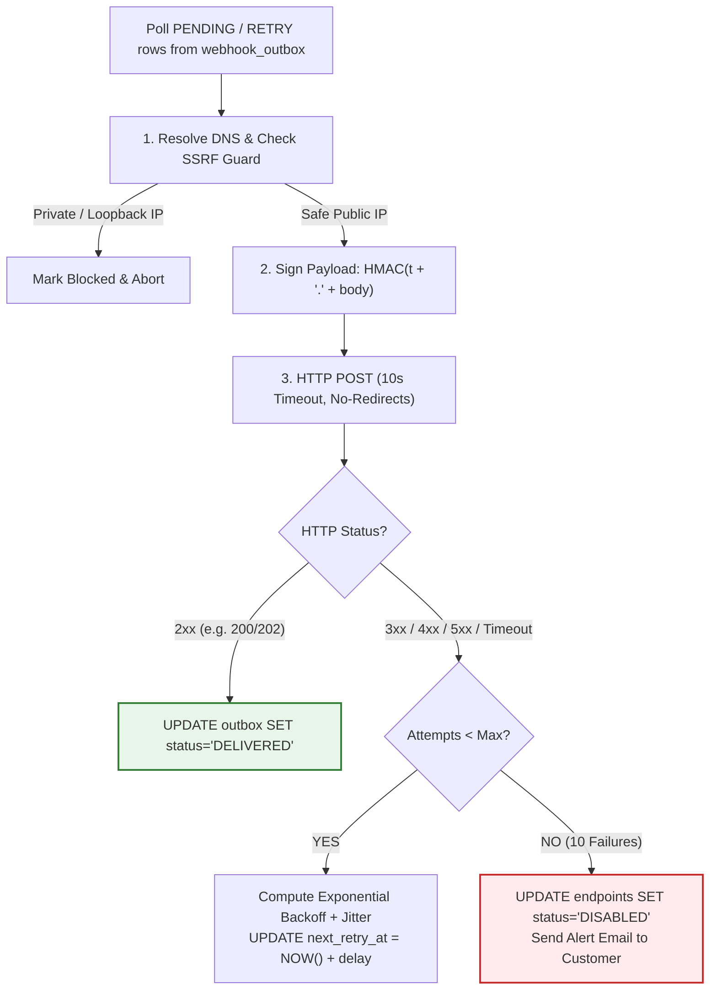

---

## 16. When Webhooks are the WRONG Tool (The Syncing Pitfall)

Webhooks are designed for **discrete point-in-time notifications** (e.g., *Send Slack alert*, *Trigger CI build*, *Unlock account*).

### The Anti-Pattern: Full Database Sync via Webhooks
Many developers attempt to maintain an exact replica of an external provider's database (e.g., Clerk Auth users, Shopify inventory) by subscribing to 20+ fine-grained webhook events (`user.created`, `user.updated`, `role.assigned`, etc.):

```
External Provider (Clerk/Shopify) -------- [20+ Webhook Events] -------> Your Database Copy
```

### Why Webhook Syncing Breaks in Production:
1. **Out-of-Order Application**: `user.updated` applied before `user.created` creates orphan rows.
2. **Missing Deletes**: A dropped webhook leaves ghost users in your database forever.
3. **Schema Migrations**: Provider adds fields or changes relationships; consumer database silently diverges.

---

## 17. The Event Log Architecture: The Right Way to Sync Distributed State

Instead of syncing directly through webhook payloads, modern distributed architectures combine **Webhooks as a Wakeup Ping** with an **Ordered Event Log API**:

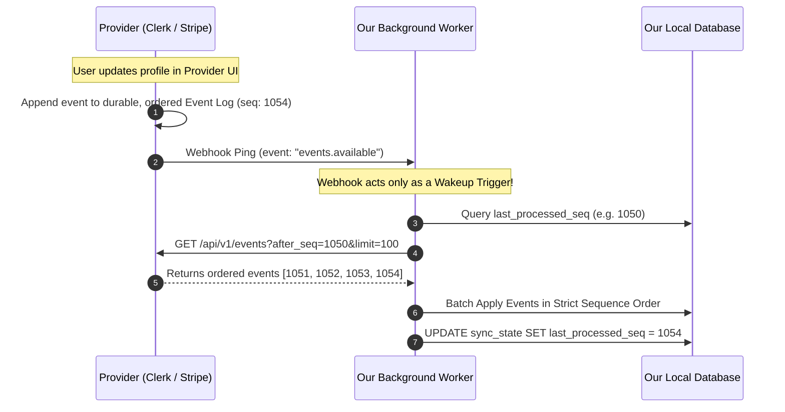

### Key Advantages of the Event Log Pattern:
* **Guaranteed Monotonic Ordering**: The provider orders events sequentially in their primary database.
* **Resilience to Lost Webhooks**: If a webhook is dropped, the periodic fallback poller (e.g. every 15m) fetches all missed events using `last_processed_seq`.
* **Zero Missing Data**: Replaying history from sequence 0 recreates exact system state.

---

## 18. Production Java Spring Boot 3 Implementation

### 1. High-Performance Thin Webhook Receiver (HMAC + Idempotency)

```java
package com.example.webhooks.receiver;

import jakarta.servlet.http.HttpServletRequest;
import org.springframework.http.HttpStatus;
import org.springframework.http.ResponseEntity;
import org.springframework.transaction.annotation.Transactional;
import org.springframework.web.bind.annotation.*;

import javax.crypto.Mac;
import javax.crypto.spec.SecretKeySpec;
import java.nio.charset.StandardCharsets;
import java.security.MessageDigest;

@RestController
@RequestMapping("/hooks")
public class StripeWebhookReceiverController {

    private static final String WEBHOOK_SECRET = "whsec_test_secret_key_12345";
    private static final long TOLERANCE_SECONDS = 300L; // 5 minutes

    private final ProcessedEventRepository eventRepo;
    private final WebhookTaskQueueProducer queueProducer;

    public StripeWebhookReceiverController(ProcessedEventRepository eventRepo,
                                           WebhookTaskQueueProducer queueProducer) {
        this.eventRepo = eventRepo;
        this.queueProducer = queueProducer;
    }

    @PostMapping("/stripe")
    @Transactional
    public ResponseEntity<String> handleStripeWebhook(
            @RequestHeader(value = "Stripe-Signature", required = false) String sigHeader,
            HttpServletRequest request,
            @RequestBody byte[] rawBodyBytes) {

        // 1. Validate signature presence
        if (sigHeader == null || rawBodyBytes == null || rawBodyBytes.length == 0) {
            return ResponseEntity.status(HttpStatus.UNAUTHORIZED).body("Missing signature or payload");
        }

        // 2. Parse Stripe-Signature header (t=timestamp,v1=signature)
        SignatureHeader parsedSig = parseStripeSignature(sigHeader);
        if (parsedSig == null) {
            return ResponseEntity.status(HttpStatus.UNAUTHORIZED).body("Malformed signature header");
        }

        // 3. Prevent Replay Attacks (Verify Timestamp Freshness)
        long currentTimestamp = System.currentTimeMillis() / 1000L;
        if (Math.abs(currentTimestamp - parsedSig.timestamp) > TOLERANCE_SECONDS) {
            return ResponseEntity.status(HttpStatus.UNAUTHORIZED).body("Timestamp expired (Replay detected)");
        }

        // 4. Verify HMAC-SHA256 over raw bytes (DO NOT parse JSON before verification)
        String payloadToSign = parsedSig.timestamp + "." + new String(rawBodyBytes, StandardCharsets.UTF_8);
        if (!isValidHmac(payloadToSign, parsedSig.v1Signature, WEBHOOK_SECRET)) {
            return ResponseEntity.status(HttpStatus.UNAUTHORIZED).body("Invalid HMAC Signature");
        }

        // 5. Extract Event ID & Check Atomic Idempotency
        String eventId = extractEventIdFromJsonBytes(rawBodyBytes);
        if (eventRepo.existsById(eventId)) {
            // Already processed! Return 200 OK immediately to satisfy provider
            return ResponseEntity.ok("Event already acknowledged (Idempotent response)");
        }

        // 6. Record event delivery in DB transaction
        eventRepo.save(new ProcessedEvent(eventId, System.currentTimeMillis()));

        // 7. Push to background queue for async execution (Keep Ingress Handler Thin)
        queueProducer.enqueueForAsyncProcessing(eventId, rawBodyBytes);

        // 8. Immediately acknowledge with 202 Accepted
        return ResponseEntity.status(HttpStatus.ACCEPTED).body("Webhook accepted for processing");
    }

    private boolean isValidHmac(String payload, String expectedSignatureHex, String secret) {
        try {
            Mac hmac = Mac.getInstance("HmacSHA256");
            SecretKeySpec secretKey = new SecretKeySpec(secret.getBytes(StandardCharsets.UTF_8), "HmacSHA256");
            hmac.init(secretKey);
            byte[] computedHash = hmac.doFinal(payload.getBytes(StandardCharsets.UTF_8));
            byte[] expectedHash = hexStringToByteArray(expectedSignatureHex);

            // Constant-time comparison prevents timing side-channel attacks
            return MessageDigest.isEqual(computedHash, expectedHash);
        } catch (Exception e) {
            return false;
        }
    }

    private SignatureHeader parseStripeSignature(String header) {
        try {
            String[] parts = header.split(",");
            long t = -1;
            String v1 = null;
            for (String part : parts) {
                String[] kv = part.trim().split("=", 2);
                if ("t".equals(kv[0])) t = Long.parseLong(kv[1]);
                if ("v1".equals(kv[0])) v1 = kv[1];
            }
            return (t != -1 && v1 != null) ? new SignatureHeader(t, v1) : null;
        } catch (Exception e) {
            return null;
        }
    }

    private byte[] hexStringToByteArray(String s) {
        int len = s.length();
        byte[] data = new byte[len / 2];
        for (int i = 0; i < len; i += 2) {
            data[i / 2] = (byte) ((Character.digit(s.charAt(i), 16) << 4)
                    + Character.digit(s.charAt(i + 1), 16));
        }
        return data;
    }

    private String extractEventIdFromJsonBytes(byte[] bytes) {
        // Simple fast extraction (or use lightweight Jackson TreeNode without full DTO mapping)
        return "evt_" + Math.abs(new String(bytes).hashCode()); 
    }

    record SignatureHeader(long timestamp, String v1Signature) {}
}
```

---

### 2. Transactional Outbox Webhook Publisher

```java
package com.example.webhooks.provider;

import org.springframework.stereotype.Service;
import org.springframework.transaction.annotation.Transactional;

@Service
public class TaskService {

    private final TaskRepository taskRepository;
    private final WebhookOutboxRepository outboxRepository;

    public TaskService(TaskRepository taskRepository, WebhookOutboxRepository outboxRepository) {
        this.taskRepository = taskRepository;
        this.outboxRepository = outboxRepository;
    }

    @Transactional
    public void moveTask(Long taskId, String newStatus, String movedBy) {
        // 1. Perform core business state change
        Task task = taskRepository.findById(taskId)
                .orElseThrow(() -> new IllegalArgumentException("Task not found"));
        task.setStatus(newStatus);
        taskRepository.save(task);

        // 2. Insert into Webhook Outbox table inside the SAME ACID transaction
        String payloadJson = String.format(
            "{"event":"task.moved","taskId":%d,"newStatus":"%s","movedBy":"%s","timestamp":%d}",
            taskId, newStatus, movedBy, System.currentTimeMillis()
        );

        WebhookOutboxEntry outboxEntry = new WebhookOutboxEntry(
            "task.moved",
            payloadJson,
            OutboxStatus.PENDING,
            System.currentTimeMillis()
        );
        outboxRepository.save(outboxEntry);
        
        // When method returns, BOTH task update and outbox row commit atomically!
    }
}
```

---

### 3. Production Dispatcher with SSRF Guard, Backoff & Jitter

```java
package com.example.webhooks.provider;

import org.springframework.scheduling.annotation.Scheduled;
import org.springframework.stereotype.Component;

import javax.crypto.Mac;
import javax.crypto.spec.SecretKeySpec;
import java.net.InetAddress;
import java.net.URI;
import java.net.http.HttpClient;
import java.net.http.HttpRequest;
import java.net.http.HttpResponse;
import java.nio.charset.StandardCharsets;
import java.time.Duration;
import java.util.HexFormat;
import java.util.List;
import java.util.concurrent.ThreadLocalRandom;

@Component
public class WebhookDispatcherWorker {

    private final WebhookOutboxRepository outboxRepo;
    private final EndpointRepository endpointRepo;
    private final HttpClient httpClient;

    public WebhookDispatcherWorker(WebhookOutboxRepository outboxRepo, EndpointRepository endpointRepo) {
        this.outboxRepo = outboxRepo;
        this.endpointRepo = endpointRepo;
        this.httpClient = HttpClient.newBuilder()
                .connectTimeout(Duration.ofSeconds(10))
                .followRedirects(HttpClient.Redirect.NEVER) // CRITICAL: Prevent SSRF Redirects
                .build();
    }

    @Scheduled(fixedDelay = 2000)
    public void dispatchPendingWebhooks() {
        long now = System.currentTimeMillis();
        List<WebhookOutboxEntry> pendingEvents = outboxRepo.findPendingEventsDueForDispatch(now);

        for (WebhookOutboxEntry entry : pendingEvents) {
            List<WebhookEndpoint> endpoints = endpointRepo.findActiveByEventType(entry.getEventType());

            for (WebhookEndpoint ep : endpoints) {
                dispatchSingleDelivery(entry, ep);
            }
        }
    }

    private void dispatchSingleDelivery(WebhookOutboxEntry entry, WebhookEndpoint ep) {
        try {
            // 1. SSRF Guard: Validate Host IP is not private / internal
            URI targetUri = URI.create(ep.getUrl());
            InetAddress address = InetAddress.getByName(targetUri.getHost());
            if (address.isLoopbackAddress() || address.isSiteLocalAddress() || address.isAnyLocalAddress()) {
                recordDeliveryFailure(entry, ep, "SSRF Blocked: Private/Internal IP target prohibited");
                return;
            }

            // 2. Sign Payload using Standard Webhooks HMAC scheme (timestamp.body)
            long timestamp = System.currentTimeMillis() / 1000L;
            String signature = generateHmacSha256(timestamp + "." + entry.getPayload(), ep.getSecretKey());

            // 3. Build & Execute POST Request
            HttpRequest request = HttpRequest.newBuilder()
                    .uri(targetUri)
                    .timeout(Duration.ofSeconds(10))
                    .header("Content-Type", "application/json")
                    .header("User-Agent", "OurApp-WebhookDispatcher/2.0")
                    .header("Webhook-Id", "msg_" + entry.getId())
                    .header("Webhook-Timestamp", String.valueOf(timestamp))
                    .header("Webhook-Signature", "v1," + signature)
                    .POST(HttpRequest.BodyPublishers.ofString(entry.getPayload(), StandardCharsets.UTF_8))
                    .build();

            HttpResponse<String> response = httpClient.send(request, HttpResponse.BodyHandlers.ofString());

            if (response.statusCode() >= 200 && response.statusCode() < 300) {
                entry.setStatus(OutboxStatus.DELIVERED);
                outboxRepo.save(entry);
            } else {
                scheduleRetryWithBackoff(entry, ep, "HTTP " + response.statusCode());
            }
        } catch (Exception ex) {
            scheduleRetryWithBackoff(entry, ep, ex.getMessage());
        }
    }

    private void scheduleRetryWithBackoff(WebhookOutboxEntry entry, WebhookEndpoint ep, String reason) {
        int attempt = entry.getAttemptCount() + 1;
        entry.setAttemptCount(attempt);

        if (attempt >= 10) {
            entry.setStatus(OutboxStatus.EXHAUSTED);
            ep.setStatus(EndpointStatus.DISABLED); // Circuit break dead endpoint
            endpointRepo.save(ep);
        } else {
            // Exponential backoff: base 5s * 2^attempt + random jitter (0-5s)
            long baseDelaySeconds = 5L * (1L << attempt);
            long jitterSeconds = ThreadLocalRandom.current().nextLong(0, 6);
            long totalDelayMs = (baseDelaySeconds + jitterSeconds) * 1000L;

            entry.setNextRetryAt(System.currentTimeMillis() + totalDelayMs);
            entry.setStatus(OutboxStatus.RETRY);
        }
        outboxRepo.save(entry);
    }

    private String generateHmacSha256(String data, String secret) throws Exception {
        Mac mac = Mac.getInstance("HmacSHA256");
        SecretKeySpec key = new SecretKeySpec(secret.getBytes(StandardCharsets.UTF_8), "HmacSHA256");
        mac.init(key);
        return HexFormat.of().formatHex(mac.doFinal(data.getBytes(StandardCharsets.UTF_8)));
    }
}
```

---

## 19. Interview & Architecture Quick-Reference Cheat Sheet

```
+----------------------------------------------------------------------------------------------------+
|                                WEBHOOK ARCHITECTURE CHEAT SHEET                                    |
+----------------------------------------------------------------------------------------------------+
| 1. Definition          | Reverse HTTP API call where server pushes events directly to client API   |
| 2. Core Protocol       | HTTP/HTTPS POST with JSON payload + Cryptographic Signature Headers       |
| 3. Signature Standard  | HMAC-SHA256 over raw byte stream using a pre-shared symmetric secret       |
| 4. Raw-Body Rule       | ALWAYS verify raw request bytes BEFORE deserializing to JSON objects      |
| 5. Replay Attack Fix   | Sign timestamp alongside body; reject requests older than 300 seconds     |
| 6. Timing Attack Fix   | Use constant-time byte comparisons (MessageDigest.isEqual / hmac.Equal)    |
| 7. SSRF Protection     | Resolve DNS on every POST; block RFC 1918 private & 169.254.169.254 IPs   |
| 8. Delivery Guarantee  | At-Least-Once (Deliveries can duplicate due to network drops)              |
| 9. Idempotency Rule    | Store event_id + execute state change in the SAME ACID DB Transaction      |
| 10. Out-of-Order Fix   | Treat webhook as a signal -> Query authoritative provider API / Versioning|
| 11. Ingress Rule       | Thin receiver: verify HMAC -> persist event -> return 202 in < 100ms       |
| 12. Provider Pattern   | Transactional Outbox Pattern + Asynchronous Retry Dispatcher Worker        |
| 13. Retry Schedule     | Exponential Backoff + Jitter (spreads load and prevents thundering herds) |
| 14. Data Sync Rule     | DO NOT sync databases with raw webhooks; use Webhook + Ordered Event Log   |
+----------------------------------------------------------------------------------------------------+
```
