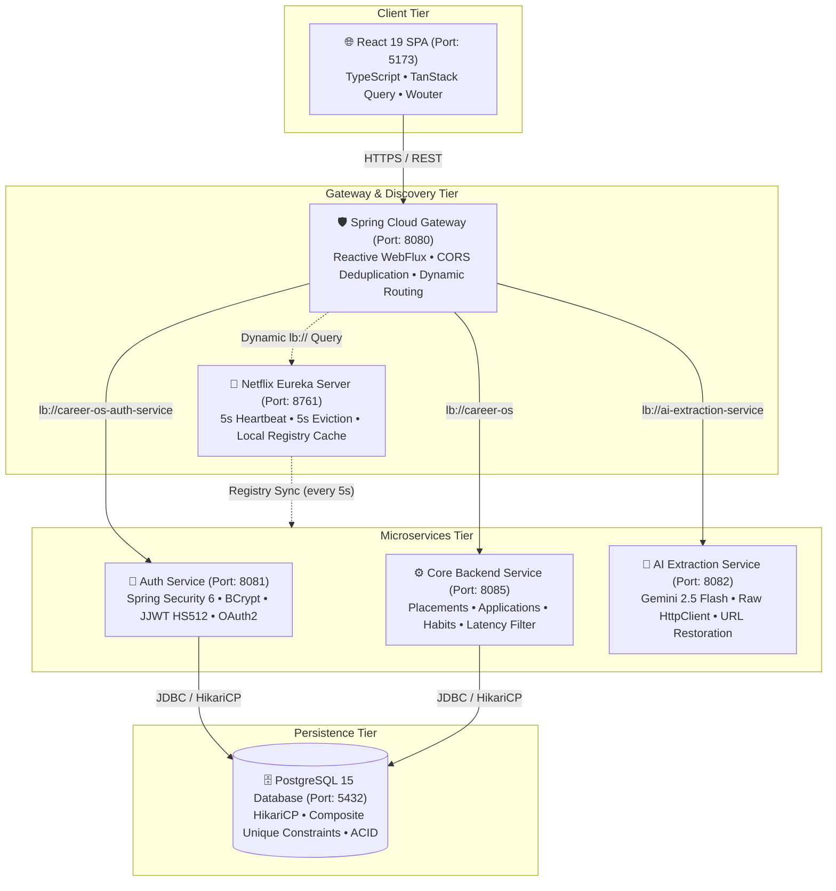
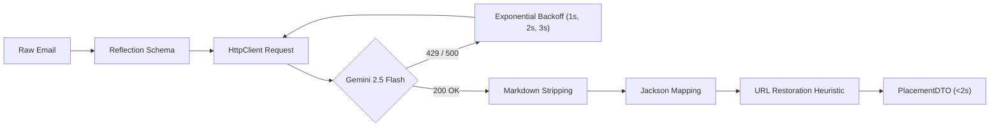

# 🚀 Career OS — 15+ LPA Java Backend & Spring Boot Interview Masterclass

> **Document Objective**: High-yield interview preparation guide engineered for senior/staff-level Java Backend, Distributed Systems, and Spring Boot interviews (15+ LPA). Consolidates project architecture, Spring framework internals, Core Java, concurrency, SQL, microservices trade-offs, and 50 practice questions into an actionable revision dossier.

---

## 📑 Quick Navigation
1. [Project — Must Know](#1-project--must-know)
2. [End-to-End Architecture & Request Lifecycle](#2-end-to-end-architecture--request-lifecycle)
3. [Project-Specific Technical Interview Q&A](#3-project-specific-technical-interview-qa)
4. [Core Java & Concurrency Deep-Dive (15+ LPA Focus)](#4-core-java--concurrency-deep-dive-15-lpa-focus)
5. [Spring Boot & Spring Framework Internals](#5-spring-boot--spring-framework-internals)
6. [Database & SQL Performance Engineering](#6-database--sql-performance-engineering)
7. [Microservices & Distributed Systems Patterns](#7-microservices--distributed-systems-patterns)
8. [Generative AI Ingestion Pipeline (Google Gemini 2.5 Flash)](#8-generative-ai-ingestion-pipeline-google-gemini-25-flash)
9. [Zero-Trust Security & Authentication Architecture](#9-zero-trust-security--authentication-architecture)
10. [System Design: Scaling Career OS to 100x Traffic](#10-system-design-scaling-career-os-to-100x-traffic)
11. [Architectural Trade-Offs & Weak Points Defense](#11-architectural-trade-offs--weak-points-defense)
12. [Top 50 High-Probability Interview Questions](#12-top-50-high-probability-interview-questions)
13. [🔥 The 60-Minute Final Night Revision Plan](#13--the-60-minute-final-night-revision-plan)

---

# 1. PROJECT — MUST KNOW

## Project in 60 Seconds
> *"I built **Career OS**, a distributed cloud-native microservices platform that automates job application tracking, placement intelligence, and daily habit routines for software engineers. It solves the fragmentation of job searches across spreadsheets and emails. The platform is decoupled into 5 microservices: a reactive Spring Cloud API Gateway, Netflix Eureka service discovery, an Auth service issuing stateless HMAC-SHA512 JWTs with OAuth2 social login, a Core Backend managing 7-stage placement pipelines and habits with PostgreSQL, and an AI Extraction service integrating Google Gemini 2.5 Flash for sub-2-second email parsing. I implemented database idempotency using composite unique constraints, automated nanosecond request profiling via a custom servlet filter with W3C `Server-Timing` headers, centralized `@RestControllerAdvice` exception handling with zero controller try-catches, and cut container build times by 75% using local-JAR Alpine packaging."*

### Key Dimensions Summary:
* **The Problem**: Job candidates manually track drives across emails, spreadsheets, and portals. Recruitment emails contain critical test links and deadlines that get lost, and daily preparation lacks streak measurement.
* **The Solution**: A unified command center with a 7-stage placement funnel (`APPLIED` $\rightarrow$ `OFFER_RECEIVED`), contest tracker, $\mathcal{O}(1)$ habit streak engine, categorized skills matrix, and an automated LLM email parser.
* **Tech Stack**: Java 17, Spring Boot 3.3, Spring Cloud Gateway (WebFlux), Netflix Eureka, Spring Security 6, JJWT (HS512), Spring Data JPA, PostgreSQL 15, Google Gemini 2.5 Flash, React 19, TypeScript, Docker Compose.
* **My Core Responsibilities**:
  1. Microservices decomposition, dynamic gateway routing, and low-latency Eureka tuning.
  2. Stateless JWT security infrastructure and Google/GitHub OAuth2 login federation.
  3. Relational PostgreSQL schema design, composite unique constraints, and JPA query optimization.
  4. Raw HTTP Gemini 2.5 Flash client with reflection prompt generation, backoff retry, and URL anti-hallucination restoration.
  5. High-precedence servlet latency tracking filter and declarative global error architecture.
* **Top Technical Challenges**:
  1. *LLM URL Token Hallucination*: LLMs normalize/lowercase test access tokens in URLs. Solved via a regex URL-preservation heuristic.
  2. *Docker Build Resource Exhaustion*: Multi-stage container builds consumed 8GB+ RAM. Replaced with host-compiled local-JAR Alpine packaging, cutting build times by 75%.
  3. *Spring Cloud Gateway Duplicate CORS*: Gateway and downstream MVC services both applied CORS. Solved with gateway-level `DedupeResponseHeader=RETAIN_FIRST`.
  4. *Eureka Cold-Start Delays*: Default 30s heartbeats caused startup 503s. Tuned lease renewal to 5s and eviction to 5s.

---

## 2-Minute Project Explanation
> *"When looking at modern software engineering job hunts, candidate productivity is destroyed by manual data entry across disparate tools. I built Career OS as a distributed system to solve this end-to-end.*
> 
> *At the edge, a reactive Spring Cloud Gateway built on Spring WebFlux and Project Reactor intercepts incoming traffic on port 8080. It dynamically routes requests by querying a Netflix Eureka registry tuned to a 5-second heartbeat, eliminating hardcoded service URLs. All authentication is completely stateless: our `auth-service` verifies credentials, hashes passwords with BCrypt, handles OAuth2 flows with Google and GitHub, and issues HMAC-SHA512 signed JWTs.*
> 
> *Downstream services—the core backend and the AI extraction service—share the symmetric JWT secret key. Instead of making remote RPC calls back to the auth service on every request, downstream services run a custom `OncePerRequestFilter` that independently validates the token signature in memory and populates Spring's `SecurityContextHolder`. This delivers zero-network-hop authentication.*
> 
> *For automated data ingestion, I built the `ai-extraction-service` integrating Google's Gemini 2.5 Flash. Rather than pulling in the heavy Google Cloud SDK, I used Java 11's `HttpClient` with connection timeouts, reflection-based JSON schema prompting, and a 3-tier exponential backoff retry loop. Because LLMs tend to lowercase or alter deep-link query parameters, I engineered a regex URL-preservation heuristic that restores exact raw test links into the extracted DTO with 100% fidelity.*
> 
> *On the persistence tier, PostgreSQL 15 enforces strict ACID integrity and API idempotency through composite unique constraints on `(user_id, company_name, role, application_link)` and `(routine_task_id, completion_date)`. This prevents duplicate records even under rapid client double-submissions. Across all services, I eliminated controller `try-catch` blocks in favor of a centralized `@RestControllerAdvice` error architecture, and injected W3C `Server-Timing` headers via a nanosecond latency tracking filter.*
> 
> *Finally, every service is containerized using Eclipse Temurin 17 Alpine JREs with local-JAR packaging, slashing image build times from 8 minutes to 15 seconds and keeping memory footprints under 150MB per service."*

---

# 2. ARCHITECTURE



### Component Rationale Matrix:
| Component | What It Does | Why It Exists (Architectural Justification) |
| :--- | :--- | :--- |
| **Spring Cloud Gateway (8080)** | Reverse proxy, path predicate matching, CORS deduplication, timeout management. | Single entry point (BFF pattern). Non-blocking Netty event loop handles thousands of concurrent open requests without thread pool starvation. |
| **Netflix Eureka (8761)** | Service registry and real-time health heartbeat monitor. | Eliminates static IP/port configuration; enables client-side load balancing (`lb://`) and seamless auto-scaling. |
| **Auth Service (8081)** | User lifecycle, BCrypt hashing, JWT issuance, OAuth2 social login federation. | Isolates sensitive authentication credentials and cryptographic signing keys from business logic services. |
| **AI Extraction Service (8082)** | Raw recruitment email parsing via Google Gemini 2.5 Flash. | AI ingestion takes 1.5s–4s. Decoupling it into an isolated service prevents long-running LLM calls from exhausting Tomcat worker threads in the CRUD backend. |
| **Core Backend (8085)** | Placements, hackathons, habit routines, skills matrix, and analytics. | Houses domain business rules, JPA repositories, transactional boundaries, and latency tracking. |
| **PostgreSQL 15 (5432)** | ACID relational storage, foreign key cascades, composite unique indexes. | Guarantees data consistency, relational queries for analytics, and database-level idempotency. |

---

## Explain One Request End-to-End
### Scenario: User submits a new job application (`POST /api/placements`)

```mermaid
sequenceDiagram
    autonumber
    actor User as React 19 Frontend
    participant GW as API Gateway (8080)
    participant Eureka as Eureka Registry (8761)
    participant Filter as RequestLatencyLoggingFilter
    participant SecFilter as JwtAuthenticationFilter
    participant Ctrl as PlacementController
    participant Svc as PlacementService
    participant Repo as PlacementRepository
    participant DB as PostgreSQL 15

    User->>GW: POST /api/placements + Bearer JWT + Body JSON
    GW->>Eureka: Lookup active instances for "career-os"
    Eureka-->>GW: Return http://backend:8085
    GW->>Filter: Forward request to backend:8085
    Note over Filter: Capture start time in nanoseconds (System.nanoTime())
    Filter->>SecFilter: Pass down FilterChain
    Note over SecFilter: Parse HS512 JWT, verify signature in-memory, set UserPrincipal in SecurityContext
    SecFilter->>Ctrl: Dispatch to createPlacement(@Valid DTO)
    Note over Ctrl: Validate DTO annotations (@NotBlank, @NotNull)
    Ctrl->>Svc: createPlacement(userId, placementDTO)
    Svc->>Repo: save(placementEntity)
    Repo->>DB: INSERT INTO placements (user_id, company_name, ...)
    alt Unique Constraint Violation
        DB-->>Repo: Error 23505 (unique_user_company_role_link)
        Repo-->>Svc: DataIntegrityViolationException
        Svc-->>Ctrl: Bubbles up
        Ctrl-->>User: GlobalExceptionHandler catches and returns 409 Conflict JSON
    else Insert Successful
        DB-->>Repo: 201 Created (Returned generated ID)
        Repo-->>Svc: Placement Entity
        Svc-->>Ctrl: PlacementDTO
        Ctrl-->>Filter: Return 201 Created ResponseEntity
        Note over Filter: In finally block, calculate durMs = (nanoTime - start) / 1e6<br/>Inject Header: Server-Timing: total;dur=X
        Filter-->>GW: HTTP 201 Created + Server-Timing
        GW-->>User: HTTP 201 Created
        Note over User: TanStack Query cache invalidation & optimistic UI update
    end
```

---

# 3. PROJECT INTERVIEW QUESTIONS

### ⭐ PROJECT QUESTION: Why did you choose a microservices architecture instead of a monolith?
> *"The primary driver was **workload isolation for AI extraction**. Calling Gemini 2.5 Flash over HTTP takes 1.5s to 4 seconds. In a traditional monolith sharing a single Tomcat thread pool (default 200 threads), a sudden spike in email parsing requests would quickly exhaust worker threads, starving fast (<30ms) CRUD requests for daily routines and placement dashboards. Decoupling AI extraction into its own service guarantees that LLM latency spikes never degrade core business operations. Secondarily, it isolates security and credential handling (`auth-service`) and makes the AI extraction service polyglot-ready (e.g., migrating to Python FastAPI/LangChain without touching core Java services)."*

### ⭐ PROJECT QUESTION: Why use Spring Cloud Gateway instead of Zuul or an NGINX reverse proxy?
> *"Netflix Zuul 1.x is a blocking, thread-per-request architecture that degrades under high concurrency. Spring Cloud Gateway is built on **Spring WebFlux and Netty**, using a non-blocking event-loop model that handles tens of thousands of concurrent open connections with a minimal thread footprint. Unlike NGINX, Spring Cloud Gateway integrates natively with Spring Cloud Service Discovery (Eureka), allowing dynamic route resolution using the `lb://` syntax and Java-based custom filters (`DedupeResponseHeader`) without maintaining external static configuration files."*

### ⭐ PROJECT QUESTION: How does dynamic service discovery work in your gateway?
> *"The gateway runs an embedded Eureka client that periodically pulls the registry cache (configured to every 5 seconds). When an incoming request matches `/api/**`, Spring Cloud LoadBalancer intercepts the `lb://career-os` URI, queries its local cache for active instances of `career-os`, selects a healthy instance using round-robin, rewrites the request URL to the target container's IP and port (`http://backend:8085`), and forwards the request."*

### ⭐ PROJECT QUESTION: Why did you use stateless JWT authentication instead of session cookies?
> *"In a distributed microservices setup, stateful HTTP sessions require distributed session storage (e.g. Redis via Spring Session) and sticky sessions on the load balancer, introducing latency and single-point-of-failure risks. With **stateless HMAC-SHA512 JWTs**, the token is completely self-contained. Downstream services (`backend`, `ai-extraction-service`) share the identical `JWT_SECRET` key via environment variables. Each service validates the cryptographic signature locally in memory without making network RPC calls to `auth-service` or hitting the database, enabling zero-latency authentication verification."*

### ⭐ PROJECT QUESTION: How do you guarantee database idempotency against duplicate submissions?
> *"We enforce idempotency at the database engine layer using **composite unique constraints**:
> 1. `applications`: `UNIQUE (user_id, event_url)`
> 2. `placements`: `UNIQUE (user_id, company_name, role, application_link)`
> 3. `routine_completion`: `UNIQUE (routine_task_id, completion_date)`
> If a user rapidly double-clicks 'Submit' or an AI extraction parses the same email twice, PostgreSQL aborts the transaction with error code `23505` (`DataIntegrityViolationException`). Our centralized `@RestControllerAdvice` catches this and converts it into a clean HTTP `409 Conflict`."*

### ⭐ PROJECT QUESTION: Explain the daily routine streak calculation algorithm.
> *"In `RoutineService`, we query `routine_completion` for all user tasks and group them by `completion_date`.
> 1. A date is classified as 'Completed' if and only if $\text{completedTasksCount} \ge \text{totalUserTasksCount}$.
> 2. **Current Streak**: Starting from `today` (or `yesterday` if today is not yet finished), we iterate backwards day-by-day. If the date exists in our completed set, we increment the streak; the moment a date is missing, the loop terminates.
> 3. **Longest Streak**: We sort unique completed dates chronologically and track contiguous day sequences where `date.minusDays(1).equals(prevDate)`.
> 4. To avoid the N+1 query problem, we collect all task IDs into a list and execute a single batch query: `findByRoutineTaskIdInAndCompletionDate(ids, today)`."*

### ⭐ PROJECT QUESTION: How does the AI URL preservation heuristic prevent hallucinations?
> *"LLMs frequently lowercase or normalize query parameters in URLs (e.g. turning `?token=AbC12` into `?token=abc12`), invalidating test links. Before sending raw email text to Gemini, our service scans the text using a strict regex: `https?://[a-zA-Z0-9.-]+(?::[0-9]+)?(?:/[^\\s<>\"']*)?`. After Jackson deserializes the JSON response, the service matches the extracted link against the raw URL list. If a match is found, it overwrites the field with the **100% exact original link string**, preserving case-sensitive tokens."*

### ⭐ PROJECT QUESTION: Why did you eliminate try-catch blocks from your controllers?
> *"Catching exceptions manually inside `@RestController` methods violates the **Single Responsibility Principle**, produces repetitive boilerplate, and risks swallowing domain exceptions into generic 500 errors. We eliminated all controller `try-catch` blocks and centralized exception handling in `GlobalExceptionHandler` using `@RestControllerAdvice`. Controllers remain clean declarative one-liners, and exceptions are mapped to standard HTTP statuses (`409 Conflict`, `400 Bad Request`, `404 Not Found`) in one place."*

### ⭐ PROJECT QUESTION: How do you measure API latency and what headers do you inject?
> *"We implemented `RequestLatencyLoggingFilter` extending `OncePerRequestFilter` ordered at `HIGHEST_PRECEDENCE`. It captures the start time via `System.nanoTime()` before the filter chain executes. In the `finally` block, it computes elapsed duration in milliseconds and attaches the W3C standard HTTP header: `Server-Timing: total;dur=X`. If duration $\ge 500\text{ms}$, it logs structured latency warnings (`[LATENCY: SLOW]`)."*

---

# 4. CORE JAVA & CONCURRENCY DEEP-DIVE (15+ LPA FOCUS)

## Core Java & OOP
### 🔥 MUST KNOW: Interface vs. Abstract Class (Java 8+ to 17)
* **Explanation**: An abstract class can hold mutable instance state (fields) and constructors, representing an *"is-a"* relationship with single inheritance. An interface represents a *"can-do"* contract supporting multiple inheritance. Since Java 8, interfaces can contain `default` and `static` methods; Java 9 added `private` methods.
* **Interview Question**: *"When would you choose an abstract class over an interface in Java 17?"*
* **Answer**: *"Choose an abstract class when you need to share non-static mutable state, access non-public fields, or define constructors that enforce initialization invariants in a hierarchy. Choose an interface when defining a capability contract across unrelated classes (e.g., `Comparable`, `Serializable`)."*

### 🔥 MUST KNOW: equals() and hashCode() Contract
* **Explanation**: If two objects are equal according to `equals(Object)`, they **must** return the identical integer from `hashCode()`. If two objects have the same hash code, they are **not** necessarily equal (hash collision). Violating this breaks hash-based collections (`HashMap`, `HashSet`).
* **Interview Question**: *"What happens if you override `equals()` but forget to override `hashCode()` in a JPA entity or DTO used in a `HashMap`?"*
* **Answer**: *"The `HashMap` uses the default `Object.hashCode()` (memory address-derived). Two distinct object instances with identical business fields will produce different hash codes, ending up in different buckets. When calling `map.get(key)`, the map will look in the wrong bucket and return `null`, even though `equals()` returns `true`."*

```java
// Correct implementation example for DTO
@Override
public boolean equals(Object o) {
    if (this == o) return true;
    if (!(o instanceof PlacementDTO that)) return false;
    return Objects.equals(companyName, that.companyName) &&
           Objects.equals(role, that.role) &&
           Objects.equals(applicationLink, that.applicationLink);
}

@Override
public int hashCode() {
    return Objects.hash(companyName, role, applicationLink);
}
```

### String vs. StringBuilder vs. StringBuffer
* **Explanation**: `String` is immutable and stored in the String Pool. `StringBuilder` is mutable and non-thread-safe (high performance). `StringBuffer` is mutable and thread-safe (methods are `synchronized`, causing thread contention).

### Checked vs. Unchecked Exceptions
* **Explanation**: Checked exceptions extend `Exception` (excluding `RuntimeException`) and must be declared in `throws` or caught (e.g., `IOException`, `SQLException`). Unchecked exceptions extend `RuntimeException` and represent unrecoverable programmer errors or business validation failures (e.g., `NullPointerException`, `IllegalArgumentException`). Spring's `@Transactional` **only rolls back on unchecked exceptions by default**.

---

## Collections Framework
### 🔥 MUST KNOW: HashMap Internals & Concurrency
* **Explanation**: Uses an array of buckets (`Node<K,V>[]`). Index is determined by `(n - 1) & hash(key)`. Collisions are resolved using singly linked lists. In Java 8+, when a bucket exceeds **8 nodes** (`TREEIFY_THRESHOLD`) and total table capacity $\ge 64$, the bucket converts into a **Red-Black Tree** ($\mathcal{O}(\log N)$ lookup).
* **Load Factor & Rehashing**: Default initial capacity is 16, default load factor is 0.75. When size exceeds $16 \times 0.75 = 12$, capacity doubles to 32 and all elements are rehashed.
* **Interview Question**: *"Why is `HashMap` not thread-safe, and what happens under concurrent writes?"*
* **Answer**: *"Concurrent `put()` calls can lead to lost updates or corrupted linked lists. In Java 7, concurrent rehashing could create circular linked lists causing 100% CPU infinite loops. In Java 8, while the circular loop is resolved, concurrent writes corrupt tree/list pointers and cause data loss."*

### 🔥 MUST KNOW: ConcurrentHashMap Architecture
* **Explanation**: In Java 8+, `ConcurrentHashMap` eliminated segment locks. It uses an array of `Node<K,V>` with **CAS (Compare-And-Swap) operations** (`Unsafe.compareAndSwapObject`) for bucket insertion when empty, and synchronizes on the **first node of the bucket (`synchronized(f)`)** during collisions. Reads are 100% lock-free using `volatile` node values.

---

## Java 8+ Streams & Functional Programming
### 🔥 MUST KNOW: Stream Operations & Intermediate vs. Terminal
* **Intermediate (Lazy)**: `filter()`, `map()`, `flatMap()`, `distinct()`, `sorted()`. They return a new Stream and execute only when a terminal operation is called.
* **Terminal (Eager)**: `collect()`, `forEach()`, `reduce()`, `count()`, `anyMatch()`.
* **`map()` vs `flatMap()`**: `map()` transforms $T \rightarrow R$ (one-to-one). `flatMap()` transforms $T \rightarrow \text{Stream}<R>$ and flattens nested streams (one-to-many).

```java
// Example from Career OS Routine aggregation
Map<LocalDate, Long> completedPerDay = completions.stream()
    .filter(RoutineCompletion::isCompleted)
    .collect(Collectors.groupingBy(
        RoutineCompletion::getCompletionDate,
        Collectors.counting()
    ));
```

---

## Multithreading & Concurrency
### 🔥 MUST KNOW: Volatile vs. Synchronized
* **`volatile`**: Guarantees **visibility** (reads/writes bypass CPU L1/L2 caches and hit main memory directly) and **instruction reordering prevention** (happens-before relationship via memory barriers). Does **not** guarantee atomicity (e.g., `count++` is a 3-step operation: read, update, write).
* **`synchronized`**: Guarantees both **mutual exclusion (atomicity)** and **visibility** by acquiring intrinsic object monitor locks.

### 🔥 MUST KNOW: ThreadPoolExecutor & Virtual Threads (Java 21 context)
* **Core Parameters**: `corePoolSize`, `maximumPoolSize`, `keepAliveTime`, `workQueue` (`BlockingQueue`), `RejectedExecutionHandler` (`AbortPolicy`, `CallerRunsPolicy`).
* **Interview Question**: *"How does `CompletableFuture.supplyAsync()` execute?"*
* **Answer**: *"It submits the task to `ForkJoinPool.commonPool()` by default, unless an explicit `Executor` is supplied. It allows non-blocking asynchronous pipeline chaining using `.thenApply()`, `.thenCompose()`, and `.exceptionally()`."*

---

# 5. SPRING BOOT & SPRING FRAMEWORK INTERNALS

### 🔥 MUST KNOW: Spring Singleton Scope & Thread Safety
* **Explanation**: All Spring beans (`@Service`, `@RestController`, `@Component`) are **Singletons** by default. A single bean instance is stored in `ApplicationContext`'s singleton registry (`ConcurrentHashMap`).
* **Thread-Safety Rule**: Because a singleton bean is shared across hundreds of concurrent HTTP threads, beans **must be stateless**. They must never contain mutable instance fields. Request state must reside in method local variables (stack-allocated) or `ThreadLocal` storage (`SecurityContextHolder`).

### 🔥 MUST KNOW: How `@Transactional` Works Internally
* **Under the Hood**: Operates via **Spring AOP Dynamic Proxies**.
  1. Spring wraps the `@Service` bean in a proxy.
  2. When a `@Transactional` method is called from outside the class, the proxy intercepts it.
  3. The proxy borrows a database connection from `HikariCP` and sets `connection.setAutoCommit(false)`.
  4. Binds the connection to the current thread via `TransactionSynchronizationManager`.
  5. Executes target business logic.
  6. If completed without unchecked exceptions (`RuntimeException` or `Error`), calls `connection.commit()`.
  7. If an unchecked exception is thrown, calls `connection.rollback()`.
* **⚠️ Self-Invocation Trap**: Calling a `@Transactional` method from another method *within the same class* (`this.methodB()`) bypasses the Spring proxy, completely disabling transaction management!

### 🔥 MUST KNOW: The N+1 Query Problem in Spring Data JPA
* **What It Is**: Loading 1 parent entity triggers 1 query. Accessing a lazily loaded `@OneToMany` collection in a loop triggers $N$ additional database queries, destroying latency.
* **How Solved in Career OS**: In `RoutineService`, instead of querying completions inside a loop, we collect all task IDs into a list and execute a single batch query:
  ```java
  List<RoutineCompletion> findByRoutineTaskIdInAndCompletionDate(List<Long> ids, LocalDate date);
  ```
  This reduces $N+1$ queries down to **exactly 1 SQL query**.

---

# 6. DATABASE & SQL PERFORMANCE ENGINEERING

### Database Tables & Indexing Summary:
| Table Name | Foreign Key & Cascade | Indexes & Unique Constraints | Idempotency / Performance Rationale |
| :--- | :--- | :--- | :--- |
| **`users`** | None | `UNIQUE (email)` | Fast credential lookup; prevents duplicate registrations. |
| **`user_profiles`** | `user_id -> users(id)` | `UNIQUE (user_id)` | Strictly enforces a 1-to-1 relationship. |
| **`applications`** | `user_id -> users(id)` | `UNIQUE (user_id, event_url)`<br>`idx_applications_status ON (status)` | Idempotency: Prevents duplicate contest/event URLs. Fast tab filtering. |
| **`placements`** | `user_id -> users(id)` | `UNIQUE (user_id, company_name, role, application_link)`<br>`idx_placements_status ON (status)` | Idempotency: Prevents duplicate job applications. Fast funnel aggregation. |
| **`skills`** | `user_id -> users(id)` | `UNIQUE (user_id, name)` | Prevents duplicate skill tags for the same user. |
| **`routine_tasks`** | `user_id -> users(id)` | `idx_routine_tasks_user_id ON (user_id)` | Fast retrieval of user habit templates ordered by `display_order`. |
| **`routine_completion`** | `routine_task_id -> routine_tasks(id)` | `CONSTRAINT uq_routine_completion UNIQUE (routine_task_id, completion_date)` | Enables $\mathcal{O}(1)$ idempotent daily habit toggles without duplicate rows. |

### 🔥 MUST KNOW: ACID Properties & PostgreSQL Isolation Levels
* **Atomicity**: All-or-nothing execution via PostgreSQL Write-Ahead Logging (WAL) and undo records.
* **Consistency**: Relational invariants, foreign key cascades, and unique constraints remain valid before and after transactions.
* **Isolation Levels**:
  1. `Read Uncommitted` (PostgreSQL treats this as Read Committed).
  2. `Read Committed` (Default in PostgreSQL): Uses MVCC (Multi-Version Concurrency Control); each statement sees only data committed before that statement began.
  3. `Repeatable Read`: Snapshot isolation; transaction sees data committed before the *transaction* began. Eliminates non-repeatable reads.
  4. `Serializable`: Eliminates phantom reads and serialization anomalies using SSI (Serializable Snapshot Isolation).

---

# 7. MICROSERVICES & DISTRIBUTED SYSTEMS PATTERNS

### Resilience & Latency Patterns
1. **Circuit Breakers (Resilience4j Concept)**: Monitors downstream failure rates. If failures exceed threshold (e.g. 50% over 10 calls), state transitions from `CLOSED` $\rightarrow$ `OPEN`, fast-failing requests immediately without waiting for timeouts.
2. **Dynamic Timeouts in Gateway**:
   - Auth Service: 15s (fast credential validation).
   - AI Extraction Service: 60s (extended to accommodate LLM inference latency).
   - Core Backend: 30s.
3. **Stateless Scalability**: Because microservices hold no session state in memory, any service instance can handle any user request behind Spring Cloud LoadBalancer.

---

# 8. GENERATIVE AI INGESTION PIPELINE (GOOGLE GEMINI 2.5 FLASH)



### Top 10 Interview Questions on the AI Component:
1. **Why Gemini 2.5 Flash over GPT-4?** Flash offers sub-2-second latency and an economical cost profile optimized for extraction tasks.
2. **Why pure `HttpClient` instead of the official Google SDK?** Eliminates 35MB+ of transitive gRPC and Protobuf dependencies, keeping the container image under 150MB.
3. **How do you force JSON output?** Configured `generationConfig.responseMimeType = "application/json"`.
4. **How is schema built?** Uses reflection across DTO field names and types to generate prompt output instructions dynamically.
5. **What if the LLM wraps output in markdown code fences?** Defensive string sanitization strips surrounding ` ```json ... ``` ` before calling Jackson.
6. **How do you handle Gemini rate limits (429)?** 3-tier exponential backoff (`Thread.sleep(1000L * attempt)`).
7. **What is the URL preservation heuristic?** Extracts raw URLs with regex before LLM processing, then matches and restores them to prevent query token corruption.
8. **What if the API call times out?** The gateway enforces a 60s response timeout, bubbling a 504 or fallback error so the UI form remains open for manual entry.
9. **How do you validate dates?** Prompt instructs ISO-8601 formatting (`YYYY-MM-DDTHH:MM:SS`), deserialized cleanly into Java `LocalDateTime`.
10. **Is this pipeline synchronous or asynchronous?** Currently synchronous HTTP for instant UI feedback; designed to evolve into an asynchronous message queue.

---

# 9. ZERO-TRUST SECURITY & AUTHENTICATION ARCHITECTURE

### The HMAC-SHA512 Stateless Token Lifecycle:
1. **Token Generation (`auth-service`)**:
   - `sub`: User ID
   - `claims`: `userId`, `email`, `iat`, `exp` (7 days)
   - Signature: HMAC-SHA512 with a 256+ bit secret (`APP_JWT_SECRET`).
2. **Local Token Verification (`backend`, `ai-extraction-service`)**:
   - Intercepted by `JwtAuthenticationFilter` extending `OncePerRequestFilter`.
   - Validates cryptographic signature against the shared secret.
   - Extracts claims and constructs a `UserPrincipal`.
   - Populates `SecurityContextHolder.getContext().setAuthentication(auth)`.
   - **Zero database queries and zero inter-service network calls.**
3. **CORS Deduplication**: Gateway applies `DedupeResponseHeader=Access-Control-Allow-Origin Access-Control-Allow-Credentials, RETAIN_FIRST` to prevent browser duplicate header errors.

---

# 10. SYSTEM DESIGN: SCALING CAREER OS TO 100X TRAFFIC

```
[100x Traffic: 1,000,000 Users]
      │
      ▼
[Global AWS CloudFront CDN / Ingress NGINX]
      │
      ▼
[Horizontal Spring Cloud Gateway Cluster (K8s Pods)]
      ├── Rate Limiter (Redis Token Bucket)
      │
      ▼
[Eureka / K8s CoreDNS]
      │
      ├──▶ [Auth Service Cluster] (Stateless JWT Verification)
      ├──▶ [Backend Service Cluster]
      │         │
      │         ├── Read Queries ──▶ [PostgreSQL Read Replicas via HikariCP]
      │         ├── Write Queries ─▶ [PostgreSQL Primary Node]
      │         └── Hot Caching ───▶ [Redis Cluster: Routine Streaks & Dashboards]
      │
      └──▶ [Async AI Email Ingestion]
                │
                ▼
          [Apache Kafka Topic: email-extraction-jobs]
                │
                ▼
          [Worker Cluster: Gemini Extraction Workers]
                │
                ▼
          [WebSocket / SSE Notification to Client UI]
```

### Key Scaling Levers:
1. **Database Read Replicas**: Route dashboard analytics and status queries to read replicas using Spring's `AbstractRoutingDataSource`.
2. **Redis Distributed Caching**: Cache daily routine task templates and weekly completion reports with a 10-minute TTL.
3. **Asynchronous Kafka Workers for AI**: Decouple email extraction from HTTP requests. User receives an immediate `202 Accepted` with a Job ID, and extracted results arrive via WebSockets.
4. **PostgreSQL Declarative Partitioning**: Partition `routine_completion` and `applications` by hash of `user_id`.

---

# 11. ARCHITECTURAL TRADE-OFFS & WEAK POINTS DEFENSE

### 1. Shared PostgreSQL Database Across Microservices
* **Interviewer Challenge**: *"You claim to have microservices, but `auth-service` and `backend` share the same PostgreSQL database. Isn't this a distributed monolith?"*
* **Why We Chose It**: Eliminates the immense complexity of distributed transactions (2-Phase Commit / Saga orchestrators) and preserves relational foreign keys (`FOREIGN KEY (user_id) REFERENCES users(id) ON DELETE CASCADE`).
* **Disadvantage**: Tight database coupling. Database schema changes require coordinated deployments.
* **Production Alternative**: Strict Database-per-Service where `auth-service` owns its DB, and `backend` receives `UserCreatedEvent` / `UserDeletedEvent` via **Apache Kafka** to maintain eventual consistency.

### 2. Symmetric Shared Secret (HS512) for JWT
* **Interviewer Challenge**: *"Why share a symmetric secret across multiple services instead of asymmetric keys?"*
* **Why We Chose It**: HS512 is computationally faster than RSA and practical when all microservices reside within a private, internal Docker network managed by one team.
* **Disadvantage**: If any downstream service is compromised, the attacker can forge valid JWTs for any user.
* **Production Alternative**: Asymmetric **RS256** (private key signs in `auth-service`, public keys exposed via a JWKS endpoint `/oauth2/jwks` for downstream validation).

### 3. Storing JWT in Browser `localStorage`
* **Interviewer Challenge**: *"Isn't `localStorage` vulnerable to Cross-Site Scripting (XSS) attacks?"*
* **Why We Chose It**: Eliminates CSRF vulnerabilities and simplifies client-side state handling with React and TanStack Query.
* **Disadvantage**: Vulnerable to token theft if malicious XSS scripts execute in the browser.
* **Production Alternative**: Store short-lived access tokens in memory and use `HttpOnly`, `Secure`, `SameSite=Strict` cookies for refresh tokens with automatic token rotation.

### 4. Netflix Eureka vs. Kubernetes Native Service Discovery
* **Interviewer Challenge**: *"Why run a separate Eureka server when modern cloud platforms like Kubernetes handle service discovery natively?"*
* **Why We Chose It**: Complete platform independence in local Docker Compose development without requiring a local Minikube/K8s cluster.
* **Production Alternative**: In production Kubernetes, eliminate Eureka entirely and use **K8s CoreDNS and ClusterIP Services**.

---

# 12. TOP 50 HIGH-PROBABILITY INTERVIEW QUESTIONS

### Project Architecture & Design (Questions 1–20)
1. **Explain Career OS in 30 seconds.** (Distributed microservices platform for placement tracking, habits, and Gemini AI email extraction).
2. **What are the 5 microservices?** (API Gateway, Service Discovery, Auth Service, AI Extraction, Core Backend).
3. **Why Spring Cloud Gateway over NGINX?** (Reactive WebFlux non-blocking I/O + native Eureka `lb://` integration).
4. **How does Eureka dynamic routing work?** (Gateway queries Eureka registry cache every 5s and round-robins across instances).
5. **Why is the AI service decoupled from the backend?** (Isolates 2-second LLM latency spikes from starving core CRUD worker threads).
6. **How do you prevent duplicate job applications?** (Composite unique constraint on `user_id, company_name, role, application_link`).
7. **How do you ensure habit completion toggling is idempotent?** (`UNIQUE (routine_task_id, completion_date)` enables $\mathcal{O}(1)$ upserts without duplicate rows).
8. **How does the streak calculation algorithm work?** (Evaluates complete day criteria and iterates backwards day-by-day).
9. **How do you prevent N+1 queries in routine completion?** (Single batch query via `findByRoutineTaskIdInAndCompletionDate`).
10. **What is the URL preservation heuristic?** (Regex extracts raw URLs before Gemini processing and restores them to prevent query token corruption).
11. **Why pure `HttpClient` over the Gemini SDK?** (Eliminates 35MB of gRPC/Protobuf dependencies, keeping Alpine JRE image under 150MB).
12. **How does the exponential backoff retry work?** (3 attempts sleeping 1s, 2s, 3s on 429/500 errors).
13. **Why eliminate controller try-catches?** (Centralizes error mapping in `@RestControllerAdvice`, keeping controllers declarative).
14. **How does `RequestLatencyLoggingFilter` work?** (`OncePerRequestFilter` at `HIGHEST_PRECEDENCE` captures nanoseconds and injects W3C `Server-Timing`).
15. **How did you tune Eureka for local development?** (Disabled self-preservation, set heartbeat and eviction to 5s).
16. **What is the local-JAR Docker pattern?** (Pre-compiles JARs on host, copying into slim `eclipse-temurin:17-jre-alpine` images in 15 seconds).
17. **How do you solve Gateway CORS duplication?** (Gateway filter `DedupeResponseHeader=Access-Control-Allow-Origin, RETAIN_FIRST`).
18. **Why PostgreSQL over MongoDB for Career OS?** (Requires relational foreign key cascades, ACID guarantees, and composite unique constraints).
19. **How do you scale AI extraction under 100x traffic?** (Asynchronous Kafka queue returning `202 Accepted` with WebSocket updates).
20. **What is the biggest trade-off in the architecture?** (Shared PostgreSQL database between Auth and Backend).

### Core Java & Concurrency (Questions 21–30)
21. **Difference between `equals()` and `==`?** (`==` checks reference identity; `equals()` evaluates logical equality).
22. **What is the `hashCode()` contract?** (Equal objects must return the same hash code; different hash codes guarantee inequality).
23. **How does `HashMap` handle collisions in Java 8+?** (Singly linked lists convert to Red-Black Trees when bucket length > 8 and capacity $\ge 64$).
24. **How does `ConcurrentHashMap` achieve thread-safety?** (CAS for empty buckets + synchronized locking on the bucket head node).
25. **Difference between `volatile` and `synchronized`?** (`volatile` guarantees memory visibility; `synchronized` guarantees visibility and mutual exclusion).
26. **What is the difference between `map()` and `flatMap()`?** (`map()` transforms $T \rightarrow R$; `flatMap()` flattens nested streams $T \rightarrow \text{Stream}<R>$).
27. **Why is `String` immutable in Java?** (Security, caching in String Pool, thread-safety, and stable hash codes).
28. **Checked vs. Unchecked exceptions?** (Checked extend `Exception` and must be handled; unchecked extend `RuntimeException`).
29. **What is a memory leak in Java?** (Unused objects remain referenced in the GC root graph, e.g. unclosed connections or static collections).
30. **How does `CompletableFuture` work?** (Provides non-blocking asynchronous pipeline chaining executing on `ForkJoinPool.commonPool()`).

### Spring Boot & Spring Data JPA (Questions 31–38)
31. **What is Inversion of Control (IoC)?** (Framework manages object creation and dependency injection rather than the application).
32. **Why use Constructor Injection over `@Autowired`?** (Enforces immutability via `final`, eases unit testing without reflection, detects circular dependencies at boot).
33. **How does `@Transactional` work under the hood?** (Spring AOP dynamic proxy manages `connection.setAutoCommit(false)`, committing or rolling back on unchecked exceptions).
34. **Why are Spring beans Singletons by default?** (Minimizes memory overhead and garbage collection churn; requires beans to be stateless).
35. **Difference between `@Component`, `@Service`, and `@Repository`?** (Semantic specialization; `@Repository` additionally translates SQL exceptions into Spring's `DataAccessException`).
36. **Difference between `OncePerRequestFilter` and `HandlerInterceptor`?** (Filter runs at servlet container boundary before `DispatcherServlet`; interceptor runs inside Spring MVC).
37. **What is the JPA N+1 problem and how do you fix it?** (1 parent query triggers $N$ child queries; solved via `JOIN FETCH`, `@EntityGraph`, or batch `IN` queries).
38. **Lazy vs. Eager loading?** (`LAZY` loads associations upon first access; `EAGER` joins and loads immediately).

### SQL & Database Performance (Questions 39–43)
39. **What is a composite index and what is the leftmost prefix rule?** (Index on multiple columns `(A, B)`; queries must filter on `A` to utilize the index).
40. **What is database idempotency?** (Performing the same operation multiple times yields the identical system state without duplicate records).
41. **Difference between `WHERE` and `HAVING` in SQL?** (`WHERE` filters rows before aggregation; `HAVING` filters grouped summaries after `GROUP BY`).
42. **What are dirty reads, non-repeatable reads, and phantom reads?** (Dirty: uncommitted data; Non-repeatable: modified rows; Phantom: inserted/deleted rows).
43. **Why use composite unique constraints over application-level checks?** (Prevents concurrent race conditions where two simultaneous requests pass in-memory checks).

### System Design & Security (Questions 44–50)
44. **How do you secure JWTs against tampering?** (HMAC-SHA512 cryptographic signature verified against a private secret key).
45. **Why disable CSRF in stateless REST APIs?** (CSRF attacks rely on browser cookie auto-attachment; APIs using `Authorization: Bearer` headers are immune).
46. **How does OAuth2 login integrate with internal JWTs?** (Exchanges authorization code for profile, provisions user in DB, and issues internal HS512 JWT).
47. **How would you scale PostgreSQL for heavy reads?** (Add read replicas via HikariCP routing; cache queries with Redis).
48. **What is a Circuit Breaker pattern?** (Prevents cascading outages by failing fast when downstream services become unresponsive).
49. **How would you prevent slow Gemini API calls from crashing your backend?** (Gateway response timeouts + thread pool isolation in dedicated microservice).
50. **What is the difference between horizontal and vertical scaling?** (Vertical adds CPU/RAM to a single machine; horizontal adds more distributed instances behind a load balancer).

---

# 13. 🔥 THE 60-MINUTE FINAL NIGHT REVISION PLAN

| Time Window | Focus Area | What to Memorize & Practice |
| :---: | :--- | :--- |
| **00 – 10 min** | **Project Elevator Pitch & Architecture** | Practice the **60-second** and **2-minute** pitches out loud. Memorize the port map and why microservices were chosen (workload isolation for AI). |
| **10 – 20 min** | **End-to-End Request Flow** | Walk through the 10-step request lifecycle for `POST /api/placements` (Gateway $\rightarrow$ Eureka $\rightarrow$ Filter $\rightarrow$ Controller $\rightarrow$ DB $\rightarrow$ `Server-Timing`). |
| **20 – 30 min** | **Spring Boot & JPA Internals** | Review how `@Transactional` works via AOP proxies, singleton thread-safety, and how batch queries solved the N+1 problem. |
| **30 – 40 min** | **Core Java & Concurrency** | Review `HashMap` treeification internals, `ConcurrentHashMap` CAS locks, `volatile` vs `synchronized`, and `equals()`/`hashCode()` contract. |
| **40 – 50 min** | **AI Pipeline & Database Idempotency** | Review Gemini structured JSON prompting, exponential backoff, URL preservation heuristic, and PostgreSQL composite unique constraints. |
| **50 – 60 min** | **Architectural Trade-Offs & Weak Points** | Prepare confident defense answers for the **shared database**, **symmetric JWT secret**, and **local-JAR Docker containerization**. |
