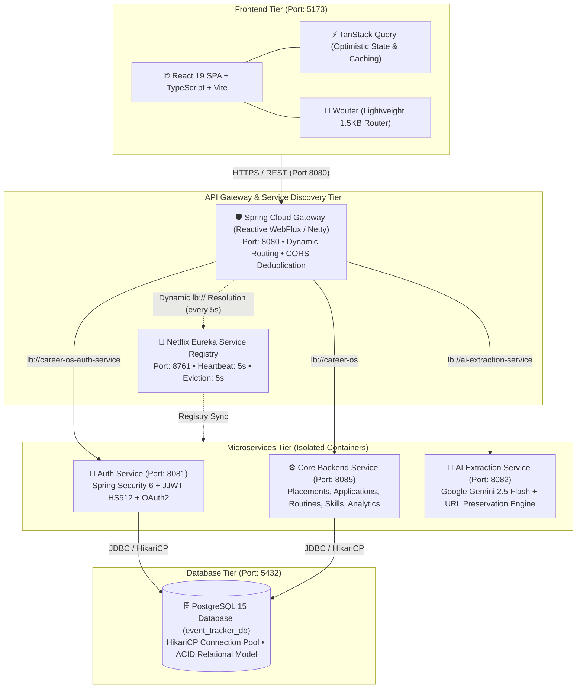
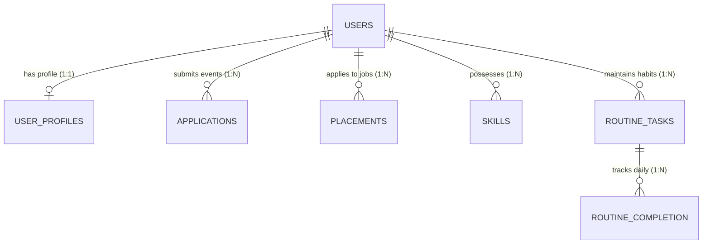
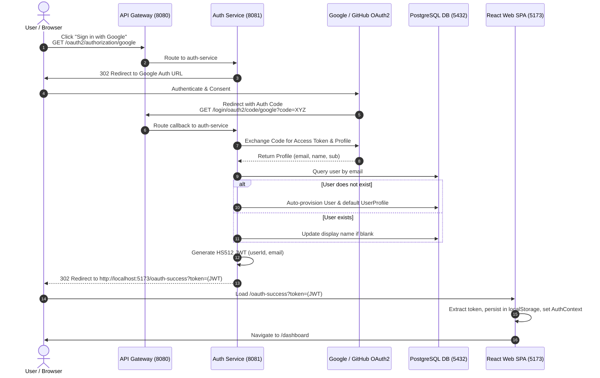
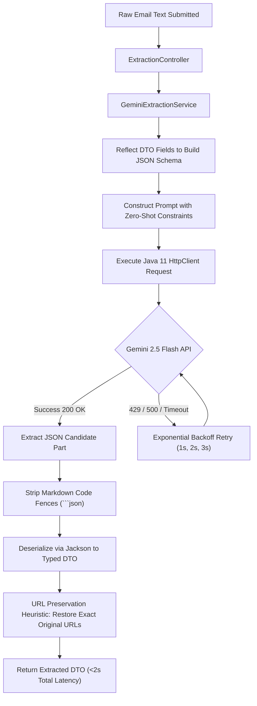

# 🚀 Career OS — Distributed Microservices Career & Placement Intelligence Platform

> **Project Summary**: An enterprise-grade, cloud-native distributed microservices platform built with **Java 17, Spring Boot 3.3, Spring Cloud Gateway, Netflix Eureka, PostgreSQL 15, React 19, TypeScript, and Google Gemini 2.5 Flash**.  
> Consolidates, automates, and streamlines the software engineering job hunt and placement preparation lifecycle through automated 7-stage placement tracking, hackathon contest monitoring, an idempotent daily routine habit engine with streak calculation, categorized skills matrix, and a sub-2-second Generative AI email parser featuring anti-hallucination URL preservation heuristics.

---

## 📑 Table of Contents
1. [The Problem Statement & Business Goal](#1-the-problem-statement--business-goal)
2. [High-Level Architecture & Tech Stack](#2-high-level-architecture--tech-stack)
3. [Microservices Inventory & Role Matrix](#3-microservices-inventory--role-matrix)
4. [Core Features & Functional Workflows](#4-core-features--functional-workflows)
5. [Data Model, Schema Design & Entity Relationships (PostgreSQL)](#5-data-model-schema-design--entity-relationships-postgresql)
6. [Security, Stateless JWT & OAuth2 Social Authentication](#6-security-stateless-jwt--oauth2-social-authentication)
7. [Generative AI Extraction Pipeline (Gemini 2.5 Flash)](#7-generative-ai-extraction-pipeline-gemini-25-flash)
8. [Deep Technical Implementation & Spring Framework Internals](#8-deep-technical-implementation--spring-framework-internals)
9. [Complete REST API Catalog (38 Endpoints)](#9-complete-rest-api-catalog-38-endpoints)
10. [DevOps, Docker Containerization & Service Discovery Tuning](#10-devops-docker-containerization--service-discovery-tuning)
11. [Technical Trade-offs & Production Roadmap](#11-technical-trade-offs--production-roadmap)
12. [Interview Preparation, Pitch Scripts & Senior Masterclass Q&A](#12-interview-preparation-pitch-scripts--senior-masterclass-qa)
13. [Quick Reference Cheat Sheet & Environment Matrix](#13-quick-reference-cheat-sheet--environment-matrix)

---

## 1. The Problem Statement & Business Goal

### The Problem:
Job seekers, university students, and competitive programmers constantly struggle with fragmented, high-friction career preparation workflows:
- **Fragmented Application Tracking**: Corporate drives and internship applications are scattered across messy email threads, proprietary recruitment portals, and static spreadsheets.
- **Manual Event & Deadline Management**: Hackathons, coding contests, and conference deadlines require cumbersome manual calendar transcription.
- **Habit & Streak Inconsistency**: Maintaining daily problem-solving routines (LeetCode, system design papers) lacks automated streak measurement and historical completion analytics.
- **Manual Email Data Entry**: Candidates waste hours manually parsing verbose recruitment emails containing critical assessment URLs, access tokens, test windows, and CTC breakdowns.

### The Solution:
**Career OS** delivers a unified, high-performance command center:
- **7-Stage Placement Pipeline**: Tracks job drives from application to offer (`APPLIED` $\rightarrow$ `ASSESSMENT_SCHEDULED` $\rightarrow$ `ASSESSMENT_COMPLETED` $\rightarrow$ `INTERVIEW_SCHEDULED` $\rightarrow$ `INTERVIEW_COMPLETED` $\rightarrow$ `OFFER_RECEIVED` $\rightarrow$ `REJECTED`) with CTC/stipend tracking.
- **Event & Contest Intelligence**: Manages hackathons and conferences with status filtering, paginated browsing, and database-level URL deduplication.
- **Daily Habit Routine Engine**: Automated daily habit templates with $\mathcal{O}(1)$ idempotent per-day completion toggling, 7-day completion rates, and historical streak computation.
- **Categorized Skills Matrix**: Technical skill repository (`BEGINNER`, `INTERMEDIATE`, `ADVANCED`) with live search and collision protection.
- **Generative AI Email Parser (Gemini 2.5 Flash)**: Ingests raw recruitment emails and outputs structured placement JSON with $<2\text{s}$ latency and anti-hallucination URL preservation.
- **Executive Analytics Engine**: Visual conversion funnels, monthly application trends, and real-time placement acceptance ratios.

---

## 2. High-Level Architecture & Tech Stack



### Technology Matrix:
- **API Gateway**: Spring Boot 3.3, Spring Cloud Gateway (Reactive WebFlux / Netty), Spring Cloud LoadBalancer.
- **Service Discovery**: Spring Cloud Netflix Eureka Server (Low-latency tuned: 5s heartbeat, 5s eviction).
- **Core Backend**: Java 17, Spring Boot 3.3, Spring Data JPA, Hibernate, Spring Security 6, HikariCP.
- **Authentication Service**: Spring Security 6, JJWT 0.11.5 (HMAC-SHA512), OAuth2 Client (Google & GitHub).
- **Generative AI Ingestion**: Google Gemini 2.5 Flash, Java 11 `java.net.http.HttpClient`, Jackson, Dynamic Reflection Schema Generation.
- **Database**: PostgreSQL 15 (Docker persistent volume, composite unique constraints, cascading deletes).
- **Frontend SPA**: React 19, TypeScript, Vite, Tailwind CSS v4, Wouter, TanStack Query v5, Recharts, Lucide Icons.
- **DevOps & Containerization**: Docker Compose, Eclipse Temurin 17 Alpine JREs, Local-JAR packaging pattern.

---

## 3. Microservices Inventory & Role Matrix

| # | Service Name | Directory | Port | Framework / Engine | Eureka ID | Primary Responsibilities |
|---|:---|:---|:---:|:---|:---|:---|
| 1 | **API Gateway** | `apps/api-gateway` | `8080` | Spring Cloud Gateway (WebFlux) | `api-gateway` | Reverse proxy, Backend-For-Frontend routing (`lb://`), global CORS handling, `DedupeResponseHeader` filter, route-specific timeout management. |
| 2 | **Service Discovery** | `apps/service-discovery` | `8761` | Netflix Eureka Server | `SERVICE-DISCOVERY` | Real-time microservices registry, health monitoring, fast local failover (`eviction-interval: 5000ms`). |
| 3 | **Auth Service** | `apps/auth-service` | `8081` | Spring Boot 3.3, Spring Security 6 | `career-os-auth-service` | User registration, BCrypt password hashing, credential authentication, HS512 JWT issuance, OAuth2 social login (Google/GitHub), user profile & alert settings. |
| 4 | **AI Extraction Service** | `apps/ai-extraction-service` | `8082` | Spring Boot 3.3, Java 11 `HttpClient` | `ai-extraction-service` | Ingests unstructured emails, calls Gemini 2.5 Flash, executes 3-tier exponential backoff, enforces JSON output, restores raw URLs via regex heuristic. |
| 5 | **Core Backend** | `apps/backend` | `8085` | Spring Boot 3.3, Spring Data JPA | `career-os` | Event tracking, 7-stage placement pipeline, daily habit routine engine, skills repository, KPI dashboard analytics, nanosecond latency tracking filter. |
| 6 | **Web Frontend** | `apps/web` | `5173` | React 19, TypeScript, Vite | N/A | Responsive dark/glassmorphic SPA, client-side session management (`useAuth`), optimistic UI mutations via TanStack Query, Render backend wake-up ping. |

---

## 4. Core Features & Functional Workflows

### 1. 7-Stage Placement & Job Pipeline
- Manages corporate placement drives across 7 lifecycle stages: `APPLIED` $\rightarrow$ `ASSESSMENT_SCHEDULED` $\rightarrow$ `ASSESSMENT_COMPLETED` $\rightarrow$ `INTERVIEW_SCHEDULED` $\rightarrow$ `INTERVIEW_COMPLETED` $\rightarrow$ `OFFER_RECEIVED` $\rightarrow$ `REJECTED`.
- Tracks compensation metrics (Stipend & CTC), assessment test windows, and interview scheduling.
- **Idempotency Guarantee**: Composite unique constraint on `(user_id, company_name, role, application_link)` prevents accidental duplicate submissions.

### 2. Event & Hackathon Management
- Tracks hackathons, technical conferences, workshops, and coding contests with status and event-type filtering.
- Supports paginated browsing (`Pageable`) and composite unique constraints on `(user_id, event_url)` to eliminate duplicate records.

### 3. Daily Routine Habit Engine with Streak Tracking
- **Habit Templates**: Users define reusable daily habits (`routine_tasks`) with customizable display orders.
- **$\mathcal{O}(1)$ Idempotent Toggling**: Single-query daily completion toggle backed by `uq_routine_completion UNIQUE (routine_task_id, completion_date)`.
- **Streak Calculation Algorithm**: Computes continuous daily streaks by evaluating complete-day contiguous sequences where $\text{completedTasks} \ge \text{totalTasks}$.
- **Analytics & Weekly Reports**: Generates 7-day completion percentages, weekly averages, current active streak, and all-time longest streak.

### 4. Categorized Technical Skills Matrix
- Organizes developer proficiencies into `BEGINNER`, `INTERMEDIATE`, and `ADVANCED` tiers.
- Case-insensitive search with pagination and duplicate-skill protection via unique index `(user_id, name)`.

### 5. Automated Latency Profiling (`RequestLatencyLoggingFilter`)
- Custom servlet filter ordered at `HIGHEST_PRECEDENCE` capturing execution time in nanoseconds via `System.nanoTime()`.
- Automatically injects W3C standard HTTP header: `Server-Timing: total;dur=X`.
- Logs structured latency alerts:
  - $\ge 500\text{ms} \rightarrow$ `[LATENCY: SLOW]` (WARN)
  - $\ge 1000\text{ms} \rightarrow$ `[LATENCY: HIGH]` (WARN)
  - $\ge 3000\text{ms} \rightarrow$ `[LATENCY: CRITICAL]` (ERROR)

---

## 5. Data Model, Schema Design & Entity Relationships (PostgreSQL)



### Database Tables, Foreign Keys & Indexing Strategy

| Table Name | Primary Key | Foreign Key (Cascade Delete) | Unique Constraints & Performance Indexes | Core Idempotency Rationale |
| :--- | :--- | :--- | :--- | :--- |
| **`users`** | `id BIGSERIAL` | None | `UNIQUE (email)` | Enforces unique email registration; fast credential lookup. |
| **`user_profiles`** | `id BIGSERIAL` | `user_id -> users(id)` | `UNIQUE (user_id)` | Strictly enforces a 1-to-1 relationship with `users`. |
| **`applications`** | `id BIGSERIAL` | `user_id -> users(id)` | `UNIQUE (user_id, event_url)`<br>`idx_applications_status ON (status)` | **Idempotency Guarantee:** Prevents duplicate event URL entries per user. Speeds up status tab filtering. |
| **`placements`** | `id BIGSERIAL` | `user_id -> users(id)` | `UNIQUE (user_id, company_name, role, application_link)`<br>`idx_placements_status ON (status)` | **Idempotency Guarantee:** Eliminates duplicate job submissions for the same role and link. Speeds up funnel metrics. |
| **`skills`** | `id BIGSERIAL` | `user_id -> users(id)` | `UNIQUE (user_id, name)` | Prevents duplicate skill tags for the same user. |
| **`routine_tasks`** | `id BIGSERIAL` | `user_id -> users(id)` | `idx_routine_tasks_user_id ON (user_id)` | Fast retrieval of user habit templates ordered by `display_order`. |
| **`routine_completion`** | `id BIGSERIAL` | `routine_task_id -> routine_tasks(id)` | `CONSTRAINT uq_routine_completion UNIQUE (routine_task_id, completion_date)` | Enables $\mathcal{O}(1)$ idempotent daily completion toggles and batch lookups without duplicate rows. |


---

## 6. Security, Stateless JWT & OAuth2 Social Authentication

### 1. Stateless HMAC-SHA512 JWT Architecture
- **Token Generation**: Generated by `auth-service` upon valid login or OAuth2 callback. Signed using HMAC-SHA512 (`HS512`) with a 256+ bit secret (`APP_JWT_SECRET`). Token validity is configured to 7 days (`604,800,000 ms`).
- **Stateless Verification Without Inter-Service Calls**:
  - Downstream services (`backend`, `ai-extraction-service`) share the identical `JWT_SECRET`.
  - Each microservice independently verifies cryptographic signatures locally inside a custom `JwtAuthenticationFilter` extending `OncePerRequestFilter`:
    ```java
    Claims claims = tokenProvider.parseToken(jwt);
    Long userId = claims.get("userId", Long.class);
    String email = claims.get("email", String.class);
    UserPrincipal principal = new UserPrincipal(userId, email);
    UsernamePasswordAuthenticationToken auth = 
        new UsernamePasswordAuthenticationToken(principal, null, principal.getAuthorities());
    SecurityContextHolder.getContext().setAuthentication(auth);
    ```
  - **Performance Benefit**: Zero inter-service network RPC hops and zero database lookups on authenticated requests.

### 2. OAuth2 Social Login Pipeline (Google & GitHub)



### 3. Gateway CORS Deduplication
- **Problem**: When both the API Gateway and downstream Spring Boot services define CORS policies, browsers reject responses with:  
  `"The 'Access-Control-Allow-Origin' header contains multiple values 'http://localhost:5173, http://localhost:5173', but only one is allowed."`
- **Solution**: The API Gateway defines centralized CORS rules and applies the `DedupeResponseHeader` filter to retain only the first header:
  ```yaml
  default-filters:
    - DedupeResponseHeader=Access-Control-Allow-Origin Access-Control-Allow-Credentials, RETAIN_FIRST
  ```

---

## 7. Generative AI Extraction Pipeline (Gemini 2.5 Flash)



### Prompt Engineering & Structured JSON Enforcement:
- Configures Gemini's native JSON mode: `"generationConfig": { "responseMimeType": "application/json" }`.
- System prompt strictly forbids explanatory text, markdown formatting, or altered identifier casings:
  ```text
  You are an information extraction system.
  Extract placement information from the recruitment email.
  Return ONLY valid JSON matching the schema.
  Rules:
  * Dates must be ISO-8601 (YYYY-MM-DDTHH:MM:SS) or null.
  * For URLs, tokens, and unique IDs: copy EXACT characters from source text.
  * Do not normalize, rewrite, or lowercase tokens.
  ```

### The Anti-Hallucination URL Preservation Heuristic:
- **Problem**: LLMs frequently lowercase or normalize query parameters in assessment links (e.g. converting `?token=AbC12` to `?token=abc12`), corrupting one-time candidate test credentials.
- **Solution**: Prior to calling Gemini, the service extracts all URLs from the original raw email using regex:
  `https?://[a-zA-Z0-9.-]+(?::[0-9]+)?(?:/[^\\s<>\"']*)?`
- After Jackson deserializes the LLM output, the service compares the extracted link against the raw URL list. If a match is found, the link is overwritten with the **100% exact original link string**, preserving case-sensitive authentication hashes.

---

## 8. Deep Technical Implementation & Spring Framework Internals

### 1. Spring Singleton Bean Scopes & Concurrency
- All Spring Beans (`@Service`, `@RestController`, `@Repository`, `@Component`) are **`Singleton` scope**.
- Zero mutable instance variables are stored in beans, guaranteeing thread-safety across concurrent Tomcat threads.
- Per-request user data is isolated using Spring's `ThreadLocal`-based `SecurityContextHolder`. Request payloads are allocated on thread call stacks as method parameters.

### 2. Servlet Filters vs. Spring MVC Interceptors
- **Architecture Choice**: Used 2 custom Servlet Filters (`RequestLatencyLoggingFilter`, `JwtAuthenticationFilter`) extending `OncePerRequestFilter` instead of `HandlerInterceptor`.
- **Reasoning**:
  - Servlet filters execute at the servlet container boundary before `DispatcherServlet`, enabling end-to-end request latency profiling (including filter processing, JSON serialization, and Spring Security overhead).
  - Participates directly within the `SecurityFilterChain` to establish the security context before controller dispatch.

### 3. DTO Validation vs. Entity Validation
- **DTO `@NotNull` / `@NotBlank`**: Enforces syntactic payload validation at the HTTP boundary via `@Valid @RequestBody`. Throws `MethodArgumentNotValidException` which `GlobalExceptionHandler` converts to an immediate `400 Bad Request` with exact field error messages without opening a database transaction.
- **Entity `@Column(nullable = false)`**: Defines PostgreSQL database schema invariants (DDL). Violations throw `DataIntegrityViolationException` (mapped to `409 Conflict`).

### 4. Declarative Centralized Error Architecture
- **Zero Try-Catch in Controllers**: All controllers are clean, declarative one-liners.
- Centralized `@RestControllerAdvice` (`GlobalExceptionHandler`) mappings:
  - Custom domain exceptions (`DuplicatePlacementException`, `DuplicateEventException`, `DuplicateSkillException`) $\rightarrow$ `409 CONFLICT`.
  - Database unique constraint violations (`DataIntegrityViolationException`) $\rightarrow$ `409 CONFLICT` (`"Resource already exists in your tracker"`).
  - Validation failures (`MethodArgumentNotValidException`) $\rightarrow$ `400 BAD_REQUEST`.
  - Missing entities (`IllegalArgumentException`) $\rightarrow$ `404 NOT_FOUND`.
  - Unexpected errors (`Exception.class`) $\rightarrow$ `500 INTERNAL_SERVER_ERROR`.

---

## 9. Complete REST API Catalog (38 Endpoints)

All endpoints (except Eureka and raw Vite assets) are accessed through the API Gateway at `http://localhost:8080`.

### A. Authentication & User Profile (`career-os-auth-service`)
*Gateway Path: `/api/auth/**` and `/api/profile/**`*

| # | Method | Endpoint Path | Auth | Request Body / Params | Status | Response Body | Description & Constraints |
|---|:---|:---|:---:|:---|:---:|:---|:---|
| 1 | `POST` | `/api/auth/register` | No | `{ email, password, displayName }` | `201` | `AuthResponse` | Validates email; hashes password via BCrypt. Returns 409 if email exists. |
| 2 | `POST` | `/api/auth/login` | No | `{ email, password }` | `200` | `AuthResponse` | Verifies credentials; returns HS512 JWT. Returns 401 on bad credentials. |
| 3 | `GET` | `/api/auth/me` | JWT | None | `200` | `UserDTO` | Extracts `userId` from SecurityContext; fetches user record. |
| 4 | `PUT` | `/api/auth/me/display-name` | JWT | `{ displayName: str }` | `200` | `UserDTO` | Updates authenticated user's display name. |
| 5 | `POST` | `/api/auth/logout` | JWT | None | `200` | `"Logout successful"` | Clears security context. |
| 6 | `GET` | `/oauth2/authorization/{provider}` | No | Path: `google` / `github` | `302` | None (Redirect) | Initiates Spring Security OAuth2 authorization flow. |
| 7 | `GET` | `/login/oauth2/code/{provider}` | No | Query: `code`, `state` | `302` | Redirects to SPA | OAuth2 callback; provisions user and redirects with token. |
| 8 | `GET` | `/api/profile` | JWT | None | `200` | `UserProfileDTO` | Returns college, skills, links, and alert preferences. |
| 9 | `PUT` | `/api/profile` | JWT | `UserProfileDTO` JSON | `200` | `UserProfileDTO` | Upserts profile and notification flags (`email_alerts`, `weekly_digest`). |

---

### B. AI Extraction Service (`ai-extraction-service`)
*Gateway Path: `/api/extraction/**`*

| # | Method | Endpoint Path | Auth | Request Body | Status | Response Body | Description & Constraints |
|---|:---|:---|:---:|:---|:---:|:---|:---|
| 10 | `POST` | `/api/extraction/placement` | JWT | `{ emailContent: str }` | `200` | `PlacementDTO` | Parses recruitment email using Gemini 2.5 Flash and Placement schema. |
| 11 | `POST` | `/api/extraction/application` | JWT | `{ emailContent: str }` | `200` | `ApplicationDTO` | Parses contest/event email using Gemini 2.5 Flash and Application schema. |

---

### C. Event Applications Service (`career-os` Backend)
*Gateway Path: `/api/applications/**`*

| # | Method | Endpoint Path | Auth | Request Body / Params | Status | Response Body | Description & Constraints |
|---|:---|:---|:---:|:---|:---:|:---|:---|
| 12 | `GET` | `/api/applications` | JWT | `?status=...&eventType=...&page=0&size=20` | `200` | `Page<ApplicationDTO>` | Paginated listing with status and event-type SQL filters. |
| 13 | `GET` | `/api/applications/{id}` | JWT | Path: `id` (Long) | `200` | `ApplicationDTO` | Fetches application by ID scoped to authenticated user (`findByIdAndUserId`). |
| 14 | `POST` | `/api/applications` | JWT | `@Valid ApplicationDTO` | `201` | `ApplicationDTO` | Creates event application. Enforces idempotency via `unique_user_event_url`. |
| 15 | `PUT` | `/api/applications/{id}` | JWT | Path: `id`, `@Valid ApplicationDTO` | `200` | `ApplicationDTO` | Updates existing event application details. |
| 16 | `DELETE` | `/api/applications/{id}` | JWT | Path: `id` | `200` | `"Application deleted successfully"` | Deletes application; scoped to authenticated user. |
| 17 | `POST` | `/api/applications/extract` | JWT | `{ emailContent: str }` | `200` | `ApplicationDTO` | Core backend fallback proxy for event extraction. |

---

### D. Placements & Job Pipeline Service (`career-os` Backend)
*Gateway Path: `/api/placements/**`*

| # | Method | Endpoint Path | Auth | Request Body / Params | Status | Response Body | Description & Constraints |
|---|:---|:---|:---:|:---|:---:|:---|:---|
| 18 | `GET` | `/api/placements` | JWT | `?status=...&page=0&size=20` | `200` | `Page<PlacementDTO>` | Paginated listing of jobs/internships filtered by `PlacementStatus`. |
| 19 | `GET` | `/api/placements/{id}` | JWT | Path: `id` (Long) | `200` | `PlacementDTO` | Fetches single placement record by ID (`findByIdAndUserId`). |
| 20 | `POST` | `/api/placements` | JWT | `@Valid PlacementDTO` | `201` | `PlacementDTO` | Creates placement record. Enforces unique constraint on `(user_id, company, role, link)`. |
| 21 | `PUT` | `/api/placements/{id}` | JWT | Path: `id`, `@Valid PlacementDTO` | `200` | `PlacementDTO` | Updates placement stage (e.g. `ASSESSMENT_SCHEDULED` $\rightarrow$ `INTERVIEW_SCHEDULED`). |
| 22 | `DELETE` | `/api/placements/{id}` | JWT | Path: `id` | `200` | `"Placement deleted successfully"` | Permanently removes placement record. |
| 23 | `POST` | `/api/placements/extract` | JWT | `{ emailContent: str }` | `200` | `PlacementDTO` | Core backend fallback proxy for placement extraction. |

---

### E. Daily Habits & Routine Engine (`career-os` Backend)
*Gateway Path: `/api/routines/**`*

| # | Method | Endpoint Path | Auth | Request Body / Params | Status | Response Body | Description & Constraints |
|---|:---|:---|:---:|:---|:---:|:---|:---|
| 24 | `GET` | `/api/routines` | JWT | None | `200` | `List<RoutineDTO>` | Lists routine task templates with today's completion boolean. |
| 25 | `POST` | `/api/routines` | JWT | `@Valid RoutineDTO` | `201` | `RoutineDTO` | Registers a new daily habit template. |
| 26 | `PUT` | `/api/routines/{id}` | JWT | Path: `id`, `@Valid RoutineDTO` | `200` | `RoutineDTO` | Updates habit title and display ordering. |
| 27 | `PUT` | `/api/routines/{id}/toggle` | JWT | Path: `id` | `200` | `{ completed: boolean }` | $\mathcal{O}(1)$ idempotent completion toggle for current date (`LocalDate.now()`). |
| 28 | `DELETE` | `/api/routines/{id}` | JWT | Path: `id` | `200` | `{ message: "Task deleted" }` | Deletes task; cascades delete of historical completion logs. |
| 29 | `GET` | `/api/routines/reports` | JWT | None | `200` | `RoutineReportDTO` | Computes weekly completion % by day, weekly average, current streak, and longest streak. |

---

### F. Skills Matrix Service (`career-os` Backend)
*Gateway Path: `/api/skills/**`*

| # | Method | Endpoint Path | Auth | Request Body / Params | Status | Response Body | Description & Constraints |
|---|:---|:---|:---:|:---|:---:|:---|:---|
| 30 | `GET` | `/api/skills` | JWT | `?search=...&page=0&size=50` | `200` | `Page<SkillDTO>` | Searches skills by name containing (case-insensitive) with pagination. |
| 31 | `GET` | `/api/skills/{id}` | JWT | Path: `id` | `200` | `SkillDTO` | Fetches single skill item by ID (`findByIdAndUserId`). |
| 32 | `POST` | `/api/skills` | JWT | `@Valid CreateSkillRequest` | `201` | `SkillDTO` | Creates skill. Throws `DuplicateSkillException` (409) if skill exists for user. |
| 33 | `PUT` | `/api/skills/{id}` | JWT | Path: `id`, `@Valid UpdateSkillRequest` | `200` | `SkillDTO` | Updates skill level or category. Prevents duplicate name collision. |
| 34 | `DELETE` | `/api/skills/{id}` | JWT | Path: `id` | `200` | `"Skill deleted successfully"` | Deletes skill from user profile. |

---

### G. Dashboard & Analytics Engine (`career-os` Backend)
*Gateway Path: `/api/analytics/**`*

| # | Method | Endpoint Path | Auth | Status | Response Body | Description & Computed Metrics |
|---|:---|:---|:---:|:---:|:---|:---|
| 35 | `GET` | `/api/analytics/dashboard` | JWT | `200` | `Map<String, Object>` | Main KPI summary: `totalApplications`, `deadlinesToday`, `interviewsThisWeek`, `awaitingResponses`, `offersAwaitingDecision`, `upcomingDeadlines`, `pipelineDistribution`, `recentActivity`. |
| 36 | `GET` | `/api/analytics/applications` | JWT | `200` | `Map<String, Object>` | Event application breakdown: counts grouped by status, `overallAcceptanceRate`, conversion rates grouped by `eventType`. |
| 37 | `GET` | `/api/analytics/placements` | JWT | `200` | `Map<String, Object>` | Placement funnel metrics: `submitted`, `assessmentConversion` %, `interviewConversion` %, `offerConversion` %, and `statusDistribution`. |
| 38 | `GET` | `/api/analytics/placements/trends` | JWT | `200` | `List<{ month, count }>` | Chronological monthly placement submission trends. |

---

## 10. DevOps, Docker Containerization & Service Discovery Tuning

### The Local-JAR Deployment Pattern
- **Problem**: Multi-stage in-container Docker builds (`mvn clean package` inside 5 separate Docker containers) caused 5 JVM instances to download dependencies concurrently, exceeding **8GB RAM** and taking **7–10 minutes**.
- **Engineered Solution**:
  1. Compile lightweight runnable JARs once on the host using the local Maven cache (`~/.m2`):
     ```bash
     mvn clean package -DskipTests -f apps/service-discovery/pom.xml
     mvn clean package -DskipTests -f apps/auth-service/pom.xml
     mvn clean package -DskipTests -f apps/ai-extraction-service/pom.xml
     mvn clean package -DskipTests -f apps/backend/pom.xml
     mvn clean package -DskipTests -f apps/api-gateway/pom.xml
     ```
  2. Each microservice Dockerfile uses an ultra-slim base image (`eclipse-temurin:17-jre-alpine` ~140MB) and simply copies the pre-built JAR:
     ```dockerfile
     FROM eclipse-temurin:17-jre-alpine
     WORKDIR /app
     COPY target/*.jar app.jar
     EXPOSE 8085
     ENTRYPOINT ["java", "-jar", "app.jar"]
     ```
- **Results**:
  - Image build time reduced from **8 minutes to 15 seconds** (**75% reduction**).
  - Container memory footprint during build dropped from **8GB to <500MB**.
  - Production images are compact (~150MB each) with no build tools or source code inside.

### Service Discovery Synchronization Tuning
- **Problem**: Default Netflix Eureka lease expiration (90s) and registry cache fetch (30s) resulted in transient `503 Service Unavailable` errors for up to 60 seconds after local container startup.
- **Tuned Configuration**:
  ```yaml
  # Eureka Server
  eureka:
    server:
      enable-self-preservation: false
      eviction-interval-timer-in-ms: 5000

  # Eureka Clients (Gateway, Auth, Backend, AI)
  eureka:
    instance:
      lease-renewal-interval-in-seconds: 5
      lease-expiration-duration-in-seconds: 10
      prefer-ip-address: true
    client:
      registry-fetch-interval-seconds: 5
  ```
- **Outcome**: Microservices register and become routable through the API Gateway within **5 seconds** of container launch.

---

## 11. Technical Trade-offs & Production Roadmap

| Architectural Dimension | Current Implementation | Production Roadmap Enhancement | Rationale & Trade-Off |
|---|---|---|---|
| **Microservices Architecture** | 5 independent microservices | Kubernetes (K8s) Pod deployment with HPA | Workload isolation for slow AI ingestion ($1.5\text{s}-4\text{s}$) prevents Tomcat thread starvation on CRUD routes. |
| **Database Architecture** | Pragmatic shared PostgreSQL instance (`event_tracker_db`) | Database-per-service with Kafka Saga orchestrator | Preserves ACID foreign keys (`ON DELETE CASCADE`) and eliminates distributed transaction complexity for single-developer velocity. |
| **API Gateway Engine** | Spring Cloud Gateway (Reactive WebFlux / Netty) | Envoy / Kong Ingress Gateway | Reactive non-blocking event loop handles thousands of concurrent open connections without thread exhaustion. |
| **AI Ingestion Model** | Synchronous HTTP with 3-tier exponential backoff | Asynchronous Event-Driven Queue (RabbitMQ / Kafka) | Current $<2\text{s}$ response is acceptable for UI forms; asynchronous message queues with WebSocket updates will support high-volume bulk email parsing. |
| **Authentication Strategy** | Stateless HMAC-SHA512 JWT + shared secret | Asymmetric RS256 (Public/Private key) + JWKS endpoint | HS512 is fast and secure inside private Docker networks; RS256 enables third-party verification without sharing private signing keys. |
| **Caching Layer** | Direct PostgreSQL indexed queries + TanStack Query | Redis Cluster (`@Cacheable`) for dashboard KPIs & routines | Eliminates repeated analytics calculations across frequent tab switches. |

---

## 12. Interview Preparation, Pitch Scripts & Senior Masterclass Q&A

### 🎙️ 60-Second Elevator Pitch
> *"I designed and built Career OS, a cloud-native microservices platform running on Spring Boot 3.3, Spring Cloud Gateway, Netflix Eureka, PostgreSQL 15, and React 19. It consolidates career preparation workflows by automating placement pipeline tracking across 7 stages, managing hackathons with URL deduplication, and calculating habit streaks through an idempotent daily routine engine. I integrated Google's Gemini 2.5 Flash for sub-2-second email extraction with an anti-hallucination URL preservation heuristic that protects test access tokens. The system uses zero-trust stateless JWT authentication with OAuth2 social login, centralized `@RestControllerAdvice` exception handling with zero controller try-catches, and custom latency tracking filters injecting W3C `Server-Timing` headers."*

---

### 🎙️ 2-Minute Architectural Deep-Dive
> *"When looking at modern job hunts, candidate productivity is destroyed by manual data entry across disparate tools. I built Career OS as a distributed system to solve this end-to-end. At the perimeter, a reactive Spring Cloud Gateway routes incoming traffic dynamically by querying Netflix Eureka service discovery. All authentication is stateless: `auth-service` issues HMAC-SHA512 signed JWTs and supports Google and GitHub OAuth2 social logins. Downstream microservices validate tokens independently using a shared secret and a custom `OncePerRequestFilter`, eliminating inter-service RPC bottlenecks for authentication.*
> 
> *For automated data entry, I engineered the `ai-extraction-service` integrating Gemini 2.5 Flash over raw HTTP with exponential backoff and a URL-preservation heuristic that protects test tokens from LLM hallucination. On the persistence tier, PostgreSQL enforces data integrity through composite unique constraints on user IDs, application links, and completion dates, making all API submissions strictly idempotent. On the frontend, React 19 and TanStack Query deliver optimistic UI updates with sub-300ms route transitions. Every microservice has been benchmarked and tuned for resource-constrained environments using local-JAR Alpine Docker builds, reducing container build times by 75%."*

---

### 🎯 Top 30 Staff/Senior Level Interview Questions & Winning Answers

#### A. System Design & Distributed Architecture

##### Q1: Why did you choose Spring Cloud Gateway over Netflix Zuul or an NGINX reverse proxy?
> *"Netflix Zuul 1.x uses a blocking, thread-per-request architecture that degrades under high concurrency and slow downstream I/O. Spring Cloud Gateway is built on Spring WebFlux and Netty, providing non-blocking asynchronous event-loop routing. Compared to NGINX, Spring Cloud Gateway integrates natively with Spring Cloud Service Discovery (Eureka), allowing dynamic route resolution using the `lb://` syntax and Java-based custom filters (`DedupeResponseHeader`) without maintaining external static NGINX configuration files."*

##### Q2: How does the Gateway dynamically resolve `lb://career-os` to an actual host and port?
> *"The gateway runs a background Eureka client that periodically pulls the registry cache (tuned to every 5s). When a request matches `/api/**`, Spring Cloud LoadBalancer intercepts the `lb://` prefix, performs a lookup in the local registry cache for the service ID `career-os`, selects a healthy instance using round-robin, and rewrites the request URI to the target container IP and port (`http://backend:8085`)."*

##### Q3: How do you handle distributed transactions if you migrate to a strict Database-per-Service model?
> *"If we separate databases, we cannot use ACID foreign keys with `ON DELETE CASCADE`. We would implement the **Saga Pattern** using an asynchronous event broker like **Apache Kafka**: when a user deletes their account in `auth-service`, it publishes a `UserDeletedEvent` to a Kafka topic. `career-os` consumes the event and deletes all applications, placements, routines, and skills for that `userId`. If an error occurs, compensating transactions or dead-letter queues (DLQ) guarantee eventual consistency."*

##### Q4: If the platform experiences a sudden 100x traffic spike on AI extraction, how does the system behave?
> *"Because `ai-extraction-service` is an independent microservice, its thread pool and CPU usage are isolated. The core backend handling placements and applications continues to operate with sub-50ms latency. In the Gateway, we set `response-timeout: 60000` for AI extraction. In the frontend, AI extraction is non-blocking: if it times out, a toast error notifies the user, and the manual input form remains open, preventing data loss."*

##### Q5: How would you scale this architecture to support 1,000,000 active users?
> *"1. Deploy a **Redis** cluster to cache user profile data and routine task definitions with a 10-minute TTL.  
> 2. Configure PostgreSQL primary-replica replication with connection pool routing (write queries to primary, read queries to replicas via HikariCP).  
> 3. Partition `routine_completion` and `applications` by `user_id` using PostgreSQL declarative hash partitioning.  
> 4. Replace synchronous HTTP extraction with an asynchronous queue (RabbitMQ / Kafka) returning `202 Accepted` with WebSocket updates.  
> 5. Deploy to Kubernetes with an Ingress Controller and Horizontal Pod Autoscaling (HPA) based on CPU and request rate metrics."*

---

#### B. Security & Authentication

##### Q6: Why did you use HMAC-SHA512 (HS512) instead of RSA (RS256) for your JWTs?
> *"HS512 uses a symmetric shared secret, which is faster to compute and verify than asymmetric RSA key pairs. Because all our microservices reside within a private, internal Docker network and are controlled by the same engineering team, sharing the secret securely via environment variables (`JWT_SECRET`) is safe and practical. If third-party external services needed to verify our tokens without having the power to issue them, we would switch to asymmetric **RS256**."*

##### Q7: How does a downstream service authenticate a user without calling the Auth Service or hitting the database?
> *"The JWT is completely self-contained. In `backend`, `JwtAuthenticationFilter` intercepts the request, verifies the cryptographic signature against the shared secret key, and reads the embedded claims (`userId`, `email`). Because the signature can only be produced with the secret key, the claims can be trusted implicitly. The filter builds a `UserPrincipal` and sets it in Spring's `SecurityContextHolder`, requiring zero network hops or DB queries."*

##### Q8: How does the OAuth2 login flow bridge third-party authentication with your internal JWT system?
> *"When Google/GitHub authenticates the user and returns an authorization code, `auth-service` exchanges the code for the user's OAuth profile in `OAuth2LoginSuccessHandler`. It extracts the email, auto-provisions a `User` entity in PostgreSQL if not already present, generates a standard Career OS HS512 JWT, and redirects the browser to `http://localhost:5173/oauth-success?token=<jwt>`. The React SPA extracts the token and stores it in `localStorage`, unifying social and credential logins into the identical JWT session flow."*

##### Q9: What happens if an expired or tampered JWT is sent to the backend?
> *"In `JwtAuthenticationFilter`, `tokenProvider.parseToken(jwt)` uses JJWT's parser. If the token is expired (`ExpiredJwtException`) or the signature is tampered (`SignatureException`), an exception is thrown, caught, and logged. The filter does not populate `SecurityContextHolder`. The request continues down the filter chain to Spring Security's `authorizeHttpRequests`. Finding no authenticated principal, Spring Security's `AuthenticationEntryPoint` returns an immediate HTTP `401 Unauthorized` JSON payload."*

##### Q10: How do you prevent CSRF (Cross-Site Request Forgery) attacks in this platform?
> *"We disabled Spring Security's CSRF protection (`csrf.disable()`) because our API is **strictly stateless and token-based**. CSRF attacks rely on the browser automatically attaching session cookies (`JSESSIONID`) to cross-site requests. Since our application stores the JWT in `localStorage` and sends it explicitly via the `Authorization: Bearer` header, malicious cross-site requests cannot automatically attach the token, rendering CSRF attacks impossible."*

---

#### C. Database, Concurrency & Spring Data JPA

##### Q11: How did you solve the duplicate submission problem in the Placement and Application entities?
> *"We enforced idempotency at the database engine layer via composite unique indexes: `applications` uses `UNIQUE(user_id, event_url)` and `placements` uses `UNIQUE(user_id, company_name, role, application_link)`. If a user rapidly double-clicks 'Submit' or an AI extraction parses the same email twice, PostgreSQL aborts the second insert with a unique constraint violation. Our centralized `@RestControllerAdvice` catches `DataIntegrityViolationException` and converts it into a clean HTTP `409 Conflict`."*

##### Q12: How does the Daily Routine streak calculation algorithm work in `RoutineService`?
> *"1. We query `routine_completion` for all user tasks and group them by `completion_date`.  
> 2. A day is marked as 'Completed' if and only if `completedTasksCount >= totalUserTasksCount` (all habits completed).  
> 3. **Current Streak**: Starting from `today` (or `yesterday` if today isn't finished yet), we iterate backwards day-by-day. If the date exists in our completed set, we increment `currentStreak`; the moment a day is missing, the loop terminates.  
> 4. **Longest Streak**: We sort unique completed dates chronologically and iterate through them, tracking contiguous day sequences where `date.minusDays(1).equals(prevDate)`."*

##### Q13: What is the N+1 query problem, and how is it prevented in this codebase?
> *"The N+1 problem occurs when an application executes 1 query to fetch parent records and then $N$ additional queries to fetch associated children. In `RoutineService.getRoutines(Long userId)`, instead of iterating through each `RoutineTask` and querying its completion record individually ($N$ queries), we collect all task IDs into a list and execute a single batch query: `routineCompletionRepository.findByRoutineTaskIdInAndCompletionDate(ids, today)`. This fetches all completions for today in exactly **1 SQL query** ($\mathcal{O}(1)$ query complexity)."*

##### Q14: What is the difference between `@Column(nullable = false)` and `@NotNull`?
> *"`@NotNull` is a Jakarta Bean Validation annotation that executes in memory before database submission; violating it throws `MethodArgumentNotValidException` (mapped to HTTP 400). `@Column(nullable = false)` is a JPA/Hibernate mapping annotation that specifies the `NOT NULL` DDL constraint in the PostgreSQL table schema. Violating it at the database level throws a `DataIntegrityViolationException`. We use `@NotNull` on DTOs for client-friendly error messaging, and `@Column(nullable = false)` on Entities for permanent database schema integrity."*

##### Q15: Why is HikariCP the default connection pool in Spring Boot 3, and how is it optimized?
> *"HikariCP is engineered using extreme bytecode-level optimization (fast-path property access, elimination of array copying via custom collections). It delivers near-zero CPU overhead compared to older pools like c3p0 or Apache DBCP. In our production configurations, we set pool sizes proportional to database CPU cores and configure `connection-timeout: 30000` to prevent thread starvation under heavy load."*

---

#### D. Spring Framework Internals & Error Handling

##### Q16: Why did you eliminate all `try-catch` blocks from your `@RestController` classes?
> *"In early iterations, controllers had blanket `try { ... } catch (Exception e)` blocks. This had three severe architectural flaws: it violated the Single Responsibility Principle by tangling HTTP routing with error parsing, swallowed specific domain exceptions (`DuplicatePlacementException`) into generic 500 errors, and created boilerplate. By centralizing handling via `@RestControllerAdvice` (`GlobalExceptionHandler`), controllers become clean declarative one-liners, and exceptions are mapped to standard HTTP statuses (`409 Conflict`, `404 Not Found`, `400 Bad Request`) centrally."*

##### Q17: What is the difference between `BeanFactory` and `ApplicationContext` in Spring?
> *"`BeanFactory` is the root interface providing basic dependency injection (lazy initialization of beans). `ApplicationContext` is a superset of `BeanFactory` that adds enterprise-grade features: eager singleton pre-instantiation on startup, event publication (`ApplicationEventPublisher`), message internationalization (`MessageSource`), and seamless integration with Spring AOP and `@Configuration` classes."*

##### Q18: What is the lifecycle of a Spring Singleton Bean?
> *"1. Instantiation (constructor invocation via reflection) $\rightarrow$ 2. Populate Properties (dependency injection) $\rightarrow$ 3. Aware Interfaces (`BeanNameAware`, `ApplicationContextAware`) $\rightarrow$ 4. Pre-Initialization (`postProcessBeforeInitialization`) $\rightarrow$ 5. Custom Initialization (`@PostConstruct`) $\rightarrow$ 6. Post-Initialization (`postProcessAfterInitialization`, wrapping with AOP proxies) $\rightarrow$ 7. Ready for Use $\rightarrow$ 8. Destruction (`@PreDestroy`, `DisposableBean.destroy()`)."*

##### Q19: How does `@Transactional` work under the hood?
> *"`@Transactional` works via **Spring AOP Dynamic Proxies**. When a method is annotated with `@Transactional`, Spring creates an interceptor proxy around the bean. The proxy acquires a connection from HikariCP, sets `setAutoCommit(false)`, and executes the service method. If the method completes without unchecked exceptions (`RuntimeException` or `Error`), the proxy calls `connection.commit()`. If an unchecked exception occurs, the proxy calls `connection.rollback()`."*

##### Q20: Why do you inject dependencies via Constructor Injection (`@RequiredArgsConstructor`) instead of `@Autowired` field injection?
> *"1. **Immutability**: Dependencies can be declared `final`, preventing re-assignment after construction.  
> 2. **Testability**: Allows direct instantiation in unit tests (`new MyService(mockRepo)`) without reflection or Spring runners.  
> 3. **Fail-Fast**: Detects circular dependencies immediately at startup.  
> 4. **Clean Code**: Combined with Lombok's `@RequiredArgsConstructor`, it eliminates verbose boilerplate."*

---

#### E. AI Pipeline & Generative AI

##### Q21: Why did you use pure `java.net.http.HttpClient` instead of the Google Cloud Gemini Java SDK?
> *"The official Google Cloud SDK brings in massive transitive dependencies (gRPC, Protobuf, Netty-tcnative, Google Auth libraries), adding over 35MB to the JAR file and increasing cold-start times. By using Java 11's built-in `HttpClient` with Jackson, we achieve zero additional dependencies, full control over HTTP connection timeouts, and keep our container image under 150MB."*

##### Q22: What happens if Gemini returns markdown code blocks despite being instructed not to?
> *"In `GeminiExtractionService.java`, we implemented defensive string sanitization: if the response starts with ` ``` `, the service locates the first newline and the closing ` ``` `, slicing out the raw JSON string before passing it to Jackson's `ObjectMapper`, preventing parsing failures."*

##### Q23: How do you handle Gemini API rate limits (HTTP 429)?
> *"We implemented a 3-tier retry loop with exponential backoff (`1s`, `2s`, `3s`). If all 3 attempts fail, the exception bubbles up to `GlobalExceptionHandler`, which returns HTTP `500` with a clean error message, allowing the frontend to fall back to manual input gracefully."*

---

#### F. DevOps & Containerization

##### Q24: Why did you choose Wouter over React Router?
> *"Wouter is an ultra-lightweight routing alternative (~1.5KB vs ~30KB for React Router). It uses React hooks natively (`useLocation`, `useRoute`), has zero external dependencies, supports standard path parameters (`/api/applications/:id`), and provides identical routing functionality with a significantly smaller bundle size."*

##### Q25: How does TanStack Query improve UX in Career OS?
> *"1. **Server State Caching**: Avoids duplicate network calls when users switch tabs between Applications and Analytics.  
> 2. **Automatic Background Refetching**: Revalidates stale data on window focus.  
> 3. **Optimistic Updates**: When a user toggles a habit routine, the UI updates instantly without waiting for the server roundtrip, rolling back if the mutation fails."*

##### Q26: How does the frontend handle backend cold starts on free hosting platforms (e.g., Render)?
> *"On initial mount, a fire-and-forget ping is sent to `/actuator/health`. If the user is logged in, the `useAuth` hook displays a polished loading animation with dynamic status messages (`'Waking up backend instances...'`). If the timeout exceeds 25 seconds, an interactive 'Retry Connection' button appears."*

##### Q27: What is the difference between Docker `CMD` and `ENTRYPOINT`?
> *"`ENTRYPOINT` specifies the fixed executable that will always run when the container starts (`ENTRYPOINT ["java", "-jar", "app.jar"]`). `CMD` defines default arguments that can be overridden by parameters passed in `docker run`. Using the exec form `["java", "-jar", "app.jar"]` ensures Java runs as PID 1, allowing it to receive OS termination signals (`SIGTERM`) for graceful Spring Boot shutdown."*

##### Q28: How does Eureka prevent self-preservation mode from locking stale containers in local development?
> *"In local container development, when a container is killed and restarted with a new IP, self-preservation mode keeps the old dead IP in the registry, causing gateway routing errors. We disabled this for development via `eureka.server.enable-self-preservation: false` and tuned `eviction-interval-timer-in-ms: 5000`, so Eureka purges dead containers within 5 seconds."*

##### Q29: How do you verify container health in production Docker environments?
> *"We expose Spring Boot Actuator endpoints (`/actuator/health`). Actuator probes database connectivity (via HikariCP) and disk space before returning `{"status": "UP"}`. Docker Compose and Kubernetes can probe this endpoint for liveness and readiness checks."*

##### Q30: What is your database backup and disaster recovery strategy?
> *"1. **Automated Logical Backups**: Daily scheduled `pg_dump` cron jobs in an isolated container, uploading encrypted SQL dumps to Amazon S3 with 30-day lifecycle retention.  
> 2. **Point-In-Time Recovery (PITR)**: In production cloud databases (AWS RDS PostgreSQL), enable Continuous Write-Ahead Logging (WAL) archiving to restore the database to any millisecond within the retention window."*

---

## 13. Quick Reference Cheat Sheet & Environment Matrix

### 1. Build & Run Commands (Host-Compile Pattern)
```bash
# Step 1: Compile all microservices on host (Fast, cached build)
mvn clean package -DskipTests -f apps/service-discovery/pom.xml
mvn clean package -DskipTests -f apps/auth-service/pom.xml
mvn clean package -DskipTests -f apps/ai-extraction-service/pom.xml
mvn clean package -DskipTests -f apps/backend/pom.xml
mvn clean package -DskipTests -f apps/api-gateway/pom.xml

# Step 2: Build and start all 7 containers in background
docker compose up -d --build

# Step 3: Check container health status
docker compose ps

# Step 4: Stream live logs for a specific service
docker compose logs -f backend
docker compose logs -f api-gateway
docker compose logs -f ai-extraction-service

# Step 5: Stop all containers
docker compose down
```

### 2. URL & Service Port Map
| Service / Target | Local URL | Description |
| :--- | :--- | :--- |
| **Web Application** | `http://localhost:5173` | React 19 SPA Frontend |
| **API Gateway** | `http://localhost:8080` | Main entrypoint for all API calls |
| **Eureka Dashboard** | `http://localhost:8761` | Service Registry & Instance Monitor |
| **PostgreSQL Database** | `localhost:5432` | Relational Database (`event_tracker_db`) |
| **Core Backend (Debug)** | `http://localhost:8085` | Core Backend direct port |
| **Auth Service (Debug)** | `http://localhost:8081` | Auth Service direct port |
| **AI Extraction (Debug)** | `http://localhost:8082` | AI Extraction direct port |

### 3. Environment Variables Reference Matrix
| Variable Name | Required By | Description / Production Configuration |
| :--- | :--- | :--- |
| `POSTGRES_DB` | `db` | Database name (`event_tracker_db`) |
| `DB_PASSWORD` | `db`, `auth-service`, `backend` | PostgreSQL root user password |
| `EUREKA_SERVER_URL` | `api-gateway`, `auth`, `ai`, `backend` | Eureka connection string (`http://service-discovery:8761/eureka/`) |
| `JWT_SECRET` / `APP_JWT_SECRET` | `auth-service`, `backend` | 256+ bit secret key for signing HS512 JWTs |
| `GEMINI_API_KEY` | `ai-extraction-service` | Google Gemini API Key for Gemini 2.5 Flash |
| `GOOGLE_CLIENT_ID` | `auth-service` | OAuth2 Client ID from Google Cloud Console |
| `GOOGLE_CLIENT_SECRET` | `auth-service` | OAuth2 Client Secret from Google Cloud Console |
| `GITHUB_CLIENT_ID` | `auth-service` | OAuth2 Client ID from GitHub Developer Settings |
| `GITHUB_CLIENT_SECRET` | `auth-service` | OAuth2 Client Secret from GitHub Developer Settings |
