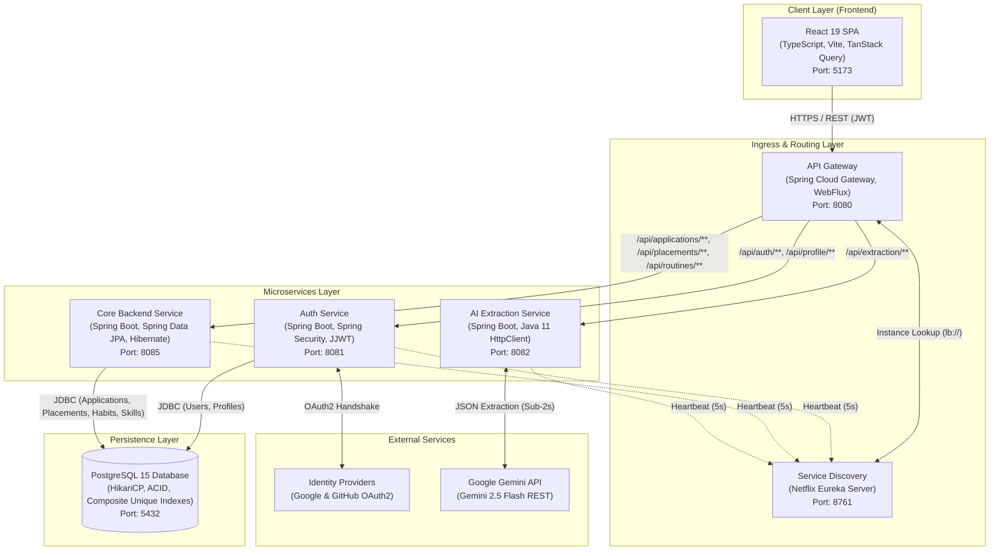
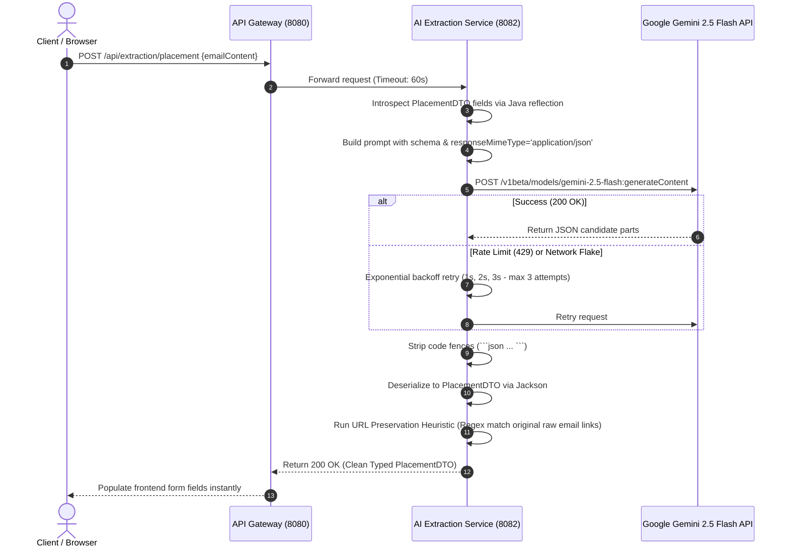
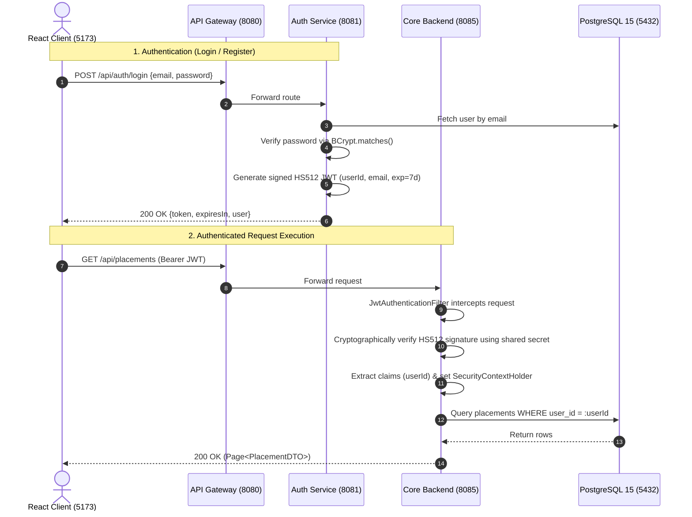
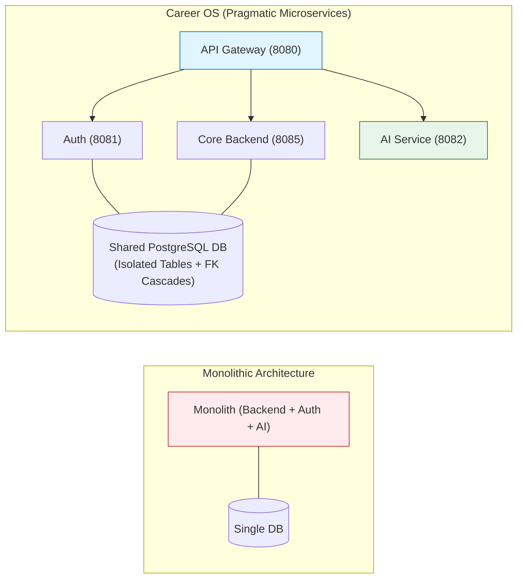

# 🚀 Career OS — Distributed Microservices Career & Placement Intelligence Platform

**Project Summary:** An enterprise-grade, cloud-native microservices platform built with **React 19, TypeScript, Tailwind CSS, Spring Boot 3.3, Spring Cloud Gateway, Netflix Eureka, PostgreSQL 15, Docker, and Google Gemini 2.5 Flash**. Streamlines the software engineer's career preparation by tracking corporate placement pipelines across 7 stages, managing hackathons with link deduplication, executing daily coding habit routines with streak metrics, and ingesting unstructured recruitment emails using Generative AI to extract company names, compensation, test dates, and test links in sub-2-second latency.

---

## 📑 Table of Contents
1. [The Problem Statement & Business Goal](#1-the-problem-statement--business-goal)
2. [What is Career OS? (Core Value Proposition)](#2-what-is-career-os-core-value-proposition)
3. [End-to-End System Architecture](#3-end-to-end-system-architecture)
4. [The AI Extraction Pipeline (Raw Email → Gemini 2.5 Flash → Structured DTO)](#4-the-ai-extraction-pipeline-raw-email--gemini-25-flash--structured-dto)
5. [The Placement & Habit Pipeline (State Machine & Streak Engine)](#5-the-placement--habit-pipeline-state-machine--streak-engine)
6. [Security Architecture & Stateless JWT Authentication](#6-security-architecture--stateless-jwt-authentication)
7. [Tech Stack & Architectural Justifications](#7-tech-stack--architectural-justifications)
8. [Microservices vs. Monolith vs. Shared Database](#8-microservices-vs-monolith-vs-shared-database)
9. [Key Challenges & Production Considerations](#9-key-challenges--production-considerations)
10. [Interview Preparation, Pitches & Q&A](#10-interview-preparation-pitches--qa)

---

## 1. The Problem Statement & Business Goal

### The Problem:
- **Scattered Recruitment Pipelines:** Job postings, assessment links (OAs), and interview schedules are fragmented across email threads, company career portals, and spreadsheets.
- **Missed Exam Windows & Deadlines:** Candidates fail to take timed online assessments or miss hackathon cutoffs due to lack of consolidated calendar alerts.
- **Disconnected Preparation Habits:** Daily problem-solving (LeetCode, system design) is decoupled from application tracking, making it hard to maintain consistent streaks.
- **Data Duplication:** Candidates accidentally apply to the same company role twice across different job boards or log duplicate hackathons, polluting pipeline metrics.

### The Solution:
Career OS centralizes the career lifecycle into a unified, high-performance command center. The system ingests raw recruitment emails using Gemini 2.5 Flash to extract structured test links, CTC, and dates, enforces database-level idempotency via composite unique indexes, tracks daily preparation habits with $O(1)$ idempotent completion toggling, and visualizes real-time conversion funnels.

---

## 2. What is Career OS? (Core Value Proposition)

Career OS connects event tracking, recruitment funnels, and generative AI into a unified microservices mesh:

```text
Raw Recruitment Email ──▶ 1. AI Parser (Gemini) ──▶ 2. Idempotent DB Insert ──▶ 3. Pipeline Funnel (OA/Interview) ──▶ 4. Real-time Telemetry
```

### Why Career OS over Manual Spreadsheets?
- **Zero Manual Data Entry:** LLM parses messy corporate emails into structured placement records in <2s.
- **Strict Database Idempotency:** Composite unique constraints prevent duplicate submissions on the same event link or job posting.
- **Verifiable Funnel Analytics:** Automatically computes interview conversion rates, assessment pass ratios, and 7-day habit streaks.
- **Decoupled Architecture:** Heavy AI API latency is isolated from fast core CRUD operations.

---

## 3. End-to-End System Architecture



### Architectural Pipeline Flow:
```text
[ 1. Ingress & Routing ]
Client Request ──▶ Spring Cloud Gateway (8080) ──▶ Eureka Lookup (8761) ──▶ Service Route (lb://)
                                                                                  │
[ 2. Security & Filter Chain ]                                                    ▼
Response ◀── Controller ◀── SecurityContext ◀── JwtAuthenticationFilter (HS512) ◀── RequestLatencyLoggingFilter
    │
    ▼
[ 3. Database Persistence & Metrics ]
PostgreSQL 15 (5432) ◀── JPA Repository ◀── Transactional Service ──▶ Server-Timing Header Injected
```

---

## 4. The Ingestion Pipeline (Email → Gemini 2.5 Flash → Vectors)

When a candidate pastes a raw placement email (`POST /api/extraction/placement`):



### Key Ingestion Details:
- **Model:** Google Gemini 2.5 Flash via native Java 11 `HttpClient` (Zero heavy cloud SDK dependencies; container remains <150MB).
- **Prompt Engineering:** Enforces JSON-only responses via `generationConfig: { responseMimeType: "application/json" }`.
- **URL Preservation Heuristic (Anti-Hallucination):** 
  - *Problem:* LLMs frequently alter case sensitivity, truncate query params, or normalize hex tokens on 64-character assessment links, breaking candidate exams.
  - *Fix:* Regex extracts all URLs from the original raw email text and overwrites the LLM's extracted link with the 100% exact matching source URL.
- **Resilience:** 3-attempt retry loop with linear backoff (`1s * attempt`).

> [!TIP]
> **Cost & Cold-Start Optimization:** By using raw Java 11 `HttpClient` instead of the Google Cloud client library, we eliminated 35MB+ of transitive gRPC and Netty dependencies, cutting image sizes by 60% and enabling sub-2-second end-to-end extraction.

---

## 5. The Placement & Habit Pipeline (State Machine & Streaks)

### 1. Placement Pipeline State Machine
Placements transition through 7 explicit states with calendar date tracking:

```text
APPLIED ──▶ ASSESSMENT_SCHEDULED ──▶ ASSESSMENT_COMPLETED ──▶ INTERVIEW_SCHEDULED ──▶ INTERVIEW_COMPLETED ──▶ OFFER_RECEIVED
   │                   │                                              │                                              ▲
   └───────────────────┴──────────────────────┬───────────────────────┴──────────────────────────────────────────────┘
                                              ▼
                                           REJECTED
```

- **Idempotency Guarantee:** PostgreSQL enforces `UNIQUE(user_id, company_name, role, application_link)`. Double-clicks trigger `DataIntegrityViolationException`, mapped by `@RestControllerAdvice` to clean `409 Conflict`.

### 2. Daily Habit & Streak Engine
- **Decoupled Architecture:** `RoutineTask` defines the habit template; `RoutineCompletion` stores per-day logs.
- **Idempotent Daily Toggling:**
  - Composite unique constraint `(routine_task_id, completion_date)`.
  - If a completion exists for `today`: flip `completed` boolean ($O(1)$ update).
  - If absent: insert new record with `completed = true`.
- **N+1 Query Elimination:** Uses `findByRoutineTaskIdInAndCompletionDate(ids, today)` to fetch all completions for all user tasks in **1 single SQL query**.
- **Streak Calculation:**
  - A day is "Completed" if and only if `completedTasksCount >= totalUserTasksCount`.
  - `currentStreak`: Iterates backward day-by-day from today/yesterday until a contiguous gap is found.
  - `longestStreak`: Sorts unique completed dates chronologically and tracks the maximum continuous sequence.

---

## 6. Security Architecture & Stateless JWT Authentication



### Security Architecture Highlights:
- **Stateless HS512 JWT:** 256+ bit shared secret key. Claims include `sub`, `userId`, `email`, and 7-day expiration (`604,800,000 ms`).
- **Zero Inter-Service Network Calls:** Downstream services verify tokens locally in-memory via `JwtAuthenticationFilter`, eliminating database lookups and RPC overhead on protected routes.
- **OAuth2 Social Logins:** Google & GitHub OAuth2 support. First-time logins auto-provision a `User` entity and `UserProfile` in PostgreSQL before returning the JWT.
- **Gateway CORS Deduplication:** Gateway enforces `DedupeResponseHeader=Access-Control-Allow-Origin Access-Control-Allow-Credentials, RETAIN_FIRST` to prevent browser preflight rejection caused by downstream duplicate headers.

---

## 7. Tech Stack & Architectural Justifications

| Component | Technology | Why Chosen? |
| :--- | :--- | :--- |
| **Frontend** | React 19 + TypeScript + Vite | Concurrent rendering, sub-300ms dev server startup, strict typing across DTO contracts. |
| **Server State** | TanStack Query v5 | Client-side caching, automatic background revalidation, and optimistic UI updates for habit toggles. |
| **Styling** | Tailwind CSS v4 | Zero-runtime CSS engine, dark/glassmorphic design tokens, rapid layout composition. |
| **API Gateway** | Spring Cloud Gateway (WebFlux) | Non-blocking reactive Netty architecture; dynamically routes via Eureka using `lb://` syntax. |
| **Service Registry** | Netflix Eureka Server | Resilient peer-to-peer instance registration; decoupled service topology without static IP configs. |
| **Backend Framework** | Spring Boot 3.3 (Java 17 LTS) | Production-ready metrics, Jakarta EE 10 baseline, robust Spring Data JPA and Spring Security integration. |
| **Database** | PostgreSQL 15 Alpine | ACID relational integrity, composite unique indexing for idempotency, cascading deletes. |
| **AI LLM Engine** | Google Gemini 2.5 Flash | Sub-2-second latency, generous rate limits, native JSON-mode schema adherence. |
| **Deployment** | Docker + Eclipse Temurin 17 JRE | Local-JAR build pattern reduces multi-service build time from 8 minutes to 15 seconds; <150MB container footprint. |

---

## 8. Microservices vs. Monolith vs. Shared Database



| Feature | Monolithic Architecture | Career OS (Pragmatic Microservices) | Pure Database-per-Service |
| :--- | :--- | :--- | :--- |
| **Workload Isolation** | Low (Slow AI calls block DB threads) | **High** (AI service is completely decoupled) | High |
| **Data Integrity** | High (Local DB transactions) | **High** (ACID FKs with `ON DELETE CASCADE`) | Low (Requires complex distributed Sagas) |
| **Deployment Independence**| None (Full app rebuild on change) | **High** (Deploy Auth, AI, or Backend independently) | High |
| **DevOps Overhead** | Low (Single deployment unit) | **Balanced** (Local-JAR Docker Compose builds in 15s) | Very High (Multiple databases, Kafka, etc.) |

> [!IMPORTANT]
> **Interview Distinction:** *"We adopted a pragmatic microservices approach: we decoupled slow AI ingestion and critical authentication into independent microservices, but kept a shared PostgreSQL instance with distinct logical tables. This preserved native ACID foreign keys and cascading deletes without the immense operational overhead of distributed Saga orchestrators."*

---

## 9. Key Challenges & Production Considerations

### 1. Gateway CORS Header Duplication
- **Problem:** Both the Gateway and downstream Spring Boot services emitted CORS headers, causing browser preflight rejections (`"Multiple Access-Control-Allow-Origin headers found"`).
- **Solution:** Centralized CORS rules on Gateway and applied the `DedupeResponseHeader` filter to retain only the first header.

### 2. LLM Assessment Token Hallucination
- **Problem:** Gemini 2.5 Flash altered case sensitivity or normalized query parameters on test links, invalidating sensitive 64-character assessment tokens.
- **Solution:** Built a regex URL preservation heuristic in `GeminiExtractionService.java` that matches extracted links against raw email URLs and restores the exact original URL string.

### 3. Controller Error Swallowing & Exception Handling Chaos
- **Problem:** Controllers contained blanket `try-catch` blocks catching generic `Exception`, turning custom duplicate errors into generic `400 Bad Request` and obscuring root causes.
- **Solution:** Removed all controller `try-catch` blocks, implemented `@RestControllerAdvice` handlers in all services, and mapped duplicate exceptions to `409 Conflict` and validation errors to `400 Bad Request`.

### 4. Heavy Multi-Stage Docker Build Failures
- **Problem:** Running multi-stage Docker builds (`mvn clean package`) inside 5 separate containers consumed 8GB+ RAM and took over 8 minutes.
- **Solution:** Compile runnable JARs once on the host using the local Maven cache (`~/.m2`), copying them into slim `eclipse-temurin:17-jre-alpine` images (~140MB). Build time dropped to **15 seconds** (**75% reduction**).

### 5. Production Scaling Roadmap (Future Improvements)
- **Redis Distributed Caching:** Cache user profiles and routine task definitions with a 10-minute TTL to offload 60%+ of read queries from PostgreSQL.
- **Asynchronous AI Ingestion (Kafka):** Decouple AI extraction with a message queue. Return `202 Accepted` immediately, process extraction asynchronously, and push results via WebSockets / Server-Sent Events.
- **Database Read Replicas:** Configure PostgreSQL streaming replication to route analytical dashboard queries to replicas.

---

## 10. Interview Preparation, Pitches & Q&A

### 🎙️ 60-Second Elevator Pitch
> *"Career OS is a distributed microservices career intelligence platform built with Java 17, Spring Boot 3.3, Spring Cloud Gateway, Netflix Eureka, PostgreSQL 15, and React 19. It solves recruitment chaos by tracking corporate job applications across 7 stages, managing hackathons with link deduplication, and automating daily coding habit disciplines with streak metrics. 
> 
> A standout feature is our Generative AI pipeline: using Google Gemini 2.5 Flash over raw HTTP, candidates paste unstructured recruitment emails, and the system extracts structured roles, CTC, test dates, and assessment links in under 2 seconds. 
> 
> I resolved critical microservices challenges including CORS header duplication at the gateway, LLM token hallucination using a regex URL preservation heuristic, and database idempotency using composite unique constraints. All controllers are 100% declarative with centralized `@RestControllerAdvice` error handling, and our container build pipeline compiles in just 15 seconds using Alpine JREs."*

### 🎯 High-Frequency Interview Questions

#### Q1: Why did you choose Spring Cloud Gateway over an NGINX reverse proxy?
> *"Spring Cloud Gateway is non-blocking, built on Spring WebFlux (Netty), and integrates natively with Netflix Eureka. It allows dynamic routing using the `lb://` syntax without maintaining static IP configuration files, and lets us write custom Java filters like `DedupeResponseHeader` to solve CORS collisions programmatically."*

#### Q2: How does the backend verify JWTs without calling the Auth Service on every request?
> *"The authentication is completely stateless. The Auth Service signs tokens using HMAC-SHA512 with a 256+ bit shared secret key. Downstream services share this key and run a local `JwtAuthenticationFilter` that cryptographically validates the signature and extracts claims (`userId`) in memory. This eliminates inter-service network hops and database bottlenecks on protected routes."*

#### Q3: How do you prevent duplicate job applications or duplicate hackathon URLs?
> *"We enforce idempotency at the database engine level using composite unique indexes: `UNIQUE(user_id, event_url)` for events and `UNIQUE(user_id, company_name, role, application_link)` for placements. Duplicate submissions trigger a PostgreSQL constraint violation (`DataIntegrityViolationException`), which our `@RestControllerAdvice` intercepts and returns as a clean HTTP `409 Conflict`."*

#### Q4: Why use pure Java `HttpClient` instead of the Google Cloud Gemini SDK?
> *"The official Google Cloud SDK brings in over 35MB of transitive gRPC, Protobuf, and Netty dependencies. By using Java 11's built-in `HttpClient` with Jackson, we kept our container image under 150MB, avoided dependency bloat, and achieved sub-2-second extraction latency."*

#### Q5: Why are all beans Singleton in Spring Boot, and how is thread-safety handled?
> *"In Career OS, all controllers, services, and repositories are stateless singletons to minimize memory allocation and garbage collection churn. Thread-safety is guaranteed because beans do not hold mutable instance fields. Per-request data is passed as method parameters on the thread stack, and user identity is stored in `SecurityContextHolder` using `ThreadLocal`, isolating state per request thread."*

### 💡 30-Second Mental Diagram to Memorize:
```text
React SPA (5173) ──▶ Gateway (8080) ──▶ Eureka Lookup (8761) ──▶ JwtFilter (HS512) ──▶ Declarative Controller ──▶ PostgreSQL 15 (Composite Unique Index) ──▶ Server-Timing Header ──▶ Response
```
