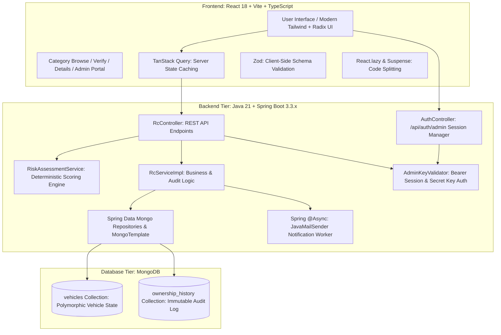
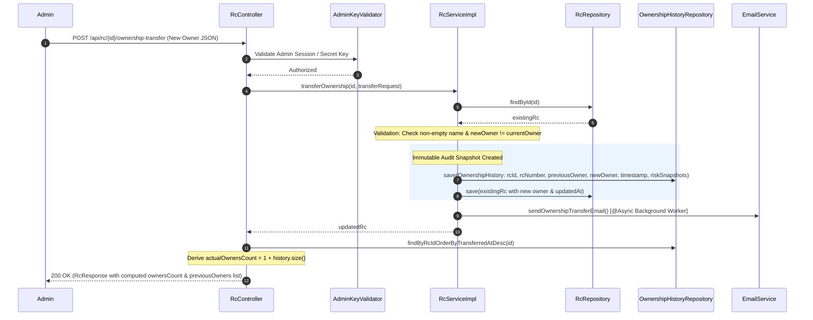

# 🚗 Drive Verify — Vehicle Registration, Inspection & Fraud Verification Platform

> **Project Summary**: A full-stack vehicle trust and ownership audit platform built with **Java 21, Spring Boot 3.3.x, MongoDB, React 18, and TypeScript**. 
> Solves the trust and information asymmetry problem in used-vehicle transactions by cross-referencing seller claims against authoritative registration records, executing deterministic fraud & risk scoring, managing immutable ownership transfer audit trails, supporting polymorphic vehicle schemas across 4 vehicle types (Cars, Bikes, Trucks, Buses), and enforcing privacy-preserving PII masking.

---

## 📑 Table of Contents
1. [The Problem Statement & Business Goal](#1-the-problem-statement--business-goal)
2. [High-Level Architecture & Tech Stack](#2-high-level-architecture--tech-stack)
3. [Core Features & Functional Workflows](#3-core-features--functional-workflows)
4. [Data Model & Schema Design (MongoDB)](#4-data-model--schema-design-mongodb)
5. [The Ownership Transfer & Audit Engine](#5-the-ownership-transfer--audit-engine)
6. [The Deterministic Risk Assessment & Fraud Engine](#6-the-deterministic-risk-assessment--fraud-engine)
7. [Complete REST API Specifications (11 Endpoints)](#7-complete-rest-api-specifications-11-endpoints)
8. [Security & Administrative Access Control](#8-security--administrative-access-control)
9. [Asynchronous Notifications & Background Processing](#9-asynchronous-notifications--background-processing)
10. [Frontend State Management, Validation & Performance](#10-frontend-state-management-validation--performance)
11. [Technical Trade-offs & Production Roadmap](#11-technical-trade-offs--production-roadmap)
12. [Resume-Ready Bullet Points](#12-resume-ready-bullet-points)
13. [Interview Preparation & Pitch Scripts](#13-interview-preparation--pitch-scripts)

---

## 1. The Problem Statement & Business Goal

### The Problem:
Used-vehicle buyers, insurance brokers, and pre-owned vehicle marketplaces frequently struggle with fragmented and manipulated vehicle records:
- **Ownership Disguise**: Sellers routinely conceal true vehicle history (e.g., claiming to be the 1st owner of a 3rd-hand car).
- **Odometer Rollback**: Odometers are rolled back to inflate resale valuations.
- **Counterfeit & Swapped Parts**: Replaced engine blocks or mismatched chassis numbers indicate theft or undisclosed total-loss accidents.
- **Undisclosed Criminal / Risk Flags**: Stolen or suspicious status flags are hidden during offline cash transactions.
- **Document Non-compliance**: Expired insurance policies and counterfeit PUC certificates.

### The Solution:
**Drive Verify** provides an all-in-one verification portal:
- **Public Verification Report**: Compares seller claims side-by-side with ground-truth registry records and calculates an explainable 0–100 Trust Score.
- **Tamper-Proof Ownership Count**: Automatically calculates owner count server-side ($1 + \text{transfers}$) from an immutable audit trail.
- **Document Upload Validation**: Client and server-side validation of registration, insurance, and inspection documents.
- **Polymorphic Category Browsing**: Supports Cars, Bikes, Trucks, and Buses with type-specific attributes without relational database joins.
- **Privacy First (PII Masking)**: Protects seller phone numbers, emails, addresses, and Aadhaar numbers from public scraping.

---

## 2. High-Level Architecture & Tech Stack



### Technology Matrix:
- **Backend**: Java 21, Spring Boot 3.3.x, Spring Data MongoDB, Spring WebMvc, Spring `@Async`, JavaMailSender, Jakarta Validation, Lombok.
- **Database**: MongoDB (Embedded document model + separate collection for historical audit logs, indexed by `rcNumber` and `vehicleType`).
- **Frontend**: React 18, TypeScript, Vite, Tailwind CSS, Radix UI (shadcn/ui style), TanStack Query, React Router 6, Zod, Lucide Icons, Sonner.
- **Testing**: JUnit 5, Mockito, Spring Boot Starter Test (28 comprehensive unit & service tests).

---

## 3. Core Features & Functional Workflows

1. **Category-First Vehicle Browsing**: Public interface featuring dedicated browsing cards for **Cars**, **Bikes**, **Trucks**, and **Buses** with category-specific technical specifications.
2. **Deterministic Vehicle Verification Report**: Buyers enter seller claims (owners count, mileage, engine number, insurance status, accident-free history). The engine compares claim vs. evidence and outputs a 0–100 Trust Score, Risk Level (LOW / MEDIUM / HIGH), inspection checklist, and price negotiation levers.
3. **Multi-Part Document Verification**: Supports client and server validation of PDF and image documents (up to 5MB) verifying MIME type, size, and structure.
4. **Automated Ownership Transfer Audit**: Whenever an admin registers an ownership change, current owner data is snapshotted into `ownership_history` with timestamps and risk status flags.
5. **Server-Side PII Masking**: Public requests receive masked phone numbers, emails, addresses, Aadhaar, engine, and chassis numbers. Only authenticated admin sessions see unmasked data.
6. **Admin Dashboard & Analytics**: Vehicle management panel for creating, updating, transferring, deleting vehicles, and viewing state-by-state and monthly verification analytics.
7. **Async Transactional Alerts**: Triggers background emails to vehicle owners upon RC registration and ownership transfers without blocking API requests.

---

## 4. Data Model & Schema Design (MongoDB)

Drive Verify employs a **hybrid document design**:
- **Embedding** for vehicle sub-entities retrieved together (`owner`, `vehicleInfo`, `registrationInfo`, `insurance`, `puc`).
- **Polymorphic Subdocument** (`vehicleInfo`) to store category-specific technical fields without schema fragmentation or empty relational columns.
- **Separate Collection** (`ownership_history`) for unbounded historical audit records to guarantee $O(1)$ single-document vehicle queries and prevent hitting MongoDB's 16MB document size limit.

```
                  ┌─────────────────────────────────────────────────────────┐
                  │                 vehicles Collection (Rc)                │
                  ├─────────────────────────────────────────────────────────┤
                  │ _id: ObjectId                                           │
                  │ rcNumber: String (Indexed, Unique)                      │
                  │ vehicleType: Enum (CAR, BIKE, TRUCK, BUS)               │
                  │ chassisNumber: String                                   │
                  │ engineNumber: String                                    │
                  │ registrationState: String                               │
                  │ stolen: Boolean                                         │
                  │ suspicious: Boolean                                     │
                  │ createdAt: Instant, updatedAt: Instant                  │
                  │                                                         │
                  │ [Embedded Sub-Objects]                                  │
                  │  ├── owner: { name, phone, email, address, aadhaar4 }   │
                  │  ├── registrationInfo: { regDate, validTill, active }   │
                  │  ├── insurance: { provider, policyNumber, validTill }   │
                  │  ├── puc: { certificateNumber, validTill }              │
                  │  └── vehicleInfo: [Polymorphic Subdocument]             │
                  │        ├── Common: make, model, year, color, fuelType   │
                  │        ├── CAR: variant, transmission, seatingCapacity  │
                  │        ├── BIKE: engineCapacity (cc), transmission      │
                  │        ├── TRUCK: loadCapacity (Tons), axleCount        │
                  │        └── BUS: seatingCapacity, standingCapacity       │
                  └────────────────────────────┬────────────────────────────┘
                                               │ 1-to-N Soft Relationship (rcId)
                                               ▼
                  ┌─────────────────────────────────────────────────────────┐
                  │        ownership_history Collection (OwnershipHistory)  │
                  ├─────────────────────────────────────────────────────────┤
                  │ _id: ObjectId                                           │
                  │ rcId: String (Indexed reference to vehicles._id)        │
                  │ rcNumber: String (Indexed denormalized)                 │
                  │ previousOwnerName: String                               │
                  │ newOwnerName: String                                    │
                  │ transferredAt: Instant                                  │
                  │ stolenAtTransfer: Boolean                               │
                  │ suspiciousAtTransfer: Boolean                           │
                  └─────────────────────────────────────────────────────────┘
```

### Why MongoDB's Document Model Over SQL? (Key Interview Point)
- **Zero Joins for Core Lookups**: Looking up an RC record loads owner, registration, insurance, PUC, and specs in a single round-trip.
- **Polymorphic Storage Without Sparse Tables**: In SQL, having 4 vehicle types with distinct specifications requires either Single Table Inheritance (dozens of `NULL` columns) or joined tables (slow, complex `JOIN` queries). MongoDB stores only relevant fields per vehicle type with zero storage waste (`@JsonInclude(Include.NON_NULL)`).
- **Audit Separation**: Separating `ownership_history` keeps the primary `vehicles` document bounded and lightweight.

---

## 5. The Ownership Transfer & Audit Engine

Whenever an administrative ownership transfer is performed via `/api/rc/{id}/ownership-transfer`:



### Critical Business Rules:
1. **Never Trust Client Owner Count**: `ownersCount` is derived server-side:
   $$\text{ownersCount} = 1 + \text{count}(\text{ownership\_history records for vehicle})$$
2. **Immutable Audit Snapshot**: The history entry records who transferred the car, the exact timestamp, and whether the vehicle was marked stolen or suspicious at the time of transfer.

---

## 6. The Deterministic Risk Assessment & Fraud Engine

The platform implements a transparent, deterministic rule-based evaluation engine (`RiskAssessmentService.java`) instead of a non-deterministic AI black box.

### Scoring Formula (Base: 100 Points)

| Parameter Evaluated | Condition | Score Impact | Finding Category |
|---|---|---|---|
| **Stolen Status** | `rc.stolen == true` | **$-50$ pts** | `DANGER` (Critical Risk) |
| **Suspicious Flag** | `rc.suspicious == true` | **$-30$ pts** | `WARNING` |
| **Owner Count Mismatch** | Claimed owners $<$ Actual owners | **$-15$ pts** per undeclared owner | `WARNING` |
| **Mileage Rollback** | Claimed mileage $<$ Recorded mileage | **$-25$ pts** | `DANGER` (Odometer Fraud) |
| **Engine Identity** | Claimed engine $\neq$ Registered engine | **$-25$ pts** | `DANGER` (Engine Swap / Fake RC) |
| **Insurance Validity** | Insurance expired past today | **$-15$ pts** | `WARNING` |
| **Insurance Claim Discrepancy**| Claimed insured, but record expired/missing | **$-20$ pts** | `WARNING` |
| **Accident Claim Discrepancy** | Claimed accident-free, but vehicle is suspicious | **$-20$ pts** | `WARNING` |
| **Clean Check Bonus** | Clean title, matching specs, active compliance | Positive factors added | `VERIFIED` |

### Risk Classification Thresholds:
- **$\ge 80$ Points $\rightarrow$ `LOW RISK` (🟢 Green)**: Safe vehicle record. Proceed with standard physical checks.
- **$50 - 79$ Points $\rightarrow$ `MEDIUM RISK` (🟡 Yellow)**: Discrepancies detected (e.g., extra prior owners, lapsed insurance). Use as price negotiation leverage.
- **$< 50$ Points $\rightarrow$ `HIGH RISK` (🔴 Red)**: Critical violations (reported stolen, odometer rolled back, or replaced engine). Transaction strongly discouraged.

### Side-by-Side Finding Object (`Finding`):
The engine outputs structured comparisons for UI rendering:
- `parameter`: Name of the metric (e.g., "Odometer / Mileage", "Engine Identity").
- `sellerClaim`: What the seller claimed.
- `officialRecord`: What the authoritative registry shows.
- `status`: `MATCH`, `MISMATCH`, or `SUSPICIOUS`.
- `detail`: Actionable explanation for buyer negotiation.

---

## 7. Complete REST API Specifications (11 Endpoints)

| # | HTTP Method | Endpoint Path | Access Level | Description |
|---|---|---|---|---|
| **1** | `POST` | `/api/auth/admin` | Public | Authenticates admin using secret key from environment and issues a secure session token (`ADM_SESS_<UUID>`). |
| **2** | `GET` | `/api/rc` | Public / Admin | Returns all vehicles. Public callers receive masked PII; admin sessions receive unmasked records. Supports optional `?vehicleType=CAR`. |
| **3** | `GET` | `/api/rc/{id}` | Public / Admin | Returns single vehicle by MongoDB ID with PII masking applied for non-admins. |
| **4** | `GET` | `/api/rc/search` | Public / Admin | Fast indexed search by RC Number (`?rcNumber=KA01AB1234`). |
| **5** | `GET` | `/api/rc/{id}/history` | Public / Admin | Returns chronological chain-of-custody transfer history for a vehicle. |
| **6** | `POST` | `/api/rc/evaluate` | Public | **Read-Only Verification**: Evaluates seller claims against official RC data and generates a complete risk assessment report. |
| **7** | `POST` | `/api/rc/documents/validate`| Public | Validates uploaded vehicle documents (PDF, JPG, PNG up to 5MB) for size, extension, and MIME integrity. |
| **8** | `GET` | `/api/rc/page` | Public / Admin | Server-side paginated query with MongoDB Criteria filters (`page`, `size`, `vehicleType`, `registrationState`, `stolen`, `suspicious`, `make`, `ownerName`). |
| **9** | `POST` | `/api/rc` | Admin Only | Registers a new vehicle with initial owner, compliance certificates, and category-specific specs. Asynchronously triggers welcome email. |
| **10**| `PUT` | `/api/rc/{id}` | Admin Only | Updates vehicle details and specifications. |
| **11**| `POST` | `/api/rc/{id}/ownership-transfer` | Admin Only | Executes legal ownership transfer, snapshots audit history, and sends email notifications. |
| **12**| `DELETE`| `/api/rc/{id}` | Admin Only | Permanently deletes a vehicle record. |
| **13**| `GET` | `/api/rc/stats` | Admin Only | Returns dashboard analytics: total vehicles, stolen count, suspicious count, state breakdown, and monthly verification trends. |

---

## 8. Security & Administrative Access Control

### Dual-Layer Authentication & Authorization:
1. **Admin Secret Key / Session Tokens**:
   - Administrations authenticate via `POST /api/auth/admin`.
   - The backend validates against `ADMIN_SECRET_KEY` loaded from `.env`.
   - On success, generates an active in-memory session token (`ADM_SESS_<UUID>`).
   - `AdminKeyValidator` supports both:
     - Header `Authorization: Bearer ADM_SESS_...`
     - Header `X-Admin-Secret-Key: <secret>`
2. **Server-Side PII Data Masking (`RcResponse.java`)**:
   - Non-admin callers never receive raw PII:
     - **Phone**: `9123456789` $\rightarrow$ `******6789`
     - **Email**: `user@example.com` $\rightarrow$ `masked@privacy.internal`
     - **Address**: Full street address $\rightarrow$ `"Protected PII Address"`
     - **Aadhaar**: `1234` $\rightarrow$ `****`
     - **Chassis & Engine**: `CHS1234567890` $\rightarrow$ `****7890`

---

## 9. Asynchronous Notifications & Background Processing

- **Non-Blocking Email Worker**:
  - Annotated with `@EnableAsync` and `@Async` using Spring's `TaskExecutor`.
  - Dispatches HTML notifications on **RC Creation** and **Ownership Transfer** without introducing latency to API client responses.
  - Gracefully handles missing SMTP credentials with structured fallback logging.

---

## 10. Frontend State Management, Validation & Performance

- **Category-First UX**:
  - Landing on `/vehicles` presents a clean selection interface (`Cars`, `Bikes`, `Trucks`, `Buses`).
  - Selecting a category loads filtered vehicles with type-specific badges and specifications.
- **Dynamic Type-Specific Details**:
  - `RcDetail.tsx` renders a dedicated **"Vehicle Specifications"** card displaying only fields pertinent to the vehicle type (e.g. `engineCapacity` for Bikes, `loadCapacity` and `axleCount` for Trucks, `standingCapacity` for Buses, `variant` and `transmission` for Cars).
- **Zod Schema Validation (`validation.ts`)**:
  - Validates RC format, phone numbers, email syntax, positive numeric limits, and enum vehicle types prior to API dispatch.
- **Code Splitting & Asset Optimization**:
  - All routes split via `React.lazy()` and `<Suspense>`.
  - Production build generates lightweight chunks with total build time under 9 seconds.

---

## 11. Technical Trade-offs & Production Roadmap

| Area | Current Implementation | Production Roadmap Enhancement |
|---|---|---|
| **Database Transactions** | Separate collection writes in service | Multi-document MongoDB Transactions (`@Transactional` with replica set) for atomic transfers |
| **Concurrency Control** | Last-write-wins | Optimistic Locking using `@Version` field on `Rc` entity to prevent simultaneous overwrites |
| **Authentication** | In-memory token store + admin secret | Spring Security 6 + stateless JWT with asymmetric keys (RSA) + refresh token rotation |
| **External Integrations** | Self-contained verified registry | Gateway connectors to official government RTO / VAHAN APIs and insurance databases |
| **Caching Layer** | Direct MongoDB lookups | Redis Cache layer for hot RC searches (`@Cacheable("vehicles")`) |

---

## 12. Resume-Ready Bullet Points

```markdown
• Drive Verify — Used Vehicle Trust & Ownership Audit Platform | Java 21, Spring Boot, MongoDB, React, TypeScript
  - Architected a full-stack vehicle trust platform to mitigate fraud in used-car transactions by cross-referencing seller claims against official registry records and ownership logs.
  - Engineered a deterministic Risk Assessment Engine evaluating 8+ fraud vectors (odometer rollbacks, undeclared prior owners, engine number mismatches, stolen flags) to generate 0–100 trust scores and inspection checklists.
  - Designed a polymorphic MongoDB document schema across 4 vehicle categories (Cars, Bikes, Trucks, Buses) supporting type-specific specifications without relational table joins or sparse NULL columns.
  - Implemented an automated ownership transfer engine that snapshots immutable chain-of-custody audit logs and strictly derives owner counts server-side to prevent tampering.
  - Developed 11 RESTful endpoints with server-side regex filtering, paginated queries via MongoTemplate, automated PII data masking, and multi-part document verification.
  - Integrated asynchronous email dispatch via JavaMailSender using Spring @Async task executors for non-blocking transaction alerts.
  - Achieved 100% test pass rate across 28 unit and service integration tests using JUnit 5 and Mockito.
```

---

## 13. Interview Preparation & Pitch Scripts

### 🎙️ 60-Second Elevator Pitch
> *"Drive Verify is a full-stack vehicle registration and fraud verification platform built with Java 21, Spring Boot, MongoDB, React, and TypeScript.*  
> *The problem it solves is information asymmetry in used-vehicle marketplaces, where buyers are routinely deceived about prior owner counts, rolled-back odometers, or hidden stolen status.*  
> *The platform allows buyers to input seller claims and deterministically evaluates them against official registry records, generating a 0–100 Trust Score, a side-by-side claim vs. evidence comparison, and a pre-purchase checklist.*  
> *On the backend, I designed an immutable ownership transfer engine where owner counts are strictly calculated server-side from audit records rather than client input. I also leveraged MongoDB's document model to support polymorphic vehicle attributes for Cars, Bikes, Trucks, and Buses without relational SQL joins.*  
> *It includes PII data masking, async email alerts, and a test suite with 28 passing unit tests."*

---

### 🎙️ 2-Minute Architectural Deep-Dive
> *"The architecture of Drive Verify is built as a clean, decoupled system consisting of a React TypeScript SPA frontend and a Spring Boot Java 21 REST backend connected to MongoDB.*  
> 
> *On the frontend, we use a category-first UX where users can explore vehicles filtered by category or verify a specific vehicle. TanStack Query manages server state, while Zod guarantees schema validation.*  
> 
> *The backend follows the Controller-Service-Repository pattern. For the database, we chose MongoDB specifically because vehicles are polymorphic: a truck requires payload capacity and axle count, a bus requires seating and standing capacity, while a bike requires engine displacement in cc. In an RDBMS, this requires either Single Table Inheritance with sparse columns or multiple JOIN tables. With MongoDB, we store flexible embedded `vehicleInfo` in a single `vehicles` collection, enabling sub-millisecond document lookups by indexed RC number with zero joins.*  
> 
> *For integrity, ownership transfers are decoupled into a separate `ownership_history` collection. When an admin executes a transfer, the service snapshots the outgoing owner and risk flags, updates the primary vehicle document, and triggers an asynchronous email via Spring `@Async`. Owner count is never taken from user input—it's strictly computed as $1 + \text{history count}$.*  
> 
> *Finally, our risk engine runs deterministically: it penalizes odometer rollbacks by 25 points, engine number mismatches by 25 points, and undeclared owners by 15 points per owner, providing complete transparency and explainability.*  
> 
> *In production, the next steps would be adding MongoDB multi-document transactions with `@Transactional` and introducing Redis caching for frequently queried registration numbers."*

---

### 🎯 Top 5 Interview Questions & Winning Answers

#### Q1: Why did you choose MongoDB instead of PostgreSQL or MySQL?
> *"In a vehicle verification platform, vehicle types share core metadata (RC number, chassis, engine, owner, insurance) but diverge significantly in technical attributes. A truck has payload capacity and axle count; a bus has seating and standing limits; a bike has engine cc. In SQL, this requires either a single table with dozens of nullable columns or multiple joined tables that degrade read performance. MongoDB's document model allows us to embed polymorphic `vehicleInfo` inside a single `vehicles` collection. We get single-query reads by indexed `rcNumber` without joins, while keeping ownership transfers cleanly separated in an append-only collection."*

#### Q2: Why is the risk scoring engine deterministic rather than AI/LLM based?
> *"In legal and financial transactions like used-vehicle purchases, users need 100% predictable, explainable, and auditable reasons for risk deductions. If a car loses 25 points, the buyer needs to know exactly that the odometer was rolled back by 15,000 km or that the engine number didn't match the registry. A deterministic algorithm ensures zero hallucination, repeatable results, and direct legal compliance."*

#### Q3: How do you prevent tampering with the number of owners?
> *"The owner count is strictly computed server-side. In `RcController` and `RcResponse.fromEntity`, we query `ownership_history` by `rcId` and compute $\text{ownersCount} = 1 + \text{history.size()}$. The client cannot supply or mutate the owner count directly."*

#### Q4: How is data privacy (PII) handled?
> *"We implemented server-side DTO projection in `RcResponse.fromEntity`. Before returning vehicle data to any non-authenticated caller, sensitive fields such as phone numbers, email addresses, residential addresses, Aadhaar numbers, and full engine/chassis numbers are masked. Only validated admin sessions receive raw identifiers."*

#### Q5: How did you test the system?
> *"We built a 28-test suite using JUnit 5 and Mockito covering service validation, ownership transfer state transitions, duplicate RC conflicts, category filtering via MongoTemplate Criteria, and deterministic risk score edge cases. On the frontend, TypeScript strict mode and Zod validation guarantee type safety."*
