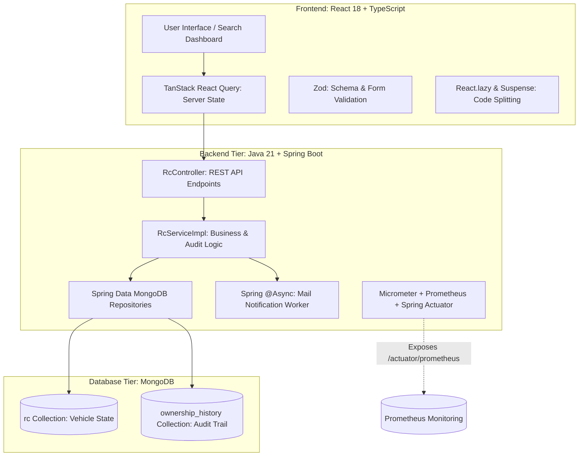
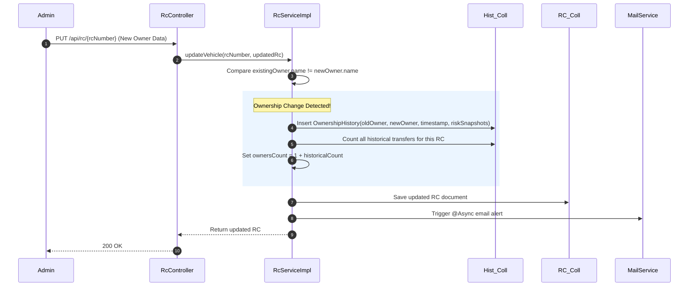

# 🚗 Drive Verify — Vehicle Registration & Fraud Verification Platform

> **Project Summary**: A full-stack vehicle registration and fraud verification platform built with **Java 21, Spring Boot, MongoDB, React, and TypeScript**. 
> Solves the trust and transparency problem in used-vehicle transactions by centralizing RC records, tracking verified ownership transfer audit trails, flagging stolen/suspicious vehicles, and deriving owner counts server-side to prevent tampering.

---

## 📑 Table of Contents
1. [The Problem Statement & Business Goal](#1-the-problem-statement--business-goal)
2. [High-Level Architecture & Tech Stack](#2-high-level-architecture--tech-stack)
3. [Core Features & Functional Workflows](#3-core-features--functional-workflows)
4. [Data Model & Schema Design (MongoDB)](#4-data-model--schema-design-mongodb)
5. [The Ownership Transfer & Audit Engine](#5-the-ownership-transfer--audit-engine)
6. [Security & Administrative Access Control](#6-security--administrative-access-control)
7. [Observability & Asynchronous Notifications](#7-observability--asynchronous-notifications)
8. [Frontend State Management & Performance](#8-frontend-state-management--performance)
9. [Technical Trade-offs & Production Roadmap](#9-technical-trade-offs--production-roadmap)
10. [Interview Preparation & Pitch Scripts](#10-interview-preparation--pitch-scripts)

---

## 1. The Problem Statement & Business Goal

### The Problem:
Used-vehicle buyers, insurance underwriters, and lenders often struggle with fragmented or unverified vehicle data:
- Inaccurate or manipulated ownership counts (e.g., selling a 3rd-hand car as 1st-hand).
- Undisclosed stolen or suspicious vehicle status.
- Missing insurance, PUC, or registration validity history.

### The Solution:
**Drive Verify** provides a single verification portal where entering an RC (Registration Certificate) number returns:
- Complete vehicle specifications and registration validity.
- Complete owner details and historical ownership audit logs.
- Real-time insurance and PUC compliance indicators.
- Instant stolen / suspicious fraud warning badges.

---

## 2. High-Level Architecture & Tech Stack



### Technology Matrix:
- **Backend**: Java 21, Spring Boot 3.x, Spring Data MongoDB, Spring `@Async`, Spring Actuator, Micrometer Prometheus.
- **Database**: MongoDB (Embedded document model + separate collection for historical audit logs).
- **Frontend**: React, TypeScript, Vite, TanStack Query (React Query), React Router 6, Zod, Tailwind CSS, Lucide Icons.

---

## 3. Core Features & Functional Workflows

1. **RC Search & Verification**: Search by vehicle registration number (e.g., `KA-01-AB-1234`) to retrieve complete verified data.
2. **Automated Ownership Audit**: Automatically logs historical owner transfers whenever an owner change is detected.
3. **Fraud & Risk Badges**: Highlights active `isStolen` or `isSuspicious` flags with visual warning banners.
4. **Admin Dashboard**: Protected management panel to add, edit, flag, or transfer vehicles.
5. **Async Email Notifications**: Sends transactional alerts asynchronously to administrators/users upon record updates.

---

## 4. Data Model & Schema Design (MongoDB)

The data model uses a hybrid design: **embedding** for vehicle sub-entities retrieved together, and a **separate collection** for unboundedly growing historical audit records.

```
                  ┌──────────────────────────────────────────────┐
                  │              RC Document (rc)                │
                  ├──────────────────────────────────────────────┤
                  │ _id: ObjectId                                │
                  │ rcNumber: String (Unique Index)              │
                  │ isStolen: Boolean                            │
                  │ isSuspicious: Boolean                        │
                  │ ownersCount: Integer (Server Calculated)     │
                  │                                              │
                  │ [Embedded Sub-Objects]                       │
                  │  ├── owner: { name, phone, email, address }  │
                  │  ├── vehicle: { make, model, fuel, chassis } │
                  │  ├── registration: { date, rto, validity }   │
                  │  └── insurance: { policyNo, expiryDate }     │
                  └──────────────────────┬───────────────────────┘
                                         │ 1-to-N Relationship
                                         ▼
                  ┌──────────────────────────────────────────────┐
                  │    OwnershipHistory (ownership_history)      │
                  ├──────────────────────────────────────────────┤
                  │ _id: ObjectId                                │
                  │ rcNumber: String                             │
                  │ previousOwner: Owner                         │
                  │ newOwner: Owner                              │
                  │ transferDate: Instant                        │
                  │ wasStolenSnapshot: Boolean                   │
                  │ wasSuspiciousSnapshot: Boolean               │
                  └──────────────────────────────────────────────┘
```

> [!NOTE]
> **Why separate `ownership_history`?**  
> Vehicle details are small and read together (embedded). However, ownership history grows over the lifetime of a car; keeping it in a separate collection avoids reaching MongoDB's 16MB document limit and keeps primary search queries fast.

---

## 5. The Ownership Transfer & Audit Engine

Whenever an administrative update changes the owner's name:



### Key Business Rule:
- `ownersCount` is **never trusted from client input**. It is strictly derived server-side:
  $$\text{ownersCount} = 1 + \text{count}(\text{OwnershipHistory records for this RC})$$

---

## 6. Security & Administrative Access Control

### Current Prototype Implementation:
- Public endpoints: `GET /api/rc/{rcNumber}` (Read-only vehicle search).
- Protected endpoints: `POST`, `PUT`, `DELETE` operations require custom HTTP Header:
  ```http
  X-ADMIN-KEY: <secret-admin-token>
  ```
- Checked via Spring interceptor/filter logic before allowing state modifications.

### Production Roadmap:
- Replace static `X-ADMIN-KEY` with **Spring Security + OAuth2 / JWT Authentication**.
- Role-Based Access Control (`ROLE_USER`, `ROLE_DEALER`, `ROLE_ADMIN`, `ROLE_RTO_OFFICER`).

---

## 7. Observability & Asynchronous Notifications

### Observability Stack:
- **Spring Boot Actuator**: Health endpoints (`/actuator/health`, `/actuator/info`).
- **Micrometer & Prometheus**: Collects JVM memory, garbage collection metrics, request latencies, and custom verification counters at `/actuator/prometheus`.

### Asynchronous Mail Dispatch:
```java
@Async
public CompletableFuture<Void> sendOwnershipTransferNotification(String rcNumber, String email) {
    // Executes in separate TaskExecutor thread pool without blocking HTTP response
    mailSender.send(...);
    return CompletableFuture.completedFuture(null);
}
```

---

## 8. Frontend State Management & Performance

- **TanStack React Query**:
  - Automatic query caching, background data revalidation, and loading/error states.
  - Cache invalidation on mutation: `queryClient.invalidateQueries(['rc', rcNumber])`.
- **Zod Schema Validation**: Client-side form validation before sending payload to backend.
- **Code Splitting**: Route-level bundle splitting using `React.lazy()` and `<Suspense>` to ensure initial page load under 1.5s.

---

## 9. Technical Trade-offs & Production Roadmap

### Known Prototype Limitations & Identified Improvements:

| Area | Current Prototype | Production Roadmap Fix |
| :--- | :--- | :--- |
| **Pagination & Filtering** | In-memory JVM filtering after `findAll()` | Database-level MongoDB queries with `Pageable` & indexes (`rcNumber`, `owner.name`) |
| **Data Integrity** | Non-transactional separate updates | Multi-document MongoDB Transactions (`@Transactional`) for atomic transfers |
| **Concurrency Control** | Last-write-wins | **Optimistic Locking** using `@Version` field to prevent simultaneous edit overwrites |
| **Authentication** | Shared `X-ADMIN-KEY` in localStorage | Spring Security + Short-lived JWTs in `HttpOnly` cookies + Refresh token rotation |
| **Authoritative Data**| Standalone database prototype | Integration with official RTO / VAHAN APIs via authenticated government gateways |

---

## 10. Interview Preparation & Pitch Scripts

### 🎙️ 60-Second Elevator Pitch
> *"Drive Verify is a full-stack vehicle registration and fraud verification platform built using Java 21, Spring Boot, MongoDB, React, and TypeScript.*  
> *The problem I solved was the lack of transparency in used-vehicle sales, where buyers often face odometer fraud or manipulated ownership counts. The app allows users to search any RC number to view complete specifications, registration validity, insurance status, and stolen/suspicious fraud flags.*  
> *On the backend, I implemented an automated audit engine: whenever an owner change is detected, it logs an immutable `OwnershipHistory` record and calculates the total owner count server-side so it cannot be forged. I also added Prometheus observability and asynchronous email notifications.*  
> *Building this taught me a lot about document modeling, audit trails, and the difference between prototype features and production-grade concurrency/security."*

---

### 🎙️ 2-Minute Architectural Deep-Dive
> *"My project is Drive Verify, a vehicle registration and fraud verification platform.*  
> *During used-car purchases, buyers frequently encounter hidden risks such as undisclosed ownership changes or vehicles flagged as stolen. Drive Verify centralizes these verification data points.*  
> 
> *The architecture consists of a React and TypeScript frontend and a Java 21 Spring Boot backend communicating over REST APIs.*  
> *On the frontend, I used TanStack React Query for server-state caching, Zod for schema validation, and route-level code splitting via `React.lazy`.*  
> 
> *The backend follows a clean Controller-Service-Repository pattern. For storage, I used MongoDB. I designed the schema such that current vehicle data (owner details, vehicle specs, insurance, and fraud flags) is embedded in a single `rc` document for fast single-query reads, while historical transfers are maintained in a dedicated `ownership_history` collection to manage unbounded growth.*  
> 
> *A key piece of business logic is the ownership transfer workflow: when an admin updates the owner, the service compares the existing and incoming owner names, persists an audit record with timestamped snapshots of risk flags, and automatically recalculates `ownersCount` server-side.*  
> 
> *I also added Spring Actuator and Micrometer Prometheus metrics for observability, and Spring `@Async` for background email alerts.*  
> 
> *While building this, I also analyzed production bottlenecks: currently pagination happens in-memory, so for a large dataset I would move queries directly into MongoDB with compound indexes, apply optimistic locking with `@Version`, and replace static admin headers with Spring Security and JWT authentication."*

---

### 🎯 5 Key Takeaways to Remember:
1. **Core Problem**: Trust & transparency in used-vehicle transactions.
2. **Core Feature**: RC verification + Automated ownership history + Fraud warning indicators.
3. **Best Backend Logic**: Server-side derived owner count + automatic audit logging on owner change.
4. **Data Model**: Embedded current vehicle state + separate collection for unbounded audit history.
5. **Self-Awareness**: Clear understanding of concurrency (optimistic locking) and database pagination improvements needed for production.
