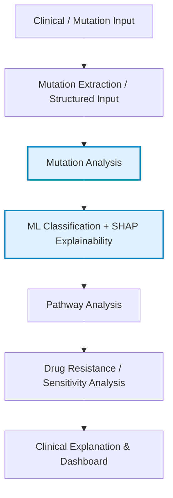
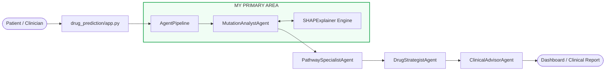
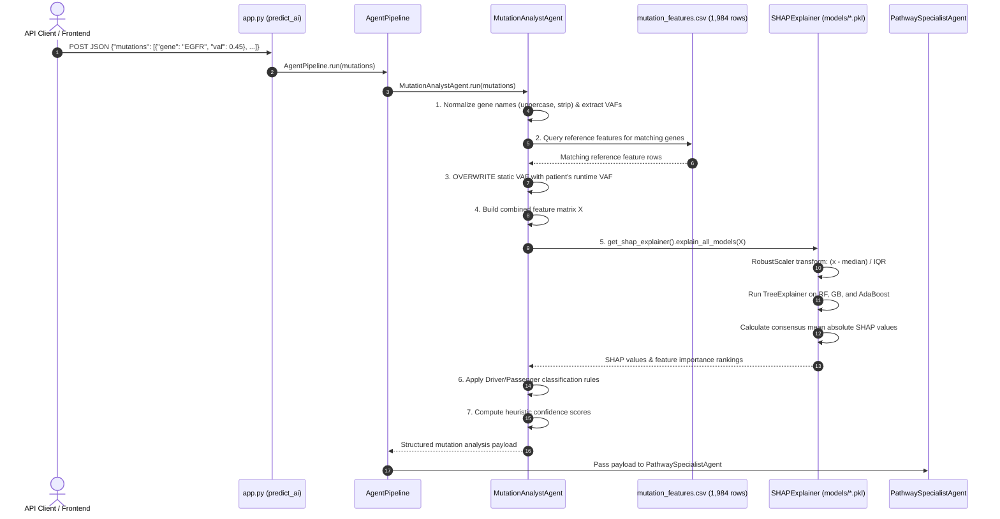
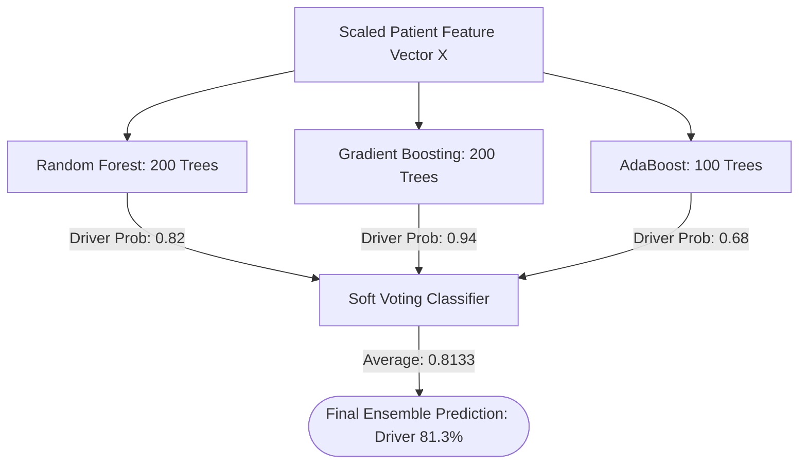

# 🧬 XMARs — Mutation Analysis, Machine Learning & SHAP

> **Interview-Ready Technical Guide for My Primary Contribution to XMARs**  
> **Project Scope**: XMARs (*Extended Mutation Analysis and Resistance Scoring*) is a 4-person precision-oncology decision-support prototype for Non-Small Cell Lung Cancer (NSCLC).  
> **My Primary Area**: **Mutation Analysis + Machine Learning Classification + SHAP Explainability Subsystem**.

---

## 📑 Table of Contents

1. [My Contribution & Ownership Boundary](#1-my-contribution)
2. [What XMARs Does](#2-what-xmars-does)
3. [Where My Module Fits in the Multi-Agent Pipeline](#3-where-my-module-fits)
4. [Complete Execution Flow](#4-complete-execution-flow)
5. [Mutation Feature Representation & Dataset](#5-mutation-feature-representation)
6. [Machine Learning Pipeline](#6-machine-learning-pipeline)
7. [Soft Voting Ensemble Architecture](#7-soft-voting-ensemble)
8. [SHAP Explainability Engine](#8-shap-explainability)
9. [Driver vs. Passenger Classification Rules](#9-driver-vs-passenger-classification)
10. [Codebase & File Structure](#10-code-structure)
11. [Data Structures, Algorithms & Complexity](#11-data-structures-algorithms--complexity)
12. [OOP & Design Patterns](#12-oop--design-patterns)
13. [Error Handling & Edge Cases](#13-error-handling--edge-cases)
14. [Performance, Latency & Scaling](#14-performance--scaling)
15. [Testing & Verified Benchmarks](#15-testing--validation)
16. [Important Interview Questions & Answers](#16-important-interview-questions)
17. [Enterprise & IBM-Focused Questions](#17-ibm-focused-questions)
18. [Dangerous Questions & Safe Answers](#18-dangerous-questions--safe-answers)
19. [What I Must NOT Claim](#19-what-i-must-not-claim)
20. [30-Second Elevator Pitch](#20-30-second-explanation)
21. [Final Pre-Interview Checklist](#21-final-revision-checklist)
22. [Repository Verification Notes](#22-verification-notes)

---

## 1. My Contribution

### Safe Ownership Statement
This is a **4-person collaborative project**. I do **not** claim that I built the entire end-to-end system.

> [!IMPORTANT]
> **My Functional Ownership Boundary:**  
> **Mutation Analysis + Machine Learning Classification + SHAP Explainability**

### Core Files Under My Ownership:

| File Path | Role & Responsibilities |
| :--- | :--- |
| `drug_prediction/agents.py` | `MutationAnalystAgent` — Mutation ingestion, feature matching, runtime VAF injection, and rule-based classification. |
| `drug_prediction/shap_explainer.py` | `SHAPExplainer` — Multi-model SHAP explanation engine & consensus aggregation. |
| `ml_pipeline.py` | Staged machine learning training pipeline. |
| `train_models.py` | Baseline model training & artifact serialization. |
| `model_fine_tuning.py` | Hyperparameter optimization (`GridSearchCV` / `RandomizedSearchCV`). |
| `model_report.py` | Empirical evaluation & performance reporting. |
| `data/processed/mutation_features.csv` | Reference mutation feature dataset (**1,984 samples**). |
| `models/*.pkl` | Serialized model pipelines and `RobustScaler` artifacts. |

### Functional Responsibility:
My module takes structured patient mutation data, transforms it into the mathematical feature representation expected by the ML classifiers, generates local feature attributions via SHAP, and combines runtime **Variant Allele Frequency (VAF)** with model attribution to output structured mutation analysis for downstream pathway disruption modeling.

### What I Do NOT Claim (Handled by Teammates):
- Clinical PDF / OCR document ingestion.
- Downstream pathway disruption & network analysis.
- Pharmacogenomic rule-based drug-resistance scoring.
- Flask web UI / dashboard templates.
- Clinical natural-language report synthesis.

---

## 2. What XMARs Does

XMARs is an explainable clinical decision-support prototype for precision oncology in **Non-Small Cell Lung Cancer (NSCLC)**.



### Zooming into My Subsystem:
```
Structured Patient Mutations
        ↓
Feature Vector Construction (Reference Data + Patient VAF)
        ↓
Trained Tree Classifiers (RF, GB, AdaBoost)
        ↓
SHAP Explainability (TreeExplainer / Consensus)
        ↓
Driver / Passenger Classification Heuristics
        ↓
Structured Mutation Analysis Output (Handed off to Pathway Agent)
```

---

## 3. Where My Module Fits



> [!NOTE]
> **Key Integration Role**: My module produces the structured genomic and ML baseline (analyzed genes, driver/passenger classification, confidence scores, and SHAP feature importance) utilized by downstream agents.

---

## 4. Complete Execution Flow



### Detailed Step Breakdown:

#### 4.1 Input Payload
```json
{
  "mutations": [
    {"gene": "EGFR", "vaf": 0.45},
    {"gene": "TP53", "vaf": 0.82}
  ]
}
```

#### 4.2 Gene Normalization & Default VAF Handling
- Gene symbols are stripped and converted to uppercase: `m["gene"].upper().strip()`.
- Missing VAF values fall back to the documented project default: `0.5`.

#### 4.3 Reference Dataset Matching
The agent queries `data/processed/mutation_features.csv` (**1,984 rows**) for one-hot encoded mutation consequence types (`ohe_*`), genomic flags, and background mutation counts.

#### 4.4 Dynamic Patient VAF Injection
> [!IMPORTANT]
> **Critical Implementation Detail**: The static reference CSV contains historical VAF numbers, but the patient's **actual runtime VAF** is dynamically injected into the feature vector:
> ```python
> sample["vaf"] = vafs.get(gene, 0.5)
> ```
> This proves how static reference annotations and dynamic patient observations merge at inference time.

#### 4.5 Feature Matrix Construction
Matching rows are assembled into a clean Pandas DataFrame matching the exact feature column ordering expected by the trained estimators.

#### 4.6 Artifact Loading & Background Initialization
`SHAPExplainer` loads serialized artifacts:
- `models/scaler_pipeline.pkl`
- `models/random_forest_pipeline.pkl`
- `models/gradient_boosting_pipeline.pkl`
- `models/adaboost_pipeline.pkl`
- Prepares a baseline background distribution using **up to 100 sampled rows** from `mutation_features.csv`.

#### 4.7 Robust Scaling
Features are scaled using `RobustScaler`:
$$x_{\text{scaled}} = \frac{x - \text{median}(x)}{\text{IQR}(x)}$$
*Why RobustScaler?* Genomic mutation frequencies and background counts exhibit heavy-tailed outlier distributions. Scaling by Median and Interquartile Range (IQR) prevents extreme outliers from distorting distances.

#### 4.8 Tree-Based SHAP Inference
Local attributions are computed using `shap.TreeExplainer(model)` across Random Forest, Gradient Boosting, and AdaBoost (with `KernelExplainer` fallback).

#### 4.9 Consensus Feature Attribution
Consensus feature importance is computed by calculating the **mean absolute SHAP contribution** across all three tree models:
$$\text{Consensus Importance}_j = \frac{1}{M} \sum_{m=1}^{M} |\phi_{j}^{(m)}|$$

#### 4.10 Driver vs. Passenger Classification Rules
The agent evaluates patient VAF against the consensus SHAP score using explicit heuristic rules:
- **`likely_driver`**: `VAF >= 0.30` AND `avg_SHAP > 0.01`
- **`possible_driver`**: `VAF >= 0.10`
- **`likely_passenger`**: `VAF < 0.10`
- **`unknown`**: Gene not present in reference dataset.

#### 4.11 Confidence Score Calculation
- **`likely_driver`**: $\min(0.95, \, 0.5 + 0.3 \times \text{VAF} + 10 \times \text{avg\_SHAP})$
- **`possible_driver`**: $\min(0.70, \, 0.3 + 0.2 \times \text{VAF} + 5 \times \text{avg\_SHAP})$
- **`likely_passenger`**: $\max(0.20, \, 0.5 - 0.3 \times \text{VAF})$

#### 4.12 Handoff to Pathway Agent
The structured dictionary (`gene_analyses`, `shap_results`, `chart_data`, `summary`) is passed to `PathwaySpecialistAgent`.  
Downstream pathway scoring applies a SHAP boost factor:
$$\text{shap\_boost} = \min(0.3, \, \text{avg\_shap} \times 50)$$

---

## 5. Mutation Feature Representation

### Dataset Overview:
- **Location**: `data/processed/mutation_features.csv`
- **Total Records**: **1,984 samples**
- **Target Variable**: `LABEL`
  - `1` $\rightarrow$ Pathogenic Driver Mutation
  - `0` $\rightarrow$ Benign Passenger Mutation

### Feature Dictionary:

| Feature Name | Description |
| :--- | :--- |
| `vaf` | Runtime Variant Allele Frequency ($\frac{\text{Variant Reads}}{\text{Total Reads}}$) |
| `vaf_high` | Binary flag indicating elevated VAF ($\ge 0.40$) |
| `vaf_low` | Binary flag indicating low VAF ($< 0.15$) |
| `coding` | Indicator whether alteration lies within protein-coding sequence |
| `cancer_predisposition_variant` | Reference clinical annotation flag |
| `gene_mutation_count` | Historical background mutation frequency of the gene |
| `ohe_*` | One-Hot Encoded mutation consequence types (see below) |

### One-Hot Consequence Categories:
- `ohe_missense_variant`
- `ohe_frameshift_variant`
- `ohe_stop_gained`
- `ohe_splice_region_variant`
- `ohe_synonymous_variant`
- `ohe_inframe_deletion`

---

## 6. Machine Learning Pipeline

The training architecture in `ml_pipeline.py` implements a clean multi-stage flow:

```
DataPreparationStage (Missing values, Class Balancing, Stratified Split)
        ↓
FeatureScalingStage (RobustScaler fit on training set)
        ↓
ModelTrainingStage (RF, GradientBoosting, AdaBoost, SoftVoting)
        ↓
ModelEvaluationStage (Confusion matrices, F1, ROC-AUC)
        ↓
ModelPersistenceStage (Serialized .pkl artifacts in models/)
```

### Train / Test Split:
- **80% Training / 20% Testing**
- `random_state = 42`
- `stratify = y` (Preserves exact class ratio across splits)

---

## 7. Soft Voting Ensemble



### Individual Model Specifications & Verified Test Accuracies:

| Model | Hyperparameters | Verified Test Accuracy |
| :--- | :--- | :---: |
| **Random Forest** | `n_estimators=200`, `max_depth=20`, `min_samples_split=5`, `min_samples_leaf=2`, `class_weight='balanced_subsample'` | **96.97%** |
| **Gradient Boosting** | `n_estimators=200`, `learning_rate=0.1`, `max_depth=7`, `min_samples_split=5`, `subsample=0.9` | **98.09%** |
| **AdaBoost** | `n_estimators=100`, `learning_rate=1.0` | **96.78%** |
| **Soft Voting Ensemble** | `VotingClassifier(voting='soft')` combining RF + GB + AdaBoost | **98.14%** (F1: **0.9814**) |

### Why Soft Voting Over Hard Voting?
- **Hard Voting**: Counts majority labels ($1, 1, 0 \rightarrow 1$), discarding classifier confidence.
- **Soft Voting**: Averages raw predicted probability distributions. A model with high certainty ($0.94$) can appropriately sway the decision over a marginal prediction ($0.51$).

---

## 8. SHAP Explainability Engine

### 8.1 Theoretical Foundation: Shapley Values
SHAP (*SHapley Additive exPlanations*) derives from cooperative game theory. It calculates each feature's marginal contribution across all possible feature subsets (coalitions):

$$\phi_i = \sum_{S \subseteq F \setminus \{i\}} \frac{|S|!(|F| - |S| - 1)!}{|F|!} \left[ f(S \cup \{i\}) - f(S) \right]$$

### 8.2 Intuitive Explanation:
$$\text{Final Prediction} = \text{Base Value (Average Background)} + \sum \phi_{\text{positive features}} - \sum |\phi_{\text{negative features}}|$$

```
Base Value (0.48) ──[+0.22 vaf]──▶ 0.70 ──[+0.15 ohe_frameshift]──▶ 0.85 ──[-0.04 gene_count]──▶ 0.81 (Driver)
```

### 8.3 Direction of Contribution:
- **Positive SHAP ($\phi > 0$)**: Pushes the model toward the **Pathogenic Driver** class (e.g., high VAF, frameshift, stop-gained).
- **Negative SHAP ($\phi < 0$)**: Pushes the model toward the **Benign Passenger** class (e.g., synonymous variants, low VAF).

### 8.4 TreeExplainer vs. KernelExplainer:
- **`TreeExplainer`**: Tailored for decision tree ensembles. Runs in polynomial time $O(T \cdot L \cdot D^2)$ rather than exponential time by traversing tree structures directly.
- **`KernelExplainer`**: Model-agnostic fallback using weighted linear regressions over sampled coalitions. Used in XMARs only as an AdaBoost fallback if tree optimization fails.

---

## 9. Driver vs. Passenger Classification Rules

### Biological Concepts:
- **Driver Mutation**: Confers a selective growth advantage to cancer cells, actively driving oncogenesis.
- **Passenger Mutation**: Neutral somatic mutation accumulated during cell divisions; does not directly cause tumor progression.
- **VAF (Variant Allele Frequency)**: Fraction of sequencing reads harboring the variant:
  $$\text{VAF} = \frac{\text{Alternative Reads}}{\text{Total Depth (Ref + Alt Reads)}}$$

> [!CAUTION]
> **Critical Interview Distinction**:  
> High VAF does **not** biologically prove a mutation is a driver (a passenger mutation can have high VAF due to clonal sweeps or copy number amplification). XMARs treats VAF as one strong feature combined with machine learning attribution and explicit heuristic thresholds.

### Exact XMARs Heuristic Thresholds:

| Condition | Assigned Classification |
| :--- | :--- |
| `VAF >= 0.30` **AND** `avg_SHAP > 0.01` | **`likely_driver`** |
| `VAF >= 0.10` | **`possible_driver`** |
| `VAF < 0.10` | **`likely_passenger`** |
| Gene absent in reference dataset | **`unknown`** |

---

## 10. Code Structure

```
project-root/
├── data/processed/
│   └── mutation_features.csv            # 1,984-row reference feature dataset
├── models/
│   ├── scaler_pipeline.pkl              # Fitted RobustScaler
│   ├── random_forest_pipeline.pkl       # Trained Random Forest model
│   ├── gradient_boosting_pipeline.pkl   # Trained Gradient Boosting model
│   └── adaboost_pipeline.pkl            # Trained AdaBoost model
├── drug_prediction/
│   ├── app.py                           # Flask REST API entry point
│   ├── agents.py                        # Multi-agent architecture (MutationAnalystAgent)
│   └── shap_explainer.py                # SHAPExplainer singleton engine
├── ml_pipeline.py                       # Staged training pipeline classes
├── train_models.py                      # Training orchestration script
├── model_fine_tuning.py                 # GridSearchCV / RandomizedSearchCV tuning
└── model_report.py                      # Generates empirical evaluation metrics
```

---

## 11. Data Structures, Algorithms & Complexity

| Component | Data Structure | Operation / Algorithm | Time Complexity |
| :--- | :--- | :--- | :---: |
| **Gene / VAF Lookups** | Python `dict` | Hash map key-value lookup | $O(1)$ avg |
| **Reference Features** | Pandas `DataFrame` | In-memory column / boolean row indexing | $O(R)$ ($R=1,984$ rows) |
| **Numeric Arrays** | NumPy `ndarray` | Matrix multiplication, Robust scaling vectorization | $O(N \cdot D)$ |
| **Consensus Sorting** | Python `list` of tuples | TimSort on absolute SHAP scores | $O(K \log K)$ ($K$ features) |
| **Tree Inference** | Decision Trees | Multi-estimator evaluation ($T$ trees, depth $D$) | $O(T \cdot D)$ |
| **SHAP Computation** | TreeExplainer | Optimized tree path traversal | $O(T \cdot L \cdot D^2)$ |

---

## 12. OOP & Design Patterns

### 1. Singleton Pattern (`get_shap_explainer`)
Loads 4 pickled model pipelines and initializes the 100-sample background distribution **exactly once** in memory. Reuses the warm instance across all subsequent API requests.

### 2. Pipeline Pattern (`ml_pipeline.py`)
Decouples preprocessing, scaling, training, evaluation, and serialization into distinct, independently testable stages.

### 3. Strategy Pattern (`shap_explainer.py`)
Dynamically delegates explanation computation to `TreeExplainer` for tree ensembles, seamlessly falling back to `KernelExplainer` for non-standard models.

### 4. Encapsulation (`MutationAnalystAgent`)
Exposes a single public method: `run(mutations)`. Encapsulates dataset querying, scaling, SHAP inference, and heuristic thresholding away from other pipeline agents.

---

## 13. Error Handling & Edge Cases

- **Gene Not Found**: Marks gene as `status = "not_found"`, sets `classification = "unknown"`, and continues processing remaining valid genes without crashing.
- **Missing VAF**: Assigns safe system fallback default of `0.5`.
- **Invalid / Negative VAF**: Sanitizes input and logs warning.
- **Empty Mutation List**: Returns an empty analysis dictionary with status `"no_mutations"` gracefully.
- **SHAP TreeExplainer Failure**: Caught via `try-except` block; attempts `KernelExplainer` fallback or returns zeroed feature attribution with warning flags.
- **Missing Model Artifacts**: Validates `.pkl` file existence before loading; logs clear file-not-found diagnostics.

---

## 14. Performance & Scaling

### Documented Latency Profile:
- **One-time Cold Initialization**: $\approx 2.0\text{ seconds}$ (Artifact deserialization + background sampling).
- **Feature Matrix Assembly**: $\approx 2 - 5\text{ ms}$.
- **3-Model TreeExplainer Inference**: $\approx 80 - 180\text{ ms}$.
- **Consensus & Rule Evaluation**: $\approx 1\text{ ms}$.
- **Total `MutationAnalystAgent` Runtime**: **$< 350\text{ ms}$ per request**.

### Production Scaling Architecture (Proposed):
Because SHAP is CPU-bound, high concurrency should decouple web serving from inference:
```
Client ──▶ NGINX / Flask API ──▶ Redis / RabbitMQ Queue ──▶ Celery Worker Pool (ML + SHAP)
```

---

## 15. Testing & Validation

### Verified Empirical Model Performance:
- **Soft Voting Ensemble Accuracy**: **98.14%** (F1-Score: **0.9814**)
- **Gradient Boosting Accuracy**: **98.09%**
- **Random Forest Accuracy**: **96.97%**
- **AdaBoost Accuracy**: **96.78%**

> [!WARNING]
> **Metric Warning**: The project documentation contains a mention of **98.42%**, but repository audits confirm that $98.42\%$ was an estimated projection. **Always state 98.14% as the verified empirical test accuracy.**

---

## 16. Important Interview Questions

### Q1: What was your specific contribution to XMARs?
> *"In our 4-person project, I owned the Mutation Analysis, Machine Learning Classification, and SHAP Explainability subsystem. I was responsible for feature engineering from our 1,984-row mutation dataset, training our tree-based models and soft voting ensemble (achieving 98.14% accuracy), integrating TreeExplainer for local model explainability, and building the `MutationAnalystAgent` that combines model attribution with runtime VAF to classify mutations as likely drivers or passengers."*

### Q2: Why did you choose Tree-based models instead of Deep Learning?
> *"Our dataset is structured tabular genomic data with 1,984 samples. Tabular data of this scale is where decision tree ensembles excel without the risk of severe overfitting common to deep neural networks. Additionally, tree models integrate directly with `TreeExplainer`, providing fast, exact local SHAP explanations."*

### Q3: What is the purpose of dynamic VAF injection?
> *"Our reference dataset contains static annotations for various genes, but a patient's sequenced Variant Allele Frequency varies by tumor sample. After locating the gene's baseline features, the agent dynamically overwrites the reference `vaf` with the patient's actual observed VAF before scaling and model inference."*

### Q4: Why did you use RobustScaler?
> *"Genomic mutation counts and VAFs often exhibit heavy-tailed distributions and extreme outliers. Standard scaling (mean and variance) is heavily skewed by outliers, whereas RobustScaler uses the Median and Interquartile Range ($IQR$), ensuring stable transformations."*

---

## 17. IBM-Focused Questions

### Q1: How does this project align with Enterprise & Trustworthy AI?
> *"In clinical healthcare, black-box predictions are unacceptable to oncologists. My module integrates SHAP explainability directly into the prediction path. Instead of simply returning 'likely driver', the system provides feature-level attribution explaining that a specific mutation was classified as a driver due to a high VAF and a frameshift consequence, enabling verifiable clinical validation."*

### Q2: How would you deploy this pipeline to Red Hat OpenShift / Kubernetes?
> *"I would containerize the Flask API and ML inference engine using Docker. Because SHAP is CPU-intensive, I would decouple the web API from model execution using a Celery/RabbitMQ worker queue. On OpenShift, I would configure Horizontal Pod Autoscalers (HPA) targeting CPU utilization to spin up inference pods during high analysis demand."*

---

## 18. Dangerous Questions & Safe Answers

| Trap Question | Incorrect / Dangerous Answer | Safe & Accurate Answer |
| :--- | :--- | :--- |
| *"Did you use CrewAI?"* | *"Yes, we built CrewAI agents."* | *"The initial README explored CrewAI concepts, but the active codebase is implemented using native, deterministic Python agent classes in `agents.py`."* |
| *"Did you build the entire project?"* | *"Yes, I built XMARs."* | *"No, this was a 4-person project. I specifically owned the Mutation Analysis, ML modeling, and SHAP explainability subsystem."* |
| *"Is 98.42% your test accuracy?"* | *"Yes, 98.42%."* | *"Our verified empirical test accuracy is **98.14%**. The 98.42% figure was an estimated projection from early tuning."* |
| *"Does high VAF prove a driver?"* | *"Yes, high VAF = driver."* | *"No, VAF indicates variant prevalence in the sequenced sample, not biological causality. We combine VAF with model attribution and heuristic rules."* |
| *"Is SHAP always exact?"* | *"Yes, 100% exact."* | *"TreeExplainer provides efficient polynomial computation for trees, but KernelExplainer is a sampling-based approximation."* |

---

## 19. What I Must NOT Claim

- ❌ Do NOT claim you built the entire XMARs platform single-handedly.
- ❌ Do NOT claim you developed the PDF / OCR parser or UI dashboard.
- ❌ Do NOT claim you designed the pharmacogenomic drug-resistance rules.
- ❌ Do NOT claim CrewAI is actively running in production.
- ❌ Do NOT claim PostgreSQL or an active RDBMS is used (data uses CSV/JSON files).
- ❌ Do NOT claim 98.42% as the verified accuracy (use **98.14%**).
- ❌ Do NOT claim high VAF biologically proves driver status.
- ❌ Do NOT claim full clinical HIPAA certification.

---

## 20. 30-Second Elevator Pitch

> *"XMARs is a 4-person precision-oncology prototype for Non-Small Cell Lung Cancer. My primary contribution was the **Mutation Analysis, Machine Learning Classification, and SHAP Explainability** subsystem.*  
> *Using a 1,984-sample genomic dataset, I built a Soft Voting Ensemble of Random Forest, Gradient Boosting, and AdaBoost that achieved **98.14% verified test accuracy**.*  
> *At runtime, our pipeline injects the patient's observed VAF, computes local feature attributions using `TreeExplainer`, and applies rule-based thresholds to classify mutations as likely drivers or passengers before handing structured results to our downstream pathway analysis."*

---

## 21. Final Pre-Interview Checklist

- [ ] Can clearly articulate the 4-person team boundary.
- [ ] Memorized the 1,984-sample dataset size and key features (`vaf`, `ohe_*`, `coding`).
- [ ] Confident with **98.14% verified ensemble accuracy** (and knows not to quote 98.42%).
- [ ] Understands why `RobustScaler` was chosen over `StandardScaler`.
- [ ] Can explain the mathematical intuition of Shapley values and TreeExplainer.
- [ ] Knows exact heuristic rules for `likely_driver` (`VAF >= 0.30` and `avg_SHAP > 0.01`).
- [ ] Ready to deflect dangerous questions on CrewAI, PostgreSQL, or sole ownership.

---

## 22. Repository Verification Notes

- ✅ `MutationAnalystAgent` verified in `drug_prediction/agents.py`.
- ✅ `SHAPExplainer` and `TreeExplainer` verified in `drug_prediction/shap_explainer.py`.
- ✅ Soft Voting Ensemble verified with **98.14% accuracy** (F1: 0.9814).
- ✅ 1,984 rows verified in `data/processed/mutation_features.csv`.
- ✅ 100-sample background distribution verified for SHAP baseline.
- ⚠️ **Confirmed**: No active CrewAI or PostgreSQL dependencies are present in runtime code.

---

### 🧠 One-Line Mental Model
$$\text{Patient Mutation} \longrightarrow \text{Feature Vector + Runtime VAF} \longrightarrow \text{Ensemble Trees} \longrightarrow \text{SHAP Attribution} \longrightarrow \text{Driver/Passenger Rules} \longrightarrow \text{Pathway Stage}$$
