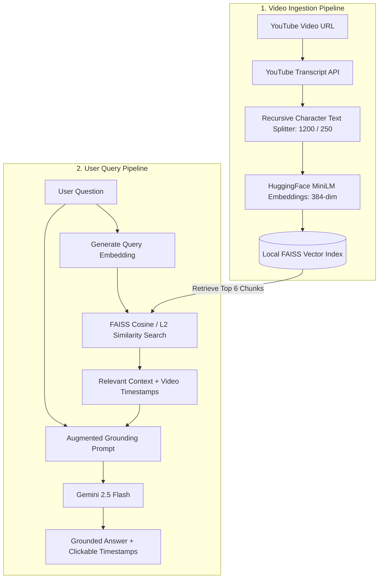
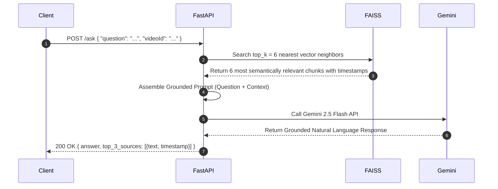
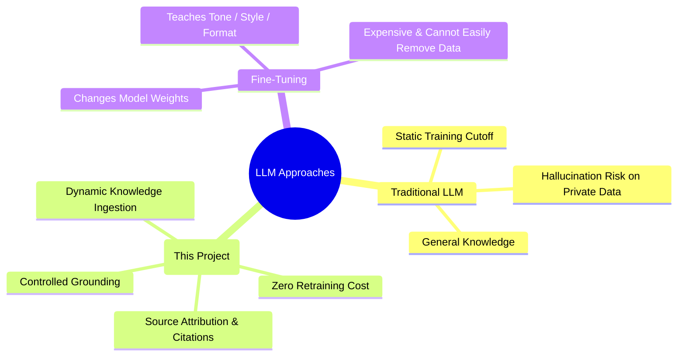

# 🤖 Video-Mind AI (YT_ChatBot) — RAG-Powered YouTube Video Intelligence

> **Project Summary**: An AI-powered video intelligence and question-answering platform built with **React, FastAPI, LangChain, HuggingFace Embeddings, FAISS, and Gemini 2.5 Flash**. 
> Uses **Retrieval-Augmented Generation (RAG)** to extract YouTube video transcripts, chunk and index them in a local vector database, and provide grounded, timestamp-backed answers, executive summaries, and key takeaways without hallucination.

---

## 📑 Table of Contents
1. [The Problem Statement & Business Goal](#1-the-problem-statement--business-goal)
2. [What is RAG? (Retrieval-Augmented Generation)](#2-what-is-rag)
3. [End-to-End System Architecture](#3-end-to-end-system-architecture)
4. [The Ingestion Pipeline (Transcript → Chunking → Vectors)](#4-the-ingestion-pipeline)
5. [The Retrieval & Generation Pipeline (Q&A Workflow)](#5-the-retrieval--generation-pipeline)
6. [Summary & Key Takeaways Generation](#6-summary--key-takeaways-generation)
7. [Tech Stack & Architectural Justifications](#7-tech-stack--architectural-justifications)
8. [RAG vs. Traditional LLM vs. Fine-Tuning](#8-rag-vs-traditional-llm-vs-fine-tuning)
9. [Key Challenges & Production Considerations](#9-key-challenges--production-considerations)
10. [Interview Preparation, Pitches & Q&A](#10-interview-preparation-pitches--qa)

---

## 1. The Problem Statement & Business Goal

### The Problem:
- Long educational and technical YouTube videos (1–3 hours) are difficult to navigate for specific answers.
- Manually scrubbing through video timelines is slow and tedious.
- Standard LLMs cannot answer questions about specific private or newly uploaded video content without hallucinations or context loss.

### The Solution:
**Video-Mind AI** allows users to input any YouTube URL, automatically indexes the video's transcript into semantic vector space, and allows users to ask questions, receiving **grounded answers paired with exact YouTube timestamp source citations**.

---

## 2. What is RAG?

**RAG (Retrieval-Augmented Generation)** connects an external dynamic knowledge base to an LLM:

```
User Query ──▶ 1. Semantic Search (FAISS) ──▶ 2. Retrieve Relevant Chunks ──▶ 3. Prompt + Chunks (Gemini) ──▶ 4. Grounded Answer
```

### Why RAG over Vanilla LLMs?
- **Zero Retraining Required**: Instantly understands brand-new videos.
- **Drastically Reduced Hallucinations**: Constrained by strict context grounding prompts.
- **Verifiable Citations**: Every answer links back to specific video timestamps.

---

## 3. End-to-End System Architecture



---

## 4. The Ingestion Pipeline

When a user submits a YouTube URL:

1. **Transcript Extraction**: Fetches timed text segments using `youtube-transcript-api`.
2. **Text Chunking**:
   - **Chunk Size**: `1200` characters ($\approx 200-250$ words).
   - **Chunk Overlap**: `250` characters (Preserves semantic context across sentence boundaries).
3. **Vector Embeddings**:
   - Model: **`sentence-transformers/all-MiniLM-L6-v2`** (HuggingFace).
   - Output: Converts each chunk into a **384-dimensional dense vector**.
4. **Vector Storage**: Indexes vectors inside **FAISS** (Facebook AI Similarity Search) and persists to local disk.

> [!TIP]
> **Cost Optimization**: Ingestion uses local HuggingFace embeddings and FAISS index creation. **Gemini API is NOT called during video loading**, ensuring zero LLM API cost during ingestion!

---

## 5. The Retrieval & Generation Pipeline

When a user asks a question (e.g., *"How does indexing work in this video?"*):



### The Grounding Prompt Template:
```text
You are an expert AI assistant answering questions about a YouTube video.
Answer the user's question STRICTLY based on the provided transcript context below.
If the answer cannot be found in the context, state "I cannot find this in the video transcript."
Do NOT make up facts or extrapolate outside the context.

Context:
{retrieved_chunks_with_timestamps}

Question: {user_question}
```

---

## 6. Summary & Key Takeaways Generation

In addition to open-ended Q&A, the platform provides:

- **Executive Summary**: Calls Gemini with full or aggregated high-relevance chunks to generate a structured 3-paragraph executive overview.
- **Key Takeaways**: Prompts Gemini to synthesize 5–7 actionable bullet points from retrieved core topics.

---

## 7. Tech Stack & Architectural Justifications

| Component | Technology | Why Chosen? |
| :--- | :--- | :--- |
| **Frontend** | React + TypeScript + Tailwind | Clean interactive UI with video player and chat interface. |
| **Backend** | Python + FastAPI | High-performance async REST API; native support for ML libraries. |
| **RAG Orchestration**| LangChain | Industry standard abstractions for chunking, prompt templates, and vector stores. |
| **Embedding Model** | HuggingFace `all-MiniLM-L6-v2` | Lightweight, fast CPU inference, high semantic accuracy (384 dimensions). |
| **Vector Database** | FAISS | In-memory, ultra-fast vector similarity search without heavy cloud DB overhead. |
| **LLM Engine** | Gemini 2.5 Flash | High speed, large context window, cost-effective reasoning and instruction following. |

---

## 8. RAG vs. Traditional LLM vs. Fine-Tuning



> **Interview Distinction**:  
> *"RAG changes the **context and knowledge** provided to the model at inference time. Fine-tuning changes the **model's internal weights** through retraining."*

---

## 9. Key Challenges & Production Considerations

### 1. Chunk Size Tuning
- *Too Small ($< 300$ chars)*: Loss of complete semantic ideas.
- *Too Large ($> 3000$ chars)*: Irrelevant context dilutes similarity search and fills LLM token budget.
- *Optimal Sweet Spot*: **1200 characters with 250 overlap**.

### 2. Video Language & Audio-only Transcripts
- Handled videos with native subtitles; for audio-only videos, the production roadmap would integrate **OpenAI Whisper** for local speech-to-text.

### 3. Production Scaling Roadmap:
- Replace local FAISS file storage with a distributed vector DB (**Pinecone / Qdrant / Milvus**) for multi-user cloud scale.
- Add Redis caching for frequently asked video queries.

---

## 10. Interview Preparation, Pitches & Q&A

### 🎙️ 60-Second Elevator Pitch
> *"Video-Mind AI is an AI-powered video intelligence platform that I built using React, FastAPI, LangChain, FAISS, and Gemini 2.5 Flash.*  
> *The problem it solves is the inefficiency of manually scrubbing through 1- to 2-hour technical YouTube videos to find specific information. The application extracts the video transcript, splits it into semantically meaningful chunks with overlap, computes 384-dimensional embeddings using HuggingFace MiniLM, and indexes them in FAISS.*  
> *When a user asks a question, the system retrieves the top-6 most relevant transcript passages using cosine similarity, augments a grounding prompt, and passes it to Gemini 2.5 Flash to generate an accurate answer along with clickable YouTube timestamp citations.*  
> *This project gave me deep hands-on experience with RAG pipelines, vector search, chunking trade-offs, and prompt engineering."*

---

### 🎯 High-Frequency Interview Questions:

#### Q1: Why did you use FAISS instead of Pinecone or Milvus?
> *"FAISS is lightweight, runs in-memory on the local server, and provides ultra-low latency similarity search without external network calls or cloud costs. For a single-user or portfolio scale system, FAISS is optimal. For an enterprise multi-tenant cloud service, I would migrate to Pinecone or Qdrant for horizontal scaling."*

#### Q2: What is the purpose of chunk overlap?
> *"Chunk overlap (250 characters in this project) ensures that critical sentences or ideas spanning across chunk boundaries are not split in half, preserving semantic continuity during embedding generation."*

#### Q3: Does RAG completely eliminate hallucinations?
> *"No, but it drastically reduces them. By combining targeted Top-K context retrieval with strict system grounding prompts ('Answer ONLY based on the provided context; if not found, say so'), we constrain the model's output to verifiable facts."*

---

### 💡 30-Second Mental Diagram to Memorize:
$$\text{Transcript} \longrightarrow \text{Chunking (1200/250)} \longrightarrow \text{Embeddings (MiniLM)} \longrightarrow \text{FAISS}$$
$$\text{Query} \longrightarrow \text{Top-6 Chunks Retrieval} \longrightarrow \text{Prompt + Context} \longrightarrow \text{Gemini 2.5 Flash} \longrightarrow \text{Answer + Timestamps}$$
