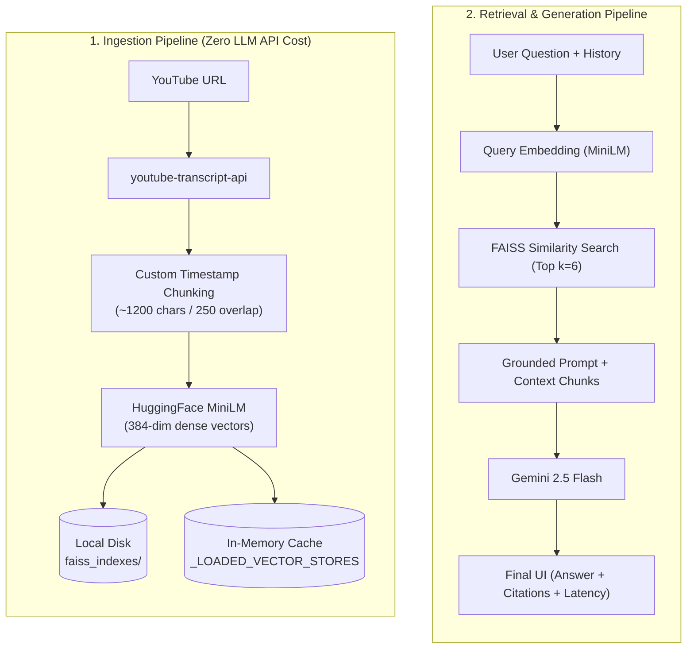
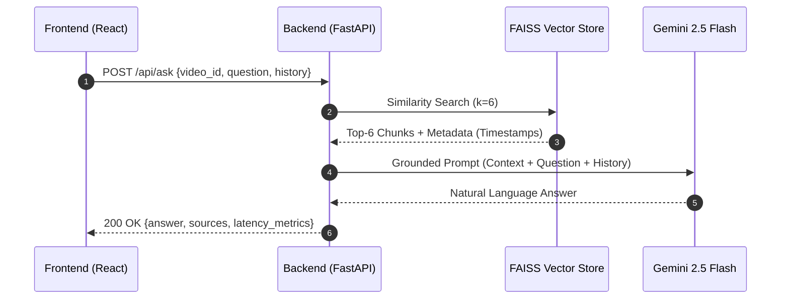
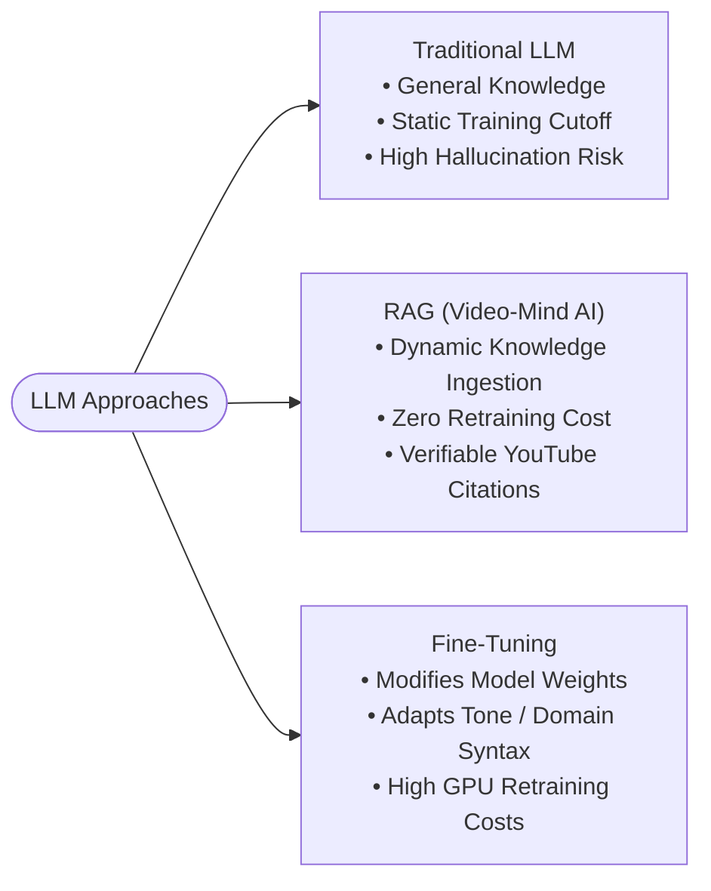

# 🤖 Video-Mind AI (YT_ChatBot) — RAG-Powered YouTube Video Intelligence

> **Project Summary**: An AI-powered video intelligence and question-answering platform built with **React, TypeScript, Tailwind CSS, FastAPI, LangChain, HuggingFace Embeddings, FAISS, and Gemini 2.5 Flash**.  
> Uses **Retrieval-Augmented Generation (RAG)** to extract YouTube video transcripts, chunk and index them in a local vector database with exact subtitle timestamps preserved, and provide grounded answers with clickable timestamp citations, structured executive summaries, key takeaways, visual Mermaid.js mind maps, and interactive quizzes without hallucinations.

---

## 📑 Table of Contents
1. [The Problem Statement & Business Goal](#1-the-problem-statement--business-goal)
2. [What is RAG? (Retrieval-Augmented Generation)](#2-what-is-rag-retrieval-augmented-generation)
3. [End-to-End System Architecture](#3-end-to-end-system-architecture)
4. [The Ingestion Pipeline (Transcript → Chunking → Vectors)](#4-the-ingestion-pipeline-transcript--chunking--vectors)
5. [The Retrieval & Generation Pipeline (Q&A Workflow)](#5-the-retrieval--generation-pipeline-qa-workflow)
6. [Multi-Modal Features (Summaries, Takeaways, Mind Maps, Quizzes)](#6-multi-modal-features-summaries-takeaways-mind-maps-quizzes)
7. [Tech Stack & Architectural Justifications](#7-tech-stack--architectural-justifications)
8. [RAG vs. Traditional LLM vs. Fine-Tuning](#8-rag-vs-traditional-llm-vs-fine-tuning)
9. [Key Challenges & Production Considerations](#9-key-challenges--production-considerations)
10. [Interview Preparation, Pitches & Q&A](#10-interview-preparation-pitches--qa)

---

## 1. The Problem Statement & Business Goal

### The Problem:
- Long technical and educational YouTube videos (1–3 hours) are difficult to navigate for specific answers.
- Manually scrubbing through video timelines is slow, imprecise, and tedious.
- Standard LLMs cannot answer questions about specific, private, or newly released videos without hallucinations or context-window limits.

### The Solution:
**Video-Mind AI** allows users to input any YouTube URL or 11-character Video ID. The system extracts the transcript, splits it into semantic chunks while maintaining precise timestamp metadata, indexes the vectors into local FAISS storage, and answers questions with exact, clickable YouTube timestamp citations (`&t=XXs`) that seek the embedded player directly to the exact moment.

---

## 2. What is RAG? (Retrieval-Augmented Generation)

**RAG (Retrieval-Augmented Generation)** connects an external, dynamic knowledge base to an LLM:

```
User Query ──▶ 1. Vector Search (FAISS) ──▶ 2. Retrieve Top-6 Chunks ──▶ 3. Grounded Prompt + Chunks (Gemini) ──▶ 4. Verifiable Answer + Timestamps
```

### Why RAG over Vanilla LLMs?
- **Zero Retraining Required**: Instantly understands brand-new videos.
- **Drastically Reduced Hallucinations**: Constrained by strict zero-shot system grounding prompts.
- **Verifiable Citations**: Every answer links directly to the video timeline.

---

## 3. End-to-End System Architecture



### Architectural Pipeline Flow:
```text
[ 1. Ingestion Pipeline (Fast & $0 LLM Cost) ]
YouTube URL ──▶ youtube-transcript-api ──▶ Custom Timestamp-Preserving Chunking (~1200 chars / 250 overlap)
                                                          │
                                                          ▼
Persistent Disk (faiss_indexes/) ◀── FAISS Index ◀── HuggingFace MiniLM (384-dim dense vectors)
                                                          │
                                                          ▼
                                             In-Memory Cache (_LOADED_VECTOR_STORES)

[ 2. Retrieval & Generation Pipeline ]
User Question + History ──▶ Query Embedding (MiniLM) ──▶ FAISS Similarity Search (Top k=6)
                                                                 │
                                                                 ▼
Final UI (Answer + Citations + Latency) ◀── Gemini 2.5 Flash ◀── Grounding Prompt + Chunks
```

---

## 4. The Ingestion Pipeline (Transcript → Chunking → Vectors)

When a user submits a YouTube URL (`POST /api/video/load`):

1. **Validation & Cache Check**:
   - Backend calls `check_faiss_index_exists(video_id)`: Checks disk in $<1\text{ms}$.
   - If `index.faiss` and `index.pkl` already exist, transcript fetching is bypassed and the video loads in $<50\text{ms}$.
2. **Transcript Extraction**:
   - Uses `youtube-transcript-api` to fetch timestamped snippet objects:  
     `[{"text": "...", "start": 12.4, "duration": 3.1}, ...]`.
3. **Timestamp-Preserving Chunking (`create_documents_from_snippets`)**:
   - **Chunk Size**: $\approx 1200$ characters ($\approx 200–250$ words).
   - **Chunk Overlap**: $\approx 250$ characters (preserves sentence continuity across chunks).
   - **Timestamp Preservation**: Groups consecutive snippets until $\approx 1200$ chars are reached and binds the start timestamp of the first snippet into `doc.metadata["start"]`.
4. **Vector Embeddings**:
   - **Model**: `sentence-transformers/all-MiniLM-L6-v2` via LangChain `HuggingFaceEmbeddings`.
   - **Output**: 384-dimensional dense vectors.
5. **Storage & Persistence**:
   - Saved locally under `faiss_indexes/<VIDEO_ID>/`:
     - `index.faiss`: Binary dense vector index for fast similarity lookups.
     - `index.pkl`: Serialized LangChain `InMemoryDocstore` storing chunk text and timestamp metadata.
   - Cached in `_LOADED_VECTOR_STORES: Dict[str, FAISS]` to prevent repeated disk reads.

> [!TIP]
> **Cost Optimization**: Ingestion uses local HuggingFace embeddings on CPU. Gemini 2.5 Flash is never called during video indexing, guaranteeing **$0 LLM API cost during video loading**.

---

## 5. The Retrieval & Generation Pipeline (Q&A Workflow)

When a user asks a question (`POST /api/ask`):



### The Grounding Prompt Template:
```text
You are a helpful AI assistant.
Answer ONLY using the provided transcript context.
If the answer is not available in the transcript, say:
"I could not find the answer in the transcript."
Do not use outside knowledge.
Do not invent information.

Transcript Context:
[{timestamp}]
{chunk_content}

Recent Conversation History:
{history}

Current Question:
{question}

Answer:
```

### Real-time Latency Telemetry:
The backend computes and returns:
- **`retrieval_ms`**: FAISS vector lookup latency ($\approx 15–40\text{ ms}$).
- **`generation_ms`**: Gemini 2.5 Flash token generation latency ($\approx 800–1200\text{ ms}$).
- **`total_ms`**: End-to-end response time displayed directly on the UI telemetry badge.

---

## 6. Multi-Modal Features (Summaries, Takeaways, Mind Maps, Quizzes)

In addition to open-ended Q&A, the backend provides 4 specialized intelligence endpoints:

1. **Executive Summary (`POST /api/video/summary`)**:
   - Retrieves top 10 core overview chunks ($k=10$).
   - Generates a structured response with: Overview, Main Concepts (bulleted), and Conclusion.
2. **Key Takeaways (`POST /api/video/takeaways`)**:
   - Retrieves top 10 insight chunks ($k=10$).
   - Generates 5–7 one-sentence actionable takeaways.
3. **Interactive Mind Map (`POST /api/video/mindmap`)**:
   - Retrieves top 10 structural chunks ($k=10$).
   - Generates valid Mermaid.js flowchart code (`graph TD`) rendered dynamically in the frontend.
4. **Interactive Quiz (`POST /api/video/quiz`)**:
   - Retrieves top 10 factual chunks ($k=10$).
   - Generates 3–4 multiple-choice questions with options, correct answer index, and explanations.

---

## 7. Tech Stack & Architectural Justifications

| Component | Technology | Why Chosen? |
| :--- | :--- | :--- |
| **Frontend** | React 19 + TypeScript + Tailwind CSS | Responsive UI with embedded YouTube player synchronization and dynamic dashboard. |
| **Backend** | Python + FastAPI | High-performance asynchronous REST API with native ML/PyTorch support. |
| **RAG Orchestration** | LangChain | Standardized abstractions for vector stores, prompt templates, and output parsers. |
| **Embedding Model** | HuggingFace `all-MiniLM-L6-v2` | Lightweight (80MB), fast CPU inference, 384-dimensional dense vectors with strong semantic accuracy. |
| **Vector Database** | FAISS (Facebook AI Similarity Search) | In-memory, ultra-fast vector search without cloud overhead or subscription costs. |
| **LLM Engine** | Gemini 2.5 Flash | Fast token generation, generous rate limits, and exceptional adherence to strict grounding constraints. |

---

## 8. RAG vs. Traditional LLM vs. Fine-Tuning



| Feature | Traditional LLM | RAG (Video-Mind AI) | Fine-Tuning |
| :--- | :--- | :--- | :--- |
| **Knowledge Base** | Static training cutoff | Real-time, dynamic per video | Embedded in model weights |
| **Hallucination Risk** | High | Low (Context-grounded) | Moderate to High |
| **Source Citations** | None | Exact YouTube timestamps | None |
| **Compute Cost** | High API token usage | Low ($0 ingestion, lean prompts) | Very High GPU training costs |

> [!IMPORTANT]
> **Interview Distinction**:  
> *"RAG changes the external context provided to the model at inference time. Fine-tuning modifies the model's internal weights through gradient descent."*

---

## 9. Key Challenges & Production Considerations

### 1. Custom Metadata-Preserving Chunking:
Standard splitters (`RecursiveCharacterTextSplitter`) operate on continuous strings and discard line-level timestamps. A custom sliding window approach aggregates snippet objects while retaining each chunk's earliest start seconds.

### 2. Chunk Size Optimization:
- **Too Small ($<300$ chars)**: Fragmented sentences, semantic context lost.
- **Too Large ($>3000$ chars)**: Diluted vector relevance and excessive context filling.
- **Sweet Spot**: 1200 characters with 250 character overlap.

### 3. Cold Start & In-Memory Caching:
Decoupled video existence checking from the heavy PyTorch embedding model, speeding up existing video loads from $\approx 6\text{s}$ to $<50\text{ms}$. Added `_LOADED_VECTOR_STORES` cache to keep active indexes hot in RAM.

### 4. Production Scaling Roadmap:
- Migrate local FAISS files to managed vector DBs (**Pinecone / Qdrant**) for multi-tenant scalability.
- Integrate **OpenAI Whisper** for videos without native transcripts.
- Add Redis for caching answers to common questions.

---

## 10. Interview Preparation, Pitches & Q&A

### 🎙️ 60-Second Elevator Pitch
> *"Video-Mind AI is an AI-powered video intelligence platform that I built using React, FastAPI, LangChain, FAISS, and Gemini 2.5 Flash. It solves the inefficiency of scrubbing through long 1- to 3-hour technical YouTube videos. The system extracts transcripts, splits them into semantically cohesive chunks while preserving exact subtitle timestamps, generates 384-dimensional embeddings using HuggingFace MiniLM, and indexes them in FAISS.  
> When a user asks a question, the backend retrieves the top-6 relevant chunks via vector similarity, injects them into a strict zero-hallucination prompt, and generates an answer with clickable timestamp links that seek the video directly to the cited moment.  
> This gave me hands-on experience with RAG architecture, vector search, chunking trade-offs, and low-latency API design."*

---

### 🎯 High-Frequency Interview Questions:

#### Q1: Why did you use FAISS instead of Pinecone or Milvus?
> *"FAISS is lightweight, runs in-memory on the local server, and provides ultra-low latency similarity search without external network calls or cloud costs. For a single-user or portfolio scale system, FAISS is optimal. For an enterprise multi-tenant cloud service, I would migrate to Pinecone or Qdrant for horizontal scaling."*

#### Q2: Why not pass the entire transcript directly to Gemini's 1M context window?
> *"Cost and latency. Passing a full 2-hour transcript (~30,000 words) on every single user question adds significant token costs and increases TTFT (Time To First Token). RAG retrieves only the 6 most relevant chunks (~1,500 tokens), making responses 5x faster and significantly cheaper."*

#### Q3: What is the purpose of chunk overlap?
> *"Chunk overlap (250 characters in this project) ensures that critical sentences or ideas spanning across chunk boundaries are not split in half, preserving semantic continuity during embedding generation."*

#### Q4: How do you prevent hallucinations?
> *"Through strict negative prompting ('If not found, say I could not find the answer in the transcript') and setting Gemini's temperature low (0.2) to prioritize precision over creativity."*

---

### 💡 30-Second Mental Diagram to Memorize:
```text
Transcript ──▶ Chunking (1200/250) ──▶ Embeddings (MiniLM) ──▶ FAISS Index
Query ──▶ Top-6 Chunks Retrieval ──▶ Prompt + Context ──▶ Gemini 2.5 Flash ──▶ Answer + Timestamps
```
