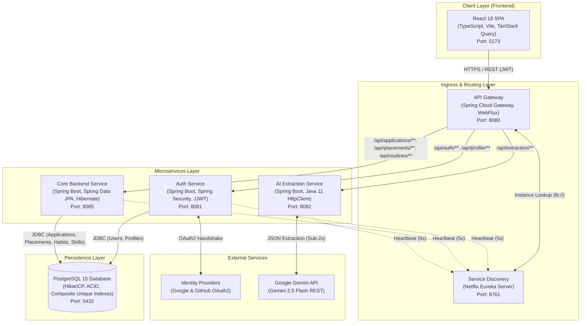
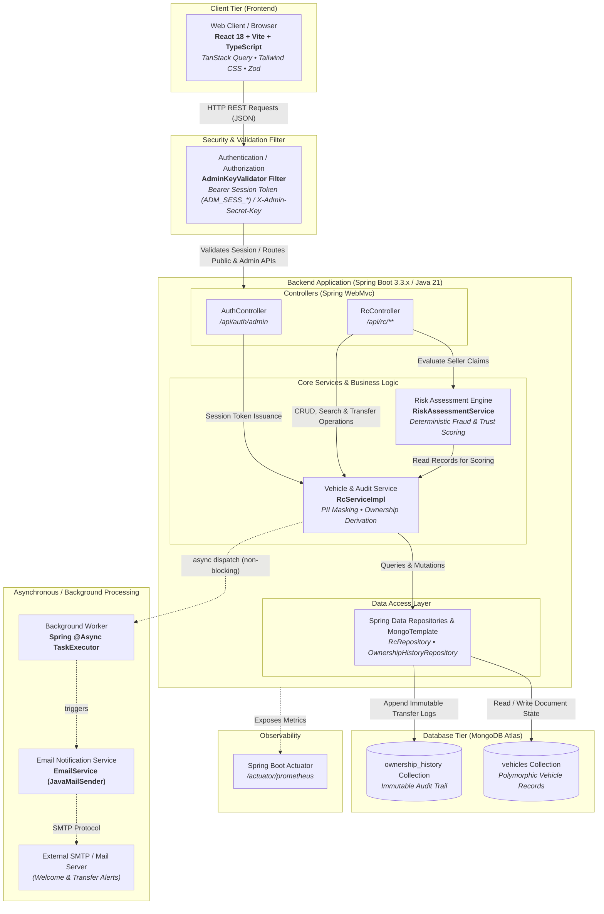
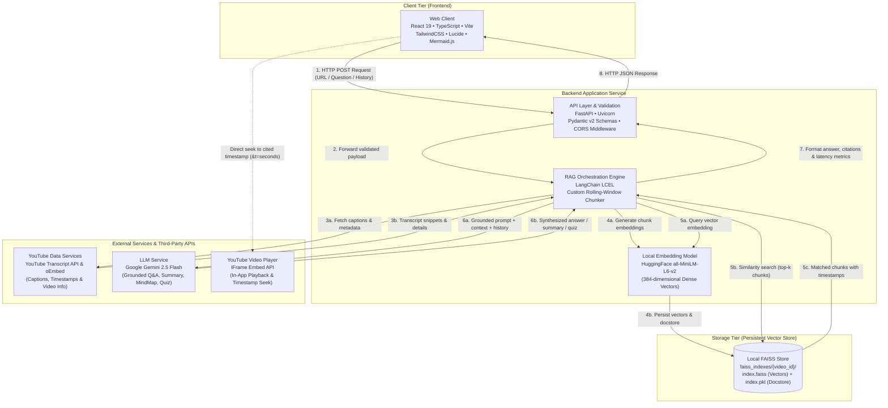

# 🏛️ System Architecture Diagrams — Projects

This document contains detailed end-to-end system architecture blueprints for:
1. 🚀 **Career OS** — Distributed Cloud-Native Microservices Architecture
2. 🚗 **Drive Verify** — Vehicle Registration & Fraud Verification Architecture
3. 🤖 **Video-Mind AI (YT_ChatBot)** — RAG YouTube Intelligence Architecture

---

## 1. 🚀 Career OS — Distributed Cloud-Native Microservices Architecture

> **Stack:** React 19 • TypeScript • Vite • Spring Boot 3.3 • Spring Cloud Gateway • Netflix Eureka • PostgreSQL 15 • Google Gemini 2.5 Flash

---

## 2. 🚗 Drive Verify — Vehicle Registration & Fraud Verification Architecture

> **Stack:** React 18 • Vite • TypeScript • TanStack Query • Spring Boot 3.3.x • Java 21 • MongoDB Atlas • Spring Data • Prometheus Actuator

---

## 3. 🤖 Video-Mind AI (YT_ChatBot) — RAG System Architecture

> **Stack:** React 19 • TypeScript • Vite • FastAPI • LangChain LCEL • HuggingFace all-MiniLM-L6-v2 • FAISS • Google Gemini 2.5 Flash

