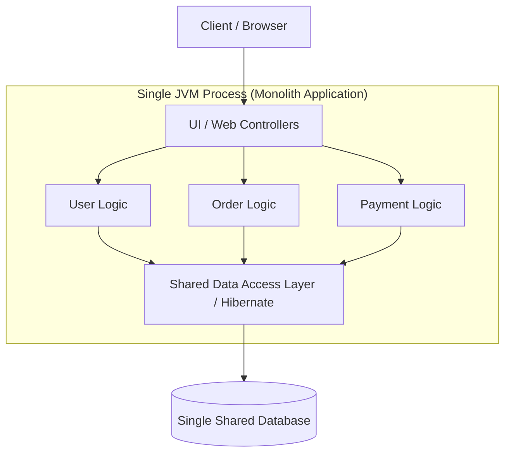
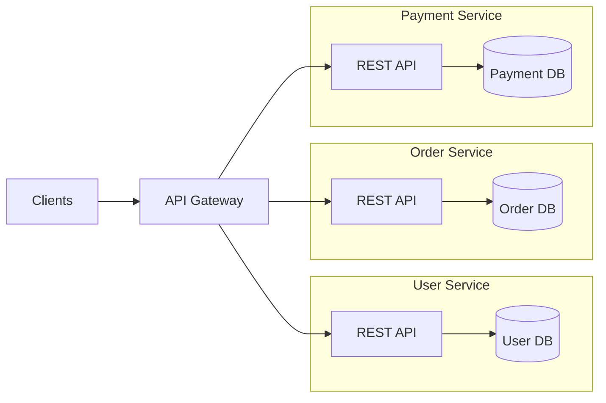
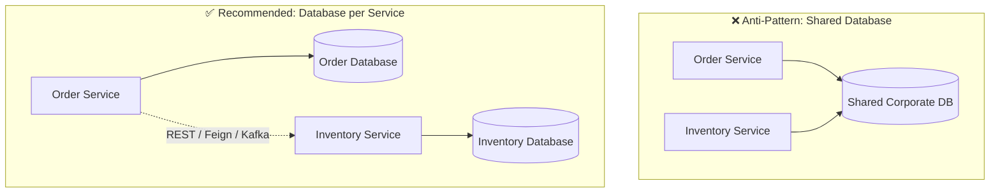
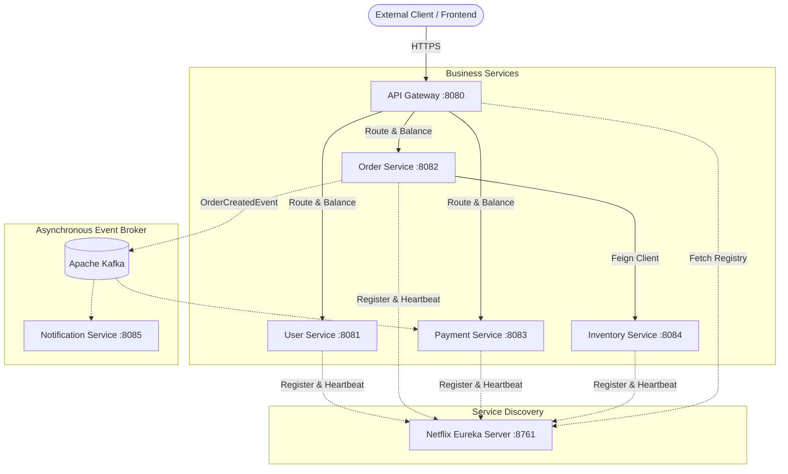
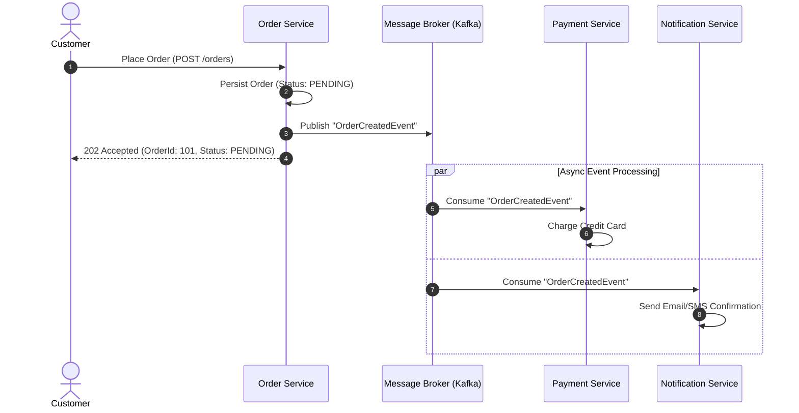

# 🏛️ 01 — Microservices Fundamentals

> **Covers Foundation & Architectural Trade-offs**  
> Understanding when to transition from a Monolith to Microservices, defining clean Domain Boundaries, adopting the **Database-per-Service** pattern, and contrasting **Synchronous vs. Asynchronous** inter-service communication.

---

## 📑 Table of Contents
1. [Monolithic Architecture: Anatomy & Challenges](#1-monolithic-architecture-anatomy--challenges)
2. [Microservices Architecture: Core Principles & Trade-offs](#2-microservices-architecture-core-principles--trade-offs)
3. [Domain Boundaries & Sizing Services](#3-domain-boundaries--sizing-services)
4. [Database-per-Service Pattern](#4-database-per-service-pattern)
5. [End-to-End Microservice Topology](#5-end-to-end-microservice-topology)
6. [Synchronous Communication (RPC / REST)](#6-synchronous-communication-rpc--rest)
7. [Asynchronous Communication (Event-Driven)](#7-asynchronous-communication-event-driven)
8. [Architectural Comparison: Sync vs. Async](#8-architectural-comparison-sync-vs-async)
9. [Interview Questions & Deep-Dive Answers](#9-interview-questions--deep-dive-answers)
10. [Core Architectural Summary](#10-core-architectural-summary)

---

## 1. Monolithic Architecture: Anatomy & Challenges

In a **Monolithic application**, all functional areas, business logic, UI rendering/controllers, and database access are packaged and deployed as a single executable artifact (e.g., a single `.jar` or `.war` file).



### Advantages of a Monolith
- **Simplicity**: Easy to develop, test locally, and run with a single `mvn spring-boot:run`.
- **Zero Network Overhead**: Calls between components are in-memory method invocations inside the same JVM (nanoseconds latency).
- **ACID Transactions**: Cross-entity transactions (`User` + `Order` + `Payment`) are trivially managed within a single database transaction via `@Transactional`.
- **Straightforward Deployment**: One pipeline, one build artifact, and simple infrastructure monitoring.

### Where Monoliths Break Down at Scale
- **Deployment Coupling**: A small bug fix in the payment module requires testing, building, and deploying the entire application.
- **Scaling Inefficiency**: If the `Order` processing requires high CPU while `User` profile requires high memory, you cannot scale them independently. The entire monolith must be duplicated across multiple servers.
- **Blast Radius**: A memory leak or uncaught OutOfMemoryError in a non-critical module (e.g., PDF generation) crashes the entire JVM process for all users.
- **Tech Stack Lock-in**: The whole system is bound to a single framework and language version; upgrading Spring Boot or Java versions becomes a massive high-risk undertaking.

---

## 2. Microservices Architecture: Core Principles & Trade-offs

A **Microservices Architecture** structures an application as a collection of small, autonomous, loosely coupled services organized around specific **business capabilities**. Each service runs in its own process and communicates via lightweight network protocols.



### Core Advantages
1. **Independent Deployability**: Teams can deploy updates to `Order Service` 10 times a day without touching or redeploying `User Service`.
2. **Horizontal Scalability on Demand**: Scale only the bottleneck service (e.g., spin up 20 instances of `Payment Service` during Black Friday, while keeping `User Service` at 2 instances).
3. **Resilience & Fault Isolation**: An outage in `Payment Service` does not crash `Order Service` if proper fallback and circuit-breaker patterns are implemented.
4. **Polyglot Flexibility**: Services can leverage different technology stacks where justified (e.g., Spring Boot for transactional processing, Python/FastAPI for ML inference).

### The Hidden Costs & Operational Complexities
> [!WARNING]
> Microservices are **not a free lunch**. They exchange software design complexity for **distributed systems operational complexity**.

- **Network Reliability & Latency**: In-memory calls (~10ns) are replaced with network calls (~10–50ms) that can fail, timeout, or experience packet loss.
- **Distributed Transactions**: You can no longer rely on single-database `@Transactional`. Maintaining data consistency across services requires patterns like **Saga** (Choreography / Orchestration) or **Two-Phase Commit (2PC)**.
- **Operational Overhead**: Requires automated CI/CD pipelines, container orchestration (Docker, Kubernetes), centralized logging, and service registries.
- **Debugging & Tracing**: A single user click might hop across 6 distinct services; diagnosing latency or errors requires distributed tracing tools (Micrometer, Zipkin, OpenTelemetry).

---

## 3. Domain Boundaries & Sizing Services

A common architectural anti-pattern is decomposing services by **technical layers** rather than **business domains**.

```text
❌ WRONG (Technical Layering):
├── Controller-Service   (Only routing)
├── Service-Layer-Service (Business logic)
└── Repository-Service   (Database access)
```
*Result*: Extreme network latency for every request, zero business autonomy, and tight coupling.

```text
✅ CORRECT (Domain-Driven Design / Business Capabilities):
├── User Service        (Authentication, Profiles, Roles)
├── Order Service       (Cart, Checkout, Order Lifecycle)
├── Inventory Service   (Stock reservations, Warehouses)
└── Payment Service     (Gateway integrations, Refunds)
```

### Guiding Rules for Service Boundaries
- **Single Responsibility Principle (SRP)**: A service should have one reason to change, driven by a specific business domain stakeholder.
- **High Cohesion, Loose Coupling**: Logic that changes together should live inside the same service. Interactions with other services should occur strictly through stable public APIs.
- **Autonomous Team Ownership**: A "Two-Pizza Team" should be able to design, develop, test, and deploy a service without blocking on other teams.

---

## 4. Database-per-Service Pattern

In true microservices, **each microservice must own and manage its private database**. No other service is permitted to access that database directly.



### Why Shared Databases are Dangerous
1. **Hidden Schema Coupling**: If `Inventory Service` renames a column in table `product_stock`, `Order Service` breaks at runtime without warning.
2. **Connection Pool Contention**: High query volume from reporting or analytics can starve critical transactional connections.
3. **Impeded Technology Choice**: Forces all domains into the same storage paradigm, preventing `Order Service` from using PostgreSQL while `Recommendation Service` uses Neo4j or Redis.

### How Services Share Data
- **Synchronous API Query**: `Order Service` calls `GET /inventory/{sku}` via Feign/RestClient.
- **Asynchronous Event Projection (CQRS)**: `Order Service` listens to `StockChangedEvent` from Kafka and stores a local read-model replica of relevant inventory counts.

---

## 5. End-to-End Microservice Topology

A production Spring Boot microservices landscape requires supporting infrastructure alongside business services:



---

## 6. Synchronous Communication (RPC / REST)

In **Synchronous Communication**, the caller sends a request over HTTP/REST and blocks or waits for the downstream service to compute and return a response.

```text
Order Service                               Payment Service
      │                                            │
      │── 1. POST /payments (Process $150) ───────>│
      │   [Thread Waiting / Non-blocking IO]       │── 2. Validate Card & Process
      │<── 3. 200 OK (PaymentStatus: SUCCESS) ─────│
      ▼                                            ▼
```

### When to Use
- When the client cannot proceed without the immediate response (e.g., Fetching user profile details to render on screen, checking real-time price calculation).
- When operations are lightweight, fast, and idempotent.

### Vulnerabilities
- **Cascading Failure Risk**: If `Payment Service` slows down from 50ms to 8 seconds, `Order Service` worker threads remain occupied waiting for responses. Soon, `Order Service` runs out of threads, crashing as well.
- **Tight Temporal Coupling**: Both caller and callee must be online and available at the exact same moment.

---

## 7. Asynchronous Communication (Event-Driven)

In **Asynchronous Communication**, the producer publishes an event or command message to an intermediary message broker (Kafka, RabbitMQ) and immediately returns a confirmation to the caller without waiting for the downstream consumers to finish.



### Core Benefits
- **Temporal Decoupling**: Consumers do not need to be running when the event is produced. If `Notification Service` is down for maintenance, messages buffer in the broker and process upon recovery.
- **Traffic Smoothing (Load Leveling)**: Spikes in checkout requests sit safely in the message queue without overwhelming downstream payment backends.
- **High Fan-out**: Multiple decoupled services can react to a single event without modifying the publisher.

---

## 8. Architectural Comparison: Sync vs. Async

| Dimension | Synchronous (REST / OpenFeign) | Asynchronous (Kafka / RabbitMQ) |
|---|---|---|
| **Interaction Model** | Request / Response | Publish / Subscribe or Message Queue |
| **Caller Blocking** | Caller waits for completion | Caller fire-and-forgets (non-blocking) |
| **Coupling** | High temporal coupling (both must be up) | Loose temporal and spatial coupling |
| **Protocol** | HTTP / HTTPS (JSON/Protobuf) | TCP-based Broker Protocol (AMQP / Kafka Binary) |
| **Failure Mode** | Cascading timeouts if downstream fails | Messages queue up; consumers recover gracefully |
| **Consistency Model** | Immediate Consistency | Eventual Consistency |
| **Debugging Complexity** | Moderate (standard stack traces) | High (tracing messages across async boundaries) |
| **Typical Use Cases** | Read queries, immediate validation | Background jobs, checkout pipelines, notifications |

---

## 9. Interview Questions & Deep-Dive Answers

### Q1: When should an engineering team choose a Monolith over Microservices?
> **Answer**:  
> A Monolith is preferred when:
> 1. **Early Stage / MVP**: Domain boundaries are still fluctuating rapidly, and business models are unproven.
> 2. **Small Team Size**: When a team has fewer than 10–15 developers, the operational tax of microservices (registries, gateways, CI/CD pipelines, distributed tracing) outweighs the architectural benefits.
> 3. **High Co-locality Needs**: When ultra-low latency (<1ms) and strict ACID transactional guarantees across all entities are non-negotiable.

### Q2: Why is the Database-per-Service pattern mandatory in microservices?
> **Answer**:  
> Sharing a database creates hidden runtime coupling. If Service A alters a table schema, Service B breaks without compile-time warnings. It also prevents independent database scaling, creates connection starvation under load, and prevents teams from choosing polyglot storage engines optimized for their workload.

### Q3: How do you achieve transactional consistency across microservices without distributed ACID locks?
> **Answer**:  
> We use the **Saga Pattern**, which coordinates a sequence of local transactions across multiple services:
> - **Choreography**: Each service executes its local transaction and publishes an event that triggers the next service. If a step fails, compensating events are emitted to undo previous steps.
> - **Orchestration**: A centralized Saga Orchestrator tells participants what transactions to execute and triggers compensating transactions upon failure.

---

## 10. Core Architectural Summary

```text
┌─────────────────────────────────────────────────────────────────────────┐
│                      MICROSERVICES GOLDEN RULES                         │
├─────────────────────────────────────────────────────────────────────────┤
│ 1. Align boundaries to Business Capabilities (DDD), not Technical layers│
│ 2. Enforce Database-per-Service — never share transactional databases   │
│ 3. Favor Asynchronous Messaging for state changes (Eventual Consistency)│
│ 4. Protect Synchronous REST calls with Timeouts and Circuit Breakers    │
│ 5. Treat Operational Tooling (CI/CD, Tracing, Gateway) as 1st-class code │
└─────────────────────────────────────────────────────────────────────────┘
```
