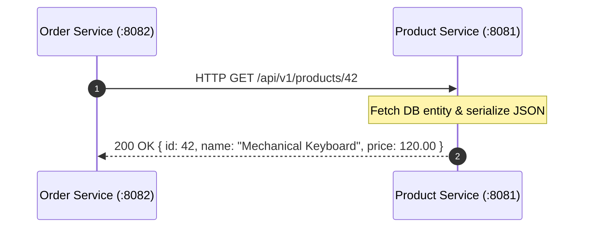
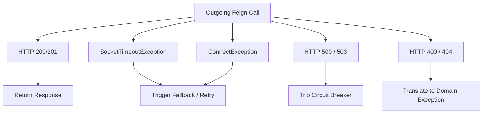
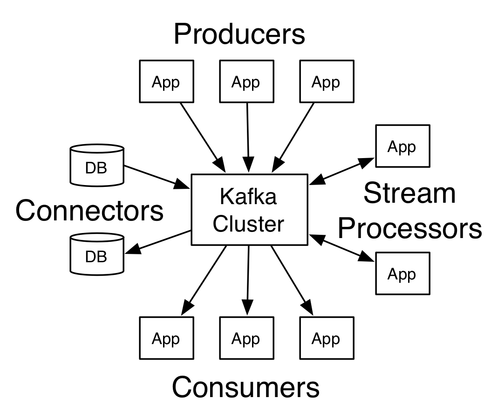

# 📡 02 — Service-to-Service Communication

> **Covers Inter-Service Synchronous Invocations & Declarative Clients**  
> Evolution from legacy `RestTemplate` to modern Spring 6 `RestClient`, mastering declarative RPC with **Spring Cloud OpenFeign**, request interceptors, custom error decoders, timeouts, and event brokers.

---

## 📑 Table of Contents
1. [Communication Paradigms in Microservices](#1-communication-paradigms-in-microservices)
2. [Legacy Synchronous Client: RestTemplate](#2-legacy-synchronous-client-resttemplate)
3. [Modern Fluent Client: Spring 6 RestClient](#3-modern-fluent-client-spring-6-restclient)
4. [Declarative REST Client: Spring Cloud OpenFeign](#4-declarative-rest-client-spring-cloud-openfeign)
5. [Enabling & Configuring OpenFeign](#5-enabling--configuring-openfeign)
6. [Feign Customization: Interceptors, Timeouts & Error Decoders](#6-feign-customization-interceptors-timeouts--error-decoders)
7. [Comparative Matrix: RestTemplate vs. RestClient vs. OpenFeign](#7-comparative-matrix-resttemplate-vs-restclient-vs-openfeign)
8. [Failure Modes & Exception Handling](#8-failure-modes--exception-handling)
9. [Event-Driven Asynchronous Integration](#9-event-driven-asynchronous-integration)
10. [Interview Questions & Deep-Dive Answers](#10-interview-questions--deep-dive-answers)
11. [Core Architectural Summary](#11-core-architectural-summary)

---

## 1. Communication Paradigms in Microservices

When `Order Service` needs product details or pricing to process a checkout, it must make a remote procedure call (RPC) over the network to `Product Service`:



In the Spring ecosystem, this synchronous communication evolved across three major generations:
1. **RestTemplate** (Spring 3.0+): Imperative, template-method based, maintenance mode.
2. **WebClient** (Spring 5.0+): Reactive / non-blocking (requires WebFlux / Project Reactor).
3. **RestClient** (Spring 6.0 / Boot 3.0+): Modern fluent API built on synchronous HTTP infrastructure.
4. **Spring Cloud OpenFeign**: Declarative, annotation-driven proxy interface.

---

## 2. Legacy Synchronous Client: RestTemplate

For over a decade, `RestTemplate` was the default synchronous HTTP client in Spring.

```java
@Configuration
public class AppConfig {
    @Bean
    public RestTemplate restTemplate() {
        return new RestTemplate();
    }
}
```

```java
@Service
public class OrderService {
    @Autowired
    private RestTemplate restTemplate;

    public ProductDTO getProductDetails(Long productId) {
        String url = "http://localhost:8081/api/v1/products/" + productId;
        // Imperative execution
        ResponseEntity<ProductDTO> response = restTemplate.getForEntity(url, ProductDTO.class);
        return response.getBody();
    }
}
```

### Why RestTemplate is Deprecated in Modern Design
- **Heavy Overload footprint**: Over 40+ overloaded methods (`getForObject`, `getForEntity`, `postForLocation`, `exchange`, `execute`).
- **Verbose Boilerplate**: Manually constructing URLs, headers, and request bodies is tedious and error-prone.
- **Maintenance Status**: Spring team officially placed `RestTemplate` into maintenance mode as of Spring Framework 5.x in favor of fluent alternatives.

---

## 3. Modern Fluent Client: Spring 6 RestClient

Introduced in **Spring Framework 6.0 and Spring Boot 3.2**, `RestClient` brings the modern, fluent syntax of WebClient to traditional synchronous blocking architectures without needing reactive dependencies.

```java
@Service
public class OrderService {

    private final RestClient restClient;

    public OrderService(RestClient.Builder builder) {
        this.restClient = builder
                .baseUrl("http://localhost:8081")
                .defaultHeader("Accept", MediaType.APPLICATION_JSON_VALUE)
                .build();
    }

    public ProductDTO getProduct(Long productId) {
        return restClient.get()
                .uri("/api/v1/products/{id}", productId)
                .retrieve()
                .onStatus(HttpStatusCode::is4xxClientError, (req, resp) -> {
                    throw new ProductNotFoundException("Product not found: " + productId);
                })
                .body(ProductDTO.class);
    }
}
```

### Advantages of RestClient
- **Fluent, Chainable API**: Cleaner readability and builder syntax.
- **Synchronous & Lightweight**: No Project Reactor / WebFlux runtime overhead.
- **Clean Exception Handling**: Dedicated `.onStatus()` hooks for custom status-code handling.

---

## 4. Declarative REST Client: Spring Cloud OpenFeign

**OpenFeign** allows developers to declare HTTP clients using standard Spring MVC annotations on a Java interface. You write **zero implementation code**; Spring Cloud generates dynamic runtime proxy beans behind the scenes.

```mermaid
flowchart LR
    subgraph ClientService ["Order Service"]
        Service[OrderService.java] --> Interface["@FeignClient ProductClient (Interface)"]
        Interface --> Proxy["Feign Dynamic Proxy (JDK Reflection)"]
    end
    
    Proxy -->|HTTP GET /products/{id}| RemoteService["Product Service API"]
```

### The Declarative Interface
```java
@FeignClient(name = "product-service", url = "${product.service.url:http://localhost:8081}")
public interface ProductClient {

    @GetMapping("/api/v1/products/{id}")
    ProductDTO getProductById(@PathVariable("id") Long id);

    @PostMapping("/api/v1/products")
    ProductDTO createProduct(@RequestBody CreateProductRequest request);
}
```

### Usage in Service Layer
```java
@Service
public class OrderService {

    private final ProductClient productClient;

    public OrderService(ProductClient productClient) {
        this.productClient = productClient;
    }

    public OrderResponse createOrder(OrderRequest request) {
        // Looks like a regular local Java method call!
        ProductDTO product = productClient.getProductById(request.getProductId());
        
        // Process order logic...
        return new OrderResponse("ORDER-CREATED", product.getPrice());
    }
}
```

---

## 5. Enabling & Configuring OpenFeign

### Step 1: Add Maven Dependency
```xml
<dependency>
    <groupId>org.springframework.cloud</groupId>
    <artifactId>spring-cloud-starter-openfeign</artifactId>
</dependency>
```

### Step 2: Enable Feign Clients on Main Application
```java
@SpringBootApplication
@EnableFeignClients(basePackages = "com.company.orderservice.client")
public class OrderServiceApplication {
    public static void main(String[] args) {
        SpringApplication.run(OrderServiceApplication.class, args);
    }
}
```

---

## 6. Feign Customization: Interceptors, Timeouts & Error Decoders

In enterprise production microservices, raw HTTP calls require authentication headers, strict timeouts, and meaningful error parsing.

### A. Request Interceptors (Header & Token Propagation)
Interceptors append headers (such as JWT bearer tokens or Correlation IDs) before any outgoing request leaves the service:

```java
@Configuration
public class FeignClientConfig {

    @Bean
    public RequestInterceptor authHeaderInterceptor() {
        return requestTemplate -> {
            // Propagate SecurityContext Token or TraceId
            requestTemplate.header("Authorization", "Bearer " + SecurityUtils.getJwtToken());
            requestTemplate.header("X-Source-Service", "order-service");
        };
    }
}
```

### B. Custom Timeout Configuration (`application.yml`)
Never allow Feign calls to wait indefinitely:

```yaml
spring:
  cloud:
    openfeign:
      client:
        config:
          default:
            connectTimeout: 2000     # 2 seconds connection timeout
            readTimeout: 5000        # 5 seconds read timeout
            loggerLevel: full
          product-service:           # Service-specific override
            connectTimeout: 1000
            readTimeout: 3000
```

### C. Custom ErrorDecoder (Graceful Exception Translation)
By default, Feign wraps remote HTTP 4xx/5xx responses in a generic `FeignException`. An `ErrorDecoder` translates remote status codes into domain-specific exceptions:

```java
public class CustomFeignErrorDecoder implements ErrorDecoder {

    private final ErrorDecoder defaultDecoder = new Default();

    @Override
    public Exception decode(String methodKey, Response response) {
        HttpStatus status = HttpStatus.valueOf(response.status());
        
        return switch (status) {
            case NOT_FOUND -> new ResourceNotFoundException("Resource not found from downstream: " + methodKey);
            case BAD_REQUEST -> new InvalidRequestException("Invalid payload sent to downstream service");
            case SERVICE_UNAVAILABLE -> new DownstreamUnavailableException("Downstream dependency temporarily down");
            default -> defaultDecoder.decode(methodKey, response);
        };
    }
}
```

---

## 7. Comparative Matrix: RestTemplate vs. RestClient vs. OpenFeign

| Feature | RestTemplate | RestClient (Spring 6) | Spring Cloud OpenFeign |
|---|---|---|---|
| **Coding Style** | Imperative / Template Method | Fluent / Builder Chaining | Declarative / Annotation-driven |
| **Status in Spring** | Maintenance Mode | Active & Recommended | Active & Recommended for Cloud |
| **Interface-Driven** | ❌ No | ❌ No | ✅ Yes (Clean Java Interface) |
| **Service Discovery Integration** | Requires `@LoadBalanced` | Requires `@LoadBalanced` | Native Integration via service name |
| **Boilerplate Code** | High | Low | Minimum (Zero implementation) |
| **Best Used For** | Legacy applications | General external REST calls | Microservice-to-microservice RPC |

---

## 8. Failure Modes & Exception Handling

Remote network calls are prone to **partial failure**. A resilient microservice must account for:



> [!IMPORTANT]
> Never catch generic `Exception` and silently return null. If an inventory check fails due to network outage, your business logic must either throw an alertable downstream exception or route to an approved degraded fallback.

---

## 9. Event-Driven Asynchronous Integration

While synchronous REST / OpenFeign works well for immediate queries, event-driven communication (e.g. Apache Kafka) is used when requests can be processed in the background or distributed to multiple subscribers:



---

## 10. Interview Questions & Deep-Dive Answers

### Q1: What makes OpenFeign "declarative"?
> **Answer**:  
> In imperative clients (`RestTemplate`), the developer writes explicit code to build the URL, set headers, serialize the body, make the HTTP request, and deserialize the response. In OpenFeign, the developer merely writes an interface with Spring MVC annotations (`@GetMapping`, `@PathVariable`). Spring Cloud dynamically builds a proxy object implementing that interface at runtime.

### Q2: How does OpenFeign integrate with Eureka for dynamic routing?
> **Answer**:  
> When the `name` attribute of `@FeignClient(name = "product-service")` matches a registered application ID in Eureka, Spring Cloud Feign bypasses hardcoded URLs. It queries the local Eureka registry cache, resolves available IP:Port endpoints, and uses Spring Cloud LoadBalancer to pick an instance.

### Q3: Why is a read timeout critical for Feign clients?
> **Answer**:  
> If downstream `Payment Service` hangs due to a database deadlock without terminating the TCP connection, the calling thread in `Order Service` blocks forever. If Tomcat has a pool of 200 threads, 200 concurrent requests will exhaust the thread pool, causing the entire `Order Service` to freeze. Setting a 2–3 second `readTimeout` ensures threads fail-fast and free resources.

---

## 11. Core Architectural Summary

```text
┌─────────────────────────────────────────────────────────────────────────┐
│                    SERVICE COMMUNICATION BEST PRACTICES                 │
├─────────────────────────────────────────────────────────────────────────┤
│ 1. Use OpenFeign for clean, maintainable microservice-to-microservice RPC│
│ 2. Use Spring 6 RestClient for external, third-party API integrations   │
│ 3. Always set connectTimeout and readTimeout on every remote client     │
│ 4. Implement RequestInterceptor to propagate Security Tokens / Trace IDs│
│ 5. Use ErrorDecoder to translate raw FeignExceptions into Domain Errors │
│ 6. Leverage Kafka Event Streaming for high-throughput async processing  │
└─────────────────────────────────────────────────────────────────────────┘
```
