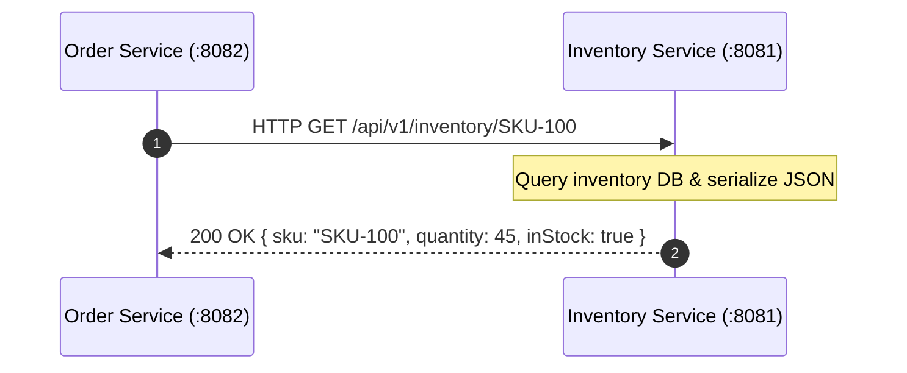
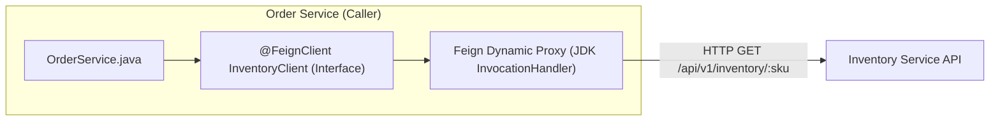
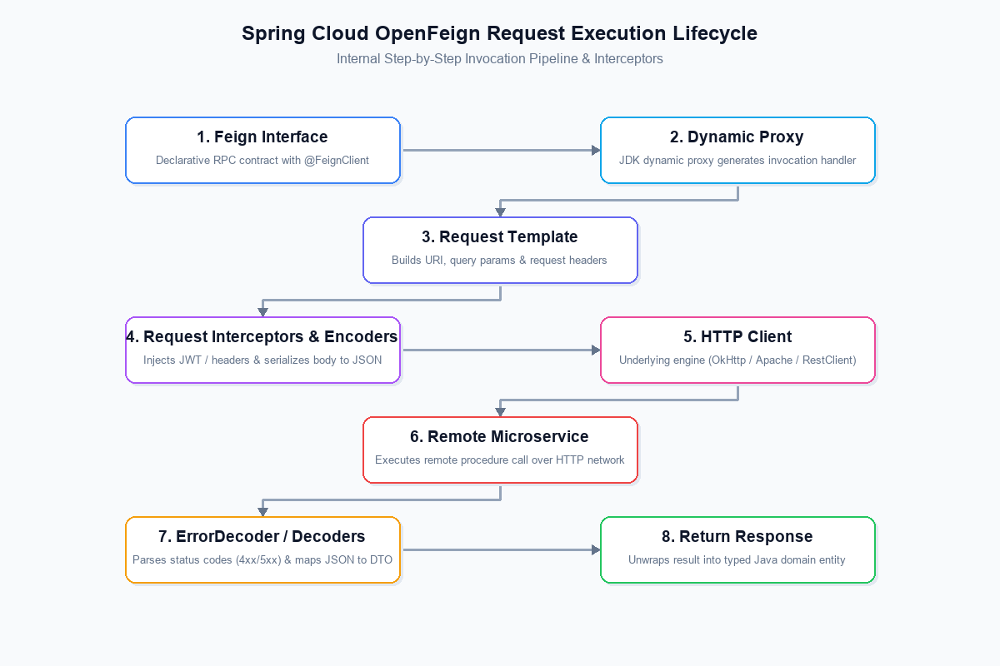
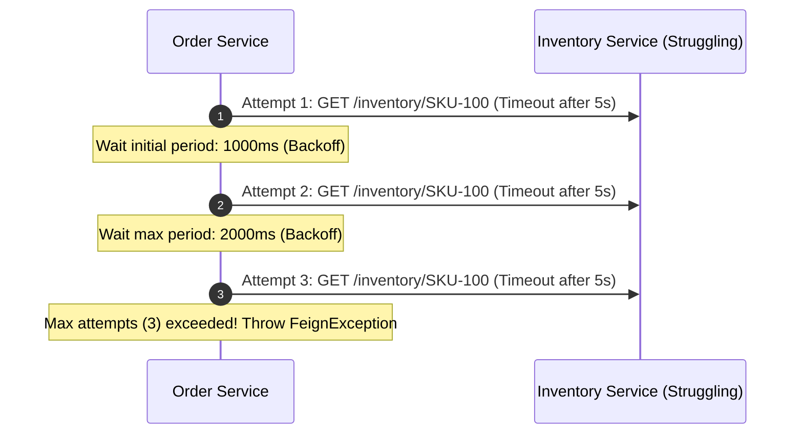
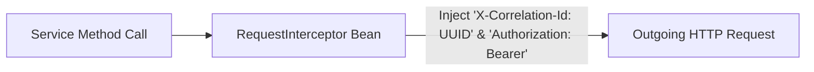

# 📡 02 — Service-to-Service Communication & Advanced OpenFeign

> **Covers Inter-Service Synchronous Invocations & Deep-Dive Feign Customization**  
> Evolution from legacy `RestTemplate` to modern Spring 6 `RestClient`, mastering declarative RPC with **Spring Cloud OpenFeign**, Global vs. Per-Client configuration, logging levels, timeouts with redirection, retryers, request interceptors, custom error decoders, custom encoders/decoders, and production architectures.

---

## 📑 Table of Contents
1. [Communication Paradigms in Microservices](#1-communication-paradigms-in-microservices)
2. [Legacy Synchronous Client: RestTemplate](#2-legacy-synchronous-client-resttemplate)
3. [Modern Fluent Client: Spring 6 RestClient](#3-modern-fluent-client-spring-6-restclient)
4. [Declarative REST Client: Spring Cloud OpenFeign](#4-declarative-rest-client-spring-cloud-openfeign)
5. [OpenFeign Execution Lifecycle & Pipeline Flow](#5-openfeign-execution-lifecycle--pipeline-flow)
6. [Enabling & Registering Feign Clients](#6-enabling--registering-feign-clients)
7. [Global Feign Configuration & Advanced Logging](#7-global-feign-configuration--advanced-logging)
8. [Per-Client Custom Configuration](#8-per-client-custom-configuration)
9. [Timeout Tuning & Automatic Retry Mechanics](#9-timeout-tuning--automatic-retry-mechanics)
10. [Request Interceptors: Authentication & Distributed Tracing](#10-request-interceptors-authentication--distributed-tracing)
11. [Custom Error Handling via ErrorDecoder](#11-custom-error-handling-via-errordecoder)
12. [Custom Encoders and Decoders](#12-custom-encoders-and-decoders)
13. [Comparative Matrix: RestTemplate vs. RestClient vs. OpenFeign](#13-comparative-matrix-resttemplate-vs-restclient-vs-openfeign)
14. [Real-World Production Use Cases](#14-real-world-production-use-cases)
15. [Event-Driven Asynchronous Integration](#15-event-driven-asynchronous-integration)
16. [Interview Questions & Deep-Dive Answers](#16-interview-questions--deep-dive-answers)
17. [Core Architectural Summary](#17-core-architectural-summary)

---

## 1. Communication Paradigms in Microservices

When `Order Service` needs product details or inventory counts to fulfill a customer checkout, it must make a remote procedure call (RPC) over the network to `Inventory Service`:



In the Spring ecosystem, synchronous inter-service communication evolved across major architectural generations:
1. **RestTemplate** (Spring 3.0+): Imperative, template-method based, maintenance mode.
2. **WebClient** (Spring 5.0+): Reactive / non-blocking (requires WebFlux / Project Reactor).
3. **RestClient** (Spring 6.0 / Boot 3.2+): Modern fluent synchronous client.
4. **Spring Cloud OpenFeign**: Declarative, annotation-driven proxy interface that simplifies network calls into normal Java method invocations.

---

## 2. Legacy Synchronous Client: RestTemplate

For over a decade, `RestTemplate` was the standard synchronous HTTP client in Spring.

```java
@Configuration
public class AppConfig {
    @Bean
    public RestTemplate restTemplate() {
        return new RestTemplate();
    }
}
```

```java
@Service
public class OrderService {
    @Autowired
    private RestTemplate restTemplate;

    public InventoryDTO checkInventory(String sku) {
        String url = "http://localhost:8081/api/v1/inventory/" + sku;
        // Imperative execution: manual URL, headers, and class mapping
        ResponseEntity<InventoryDTO> response = restTemplate.getForEntity(url, InventoryDTO.class);
        return response.getBody();
    }
}
```

### Why RestTemplate is Deprecated in Modern Design
- **Heavy Overload footprint**: Over 40+ overloaded methods (`getForObject`, `getForEntity`, `postForLocation`, `exchange`, `execute`).
- **Verbose Boilerplate**: Manually constructing URLs, headers, query parameters, and request bodies is tedious and error-prone.
- **Maintenance Status**: The Spring team officially placed `RestTemplate` into maintenance mode as of Spring Framework 5.x in favor of fluent alternatives (`RestClient`).

---

## 3. Modern Fluent Client: Spring 6 RestClient

Introduced in **Spring Framework 6.0 and Spring Boot 3.2**, `RestClient` brings the modern, fluent syntax of WebClient to traditional synchronous blocking architectures without needing reactive dependencies.

```java
@Service
public class OrderService {

    private final RestClient restClient;

    public OrderService(RestClient.Builder builder) {
        this.restClient = builder
                .baseUrl("http://localhost:8081")
                .defaultHeader("Accept", MediaType.APPLICATION_JSON_VALUE)
                .build();
    }

    public InventoryDTO getInventory(String sku) {
        return restClient.get()
                .uri("/api/v1/inventory/{sku}", sku)
                .retrieve()
                .onStatus(HttpStatusCode::is4xxClientError, (req, resp) -> {
                    throw new ResourceNotFoundException("Inventory SKU not found: " + sku);
                })
                .body(InventoryDTO.class);
    }
}
```

### Advantages of RestClient
- **Fluent, Chainable API**: Cleaner readability and builder syntax.
- **Synchronous & Lightweight**: No Project Reactor / WebFlux runtime overhead.
- **Clean Exception Handling**: Dedicated `.onStatus()` hooks for custom status-code handling.

---

## 4. Declarative REST Client: Spring Cloud OpenFeign

**OpenFeign** allows developers to declare HTTP clients using standard Spring MVC annotations on a Java interface. You write **zero implementation code**; Spring Cloud generates dynamic runtime proxy beans behind the scenes.



### The Declarative Interface
```java
@FeignClient(name = "inventory-service", url = "${inventory.service.url:http://localhost:8081}")
public interface InventoryClient {

    @GetMapping("/api/v1/inventory/{sku}")
    InventoryDTO checkInventory(@PathVariable("sku") String sku);

    @PostMapping("/api/v1/inventory")
    InventoryDTO updateStock(@RequestBody UpdateStockRequest request);
}
```

### Usage in Service Layer
```java
@Service
public class OrderService {

    private final InventoryClient inventoryClient;

    public OrderService(InventoryClient inventoryClient) {
        this.inventoryClient = inventoryClient;
    }

    public OrderResponse placeOrder(OrderRequest request) {
        // Looks and feels like a regular local Java method invocation!
        InventoryDTO inventory = inventoryClient.checkInventory(request.getSku());
        
        if (!inventory.isInStock()) {
            throw new OutOfStockException("Item currently unavailable");
        }
        
        return new OrderResponse("ORDER_PLACED", request.getSku());
    }
}
```

---

## 5. OpenFeign Execution Lifecycle & Pipeline Flow

Understanding how Feign handles method invocations internally from interface proxy to wire serialization:



```text
Detailed 8-Step Invocation Pipeline:
1. Feign Interface      → Method call: inventoryClient.checkInventory("SKU-100")
2. Dynamic Proxy        → JDK InvocationHandler intercepts call and extracts metadata
3. Request Template     → Compiles URL, path variables, query params & headers
4. Encoders & Intercept → Applies RequestInterceptors (Auth/TraceId); encodes body to JSON
5. HTTP Client          → Dispatches socket request via underlying client (OkHttp / Apache / RestClient)
6. Remote Microservice  → Target service processes HTTP request over network
7. ErrorDecoder/Decoder → Deserializes response JSON into DTO or maps 4xx/5xx to exceptions
8. Return Response      → Returns strongly typed Java domain entity to calling service
```

---

## 6. Enabling & Registering Feign Clients

### Step 1: Add Maven Dependency
```xml
<dependency>
    <groupId>org.springframework.cloud</groupId>
    <artifactId>spring-cloud-starter-openfeign</artifactId>
</dependency>
```

### Step 2: Enable Feign Clients on Main Application
```java
@SpringBootApplication
@EnableFeignClients(basePackages = "com.company.orderservice.client")
public class OrderServiceApplication {
    public static void main(String[] args) {
        SpringApplication.run(OrderServiceApplication.class, args);
    }
}
```

---

## 7. Global Feign Configuration & Advanced Logging

By default, Feign provides default implementations for encoders, decoders, error decoders, and logger levels. By default, **Feign logs nothing** (`Logger.Level.NONE`).

### Overriding Global Logger Level
To apply a global configuration to **all Feign clients** in the entire application, define a configuration class with a `@Bean` returning `feign.Logger.Level`:

```java
package com.company.orderservice.client.config;

import feign.Logger;
import org.springframework.context.annotation.Bean;
import org.springframework.context.annotation.Configuration;

@Configuration
public class GlobalFeignConfig {

    @Bean
    public Logger.Level feignLoggerLevel() {
        return Logger.Level.FULL; // Global logger level for all Feign clients
    }
}
```

### Feign Logger Levels Compared
| Log Level | Output Details | Use Case |
|---|---|---|
| **`NONE`** | No logs (Default) | High-throughput production environments |
| **`BASIC`** | Method, URL, Response status code, Execution time | Production performance tracking |
| **`HEADERS`** | Basic info + Request and Response Headers | Debugging headers, cookies, and tokens |
| **`FULL`** | Headers + Request & Response Body + Metadata | Local development & intensive debugging |

> [!IMPORTANT]
> **Why logs might not show up:**  
> Spring Boot restricts package logging by default. In order for Feign's `FULL` or `DEBUG` logs to print to the console, you **must enable DEBUG logging** for the Feign client package in `application.yml`:
> ```yaml
> logging:
>   level:
>     com.company.orderservice.client: DEBUG
> ```

---

## 8. Per-Client Custom Configuration

In enterprise microservices, an `Order Service` may talk to 5 different services (e.g., `InventoryClient`, `PaymentClient`, `NotificationClient`). You should **not** apply the same configuration to everyone:
- `PaymentClient`: Needs strict timeouts (2s) and `FULL` logging for audit trails.
- `InventoryClient`: Needs moderate timeouts (5s) and `BASIC` logging.

### Step 1: Create a Specific Client Configuration Class
Do **not** add `@Configuration` to client-specific config classes if you do not want it scanned as a global bean:

```java
package com.company.orderservice.client.config;

import feign.Logger;
import org.springframework.context.annotation.Bean;

public class InventoryFeignClientConfig {

    @Bean
    public Logger.Level inventoryLoggerLevel() {
        return Logger.Level.BASIC; // Applied only to inventory client!
    }
}
```

### Step 2: Attach Configuration to `@FeignClient`
Use the `configuration` attribute on the interface:

```java
@FeignClient(
    name = "inventory-service",
    url = "${inventory.service.url:http://localhost:8081}",
    configuration = InventoryFeignClientConfig.class
)
public interface InventoryClient {

    @GetMapping("/api/v1/inventory/{sku}")
    InventoryDTO checkInventory(@PathVariable("sku") String sku);
}
```

Now, `InventoryClient` strictly adheres to `InventoryFeignClientConfig` without polluting other Feign clients!

---

## 9. Timeout Tuning & Automatic Retry Mechanics

By default, Feign has a default timeout of **60 seconds**, which is far too long for responsive microservices.

### A. Tuning Timeouts via `Request.Options` Bean
You can tune both `connectTimeout` (time to establish TCP handshake) and `readTimeout` (time waiting for response packets), as well as whether to follow HTTP redirects:

```java
@Bean
public Request.Options requestOptions() {
    return new Request.Options(
        Duration.ofMillis(3000), // Connect Timeout: 3 seconds
        Duration.ofMillis(5000), // Read Timeout: 5 seconds
        true                     // Follow 3xx HTTP Redirects: true
    );
}
```

If `Inventory Service` takes longer than 5 seconds to respond, Feign immediately throws a `SocketTimeoutException / Read timed out`.

### B. Configuring Automatic Retries via `Retryer` Bean
Feign provides a built-in `Retryer` to automatically re-invoke failing requests before bubbling exceptions up to the service layer:

```java
@Bean
public Retryer feignRetryer() {
    // period: initial backoff interval (1000ms = 1s)
    // maxPeriod: maximum wait interval between retries (2000ms = 2s)
    // maxAttempts: total execution attempts (3 attempts = 1 initial + 2 retries)
    return new Retryer.Default(1000L, 2000L, 3);
}
```



> [!WARNING]
> By default, Feign's default retryer is `Retryer.NEVER_RETRY`. When enabling retries, only retry **idempotent operations** (GET / PUT / DELETE). Retrying non-idempotent POST payments without an `Idempotency-Key` can cause duplicate credit card charges!

---

## 10. Request Interceptors: Authentication & Distributed Tracing

A **`RequestInterceptor`** intercepts every outgoing HTTP request template *before* it hits the network. This provides a single, centralized place to inject authentication tokens and correlation IDs.



### Implementing `RequestInterceptor`
```java
@Configuration
public class FeignAuthAndTraceInterceptorConfig {

    @Bean
    public RequestInterceptor correlationIdInterceptor() {
        return requestTemplate -> {
            // 1. Centralized Correlation ID for distributed tracing
            String correlationId = UUID.randomUUID().toString();
            requestTemplate.header("X-Correlation-Id", correlationId);

            // 2. Centralized Bearer JWT Token propagation
            String token = SecurityContextHolder.getContext().getAuthentication().getCredentials().toString();
            requestTemplate.header(HttpHeaders.AUTHORIZATION, "Bearer " + token);

            // 3. Client identification header
            requestTemplate.header("X-Source-Service", "order-service");
        };
    }
}
```

Every Feign call automatically includes these headers without manual code in each controller or service!

---

## 11. Custom Error Handling via ErrorDecoder

When a downstream service responds with an HTTP 4xx or 5xx error, Feign's default error handler wraps it inside a generic `FeignException` (e.g., `FeignException.NotFound: [404] during [GET]`).

In enterprise applications, we need clean domain exceptions (e.g., `ProductNotFoundException`, `InventoryUnavailableException`). An **`ErrorDecoder`** intercepts errors and converts them into custom domain exceptions.

### Step 1: Implement Custom `ErrorDecoder`
```java
public class CustomFeignErrorDecoder implements ErrorDecoder {

    private final ErrorDecoder defaultErrorDecoder = new Default();

    @Override
    public Exception decode(String methodKey, Response response) {
        HttpStatus status = HttpStatus.valueOf(response.status());

        return switch (status) {
            case NOT_FOUND -> new ProductNotFoundException("Product not found in inventory for method: " + methodKey);
            case BAD_REQUEST -> new InvalidRequestException("Invalid request payload sent to downstream service");
            case SERVICE_UNAVAILABLE -> new DownstreamUnavailableException("Inventory service is temporarily down");
            default -> defaultErrorDecoder.decode(methodKey, response);
        };
    }
}
```

### Step 2: Register as a Spring Bean
```java
@Configuration
public class FeignErrorConfig {

    @Bean
    public ErrorDecoder errorDecoder() {
        return new CustomFeignErrorDecoder();
    }
}
```

When `Inventory Service` returns `404 Not Found`, your service layer catches `ProductNotFoundException` instead of catching raw `FeignException`.

---

## 12. Custom Encoders and Decoders

- **Encoder**: Converts Java request objects into wire formats (JSON, XML, or multipart form-data) inside the `RequestTemplate`.
- **Decoder**: Converts wire HTTP response bodies (JSON, bytes) back into Java domain DTOs.

While Spring Cloud provides default Jackson encoders/decoders, you can override them for custom serialization (e.g., custom date formats, XML payloads, compression, or custom encryption):

### Custom Jackson Encoder Example
```java
public class CustomInventoryEncoder implements Encoder {

    private final ObjectMapper objectMapper;

    public CustomInventoryEncoder(ObjectMapper objectMapper) {
        this.objectMapper = objectMapper;
    }

    @Override
    public void encode(Object object, Type bodyType, RequestTemplate template) throws EncodeException {
        try {
            byte[] jsonBytes = objectMapper.writeValueAsBytes(object);
            template.body(jsonBytes, StandardCharsets.UTF_8);
            template.header(HttpHeaders.CONTENT_TYPE, MediaType.APPLICATION_JSON_VALUE);
        } catch (JsonProcessingException ex) {
            throw new EncodeException("Failed to serialize object to JSON", ex);
        }
    }
}
```

### Registering Encoder Bean
```java
@Configuration
public class CustomCodecConfig {

    @Bean
    public Encoder customEncoder(ObjectMapper objectMapper) {
        return new CustomInventoryEncoder(objectMapper);
    }
}
```

---

## 13. Comparative Matrix: RestTemplate vs. RestClient vs. OpenFeign

| Feature | RestTemplate | RestClient (Spring 6) | Spring Cloud OpenFeign |
|---|---|---|---|
| **Coding Style** | Imperative / Template Method | Fluent / Builder Chaining | Declarative / Annotation-driven |
| **Status in Spring** | Maintenance Mode | Active & Recommended | Active & Recommended for Cloud |
| **Interface-Driven** | ❌ No | ❌ No | ✅ Yes (Clean Java Interface) |
| **Service Discovery Integration** | Requires `@LoadBalanced` | Requires `@LoadBalanced` | Native Integration via service name |
| **Timeout Customization** | Via ClientHttpRequestFactory | Via ClientHttpRequestFactory | Native `Request.Options` Bean / YAML |
| **Automatic Retryer** | Manual loop or Spring Retry | Manual loop or Spring Retry | Native `Retryer` Bean / YAML |
| **Boilerplate Code** | High | Low | Minimum (Zero implementation) |
| **Best Used For** | Legacy applications | General external REST calls | Microservice-to-microservice RPC |

---

## 14. Real-World Production Use Cases

The advanced features of OpenFeign provide immense value across enterprise architectures:

1. **Secure Service-to-Service Communication**:
   - Using `RequestInterceptor` to propagate OAuth2 / JWT bearer tokens from inbound security contexts to outbound downstream requests.
2. **Distributed Tracing & Correlation**:
   - Injecting `X-Correlation-Id` or W3C `traceparent` headers to trace user transactions end-to-end across multiple services.
3. **Centralized Error Translation**:
   - Using `ErrorDecoder` so downstream HTTP error codes (400, 404, 500) become domain-specific exceptions with customized business error messages.
4. **Debugging API Calls via Feign Logging**:
   - Selectively enabling `FULL` or `BASIC` logging in staging/development to inspect outgoing payloads and response times without modifying code.
5. **Handling Slow & Unreliable Services**:
   - Tuning `Request.Options` timeouts (connect and read) and combining with `Retryer` and circuit breakers to prevent thread starvation.
6. **Integration with Third-Party APIs**:
   - Declaring clean clients for third-party systems (e.g., Stripe, Twilio, SendGrid) with customized encoders for their unique payload specifications.
7. **Per-Service Configuration Isolation**:
   - Managing 50+ microservice clients where internal fast services use low timeouts (500ms) while heavy batch services use higher limits (10s).

---

## 15. Event-Driven Asynchronous Integration

While synchronous REST / OpenFeign works well for immediate queries, event-driven communication (e.g. Apache Kafka) is used when requests can be processed in the background or distributed to multiple subscribers:


---

## 16. Interview Questions & Deep-Dive Answers

### Q1: What is the difference between Global Configuration and Per-Client Configuration in Feign?
> **Answer**:  
> - **Global Configuration**: Annotated with `@Configuration` and scanned into the Spring ApplicationContext. Overrides beans (such as `Logger.Level`, `ErrorDecoder`, or `RequestInterceptor`) for **every** Feign client in the application.
> - **Per-Client Configuration**: Placed in an unannotated class or outside component scan, and explicitly linked via `@FeignClient(name = "...", configuration = MyConfig.class)`. Only affects that specific Feign client, allowing fine-grained isolation of timeouts, log levels, and interceptors.

### Q2: Why is enabling Feign's `Logger.Level.FULL` not enough to see logs in the console?
> **Answer**:  
> Feign logs using SLF4J at the `DEBUG` level. Spring Boot's default logging level for application packages is `INFO`. Even if Feign generates `FULL` log statements, SLF4J suppresses them unless you explicitly configure `logging.level.<feign-package>=DEBUG` in `application.yml`.

### Q3: What is the risk of using Feign's default retryer (`Retryer.Default`)?
> **Answer**:  
> Feign's default retryer blindly retries upon receiving `RetryableException` or `IOException`. If enabled on non-idempotent operations (like a POST request to charge a credit card), transient read timeouts can cause duplicate payments. In microservices, retries should strictly be paired with **exponential backoff, jitter, and idempotency keys**.

### Q4: How does `ErrorDecoder` differ from `@ExceptionHandler` in `@ControllerAdvice`?
> **Answer**:  
> - `@ExceptionHandler` handles exceptions thrown *inside your own service* before returning a response to your caller.
> - `ErrorDecoder` intercepts HTTP error responses *coming from a downstream remote service* during an outgoing Feign RPC call, allowing you to translate downstream HTTP status codes (404, 500) into typed Java exceptions before they reach your service layer.

---

## 17. Core Architectural Summary

```text
┌─────────────────────────────────────────────────────────────────────────┐
│                    ADVANCED FEIGN CLIENT CHEAT SHEET                    │
├─────────────────────────────────────────────────────────────────────────┤
│ 1. Feign Interface → Dynamic Proxy → RequestTemplate → HTTP Client      │
│ 2. Use Global Config for universal rules; Per-Client Config for tuning  │
│ 3. Logger.Level requires package-level DEBUG logging in application.yml │
│ 4. Request.Options sets connectTimeout, readTimeout, and redirects      │
│ 5. Retryer.Default(period, maxPeriod, attempts) handles backoff retries │
│ 6. RequestInterceptor automatically injects JWT tokens & Trace IDs      │
│ 7. ErrorDecoder translates remote 4xx/5xx responses to Domain Exceptions│
│ 8. Encoders/Decoders allow custom JSON/XML/Multipart wire transformations│
└─────────────────────────────────────────────────────────────────────────┘
```
