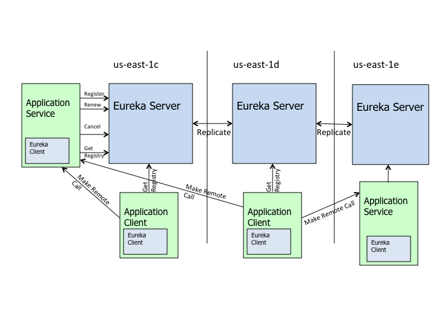
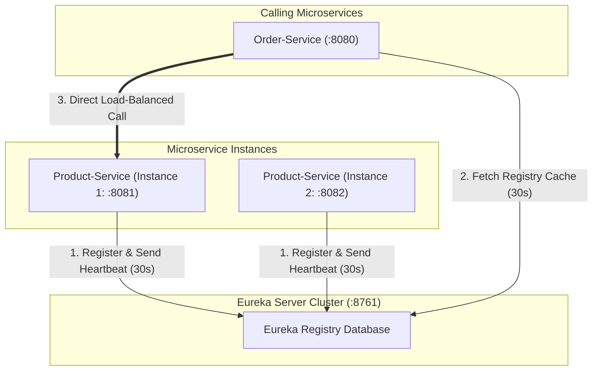
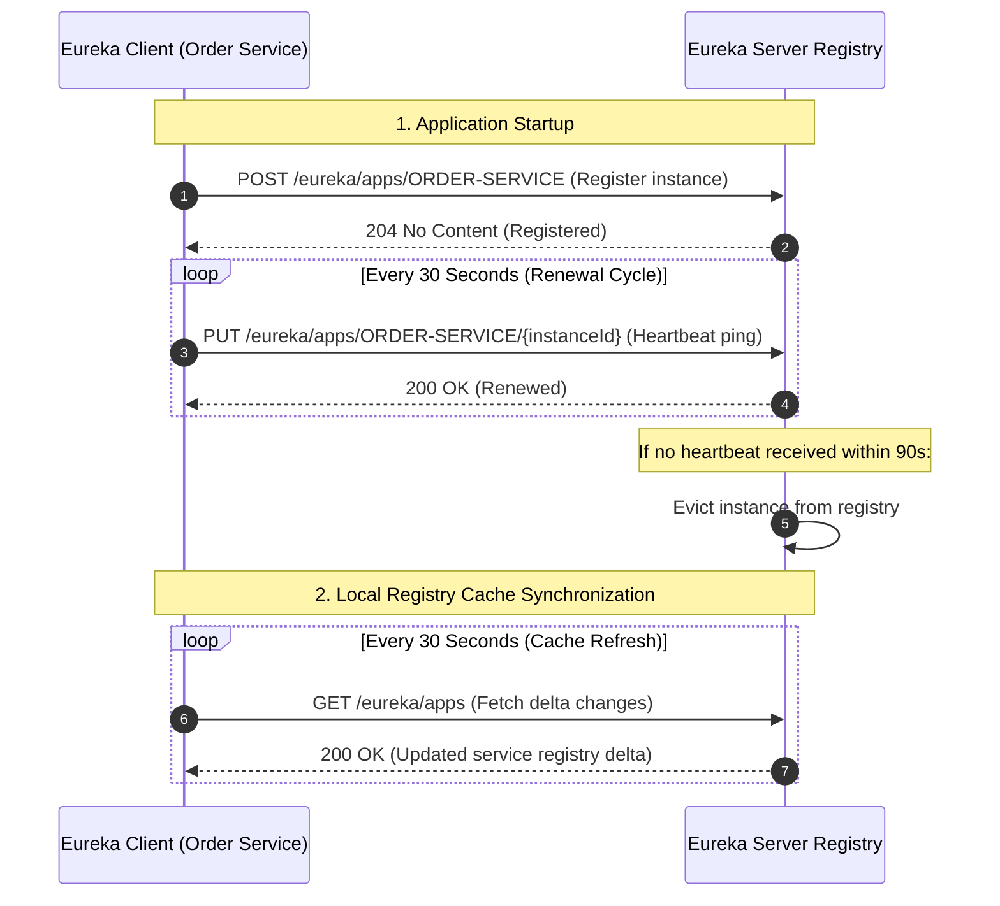
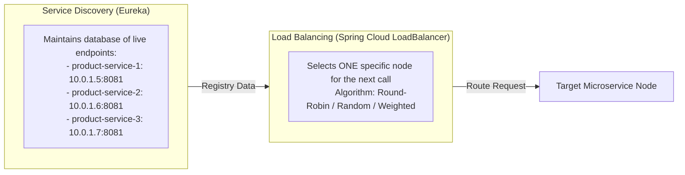

# 🧭 03 — Service Discovery with Netflix Eureka

> **Covers Dynamic Registration & Discovery Lifecycle**  
> Why dynamic cloud environments require Service Registries, setting up **Eureka Server & Client**, heartbeat renewal cycles, eviction thresholds, Eureka's self-preservation mode, client-side load balancing, and official architectural diagrams.

---

## 📑 Table of Contents
1. [Why Service Discovery is Mandatory](#1-why-service-discovery-is-mandatory)
2. [Server-Side vs. Client-Side Service Discovery](#2-server-side-vs-client-side-service-discovery)
3. [Netflix Eureka Architecture & Core Components](#3-netflix-eureka-architecture--core-components)
4. [Setting Up Eureka Server with Code](#4-setting-up-eureka-server-with-code)
5. [Registering Eureka Clients with Code](#5-registering-eureka-clients-with-code)
6. [Dynamic Resolution via Logical Service Names](#6-dynamic-resolution-via-logical-service-names)
7. [The Eureka Lifecycle: Heartbeats, Evictions & Caching](#7-the-eureka-lifecycle-heartbeats-evictions--caching)
8. [Eureka Self-Preservation Mode](#8-eureka-self-preservation-mode)
9. [Service Discovery vs. Load Balancing](#9-service-discovery-vs-load-balancing)
10. [Interview Questions & Deep-Dive Answers](#10-interview-questions--deep-dive-answers)
11. [Core Architectural Summary](#11-core-architectural-summary)

---

## 1. Why Service Discovery is Mandatory

In traditional monolithic deployments, services lived on fixed, static servers with well-known IP addresses (`192.168.1.50:8080`).

In modern cloud environments (Docker, Kubernetes, AWS Auto-scaling):
- **Dynamic IP Allocation**: Containers restart and receive new random IP addresses.
- **Auto-Scaling**: Under traffic spikes, instance count jumps from 2 to 10 instances, then scales back down.
- **Ephemeral Lifecycles**: Instances are terminated, upgraded, or migrated across host nodes continuously.

```text
❌ Hardcoded Configuration Nightmare:
order.service.payment-url=http://10.0.1.25:8083,http://10.0.1.26:8083
```
*Problem*: If instance `10.0.1.25` crashes or changes IP, every calling service requires configuration updates and redeployment.

```text
✅ Dynamic Service Discovery:
Caller queries registry: "Give me the live IPs for 'payment-service'"
Registry returns: ["10.0.3.12:8083", "10.0.3.14:8083"]
```

---

## 2. Server-Side vs. Client-Side Service Discovery

There are two primary paradigms for discovering services:

```mermaid
graph TD
    subgraph ServerSide ["1. Server-Side Discovery (e.g., AWS ALB / Kubernetes ClusterIP)"]
        C1[Client Service] --> LB[Hardware / Cloud Load Balancer]
        LB --> R1[(Central Registry)]
        LB --> S1[Instance A]
        LB --> S2[Instance B]
    end

    subgraph ClientSide ["2. Client-Side Discovery (e.g., Spring Cloud Eureka + LoadBalancer)"]
        C2[Client Service] -. 1. Query live nodes .-> E[(Eureka Registry)]
        C2 -->|2. Direct Load-Balanced Request| S3[Instance A]
        C2 -.->|Alternative Route| S4[Instance B]
    end
```

| Dimension | Server-Side Discovery | Client-Side Discovery (Eureka) |
|---|---|---|
| **Hop Count** | 2 hops (Client → LB → Service) | 1 direct hop (Client → Service) |
| **Load Balancer Bottleneck** | Hardware/Cloud LB can become single point of failure | No central traffic bottleneck |
| **Client Complexity** | Simple (client just calls a DNS name) | Requires discovery client library in microservice |
| **Common Examples** | Kubernetes Services / AWS ALB / NGINX | Netflix Eureka + Spring Cloud LoadBalancer |

---

## 3. Netflix Eureka Architecture & Core Components

Eureka is an AP (Available and Partition-tolerant according to the CAP theorem) service registry developed by Netflix.





### Key Components
1. **Eureka Server**: The centralized registry repository where services register their network locations (`hostname`, `ip`, `port`, `healthCheckUrl`).
2. **Eureka Client**: A background agent running inside each microservice that handles self-registration, periodic heartbeat pings, and local registry cache synchronization.

---

## 4. Setting Up Eureka Server with Code

### Step 1: Maven Dependency
```xml
<dependency>
    <groupId>org.springframework.cloud</groupId>
    <artifactId>spring-cloud-starter-netflix-eureka-server</artifactId>
</dependency>
```

### Step 2: Enable Eureka Server
```java
@SpringBootApplication
@EnableEurekaServer
public class DiscoveryServerApplication {
    public static void main(String[] args) {
        SpringApplication.run(DiscoveryServerApplication.class, args);
    }
}
```

### Step 3: Server Configuration (`application.yml`)
```yaml
server:
  port: 8761

eureka:
  instance:
    hostname: localhost
  client:
    # Eureka server does not need to register with itself
    register-with-eureka: false
    fetch-registry: false
    service-url:
      defaultZone: http://${eureka.instance.hostname}:${server.port}/eureka/
```

Accessing `http://localhost:8761` opens the **Eureka Dashboard**, displaying active registered instances, memory stats, and replica statuses.

---

## 5. Registering Eureka Clients with Code

Any microservice (e.g., `Product Service`, `Order Service`) can register itself with Eureka.

### Step 1: Maven Dependency
```xml
<dependency>
    <groupId>org.springframework.cloud</groupId>
    <artifactId>spring-cloud-starter-netflix-eureka-client</artifactId>
</dependency>
```

### Step 2: Client Configuration (`application.yml`)
```yaml
spring:
  application:
    name: product-service  # Logical Service ID registered in Eureka

server:
  port: 8081

eureka:
  client:
    service-url:
      defaultZone: http://localhost:8761/eureka/
    fetch-registry: true
    register-with-eureka: true
  instance:
    prefer-ip-address: true # Registers container IP rather than hostname
```

> [!NOTE]
> In modern Spring Boot versions, simply including the `spring-cloud-starter-netflix-eureka-client` dependency on the classpath automatically enables discovery. The `@EnableEurekaClient` annotation is optional.

---

## 6. Dynamic Resolution via Logical Service Names

Once services are registered under their logical names (`PRODUCT-SERVICE`, `ORDER-SERVICE`), Feign and RestClient can invoke them without knowing IP addresses or ports:

```java
// Spring Cloud dynamically looks up "product-service" in Eureka
@FeignClient(name = "product-service")
public interface ProductClient {

    @GetMapping("/api/v1/products/{id}")
    ProductDTO getProduct(@PathVariable("id") Long id);
}
```

If 3 instances of `product-service` are running, Spring Cloud LoadBalancer automatically balances traffic across them (e.g., Round Robin).

---

## 7. The Eureka Lifecycle: Heartbeats, Evictions & Caching

The coordination between Eureka Server and Clients follows a strict timing lifecycle:



### Critical Timers
- **Renewal Interval (`eureka.instance.lease-renewal-interval-in-seconds`)**: Defaults to **30 seconds**. How frequently the client sends heartbeats to Eureka.
- **Expiration Duration (`eureka.instance.lease-expiration-duration-in-seconds`)**: Defaults to **90 seconds**. If Eureka receives no heartbeat for 90s, it marks the instance dead and evicts it.
- **Client Cache Refresh (`eureka.client.registry-fetch-interval-seconds`)**: Defaults to **30 seconds**. Clients cache the registry locally so they don't query Eureka on every HTTP call.

---

## 8. Eureka Self-Preservation Mode

> [!WARNING]
> **What is Eureka Self-Preservation?**  
> If a network partition occurs between Eureka Server and several client instances, Eureka may stop receiving heartbeats from 50% of the nodes. Evicting all those nodes would be catastrophic because the services are actually healthy—only the network link to Eureka is broken!

When Eureka observes that renewals drop below a defined renewal percent threshold (default: **85% of expected renewals** within 15 minutes), it enters **Self-Preservation Mode**:

```text
EMERGENCY! EUREKA MAY BE INCORRECTLY CLAIMING INSTANCES ARE UP WHEN THEY'RE NOT.
RENEWALS ARE LESSER THAN THE THRESHOLD AND HENCE THE INSTANCES ARE NOT BEING EXPIRED JUST TO BE SAFE.
```

### Self-Preservation Behavior
- Eureka **stops evicting** any instances from its registry, even if heartbeats stop arriving.
- Clients continue using their locally cached instance lists.
- This protects availability at the risk of clients occasionally calling an instance that genuinely crashed.

---

## 9. Service Discovery vs. Load Balancing

Interviewers frequently probe this distinction:



- **Service Discovery** answers: *"Where are all the available instances right now?"*
- **Load Balancing** answers: *"Which single instance among the available options should receive this specific request?"*

---

## 10. Interview Questions & Deep-Dive Answers

### Q1: Does every inter-service request go through the Eureka Server?
> **Answer**:  
> **No, absolutely not.** Eureka is strictly a control-plane service registry, not a data-plane proxy. Clients download and cache the registry locally every 30 seconds. When `Order Service` calls `Product Service`, it uses its local cache and executes a direct point-to-point HTTP request to the chosen instance. If Eureka crashes, existing services can still talk to each other using their local registry caches!

### Q2: What happens if an instance crashes abruptly?
> **Answer**:  
> If an instance crashes without sending an unregister shutdown hook, Eureka waits for the lease expiration duration (default 90 seconds) before evicting it. Because clients refresh their cache every 30 seconds, a caller might attempt to call the dead instance during this window. This is why client-side **Circuit Breakers and Retries (Resilience4j)** are mandatory.

### Q3: Why does Netflix Eureka favor Availability over Consistency (AP in CAP theorem)?
> **Answer**:  
> In distributed microservices, it is far better for a caller to receive an outdated IP and attempt a call (which can fallback gracefully) than for the entire registry to lock up and reject requests during a network partition. Eureka prioritizes high availability of service lookup data.

---

## 11. Core Architectural Summary

```text
┌─────────────────────────────────────────────────────────────────────────┐
│                      EUREKA DISCOVERY CHEAT SHEET                       │
├─────────────────────────────────────────────────────────────────────────┤
│ 1. Eureka Server acts as dynamic phonebook; Clients self-register       │
│ 2. Heartbeats sent every 30s; Leases expire after 90s without pings     │
│ 3. Clients cache the registry locally to eliminate single-point bottleneck│
│ 4. Feign resolves logical names ('product-service') via local cache     │
│ 5. Self-Preservation prevents mass-eviction during network partitions   │
│ 6. Pair with Resilience4j to handle stale-cache eviction lag            │
└─────────────────────────────────────────────────────────────────────────┘
```
