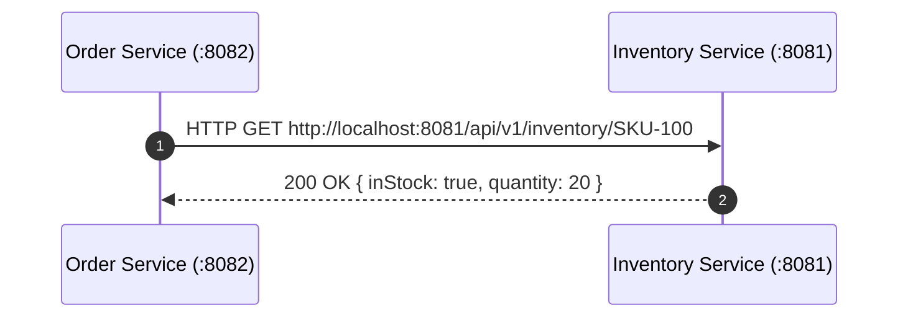
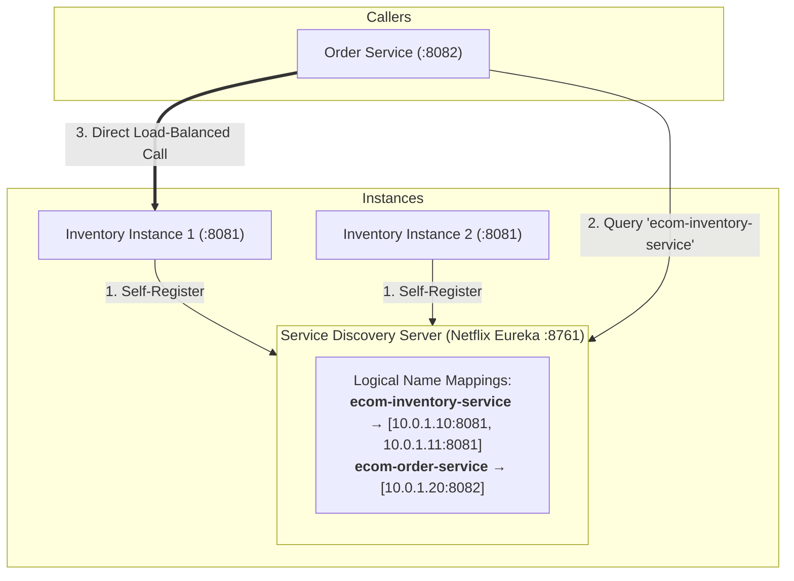
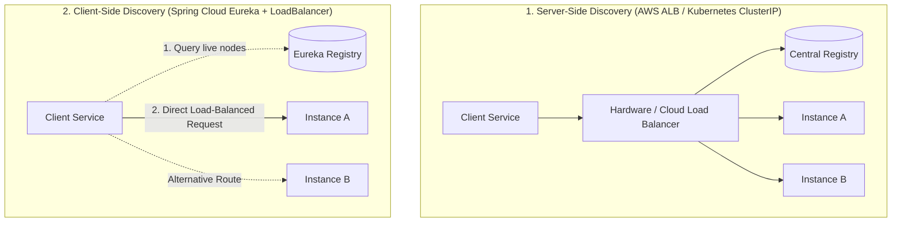
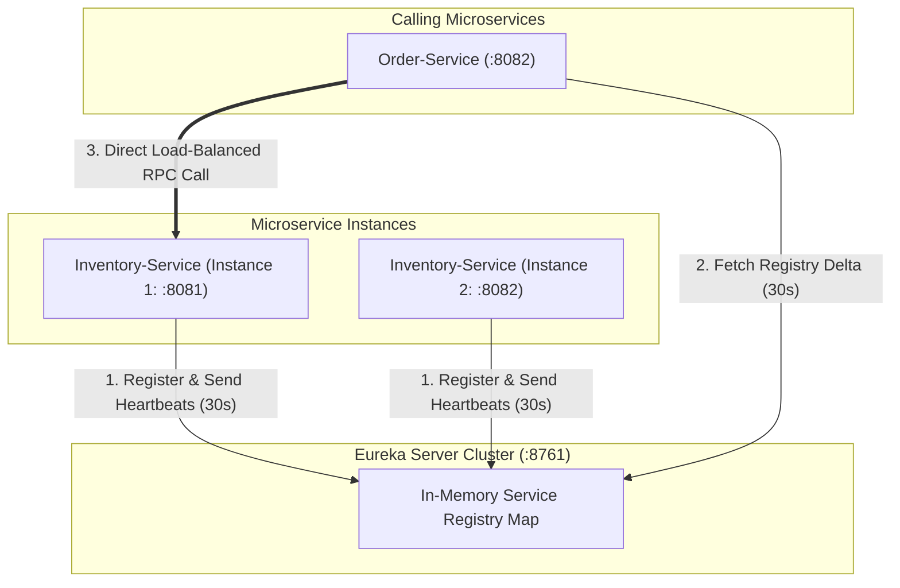
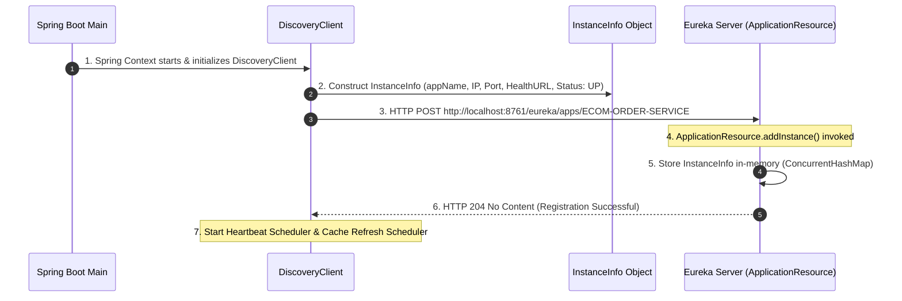
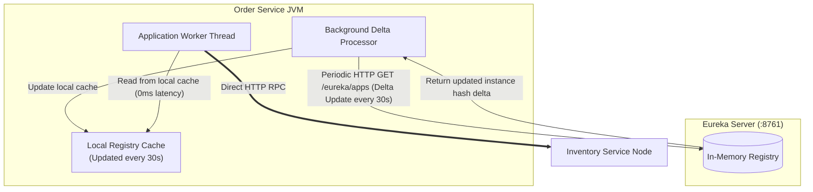
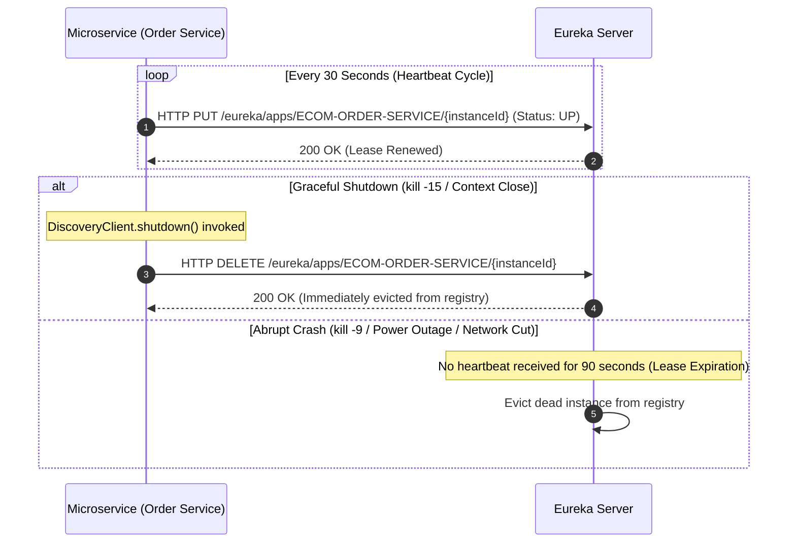
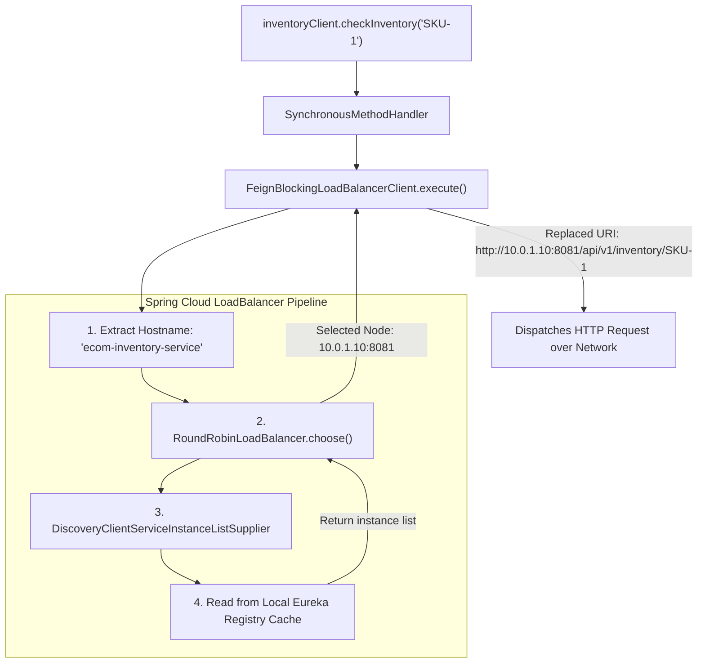
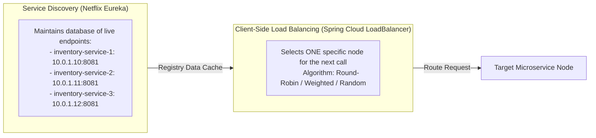

# 🧭 03 — Service Discovery with Netflix Eureka: Architecture & Deep Internals

> **Covers Dynamic Registration, Discovery Lifecycle & Internal Engine Architecture**  
> Why dynamic cloud environments require Service Registries, setting up **Eureka Server & Client**, DiscoveryClient programmatic lookup, startup registration flow, in-memory registry, local cache & delta fetch scheduler, heartbeat renewal & eviction lifecycles, graceful unregistration, self-preservation mode, and how Feign integrates with `FeignBlockingLoadBalancerClient` and Round-Robin load balancing.

---

## 📑 Table of Contents
1. [The Fundamental Problem: Hardcoded URLs & Dynamic Scaling](#1-the-fundamental-problem-hardcoded-urls--dynamic-scaling)
2. [What is Service Discovery? (The Dynamic Phonebook)](#2-what-is-service-discovery-the-dynamic-phonebook)
3. [Server-Side vs. Client-Side Service Discovery](#3-server-side-vs-client-side-service-discovery)
4. [Netflix Eureka Architecture & Core Components](#4-netflix-eureka-architecture--core-components)
5. [Setting Up Eureka Server with Code](#5-setting-up-eureka-server-with-code)
6. [Registering Eureka Clients with Code](#6-registering-eureka-clients-with-code)
7. [Programmatic Instance Discovery via DiscoveryClient](#7-programmatic-instance-discovery-via-discoveryclient)
8. [Under the Hood: What Happens at Application Startup?](#8-under-the-hood-what-happens-at-application-startup)
9. [Service Registry In-Memory Storage & Local Cache Engine](#9-service-registry-in-memory-storage--local-cache-engine)
10. [Heartbeats, Lease Renewals & Graceful Deregistration](#10-heartbeats-lease-renewals--graceful-deregistration)
11. [Eureka Self-Preservation Mode](#11-eureka-self-preservation-mode)
12. [How OpenFeign Automatically Resolves Service Names (Load Balancer Internals)](#12-how-openfeign-automatically-resolves-service-names-load-balancer-internals)
13. [Service Discovery vs. Load Balancing](#13-service-discovery-vs-load-balancing)
14. [Interview Questions & Deep-Dive Answers](#14-interview-questions--deep-dive-answers)
15. [Core Architectural Summary](#15-core-architectural-summary)

---

## 1. The Fundamental Problem: Hardcoded URLs & Dynamic Scaling

In traditional monolithic architectures, applications ran on fixed servers with static IP addresses (`192.168.1.50:8080`). In a microservices architecture, services communicate over HTTP network calls:



### Why Hardcoded URLs Break in Production:
1. **Port / Host Reallocation**: If `Inventory Service` changes its port from `8081` to `8082`, `Order Service` continues hitting `8081` and immediately fails with connection refused.
2. **Tight Coupling**: Any infrastructure change in one service forces configuration updates and redeployments of every caller service.
3. **Dynamic Autoscaling**: Under high traffic (e.g., flash sales), the cloud infrastructure spins up 5 new instances of `Inventory Service` with dynamically assigned IPs. `Order Service` has no way of knowing these new URLs exist or routing traffic to them.
4. **Multi-Environment Maintenance**: Maintaining separate hardcoded URL lists across `dev`, `stage`, and `prod` configurations creates massive operational overhead.

```text
❌ Hardcoded Configuration Nightmare:
order.service.inventory-url=http://10.0.1.25:8081,http://10.0.1.26:8081
```

---

## 2. What is Service Discovery? (The Dynamic Phonebook)

**Service Discovery** acts as an intelligent, automated registry (like a dynamic phonebook). Instead of services knowing each other's physical IP addresses, they only know logical service names (e.g., `ecom-inventory-service`).



### How It Works:
1. **Registration**: When a microservice starts up, it announces itself to the discovery server: *"I am `ecom-inventory-service` running at `10.0.1.10:8081`."*
2. **Dynamic Updates**: If an instance scales down or crashes, it is removed from the registry.
3. **Discovery**: When `Order Service` needs to call `Inventory Service`, it asks Eureka for active instances and routes the call directly to an available node.

---

## 3. Server-Side vs. Client-Side Service Discovery



| Dimension | Server-Side Discovery | Client-Side Discovery (Eureka) |
|---|---|---|
| **Hop Count** | 2 hops (Client → LB → Service) | 1 direct hop (Client → Service) |
| **Load Balancer Bottleneck** | Hardware/Cloud LB can become single point of failure | No central traffic bottleneck |
| **Client Complexity** | Simple (client just calls a DNS name) | Requires discovery client library in microservice |
| **Common Examples** | Kubernetes Services / AWS ALB / NGINX | Netflix Eureka + Spring Cloud LoadBalancer |

---

## 4. Netflix Eureka Architecture & Core Components

Eureka is an AP (Available and Partition-tolerant according to the CAP theorem) service registry developed by Netflix.




### Key Components:
1. **Eureka Server**: Central standalone Spring Boot application acting as the registry phonebook. Stores active service instance metadata **in-memory** (no SQL/NoSQL database required).
2. **Eureka Client**: Embedded background agent inside microservices handling automated registration, periodic heartbeat renewal pings, and local registry cache synchronization.

---

## 5. Setting Up Eureka Server with Code

### Step 1: Maven Dependency
```xml
<dependency>
    <groupId>org.springframework.cloud</groupId>
    <artifactId>spring-cloud-starter-netflix-eureka-server</artifactId>
</dependency>
```

### Step 2: Enable Eureka Server on Main Class
```java
package com.codesnippet.eurekaserver;

import org.springframework.boot.SpringApplication;
import org.springframework.boot.autoconfigure.SpringBootApplication;
import org.springframework.cloud.netflix.eureka.server.EnableEurekaServer;

@SpringBootApplication
@EnableEurekaServer // Initializes Eureka Server beans & REST endpoints
public class EurekaServerApplication {
    public static void main(String[] args) {
        SpringApplication.run(EurekaServerApplication.class, args);
    }
}
```

### Step 3: Server Configuration (`application.yml`)
```yaml
server:
  port: 8761 # Default standard Eureka port

spring:
  application:
    name: eureka-server

eureka:
  instance:
    hostname: localhost
  client:
    # A standalone Eureka server does not need to register with itself or fetch its own registry
    register-with-eureka: false
    fetch-registry: false
    service-url:
      defaultZone: http://${eureka.instance.hostname}:${server.port}/eureka/
```

Accessing `http://localhost:8761` in the browser opens the **Eureka Dashboard**, displaying registered application names, IPs, ports, and health statuses.

---

## 6. Registering Eureka Clients with Code

Both `Inventory Service` and `Order Service` register themselves as Eureka clients.

### Step 1: Maven Dependency
```xml
<dependency>
    <groupId>org.springframework.cloud</groupId>
    <artifactId>spring-cloud-starter-netflix-eureka-client</artifactId>
</dependency>
```

### Step 2: Client Configuration (`application.yml`)
```yaml
server:
  port: 8081

spring:
  application:
    name: ecom-inventory-service # Logical name registered in Eureka

eureka:
  client:
    register-with-eureka: true
    fetch-registry: true
    service-url:
      defaultZone: http://localhost:8761/eureka/ # Eureka server address
  instance:
    prefer-ip-address: true # Registers container/host IP rather than hostname
```

> [!NOTE]
> If `eureka.client.service-url.defaultZone` is omitted, Eureka clients automatically default to `http://localhost:8761/eureka/`. In production, you specify the exact cluster zone URL per environment (`dev`, `stage`, `prod`).

---

## 7. Programmatic Instance Discovery via DiscoveryClient

Before using declarative tools like OpenFeign, Spring Cloud provides the **`DiscoveryClient`** bean for programmatic access to the service registry:

```java
@Service
public class OrderService {

    private final DiscoveryClient discoveryClient;
    private final RestClient restClient;

    public OrderService(DiscoveryClient discoveryClient, RestClient.Builder restClientBuilder) {
        this.discoveryClient = discoveryClient;
        this.restClient = restClientBuilder.build();
    }

    public InventoryDTO checkInventoryManual(String sku) {
        // 1. Query Eureka registry for all live instances of "ecom-inventory-service"
        List<ServiceInstance> instances = discoveryClient.getInstances("ecom-inventory-service");

        if (instances == null || instances.isEmpty()) {
            throw new IllegalStateException("No active instances available for ecom-inventory-service");
        }

        // 2. Pick an instance (Manual selection: e.g., index 0)
        ServiceInstance targetInstance = instances.get(0);
        URI uri = targetInstance.getUri(); // Resolves to e.g., http://10.0.1.10:8081

        // 3. Make HTTP call using the resolved dynamic URI
        return restClient.get()
                .uri(uri + "/api/v1/inventory/{sku}", sku)
                .retrieve()
                .body(InventoryDTO.class);
    }
}
```

### Limitations of Manual DiscoveryClient:
- Selecting `instances.get(0)` does not distribute load across multiple nodes.
- Requires manual load-balancing logic, round-robin algorithms, and boilerplate code.

---

## 8. Under the Hood: What Happens at Application Startup?

When a Spring Boot microservice starts up with Eureka client on its classpath, the internal startup registration sequence executes:



### Detailed Breakdown:
1. **`DiscoveryClient` Initialization**: Spring Boot creates the `DiscoveryClient` bean during application context startup.
2. **`InstanceInfo` Construction**: Gathers runtime metadata: `appName` (`ECOM-ORDER-SERVICE`), IP address, port, `healthCheckUrl`, actuator info URL, and initial status (`UP`).
3. **HTTP Registration**: Sends an HTTP `POST` request to `/eureka/apps/{appName}` on the Eureka server.
4. **In-Memory Registry Persistence**: Eureka's `ApplicationResource.addInstance()` accepts the payload and registers the instance inside its in-memory map.
5. **Background Schedulers Triggered**: The client immediately boots two background daemon schedulers:
   - **Heartbeat Scheduler** (Lease renewal pings)
   - **Cache Refresh Scheduler** (Registry delta synchronization)

---

## 9. Service Registry In-Memory Storage & Local Cache Engine

> [!IMPORTANT]
> **Does `Order Service` query Eureka on every single HTTP request?**  
> **NO.** If every microservice called Eureka for every single request, Eureka would become a massive latency bottleneck and single point of failure.

Instead, Eureka clients maintain an internal **Local Registry Cache**:



### How the Local Cache Works:
- **Zero-Latency In-Memory Reads**: When calling `Inventory Service`, the client reads instance IPs directly from its in-memory local cache (nanoseconds).
- **Periodic Delta Fetching (`eureka.client.registry-fetch-interval-seconds`)**: Defaults to **30 seconds**. The client queries Eureka only for *deltas* (changes/new instances) and updates its local cache.
- **Resilience to Eureka Outages**: If the Eureka Server goes down completely, existing microservices continue communicating seamlessly using their local caches.

### Tuning the Cache Fetch Interval:
```yaml
eureka:
  client:
    registry-fetch-interval-seconds: 30 # Default 30s (can be tuned lower for rapid local dev)
```

---

## 10. Heartbeats, Lease Renewals & Graceful Deregistration

To keep the registry clean from stale or crashed instances, Eureka uses **Lease Renewals (Heartbeats)**.



### Critical Lease Configuration Settings:
```yaml
eureka:
  instance:
    # How often client sends "I am alive" heartbeats to Eureka
    lease-renewal-interval-in-seconds: 30 # Default: 30s
    # How long Eureka waits without a heartbeat before evicting the node
    lease-expiration-duration-in-seconds: 90 # Default: 90s
```

### Graceful vs. Abrupt Shutdown:
- **Graceful Shutdown**: When Spring Boot terminates cleanly, the `DiscoveryClient` unregisters itself via an HTTP `DELETE` call. Eureka removes the instance **immediately**.
- **Abrupt Crash**: If a server crashes without running shutdown hooks, Eureka waits for the `lease-expiration-duration-in-seconds` (90s) before evicting the dead instance.

---

## 11. Eureka Self-Preservation Mode

> [!WARNING]
> **What is Eureka Self-Preservation?**  
> If a sudden network partition occurs between Eureka Server and several client instances, Eureka may stop receiving heartbeats from 50% of the cluster. Evicting all those instances would be catastrophic because the services are actually running fine—only the network link to Eureka is broken!

When Eureka observes that renewals drop below a defined threshold (default: **85% of expected renewals within 15 minutes**), it activates **Self-Preservation Mode**:

```text
EMERGENCY! EUREKA MAY BE INCORRECTLY CLAIMING INSTANCES ARE UP WHEN THEY'RE NOT.
RENEWALS ARE LESSER THAN THE THRESHOLD AND HENCE THE INSTANCES ARE NOT BEING EXPIRED JUST TO BE SAFE.
```

### Self-Preservation Behavior:
- Eureka **freezes eviction** and stops removing instances from its registry, even if heartbeats stop arriving.
- Clients continue using their locally cached instance lists.
- This protects cluster availability at the risk of clients occasionally attempting calls to an instance that genuinely crashed (which is why client-side **Circuit Breakers and Retries** are required).

---

## 12. How OpenFeign Automatically Resolves Service Names (Load Balancer Internals)

When using Spring Cloud OpenFeign without hardcoded URLs:

```java
@FeignClient(name = "ecom-inventory-service")
public interface InventoryClient {

    @GetMapping("/api/v1/inventory/{sku}")
    InventoryDTO checkInventory(@PathVariable("sku") String sku);
}
```

How does Feign magically resolve `ecom-inventory-service` into `http://10.0.1.10:8081`?



### Internal Execution Sequence:
1. **Method Invocation**: The application calls `inventoryClient.checkInventory("SKU-1")`.
2. **`FeignBlockingLoadBalancerClient` Interception**: Intercepts the request and extracts the host string (`ecom-inventory-service`).
3. **`RoundRobinLoadBalancer.choose()`**: Evaluates available instances.
4. **`DiscoveryClientServiceInstanceListSupplier`**: Fetches the list of active instances directly from the local Eureka client cache.
5. **URL Replacement**: Replaces the logical service name with the chosen instance's physical IP and port (`http://10.0.1.10:8081/api/v1/inventory/SKU-1`).
6. **Network Dispatch**: Dispatches the HTTP request to the target server.

---

## 13. Service Discovery vs. Load Balancing

Interviewers frequently probe this distinction:



- **Service Discovery** answers: *"Where are all the available instances located right now?"*
- **Load Balancing** answers: *"Which single instance among the available options should receive this specific request?"*

---

## 14. Interview Questions & Deep-Dive Answers

### Q1: Does every inter-service request go through the Eureka Server?
> **Answer**:  
> **No, absolutely not.** Eureka is strictly a control-plane service registry, not a data-plane proxy. Clients download and cache the registry locally every 30 seconds. When `Order Service` calls `Inventory Service`, it resolves the IP from its local cache and executes a direct point-to-point HTTP request to the chosen instance. If Eureka crashes, existing services can still talk to each other using their local registry caches.

### Q2: What happens when an application shuts down gracefully vs abruptly?
> **Answer**:  
> - **Graceful Shutdown**: The client sends an HTTP `DELETE` unregister event during context shutdown, and Eureka evicts it immediately.
> - **Abrupt Crash**: Eureka stops receiving heartbeats and waits for the lease expiration duration (default 90 seconds) before evicting the dead instance.

### Q3: Why does Netflix Eureka store registry data in-memory without a database?
> **Answer**:  
> Microservice instance locations are ephemeral and constantly fluctuating. Storing registrations in an in-memory `ConcurrentHashMap` provides nanosecond lookup performance, eliminates database schema coupling, and ensures high availability (AP in CAP theorem).

### Q4: How does OpenFeign know which instance to call when multiple instances exist?
> **Answer**:  
> OpenFeign integrates with `FeignBlockingLoadBalancerClient` and Spring Cloud LoadBalancer. It queries the local discovery cache via `DiscoveryClientServiceInstanceListSupplier` and applies client-side **Round-Robin** load balancing to pick an instance for each request.

---

## 15. Core Architectural Summary

```text
┌─────────────────────────────────────────────────────────────────────────┐
│                      EUREKA DISCOVERY CHEAT SHEET                       │
├─────────────────────────────────────────────────────────────────────────┤
│ 1. Eureka Server is an In-Memory Service Registry (no DB required)      │
│ 2. Clients self-register on startup via DiscoveryClient & InstanceInfo  │
│ 3. Clients cache the registry locally (updated via delta fetch every 30s)│
│ 4. Heartbeats sent every 30s; leases expire after 90s without pings     │
│ 5. Graceful shutdown sends unregister event for immediate eviction      │
│ 6. Self-Preservation prevents mass-eviction during network partitions   │
│ 7. OpenFeign + LoadBalancer resolves logical names via local cache      │
└─────────────────────────────────────────────────────────────────────────┘
```
