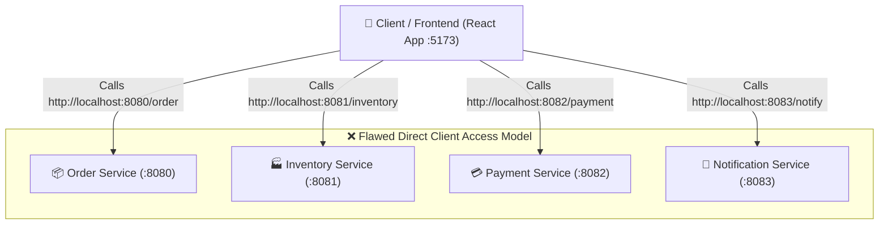
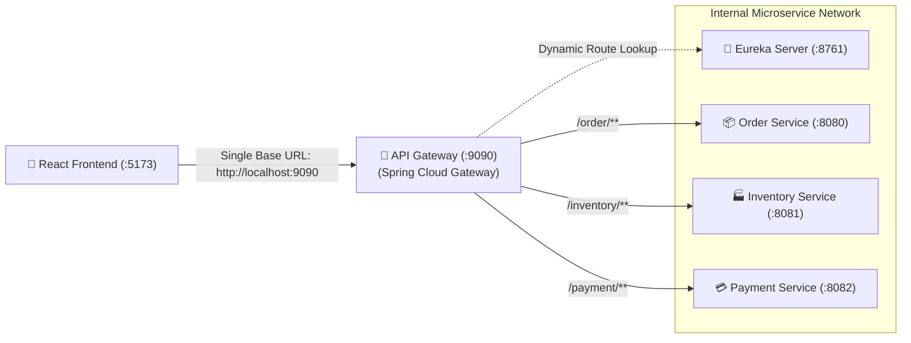
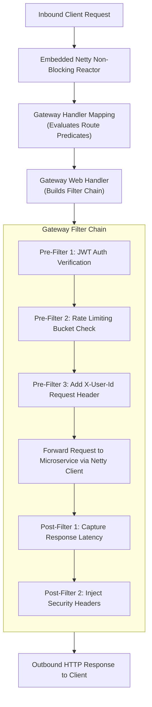
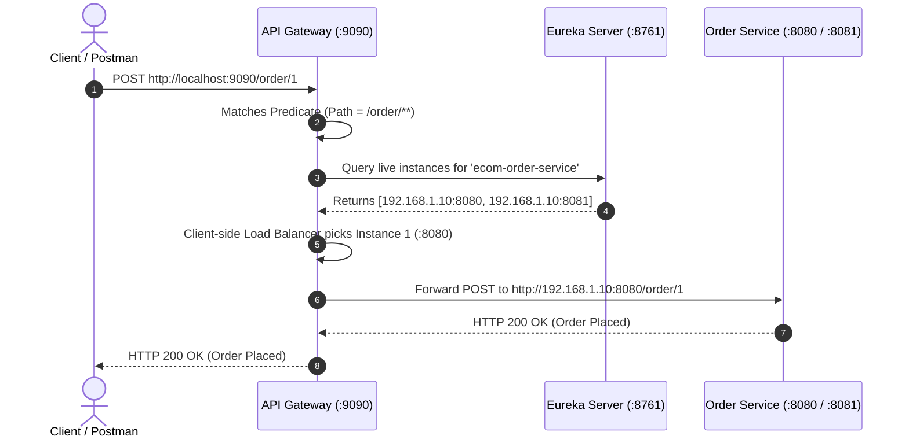
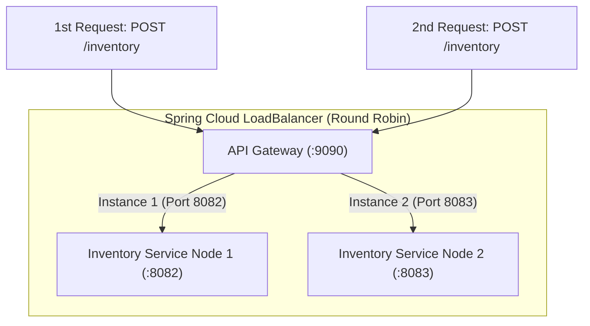

# 🚪 04 — Spring Cloud API Gateway

> **Mastering API Gateway Architecture for Interviews & System Design**  
> Covers The Problems in Direct Client Setups, Spring WebFlux Non-Blocking Reactive Foundation, Static Routing vs Dynamic Routing with Netflix Eureka (`lb://`), The 30s Cache Latency Mechanism, Client-Side Load Balancing with Multiple Instances, Pre/Post Gateway Filters, Edge Authentication, Centralized CORS, and Placement Interview Questions.

---

## 📑 Table of Contents
1. [The Problem with Direct Client-to-Microservice Communication](#1-the-problem-with-direct-client-to-microservice-communication)
2. [What is an API Gateway? (The Single Entry Point)](#2-what-is-an-api-gateway-the-single-entry-point)
3. [Spring Cloud Gateway Internal Architecture (WebFlux & Netty)](#3-spring-cloud-gateway-internal-architecture-webflux--netty)
4. [Setting Up Spring Cloud Gateway (Dependencies & Configuration)](#4-setting-up-spring-cloud-gateway-dependencies--configuration)
5. [Static Routing vs. Dynamic Routing with Netflix Eureka](#5-static-routing-vs-dynamic-routing-with-netflix-eureka)
6. [Why Changes Take Up to 30 Seconds (The Discovery Cache Window)](#6-why-changes-take-up-to-30-seconds-the-discovery-cache-window)
7. [Client-Side Load Balancing Across Multiple Instances (`lb://`)](#7-client-side-load-balancing-across-multiple-instances-lb)
8. [Gateway Filters (Pre-Filters, Post-Filters & Transformations)](#8-gateway-filters-pre-filters-post-filters--transformations)
9. [Centralized Cross-Cutting Concerns (Auth, Rate Limiting & CORS)](#9-centralized-cross-cutting-concerns-auth-rate-limiting--cors)
10. [Anti-Patterns: What NEVER to Put in an API Gateway](#10-anti-patterns-what-never-to-put-in-an-api-gateway)
11. [Placement & Interview Questions (With Concrete Answers)](#11-placement--interview-questions-with-concrete-answers)

---

## 1. The Problem with Direct Client-to-Microservice Communication

Suppose you build a microservices-based e-commerce application with an **Order Service**, **Inventory Service**, **Payment Service**, and **Notification Service**.

Without an API Gateway, your frontend (React, Vue, iOS/Android mobile apps) talks directly to each individual microservice:



### Why Direct Client Access Breaks in Production:

```
+---------------------------------------------------------------------------------------------------+
|                        5 CRITICAL PROBLEMS WITHOUT AN API GATEWAY                                 |
+---------------------------------------------------------------------------------------------------+
| 1. Multiple Microservice URLs: Client must manage ports, domains, and route mappings for 20+ APIs.|
| 2. Tight Coupling to Topology: If Order Service moves from :8080 to :8090, client code breaks!   |
| 3. Security Duplication     : JWT parsing, token validation, and OAuth code duplicated in all 20+ apps.|
| 4. Cross-Cutting Overhead    : Logging, CORS, rate limiting, and metrics must be repeated in every repo.|
| 5. Security & Attack Surface : Exposing internal microservice IP addresses directly to the public web.|
+---------------------------------------------------------------------------------------------------+
```

### "Why Can't the React Client Just Query Eureka Server Directly?"
> 💡 **Classic Interview Question**: Why not let the React app query Eureka at `:8761` to discover service URLs dynamically?  
> **Answer**:  
> 1. **Boundary Violation**: Eureka is an **internal server-side service registry**. It is not meant to be exposed to public web browsers.
> 2. **Client Complexity**: Frontends should strictly handle UI/UX state, not complex client-side service registry caching, heartbeat renewal, and load-balancing algorithms.
> 3. **Security Vulnerability**: Exposing Eureka to browsers leaks your entire internal network topology, IPs, and port configurations to potential attackers.

---

## 2. What is an API Gateway? (The Single Entry Point)

An **API Gateway** is an architectural pattern and server that acts as the **single front door / reverse proxy** into your microservices ecosystem:



### Core Responsibilities of an API Gateway:
1. **Single Entry Point**: Clients only know one URL (e.g. `https://api.mycompany.com`).
2. **Dynamic Request Routing**: Directs `/order/**` to Order Service and `/inventory/**` to Inventory Service.
3. **Centralized Authentication & Authorization**: Validates JWT tokens once at the edge before requests reach downstream services.
4. **Service Discovery Integration**: Queries Eureka to find live instances automatically.
5. **Client-Side Load Balancing**: Distributes traffic across healthy service instances using Round-Robin.
6. **Centralized Cross-Cutting Concerns**: Rate limiting, request/response logging, header transformations, and global CORS management.

---

## 3. Spring Cloud Gateway Internal Architecture (WebFlux & Netty)

Spring Cloud Gateway is built on **Spring WebFlux (Project Reactor)** and runs on an embedded **Netty** server.



### The 3 Core Building Blocks:
* **Route**: The basic building block consisting of an **ID**, a **Destination URI**, a collection of **Predicates**, and a collection of **Filters**.
* **Predicate**: A Java 8 `Predicate` matching HTTP request attributes (e.g., `Path=/order/**`, `Method=GET`, `Header=X-Role,admin`).
* **Filter**: Modifies requests before forwarding downstream (**Pre-Filter**) or responses before returning to clients (**Post-Filter**).

### Threading Model: Non-Blocking vs Blocking (Why WebFlux?)
| Dimension | Old Netflix Zuul 1.x / Spring MVC | Spring Cloud Gateway / WebFlux |
| :--- | :--- | :--- |
| **Engine** | Blocking Tomcat Servlet (`1 Thread per Request`) | Non-blocking Event Loop (**Netty Reactor**) |
| **Throughput** | Degrades under slow downstream microservices | Handles **tens of thousands of concurrent connections** with low memory |
| **Memory Footprint** | High (500 threads $	imes$ 1MB stack = 500MB RAM) | Minimal (small fixed thread pool = CPU core count) |

---

## 4. Setting Up Spring Cloud Gateway (Dependencies & Configuration)

To build an API Gateway in Spring Boot, use `spring-cloud-starter-gateway` (which transitively includes Spring WebFlux and Netty):

### 1. `pom.xml`
```xml
<?xml version="1.0" encoding="UTF-8"?>
<project xmlns="http://maven.apache.org/POM/4.0.0"
         xmlns:xsi="http://www.w3.org/2001/XMLSchema-instance"
         xsi:schemaLocation="http://maven.apache.org/POM/4.0.0 https://maven.apache.org/xsd/maven-4.0.0.xsd">
    <modelVersion>4.0.0</modelVersion>

    <parent>
        <groupId>org.springframework.boot</groupId>
        <artifactId>spring-boot-starter-parent</artifactId>
        <version>3.2.3</version>
        <relativePath/>
    </parent>

    <groupId>com.codesnippet</groupId>
    <artifactId>api-gateway</artifactId>
    <version>1.0.0</version>

    <properties>
        <java.version>17</java.version>
        <spring-cloud.version>2023.0.0</spring-cloud.version>
    </properties>

    <dependencyManagement>
        <dependencies>
            <dependency>
                <groupId>org.springframework.cloud</groupId>
                <artifactId>spring-cloud-dependencies</artifactId>
                <version>${spring-cloud.version}</version>
                <type>pom</type>
                <scope>import</scope>
            </dependency>
        </dependencies>
    </dependencyManagement>

    <dependencies>
        <!-- 1. Spring Cloud Gateway (Reactive WebFlux Engine) -->
        <dependency>
            <groupId>org.springframework.cloud</groupId>
            <artifactId>spring-cloud-starter-gateway</artifactId>
        </dependency>

        <!-- 2. Netflix Eureka Client (For Dynamic Service Discovery) -->
        <dependency>
            <groupId>org.springframework.cloud</groupId>
            <artifactId>spring-cloud-starter-netflix-eureka-client</artifactId>
        </dependency>

        <!-- 3. Actuator (For Route Health & Metrics) -->
        <dependency>
            <groupId>org.springframework.boot</groupId>
            <artifactId>spring-boot-starter-actuator</artifactId>
        </dependency>
    </dependencies>
</project>
```

### 2. Main Application Class
```java
package com.codesnippet.gateway;

import org.springframework.boot.SpringApplication;
import org.springframework.boot.autoconfigure.SpringBootApplication;
import org.springframework.cloud.client.discovery.EnableDiscoveryClient;

@SpringBootApplication
@EnableDiscoveryClient
public class ApiGatewayApplication {
    public static void main(String[] args) {
        SpringApplication.run(ApiGatewayApplication.class, args);
    }
}
```

---

## 5. Static Routing vs. Dynamic Routing with Netflix Eureka

### A. Static Routing (Hardcoded URLs — Not Recommended for Scalable Cloud)
In static routing, we hardcode the target host and port of downstream microservices directly in `application.yml`:

```yaml
server:
  port: 9090

spring:
  application:
    name: api-gateway
  cloud:
    gateway:
      routes:
        - id: ecom-order-service
          uri: http://localhost:8080
          predicates:
            - Path=/order/**

        - id: ecom-inventory-service
          uri: http://localhost:8081
          predicates:
            - Path=/inventory/**
```

❌ **Flaw**: If Inventory Service auto-scales to 5 instances or changes its port dynamically, you must manually rewrite and redeploy the Gateway!

---

### B. Dynamic Routing with Netflix Eureka (`lb://` Protocol)
By replacing hardcoded `http://localhost:8080` with the `lb://` (Load Balancer) protocol followed by the **Eureka Application Name**, Spring Cloud Gateway resolves instances dynamically:

```yaml
server:
  port: 9090

spring:
  application:
    name: api-gateway
  cloud:
    gateway:
      discovery:
        locator:
          enabled: true
          lower-case-service-id: true
      routes:
        # 1. Dynamic Order Route
        - id: ecom-order-service
          uri: lb://ecom-order-service
          predicates:
            - Path=/order/**

        # 2. Dynamic Inventory Route
        - id: ecom-inventory-service
          uri: lb://ecom-inventory-service
          predicates:
            - Path=/inventory/**

eureka:
  client:
    register-with-eureka: true
    fetch-registry: true
    service-url:
      defaultZone: http://localhost:8761/eureka/
  instance:
    prefer-ip-address: true
```



---

## 6. Why Changes Take Up to 30 Seconds (The Discovery Cache Window)

### The Scenario:
You restart Inventory Service from port `8081` to port `8082`. Immediately, hitting the Gateway returns:
```
HTTP 500 / 503: Connection refused -> http://localhost:8081
```
After waiting ~30 seconds, hitting the same URL succeeds!

### Why Did This Happen?
API Gateway does **NOT** make an HTTP network request to Eureka Server for every incoming user request (which would turn Eureka into a massive latency bottleneck).

Instead, the Gateway maintains an **In-Memory Local Registry Cache**:
1. Every **30 seconds** (`registry-fetch-interval-seconds: 30`), a background worker fetches updated instance delta lists from Eureka.
2. If an instance changes its port at $T=0$, the Gateway's local cache still holds the old IP:Port until the next 30-second fetch cycle completes.

```yaml
# For local development testing, you can reduce this interval:
eureka:
  client:
    registry-fetch-interval-seconds: 5 # Default is 30 seconds
```

---

## 7. Client-Side Load Balancing Across Multiple Instances (`lb://`)

When you spin up multiple instances of the same service (e.g. `ecom-inventory-service` running on `:8082` and `:8083`), Eureka registers both under the same application name:



### How to Run Multiple Instances in Terminal:
```bash
# Instance 1
mvn spring-boot:run -Dspring-boot.run.arguments="--server.port=8082"

# Instance 2
mvn spring-boot:run -Dspring-boot.run.arguments="--server.port=8083"
```
When requests arrive at `http://localhost:9090/inventory`, Spring Cloud Gateway automatically alternates between `:8082` and `:8083` in **Round-Robin** fashion!

---

## 8. Gateway Filters (Pre-Filters, Post-Filters & Transformations)

### Custom Global Logging Filter (Measuring Latency)
```java
package com.codesnippet.gateway.filter;

import org.slf4j.Logger;
import org.slf4j.LoggerFactory;
import org.springframework.cloud.gateway.filter.GatewayFilterChain;
import org.springframework.cloud.gateway.filter.GlobalFilter;
import org.springframework.core.Ordered;
import org.springframework.stereotype.Component;
import org.springframework.web.server.ServerWebExchange;
import reactor.core.publisher.Mono;

@Component
public class LoggingGlobalFilter implements GlobalFilter, Ordered {

    private static final Logger log = LoggerFactory.getLogger(LoggingGlobalFilter.class);

    @Override
    public Mono<Void> filter(ServerWebExchange exchange, GatewayFilterChain chain) {
        long startTime = System.currentTimeMillis();
        String path = exchange.getRequest().getURI().getPath();
        String method = exchange.getRequest().getMethod().name();

        log.info("[GATEWAY PRE-FILTER] Incoming Request -> {} {}", method, path);

        return chain.filter(exchange).then(Mono.fromRunnable(() -> {
            long duration = System.currentTimeMillis() - startTime;
            int statusCode = exchange.getResponse().getStatusCode() != null 
                    ? exchange.getResponse().getStatusCode().value() 
                    : 500;
            log.info("[GATEWAY POST-FILTER] Completed -> {} {} | Status: {} | Duration: {}ms",
                    method, path, statusCode, duration);
        }));
    }

    @Override
    public int getOrder() {
        return -1; // Highest priority execution
    }
}
```

---

## 9. Centralized Cross-Cutting Concerns (Auth, Rate Limiting & CORS)

### A. Centralized Edge Authentication Filter
Instead of configuring JWT security in 20 different microservices, validate tokens once at the Gateway. If valid, extract user claims and inject them into headers (`X-User-Id`, `X-User-Role`) for downstream microservices:

```java
package com.codesnippet.gateway.filter;

import org.springframework.cloud.gateway.filter.GatewayFilter;
import org.springframework.cloud.gateway.filter.factory.AbstractGatewayFilterFactory;
import org.springframework.http.HttpHeaders;
import org.springframework.http.HttpStatus;
import org.springframework.http.server.reactive.ServerHttpRequest;
import org.springframework.stereotype.Component;
import org.springframework.web.server.ServerWebExchange;
import reactor.core.publisher.Mono;

@Component
public class AuthenticationFilter extends AbstractGatewayFilterFactory<AuthenticationFilter.Config> {

    public AuthenticationFilter() {
        super(Config.class);
    }

    public static class Config {}

    @Override
    public GatewayFilter apply(Config config) {
        return (exchange, chain) -> {
            ServerHttpRequest request = exchange.getRequest();

            // 1. Bypass public auth endpoints
            if (request.getURI().getPath().startsWith("/api/auth")) {
                return chain.filter(exchange);
            }

            // 2. Validate Authorization Header
            if (!request.getHeaders().containsKey(HttpHeaders.AUTHORIZATION)) {
                return onError(exchange, "Missing Authorization Header", HttpStatus.UNAUTHORIZED);
            }

            String authHeader = request.getHeaders().getFirst(HttpHeaders.AUTHORIZATION);
            if (authHeader == null || !authHeader.startsWith("Bearer ")) {
                return onError(exchange, "Invalid Authorization Header", HttpStatus.UNAUTHORIZED);
            }

            String token = authHeader.substring(7);

            // 3. Verify JWT & extract claims (mocked validation)
            if (!isValidJwt(token)) {
                return onError(exchange, "Invalid or Expired JWT", HttpStatus.UNAUTHORIZED);
            }

            // 4. Mutate request: Inject trusted user claims downstream
            ServerHttpRequest mutatedRequest = exchange.getRequest().mutate()
                    .header("X-User-Id", "user_999")
                    .header("X-User-Role", "ADMIN")
                    .build();

            return chain.filter(exchange.mutate().request(mutatedRequest).build());
        };
    }

    private boolean isValidJwt(String token) {
        return token != null && !token.isBlank();
    }

    private Mono<Void> onError(ServerWebExchange exchange, String err, HttpStatus status) {
        exchange.getResponse().setStatusCode(status);
        return exchange.getResponse().setComplete();
    }
}
```

---

### B. Global Centralized CORS Configuration
Eliminate messy individual service CORS filters by managing CORS globally in the Gateway:

```yaml
spring:
  cloud:
    gateway:
      globalcors:
        cors-configurations:
          '[/**]':
            allowedOrigins:
              - "http://localhost:5173"
              - "https://myproductionapp.com"
            allowedMethods:
              - GET
              - POST
              - PUT
              - DELETE
              - OPTIONS
            allowedHeaders: "*"
            allowCredentials: true
            maxAge: 3600
```

---

## 10. Anti-Patterns: What NEVER to Put in an API Gateway

```
+---------------------------------------------------------------------------------------------------+
|                               API GATEWAY ARCHITECTURAL ANTI-PATTERNS                             |
+---------------------------------------------------------------------------------------------------+
| ❌ Business Domain Logic   : Never write checkout or tax calculations in the Gateway.             |
| ❌ Direct Database Access  : Never connect the Gateway directly to PostgreSQL/MySQL/MongoDB.     |
| ❌ Heavy Data Aggregations : Avoid complex fan-out join queries (use Backend-for-Frontend / BFF). |
| ❌ Blocking Thread Calls   : Never use Thread.sleep() or RestTemplate (blocks Netty Event Loop!). |
+---------------------------------------------------------------------------------------------------+
```

---

## 11. Placement & Interview Questions (With Concrete Answers)

### Q1: What is the difference between Netflix Zuul 1.x and Spring Cloud Gateway?
> **Answer**:  
> * **Netflix Zuul 1.x** is built on the blocking Java Servlet API (`Tomcat`) where each incoming request occupies a dedicated OS worker thread. If downstream services hang, threads get exhausted, causing gateway-wide thread starvation.  
> * **Spring Cloud Gateway** is built on non-blocking **Spring WebFlux / Project Reactor** running on **Netty**. A small number of event loop threads handle thousands of concurrent requests asynchronously without thread exhaustion.

### Q2: How does the `lb://` protocol work in Spring Cloud Gateway?
> **Answer**:  
> The `lb://` prefix instructs Spring Cloud Gateway to activate **Spring Cloud LoadBalancer**. Instead of resolving the target URL through DNS, it looks up the service name in the local **Eureka service registry cache** and distributes requests across live instance IP addresses using Round-Robin.

### Q3: Why does restarting a microservice on a new port cause 500 errors for ~30 seconds?
> **Answer**:  
> The Gateway does not query Eureka Server synchronously on every request. It caches the service registry locally and updates it on a background polling interval (default: 30 seconds via `registry-fetch-interval-seconds`). Until the next cache refresh runs, the Gateway routes to the old cached port.

### Q4: How do you pass authenticated user details from the Gateway to downstream microservices?
> **Answer**:  
> The Gateway validates the JWT token at the edge, extracts claims (e.g. `userId`, `roles`), and mutates the incoming request headers before forwarding:
> ```java
> exchange.getRequest().mutate().header("X-User-Id", userId).build();
> ```
> Downstream microservices read `@RequestHeader("X-User-Id")` directly, avoiding duplicate JWT decoding across all internal services.

---

## 12. Core Architectural Summary

```
+----------------------------------------------------------------------------------------------------+
|                               API GATEWAY CHEAT SHEET FOR INTERVIEWS                               |
+----------------------------------------------------------------------------------------------------+
| 1. Purpose             | Single public entry point into microservices ecosystem                   |
| 2. Runtime Engine      | Spring WebFlux + Netty (Reactive Non-Blocking Event Loop)                 |
| 3. Building Blocks     | Routes = ID + Target URI + Predicates (Matching) + Filters (Mutation)      |
| 4. Dynamic Routing     | uri: lb://SERVICE-NAME (resolves instances via Eureka + Load Balancing)   |
| 5. Caching Interval    | 30 seconds default Eureka local registry refresh cycle                     |
| 6. Edge Security       | Validate JWT once at Gateway -> inject X-User-Id header downstream        |
| 7. Cross-Cutting       | Global CORS, Request Latency Logging, Redis Token Bucket Rate Limiting    |
+----------------------------------------------------------------------------------------------------+
```
