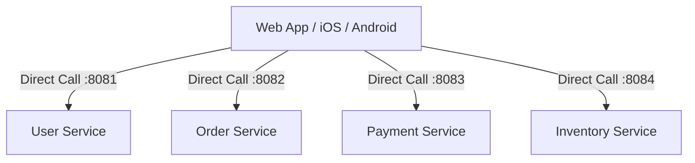
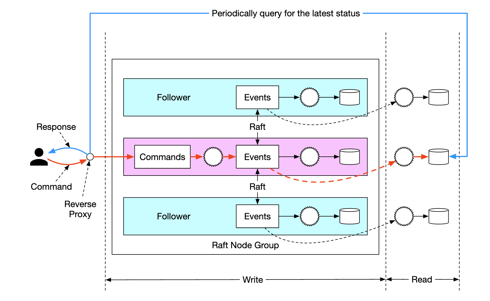
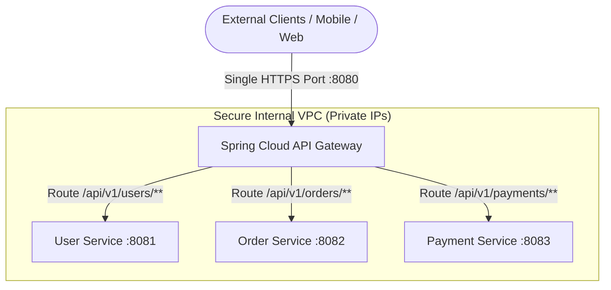
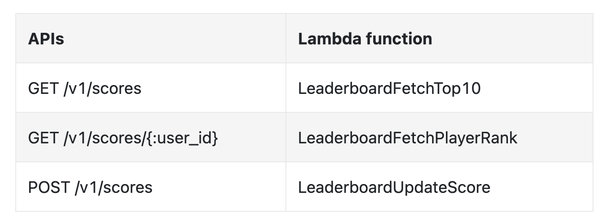
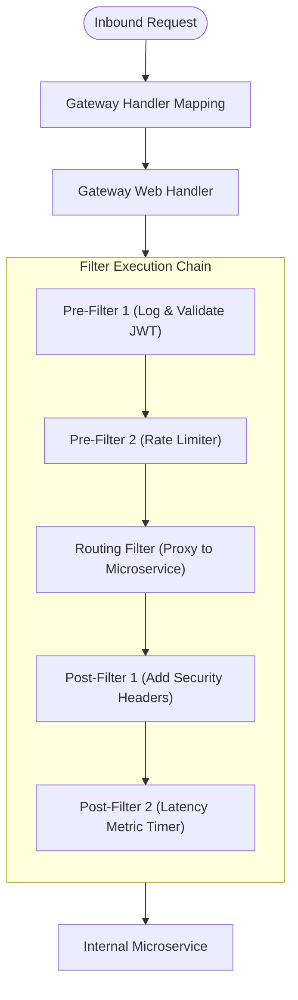
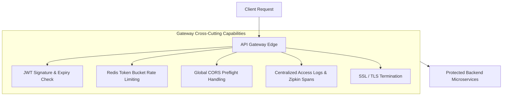

# 🚪 04 — Spring Cloud API Gateway

> **Covers Edge Routing, Filtering & Centralized Edge Security**  
> Why direct client-to-microservice communication fails, anatomy of **Spring Cloud Gateway**, Route Predicates, Pre/Post Gateway Filters, dynamic discovery routing, JWT edge validation, Redis Token-Bucket rate limiting, and edge cross-cutting concerns with visual diagrams.

---

## 📑 Table of Contents
1. [The Edge Problem: Why Direct Client Access Fails](#1-the-edge-problem-why-direct-client-access-fails)
2. [What is an API Gateway?](#2-what-is-an-api-gateway)
3. [Spring Cloud Gateway Architecture](#3-spring-cloud-gateway-architecture)
4. [Route Predicates & Filters Explained](#4-route-predicates--filters-explained)
5. [Configuring Routes: Static vs. Dynamic Discovery](#5-configuring-routes-static-vs-dynamic-discovery)
6. [Writing Custom Gateway Filters (Pre & Post) with Code](#6-writing-custom-gateway-filters-pre--post-with-code)
7. [JWT Edge Authentication Filter with Code](#7-jwt-edge-authentication-filter-with-code)
8. [Redis Token Bucket Rate Limiting with Code](#8-redis-token-bucket-rate-limiting-with-code)
9. [Cross-Cutting Concerns at the Edge](#9-cross-cutting-concerns-at-the-edge)
10. [Anti-Pattern: The Gateway as a Business Dump](#10-anti-pattern-the-gateway-as-a-business-dump)
11. [Interview Questions & Deep-Dive Answers](#11-interview-questions--deep-dive-answers)
12. [Core Architectural Summary](#12-core-architectural-summary)

---

## 1. The Edge Problem: Why Direct Client Access Fails

In a naive microservices setup, external mobile apps, SPAs, and third-party partners communicate directly with individual backend microservices:



### Severe Vulnerabilities of Direct Client Access
1. **Massive Attack Surface**: Every backend service must be exposed to the public Internet with public IPs and open firewall ports.
2. **Duplicated Cross-Cutting Logic**: Every microservice must independently implement JWT token validation, SSL termination, CORS policies, rate limiting, and request logging.
3. **High Chatty Network Latency**: Rendering a single mobile screen (e.g., Order Detail) requires the phone to fire 5 separate cellular HTTP calls to 5 services.
4. **Client-Backend Coupling**: If the backend team refactors and splits `Order Service` into `Order Service` and `Fulfillment Service`, client apps break immediately.

---

## 2. What is an API Gateway?

An **API Gateway** serves as the **single, reverse-proxy entry point** shielding the entire internal microservices cluster from external traffic:





### Primary Edge Responsibilities
- **Intelligent Routing**: Forwarding inbound URLs to appropriate downstream microservices.
- **Security & Authentication**: Validating JWT Bearer tokens and terminating SSL.
- **Traffic Control & Rate Limiting**: Throttling abusive IP addresses or client IDs.
- **CORS Handling**: Managing Cross-Origin Resource Sharing centrally for all SPAs.
- **Protocol Translation & Header Enrichment**: Sanitizing headers and appending internal user identity headers (`X-User-Id`, `X-User-Role`).

---

## 3. Spring Cloud Gateway Architecture

Unlike older gateways (such as Netflix Zuul 1.x which used blocking I/O with a thread-per-connection), **Spring Cloud Gateway** is built on top of **Spring 5, Project Reactor, and Netty**:





### Core Concepts
1. **Route**: The basic building block of the gateway. Defined by an **ID**, a **destination URI**, a collection of **Predicates**, and a collection of **Filters**.
2. **Predicate**: A Java 8 `Predicate` matching HTTP request attributes (Path, Method, Headers, Cookies, Query Params).
3. **Filter**: Spring Framework `GatewayFilter` instances that intercept, inspect, or modify the request before routing and/or modify the response before returning.

---

## 4. Route Predicates & Filters Explained

### Common Built-in Route Predicates
Predicates determine *if* a request matches a route:
- `Path=/api/v1/orders/**`: Matches incoming URI paths.
- `Method=GET,POST`: Matches specific HTTP verbs.
- `Header=X-Request-Id, \d+`: Matches if a header is present and satisfies regex.
- `After=2026-01-01T00:00:00+00:00[UTC]`: Matches requests that occur after a given timestamp (useful for scheduled feature rollouts).

### Common Built-in Gateway Filters
Filters modify the request or response:
- `RewritePath=/api/v1/(?<segment>.*), /$\{segment}`: Rewrites `/api/v1/orders` to `/orders`.
- `AddRequestHeader=X-Gateway-Origin, SpringCloudGateway`: Injects custom headers to downstream services.
- `AddResponseHeader=X-Frame-Options, DENY`: Enhances security headers on egress.
- `RequestRateLimiter`: Leverages Redis token-bucket to throttle requests.

---

## 5. Configuring Routes: Static vs. Dynamic Discovery

### Approach A: Static URI Routing (application.yml)
Routes configured with fixed backend IP/domain:

```yaml
spring:
  cloud:
    gateway:
      routes:
        - id: user-service-route
          uri: http://localhost:8081
          predicates:
            - Path=/api/v1/users/**
          filters:
            - StripPrefix=1
```

### Approach B: Dynamic Discovery Routing via Eureka (`lb://`)
Instead of hardcoded URLs, the gateway uses **logical service names** resolved dynamically from Netflix Eureka with client-side load balancing:

```yaml
spring:
  cloud:
    gateway:
      routes:
        - id: order-service-route
          uri: lb://ORDER-SERVICE      # Dynamic lookup in Eureka + Load Balancing
          predicates:
            - Path=/api/v1/orders/**
          filters:
            - RewritePath=/api/v1/(?<segment>.*), /$\{segment}
            - AddRequestHeader=X-Forwarded-By, API-Gateway

        - id: payment-service-route
          uri: lb://PAYMENT-SERVICE
          predicates:
            - Path=/api/v1/payments/**
```

---

## 6. Writing Custom Gateway Filters (Pre & Post) with Code

You can write custom global or route-specific filters using reactive `Mono`:

```java
@Component
public class LoggingAndTimingGlobalFilter implements GlobalFilter, Ordered {

    private static final Logger log = LoggerFactory.getLogger(LoggingAndTimingGlobalFilter.class);

    @Override
    public Mono<Void> filter(ServerWebExchange exchange, GatewayFilterChain chain) {
        ServerHttpRequest request = exchange.getRequest();
        long startTime = System.currentTimeMillis();

        // --- PRE-FILTER LOGIC ---
        log.info("[GATEWAY PRE] Inbound {} {} from IP={}", 
                request.getMethod(), request.getURI(), request.getRemoteAddress());

        // --- DELEGATE TO DOWNSTREAM & RUN POST-FILTER ---
        return chain.filter(exchange).then(Mono.fromRunnable(() -> {
            // --- POST-FILTER LOGIC ---
            long duration = System.currentTimeMillis() - startTime;
            HttpStatusCode statusCode = exchange.getResponse().getStatusCode();
            log.info("[GATEWAY POST] Completed {} with status {} in {}ms",
                    request.getURI(), statusCode, duration);
        }));
    }

    @Override
    public int getOrder() {
        return -1; // Highest priority in filter order
    }
}
```

---

## 7. JWT Edge Authentication Filter with Code

Centralizing JWT authentication at the API Gateway prevents unauthorized traffic from penetrating the internal VPC:

```java
@Component
public class JwtAuthenticationFilter extends AbstractGatewayFilterFactory<JwtAuthenticationFilter.Config> {

    private final JwtTokenValidator jwtValidator;

    public JwtAuthenticationFilter(JwtTokenValidator jwtValidator) {
        super(Config.class);
        this.jwtValidator = jwtValidator;
    }

    public static class Config {
        // Configuration properties if needed
    }

    @Override
    public GatewayFilter apply(Config config) {
        return (exchange, chain) -> {
            ServerHttpRequest request = exchange.getRequest();

            // 1. Check for Authorization header
            if (!request.getHeaders().containsKey(HttpHeaders.AUTHORIZATION)) {
                return onError(exchange, "Missing Authorization Header", HttpStatus.UNAUTHORIZED);
            }

            String authHeader = request.getHeaders().getFirst(HttpHeaders.AUTHORIZATION);
            if (authHeader == null || !authHeader.startsWith("Bearer ")) {
                return onError(exchange, "Invalid Authorization Header", HttpStatus.UNAUTHORIZED);
            }

            String token = authHeader.substring(7);

            // 2. Validate Token Signature & Expiration
            try {
                Claims claims = jwtValidator.validateAndExtractClaims(token);
                
                // 3. Mutate Request: Add authenticated user identity headers for downstream services
                ServerHttpRequest mutatedRequest = exchange.getRequest().mutate()
                        .header("X-User-Id", claims.getSubject())
                        .header("X-User-Role", claims.get("role", String.class))
                        .build();

                return chain.filter(exchange.mutate().request(mutatedRequest).build());

            } catch (Exception ex) {
                return onError(exchange, "JWT Token Expired or Invalid", HttpStatus.UNAUTHORIZED);
            }
        };
    }

    private Mono<Void> onError(ServerWebExchange exchange, String err, HttpStatus httpStatus) {
        ServerHttpResponse response = exchange.getResponse();
        response.setStatusCode(httpStatus);
        response.getHeaders().setContentType(MediaType.APPLICATION_JSON);
        String jsonError = String.format("{\"error\": \"%s\", \"status\": %d}", err, httpStatus.value());
        DataBuffer buffer = response.bufferFactory().wrap(jsonError.getBytes(StandardCharsets.UTF_8));
        return response.writeWith(Mono.just(buffer));
    }
}
```

---

## 8. Redis Token Bucket Rate Limiting with Code

Spring Cloud Gateway integrates out-of-the-box with Redis using the **Token Bucket Algorithm**.

### Step 1: Add Redis Reactive Dependency
```xml
<dependency>
    <groupId>org.springframework.boot</groupId>
    <artifactId>spring-boot-starter-data-redis-reactive</artifactId>
</dependency>
```

### Step 2: Define KeyResolver Bean (Resolve by User ID or IP)
```java
@Configuration
public class RateLimiterConfig {

    @Bean
    public KeyResolver userKeyResolver() {
        // Rate limit based on authenticated User ID header, fallback to IP address
        return exchange -> {
            String userId = exchange.getRequest().getHeaders().getFirst("X-User-Id");
            if (userId != null) {
                return Mono.just(userId);
            }
            return Mono.just(exchange.getRequest().getRemoteAddress().getAddress().getHostAddress());
        };
    }
}
```

### Step 3: Configure Token Bucket in `application.yml`
```yaml
spring:
  cloud:
    gateway:
      routes:
        - id: order-service-route
          uri: lb://ORDER-SERVICE
          predicates:
            - Path=/api/v1/orders/**
          filters:
            - name: RequestRateLimiter
              args:
                redis-rate-limiter.replenishRate: 10   # 10 tokens replenished per second
                redis-rate-limiter.burstCapacity: 20   # Maximum burst limit of 20 tokens
                key-resolver: "#{@userKeyResolver}"
```

If an IP/User exceeds the limit, the Gateway automatically rejects calls with `HTTP 429 Too Many Requests`.

---

## 9. Cross-Cutting Concerns at the Edge



### Handling Centralized CORS in `application.yml`
```yaml
spring:
  cloud:
    gateway:
      globalcors:
        cors-configurations:
          '[/**]':
            allowedOrigins: "https://myfrontend.com"
            allowedMethods:
              - GET
              - POST
              - PUT
              - DELETE
              - OPTIONS
            allowedHeaders: "*"
            allowCredentials: true
            maxAge: 3600
```

---

## 10. Anti-Pattern: The Gateway as a Business Dump

> [!CAUTION]
> **Do not write Domain Business Logic in the API Gateway.**

```text
❌ CRITICAL ANTI-PATTERNS IN GATEWAY:
├── Calculating discounts or order taxes
├── Performing complex database JOIN queries
├── Orchestrating domain entities directly
└── Storing relational domain tables
```

### Why this breaks architecture:
- Turns the gateway into a **monolithic bottleneck**.
- High CPU computation in the gateway blocks the non-blocking Netty event loop, slowing down routing for all other services.
- Violates domain separation of concerns.

The Gateway should focus strictly on **Transport, Routing, Edge Security, and Protocol Governance**.

---

## 11. Interview Questions & Deep-Dive Answers

### Q1: What is the underlying runtime difference between Netflix Zuul 1.x and Spring Cloud Gateway?
> **Answer**:  
> Netflix Zuul 1.x was built on standard Java Servlet APIs using synchronous blocking I/O (one dedicated thread per incoming request). When downstream services became slow, threads backed up quickly, causing thread pool starvation. Spring Cloud Gateway is built on **Spring WebFlux and Netty**, utilizing an asynchronous, non-blocking event-driven loop. A small fixed number of threads handles tens of thousands of concurrent connections efficiently.

### Q2: What does the `lb://` prefix mean in route configuration?
> **Answer**:  
> `lb://` stands for **Load Balanced**. When configured (e.g., `uri: lb://ORDER-SERVICE`), the gateway does not interpret `ORDER-SERVICE` as a DNS hostname. Instead, it instructs Spring Cloud LoadBalancer to look up the available registered IP/port instances in the Eureka registry and balance incoming traffic across them.

### Q3: How do you pass authenticated user details from Gateway to downstream services?
> **Answer**:  
> The Gateway authenticates the external JWT token at the edge. Once verified, custom Gateway Pre-Filters extract user claims (such as `userId`, `username`, `roles`) and mutate the outbound request by adding internal headers like `X-User-Id: 1042` and `X-User-Role: ADMIN`. Downstream services simply inspect these headers without needing to re-parse the JWT token.

---

## 12. Core Architectural Summary

```text
┌─────────────────────────────────────────────────────────────────────────┐
│                      API GATEWAY CHEAT SHEET                            │
├─────────────────────────────────────────────────────────────────────────┤
│ 1. Acts as the single perimeter shield for all backend microservices    │
│ 2. Route = Predicates (matching conditions) + Filters (transformations) │
│ 3. Use 'lb://SERVICE-NAME' for dynamic Eureka integration               │
│ 4. Offload Edge concerns: JWT Auth, Rate Limiting, CORS, SSL, Logging   │
│ 5. Use Redis Token-Bucket (RequestRateLimiter) to throttle abuse        │
│ 6. NEVER put business domain rules or database logic in the Gateway     │
└─────────────────────────────────────────────────────────────────────────┘
```
