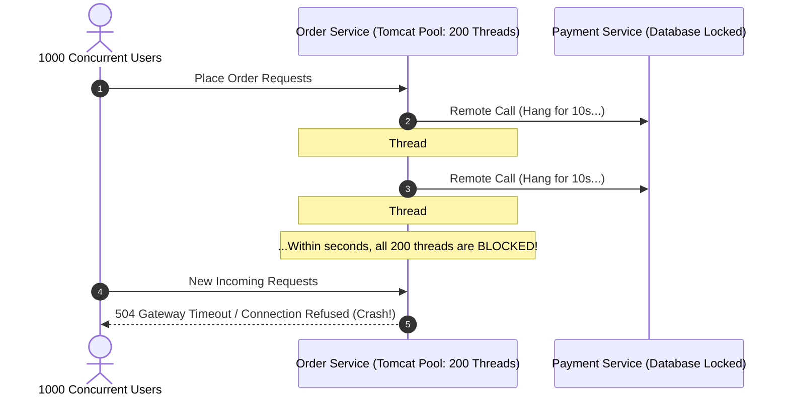
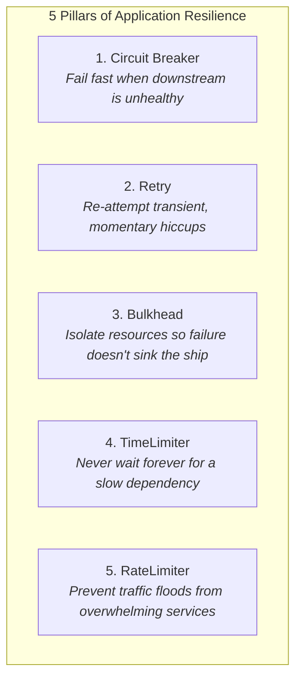
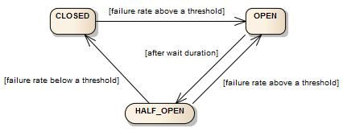
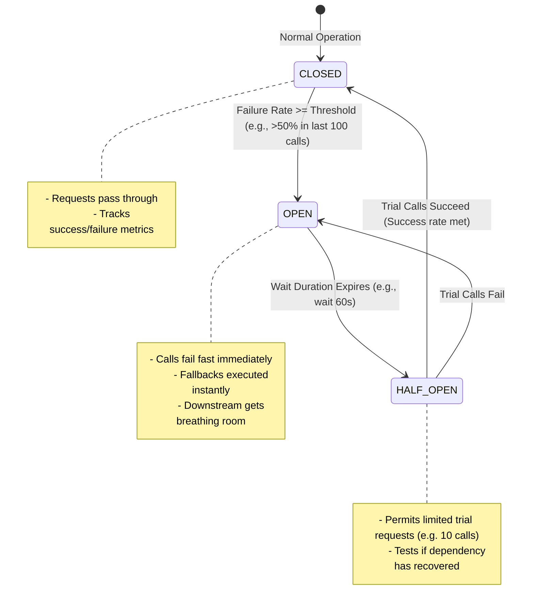
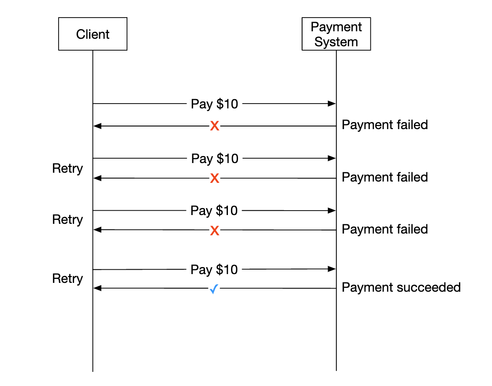
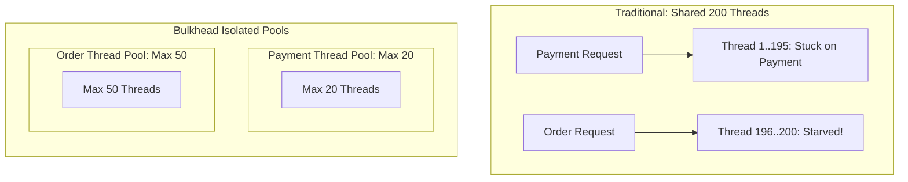
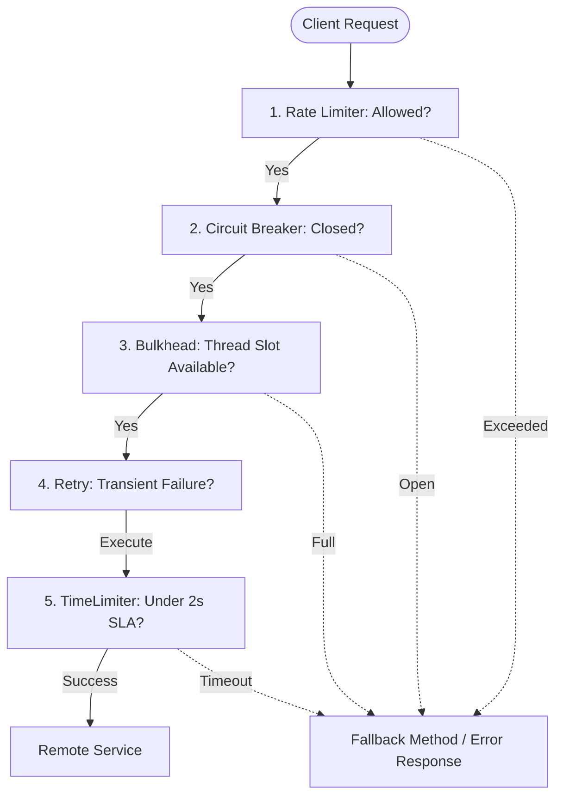

# 🛡️ 05 — Resilience & Fault Tolerance with Resilience4j

> **Covers Cascading Outage Prevention & Stability Patterns**  
> How distributed partial failures crash entire clusters, deep dive into **Resilience4j**, Circuit Breaker 3-state mechanics, Retry with Exponential Backoff and Jitter, Bulkhead Thread Isolation, TimeLimiter, and Fallback engineering with visual state machines.

---

## 📑 Table of Contents
1. [The Nature of Distributed Failures](#1-the-nature-of-distributed-failures)
2. [Anatomy of Cascading Failures](#2-anatomy-of-cascading-failures)
3. [The 5 Core Stability Patterns](#3-the-5-core-stability-patterns)
4. [Resilience4j Overview](#4-resilience4j-overview)
5. [Circuit Breaker: The 3-State Machine](#5-circuit-breaker-the-3-state-machine)
6. [Retry Pattern & Avoiding Retry Storms](#6-retry-pattern--avoiding-retry-storms)
7. [Bulkhead Pattern: Thread vs. Semaphore Isolation](#7-bulkhead-pattern-thread-vs-semaphore-isolation)
8. [TimeLimiter & Timeout Governance](#8-timelimiter--timeout-governance)
9. [RateLimiter: Protecting Upstream Capacities](#9-ratelimiter-protecting-upstream-capacities)
10. [Fallback Engineering: Safe Degradation vs. Dangerous Fallbacks](#10-fallback-engineering-safe-degradation-vs-dangerous-fallbacks)
11. [Combining Resilience Patterns in Practice](#11-combining-resilience-patterns-in-practice)
12. [Interview Questions & Deep-Dive Answers](#12-interview-questions--deep-dive-answers)
13. [Core Architectural Summary](#13-core-architectural-summary)

---

## 1. The Nature of Distributed Failures

In a single-process application, method calls either complete or throw an immediate exception. In a distributed microservice network, failure is **partial, intermittent, and deceptive**:

```text
Common Microservice Failure Modes:
├── Network latency spikes (packet drops, TCP retransmission)
├── Downstream thread deadlocks or GC pauses (Stop-The-World)
├── Database connection pool exhaustion
├── Cascading downstream 500/503 errors
└── Abrupt instance crashes or node reboots
```

> [!IMPORTANT]
> The most dangerous failure in a distributed system is **not an immediate crash**; it is **a slow downstream service**. An immediate crash frees resources instantly. A slow response ties up threads and resources across the entire call chain until the whole system collapses.

---

## 2. Anatomy of Cascading Failures

Consider what happens when `Payment Service` slows down from 100ms to 10 seconds:



1. Each incoming request to `Order Service` consumes 1 worker thread from the web server pool (e.g., Tomcat pool of 200 threads).
2. The worker thread calls `Payment Service` and waits.
3. When 200 concurrent requests accumulate, **all 200 threads are stuck waiting**.
4. Any new incoming requests—even for completely unrelated features like viewing orders—are rejected with `504 Gateway Timeout` or `Connection Refused`.
5. The failure in `Payment Service` has cascaded to take down `Order Service`.

---

## 3. The 5 Core Stability Patterns



| Resilience Pattern | Problem Addressed | Core Action |
|---|---|---|
| **Circuit Breaker** | Downstream dependency repeatedly failing | Cuts off traffic, fails fast, allows recovery |
| **Retry** | Transient network blip or temporary 503 | Re-executes call with exponential backoff |
| **Bulkhead** | One slow dependency exhausting all server threads | Segregates threads into isolated dedicated pools |
| **TimeLimiter** | Downstream method hanging indefinitely | Aborts execution after strict SLA duration |
| **RateLimiter** | Traffic surges and abusive spikes | Throttles incoming invocations per time window |

---

## 4. Resilience4j Overview

**Resilience4j** is a lightweight, fault-tolerance library designed for Java 8+ and functional programming. It replaced the now-deprecated Netflix Hystrix.

### Why Resilience4j beats legacy Hystrix:
- **Modular Design**: Choose only the modules you need (`resilience4j-circuitbreaker`, `resilience4j-ratelimiter`).
- **Zero Heavy Dependencies**: Built purely on Vavr and Java functional APIs (no RxJava or Archaius).
- **First-Class Spring Boot 3 & Actuator Integration**: Exposes metrics directly to Micrometer and Prometheus.

---

## 5. Circuit Breaker: The 3-State Machine

The **Circuit Breaker** monitors call failure rates over a sliding window.





### The 3 States
1. **`CLOSED`**: Healthy state. All requests flow through to the remote service. If the failure rate (e.g., exceptions, timeouts) exceeds a configured threshold (e.g., 50%) within a sliding window of 100 calls, the breaker trips to **`OPEN`**.
2. **`OPEN`**: Unhealthy state. Requests are **blocked immediately** without hitting the network. Resilience4j invokes the configured fallback method in zero milliseconds.
3. **`HALF_OPEN`**: Probe state. After a configured wait duration (e.g., 60 seconds), the breaker enters Half-Open and allows a small trial batch of requests (e.g., 10 requests). If they succeed, it transitions back to **`CLOSED`**; if any fail, it resets to **`OPEN`**.

### Resilience4j Configuration (`application.yml`)
```yaml
resilience4j:
  circuitbreaker:
    instances:
      paymentService:
        sliding-window-type: COUNT_BASED
        sliding-window-size: 50
        failure-rate-threshold: 50           # Open circuit if 50% of calls fail
        slow-call-rate-threshold: 50         # Open circuit if 50% of calls take > 2s
        slow-call-duration-threshold: 2000ms
        wait-duration-in-open-state: 30000ms # Stay OPEN for 30 seconds
        permitted-number-of-calls-in-half-open-state: 10
        automatic-transition-from-open-to-half-open-enabled: true
```

---

## 6. Retry Pattern & Avoiding Retry Storms

The **Retry** pattern automatically re-invokes an operation when it encounters a transient exception.



```java
@Retry(name = "inventoryService", fallbackMethod = "inventoryFallback")
public StockDTO checkStock(String sku) {
    return inventoryClient.getStock(sku);
}
```

```yaml
resilience4j:
  retry:
    instances:
      inventoryService:
        max-attempts: 3
        wait-duration: 500ms
        enable-exponential-backoff: true
        exponential-backoff-multiplier: 2
        retry-exceptions:
          - org.springframework.web.client.HttpServerErrorException
          - java.io.IOException
        ignore-exceptions:
          - com.company.exceptions.InvalidSkuException # Do NOT retry client errors!
```

> [!WARNING]
> **Beware of the "Retry Storm" (Thundering Herd):**  
> If a service is down under heavy load and 5,000 clients immediately retry 3 times without waiting, incoming traffic quadruples (20,000 requests), ensuring the service **can never recover**.  
> **Always use**:
> 1. **Exponential Backoff** (e.g., wait 500ms, then 1000ms, then 2000ms).
> 2. **Jitter** (add random variance to avoid synchronized retries).
> 3. **Non-idempotent awareness** (Never retry unsafe POST payment operations unless using an `Idempotency-Key`).

---

## 7. Bulkhead Pattern: Thread vs. Semaphore Isolation

The term **Bulkhead** is borrowed from the nautical architecture of ships: partitions prevent a single hull breach from flooding and sinking the entire vessel.



### Types of Bulkheads
1. **Semaphore Bulkhead**: Limits the number of concurrent executions using Java atomic semaphores. Executes on the calling thread; zero context-switching overhead.
2. **ThreadPool Bulkhead**: Uses a bounded queue and dedicated thread pool. Decouples the calling thread from the downstream execution thread.

```yaml
resilience4j:
  bulkhead:
    instances:
      paymentService:
        max-concurrent-calls: 20
        max-wait-duration: 100ms
```

---

## 8. TimeLimiter & Timeout Governance

A **TimeLimiter** sets a strict SLA duration on asynchronous/future executions.

```yaml
resilience4j:
  timelimiter:
    instances:
      paymentService:
        timeout-duration: 2s
        cancel-running-future: true
```

If the remote invocation takes 2.01 seconds, Resilience4j cancels the `CompletableFuture` and raises a `TimeoutException`.

---

## 9. RateLimiter: Protecting Upstream Capacities

The **RateLimiter** restricts the frequency of requests over a given time frame (e.g., token-bucket algorithm).

```yaml
resilience4j:
  ratelimiter:
    instances:
      notificationService:
        limit-for-period: 100
        limit-refresh-period: 1s
        timeout-duration: 0ms # Fail fast if rate exceeded
```

---

## 10. Fallback Engineering: Safe Degradation vs. Dangerous Fallbacks

A **Fallback** method executes when the primary method fails or is short-circuited by a Circuit Breaker.

### Safe Fallback Examples
- Return cached recommendations when `Recommendation Service` is down.
- Show "Estimated Delivery: 3-5 days" if the real-time shipping calculator fails.
- Queue an email event to a dead-letter topic if `Email Service` is unavailable.

### Dangerous Anti-Pattern Fallback
```java
// ❌ CATASTROPHIC ANTI-PATTERN:
public PaymentResponse paymentFallback(PaymentRequest req, Throwable t) {
    // NEVER RETURN FAKE SUCCESS FOR FINANCIAL OR CRITICAL OPERATIONS!
    return new PaymentResponse("SUCCESS", "Payment processed");
}
```

```java
// ✅ CORRECT FALLBACK:
public PaymentResponse paymentFallback(PaymentRequest req, Throwable t) {
    log.error("Payment gateway unavailable for orderId={}", req.getOrderId(), t);
    return new PaymentResponse("PAYMENT_PENDING", "Payment queued for offline verification");
}
```

> [!CAUTION]
> Fallbacks must never violate business integrity. If a transaction cannot safely degrade, fail fast with a descriptive error message.

---

## 11. Combining Resilience Patterns in Practice

In enterprise code, multiple patterns wrap a single remote method call:



### Full Java Code Example
```java
@Service
public class PaymentGatewayService {

    private final PaymentClient paymentClient;

    public PaymentGatewayService(PaymentClient paymentClient) {
        this.paymentClient = paymentClient;
    }

    @CircuitBreaker(name = "paymentService", fallbackMethod = "handlePaymentFallback")
    @Retry(name = "paymentService")
    @Bulkhead(name = "paymentService")
    public PaymentResponse processPayment(PaymentRequest request) {
        return paymentClient.charge(request);
    }

    // Fallback signature must match parameters + Throwable
    public PaymentResponse handlePaymentFallback(PaymentRequest request, Throwable ex) {
        return new PaymentResponse("FAILED_DOWNSTREAM", "Payment system degraded: " + ex.getMessage());
    }
}
```

---

## 12. Interview Questions & Deep-Dive Answers

### Q1: What is the exact sequence of events when a Circuit Breaker transitions from CLOSED to OPEN?
> **Answer**:  
> Resilience4j tracks execution outcomes across a configured sliding window (e.g., 100 calls). When the minimum number of calls is evaluated and the failure rate percentage equals or exceeds the threshold (e.g., ≥50%), the state transitions to `OPEN`. At that moment:
> 1. All subsequent incoming calls are rejected immediately with `CallNotPermittedException`.
> 2. Zero network calls reach the failing downstream service.
> 3. Fallback methods execute instantly without blocking caller threads.
> 4. An internal timer starts for `wait-duration-in-open-state` (e.g., 60 seconds) before transitioning to `HALF_OPEN`.

### Q2: Why should you never use Retry without Exponential Backoff and Jitter?
> **Answer**:  
> Without exponential backoff, immediate retries overwhelm a struggling service, causing a "thundering herd" effect. Without jitter (randomized delay offsets), all clients retry in synchronized waves, recreating traffic spikes at regular intervals.

### Q3: What is the difference between a Circuit Breaker and a Bulkhead?
> **Answer**:  
> A **Circuit Breaker** tracks downstream health over time and cuts off calls when the target is failing. A **Bulkhead** limits concurrent access to a resource *regardless* of its health, preventing one single dependency from consuming 100% of the caller's thread pool.

---

## 13. Core Architectural Summary

```text
┌─────────────────────────────────────────────────────────────────────────┐
│                    RESILIENCE & FAULT TOLERANCE RULES                   │
├─────────────────────────────────────────────────────────────────────────┤
│ 1. Slow downstream services are more dangerous than dead services       │
│ 2. Use Circuit Breakers to fail fast and protect thread pools           │
│ 3. Use Retries strictly for transient network errors (with Backoff)     │
│ 4. Segment resources with Bulkheads to protect critical features        │
│ 5. Always set strict TimeLimiters on all remote procedure calls         │
│ 6. Ensure Fallbacks preserve data consistency and business integrity    │
└─────────────────────────────────────────────────────────────────────────┘
```
