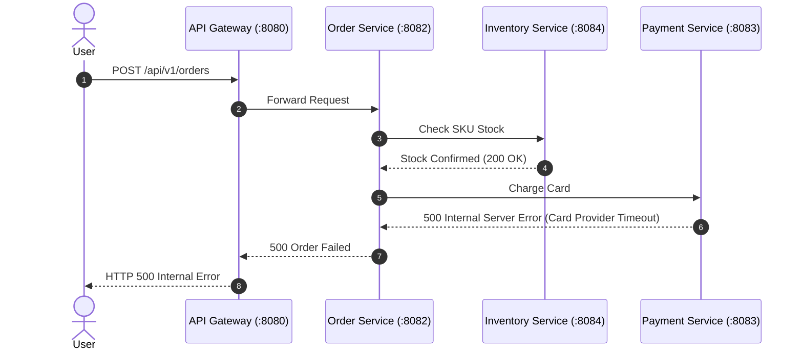
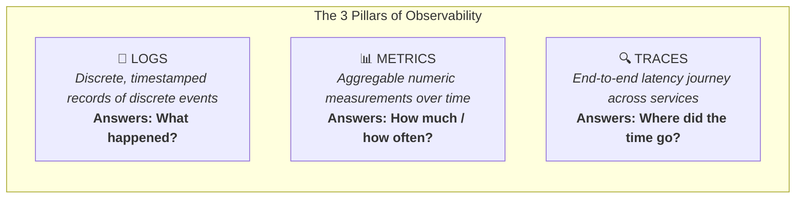
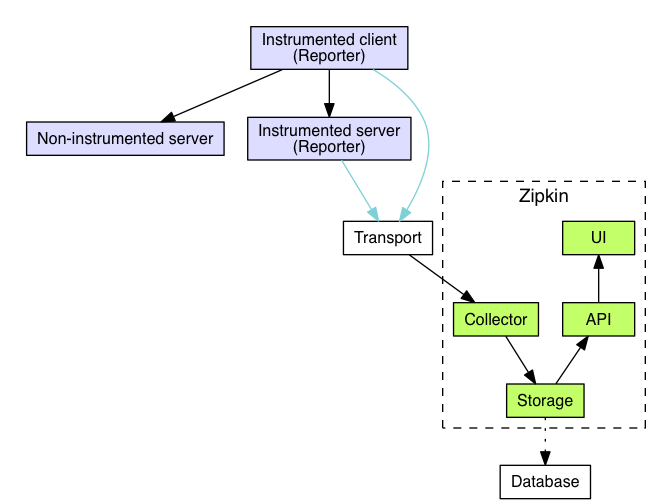

# 🔭 06 — Microservices Observability & Distributed Tracing

> **Covers Full-Stack Diagnostics across Distributed Services**  
> Navigating the 3 Pillars of Observability (**Logs, Metrics, Traces**), mastering Distributed Tracing with **Micrometer Tracing & OpenTelemetry**, `TraceId` vs `SpanId` propagation, Spring Boot Actuator, Prometheus, and Zipkin distributed architecture diagrams.

---

## 📑 Table of Contents
1. [The Microservices Debugging Dilemma](#1-the-microservices-debugging-dilemma)
2. [The 3 Pillars of Observability](#2-the-3-pillars-of-observability)
3. [Distributed Tracing: TraceId vs. SpanId](#3-distributed-tracing-traceid-vs-spanid)
4. [Context Propagation Across Network Boundaries](#4-context-propagation-across-network-boundaries)
5. [Spring Boot 3 Tracing Stack: Micrometer & OpenTelemetry](#5-spring-boot-3-tracing-stack-micrometer--opentelemetry)
6. [Centralized Logging & MDC (Mapped Diagnostic Context)](#6-centralized-logging--mdc-mapped-diagnostic-context)
7. [Application Metrics with Spring Boot Actuator & Prometheus](#7-application-metrics-with-spring-boot-actuator--prometheus)
8. [End-to-End Production Observability Architecture](#8-end-to-end-production-observability-architecture)
9. [Production Logging Best Practices & Security Pitfalls](#9-production-logging-best-practices--security-pitfalls)
10. [Interview Questions & Deep-Dive Answers](#10-interview-questions--deep-dive-answers)
11. [Core Architectural Summary](#11-core-architectural-summary)

---

## 1. The Microservices Debugging Dilemma

In a monolith, diagnosing an error is straightforward: an exception prints a single stack trace detailing the exact line of code across classes.

In a microservice landscape, **a single user action branches across multiple servers and databases**:



### The Production Questions
When the user reports a failure:
- *Which of the 4 services failed?*
- *Why did the request take 6.4 seconds before failing?*
- *How do we isolate the logs of this specific request among millions of log entries generated every second across 50 server nodes?*

**Distributed Observability** provides the answers.

---

## 2. The 3 Pillars of Observability



| Pillar | Data Type | Key Characteristics | Common Tools |
|---|---|---|---|
| **Logs** | Text / JSON lines | High cardinality, high detail, expensive to store indefinitely | Logback, Logstash, Loki, Elasticsearch |
| **Metrics** | Numeric time-series | Low overhead, highly compressible, ideal for real-time alerts | Micrometer, Prometheus, Datadog |
| **Traces** | Directed Acyclic Graph (DAG) | Pinpoints call latency bottlenecks and hop-by-hop failures | Micrometer Tracing, OpenTelemetry, Zipkin, Tempo |

---

## 3. Distributed Tracing: TraceId vs. SpanId

Distributed tracing assigns unique correlation identifiers to requests as they traverse system boundaries.

```mermaid
gantt
    title Distributed Trace Breakdown (Total Latency: 420ms)
    dateFormat X
    axisFormat %s ms

    section Trace ID: a8f9e0b12c4
    API Gateway (Span: gateway-root)        :0, 420
    Order Service (Span: order-create)     :20, 390
    Inventory Service (Span: stock-check)  :50, 110
    Payment Service (Span: payment-charge) :170, 380
```

### TraceId vs. SpanId Defined
- **`TraceId`**: A single globally unique identifier generated at the **API Gateway** when the user request first enters the cluster. **The `TraceId` remains unchanged across all services** throughout the entire lifecycle of the request.
- **`SpanId`**: Represents a single unit of contiguous work within a specific microservice. Each HTTP call, database query, or message publish generates a new `SpanId`.
- **`ParentSpanId`**: References the preceding span, allowing visualization tools (Zipkin, Jaeger) to reconstruct the hierarchical tree.

---

## 4. Context Propagation Across Network Boundaries

How does `Order Service` pass its `TraceId` to `Payment Service`?  
Through **HTTP Headers (W3C Trace Context Specification)**:

```text
HTTP Request Headers Sent from Order Service:
traceparent: 00-4bf92f3577b34da6a3ce929d0e0e4736-00f067aa0ba902b7-01
│            │  │                                │                │
Version      │  Trace ID (32 hex characters)     Span ID (16 hex) Trace Flags (Sampled)
```

Legacy systems also use B3 Propagation headers:
- `X-B3-TraceId: 4bf92f3577b34da6a3ce929d0e0e4736`
- `X-B3-SpanId: 00f067aa0ba902b7`
- `X-B3-Sampled: 1`

Spring Cloud OpenFeign and `RestClient` automatically inject these headers if tracing libraries are present on the classpath.

---

## 5. Spring Boot 3 Tracing Stack: Micrometer & OpenTelemetry

> [!NOTE]
> In Spring Boot 2.x, distributed tracing was handled by **Spring Cloud Sleuth**. In **Spring Boot 3.x**, Sleuth was discontinued and replaced by **Micrometer Tracing**.

### Maven Dependencies for Distributed Tracing
```xml
<!-- Core Micrometer Tracing API -->
<dependency>
    <groupId>io.micrometer</groupId>
    <artifactId>micrometer-tracing-bridge-otel</artifactId>
</dependency>

<!-- OpenTelemetry Exporter to Zipkin / Jaeger -->
<dependency>
    <groupId>io.opentelemetry</groupId>
    <artifactId>opentelemetry-exporter-zipkin</artifactId>
</dependency>
```

### Configuration (`application.yml`)
```yaml
management:
  tracing:
    sampling:
      probability: 1.0   # Sample 100% of requests in Dev/Staging (use 0.1 in Prod)
  zipkin:
    tracing:
      endpoint: http://localhost:9411/api/v2/spans
```

---

## 6. Centralized Logging & MDC (Mapped Diagnostic Context)

By configuring your logging pattern, SLF4J and Logback automatically extract the active `traceId` and `spanId` from MDC and inject them into every log statement:

### Logback Configuration (`application.yml`)
```yaml
logging:
  pattern:
    level: "%5p [${spring.application.name:},%X{traceId:-},%X{spanId:-}]"
```

### Log Output in Console / Central Log Aggregator
```text
2026-09-05 18:30:12.105  INFO [order-service,a8f9e0b12c4,51f89bc4] : Inbound create order request for user=1042
2026-09-05 18:30:12.150  INFO [order-service,a8f9e0b12c4,51f89bc4] : Contacting inventory service for sku=SKU-99
2026-09-05 18:30:12.280 ERROR [payment-service,a8f9e0b12c4,98e72ba1] : Payment gateway socket timeout on orderId=402
```

### The Power of Correlation
If an incident occurs, an engineer searches Kibana or Grafana Loki:
```text
traceId = "a8f9e0b12c4"
```
Instantly, the search returns every log line emitted across Gateway, Order Service, and Payment Service in chronological order!

---

## 7. Application Metrics with Spring Boot Actuator & Prometheus

While logs and traces diagnose individual requests, **Metrics** provide the high-level health of your system.

### Maven Setup
```xml
<dependency>
    <groupId>org.springframework.boot</groupId>
    <artifactId>spring-boot-starter-actuator</artifactId>
</dependency>
<dependency>
    <groupId>io.micrometer</groupId>
    <artifactId>micrometer-registry-prometheus</artifactId>
</dependency>
```

### Actuator Configuration (`application.yml`)
```yaml
management:
  endpoints:
    web:
      exposure:
        include: health,info,prometheus,metrics
  endpoint:
    health:
      show-details: always
```

### Critical Golden Signals to Monitor
1. **Latency**: `http_server_requests_seconds_duration` (P50, P95, P99 response times).
2. **Traffic**: `http_server_requests_seconds_count` (Requests per second).
3. **Errors**: HTTP 5xx response error rate.
4. **Saturation**: JVM heap utilization, active Tomcat worker threads, and DB connection pool utilization (HikariCP).

---

## 8. End-to-End Production Observability Architecture



```mermaid
flowchart TD
    subgraph Services ["Spring Boot Microservice Cluster"]
        S1[Order Service]
        S2[Payment Service]
    end

    subgraph CollectionPipeline ["Telemetry Pipeline"]
        Actuator[Actuator Prometheus Endpoint]
        MDC[Logback MDC Appender]
        OtelBridge[Micrometer OTel Tracer]
    end

    subgraph StorageEngine ["Observability Backends"]
        Prom[(Prometheus TSDB)]
        Loki[(Grafana Loki / Elasticsearch)]
        Zipkin[(Zipkin / Jaeger / Tempo)]
    end

    subgraph UI ["Single Pane of Glass"]
        Grafana[Grafana Dashboards & Alerts]
    end

    S1 --> Actuator & MDC & OtelBridge
    S2 --> Actuator & MDC & OtelBridge

    Actuator -->|Scrape /actuator/prometheus| Prom
    MDC -->|Ship JSON Logs (Promtail/Fluentbit)| Loki
    OtelBridge -->|Export Spans (HTTP/gRPC)| Zipkin

    Prom --> Grafana
    Loki --> Grafana
    Zipkin --> Grafana
```

---

## 9. Production Logging Best Practices & Security Pitfalls

### Good vs. Bad Log Practices
```java
// ❌ BAD: No context, no parameters
log.error("Payment failed");

// ❌ DANGEROUS: Leaking PII / Sensitive Security Tokens
log.info("Processing order for user {} with credit card {} and token {}", 
         userId, rawCreditCardNumber, bearerJwtToken);

// ✅ GOOD: Parameterized, informative, safe
log.warn("Payment authorization declined for orderId={} customerId={} reason={}",
         orderId, customerId, declineReason);
```

> [!CAUTION]
> **Data Privacy & Compliance (GDPR, PCI-DSS, HIPAA):**  
> Never log unmasked Passwords, Credit Card Numbers (PAN), CVVs, Personal Identification Numbers, or Bearer Tokens in application logs. Use Logback masking converters or regex sanitizers.

---

## 10. Interview Questions & Deep-Dive Answers

### Q1: What is the difference between Spring Cloud Sleuth and Micrometer Tracing?
> **Answer**:  
> In Spring Boot 2.x, distributed tracing was implemented by Spring Cloud Sleuth. In Spring Boot 3.x, Sleuth was retired. The Spring team extracted tracing into **Micrometer Tracing**, providing a vendor-neutral facade that can bridge to either OpenTelemetry (OTel) or Brave, exporting trace spans to Zipkin, Jaeger, or Grafana Tempo.

### Q2: Why is Sampling Probability used in distributed tracing?
> **Answer**:  
> In a system handling 50,000 requests per second, tracing 100% of calls generates massive network bandwidth and terabytes of trace storage costs. By configuring a sampling rate (e.g., `management.tracing.sampling.probability: 0.05`), the framework traces a random 5% sample of requests. This preserves accurate latency distributions while reducing storage costs by 95%.

### Q3: What is the role of MDC in distributed logging?
> **Answer**:  
> MDC (**Mapped Diagnostic Context**) is a thread-local map provided by SLF4J/Logback. When a request arrives, the tracing library stores the `traceId` and `spanId` into MDC. Every time `log.info()` or `log.error()` is called on that thread, Logback automatically formats those IDs into the log string without the developer having to pass them manually.

---

## 11. Core Architectural Summary

```text
┌─────────────────────────────────────────────────────────────────────────┐
│                    OBSERVABILITY ARCHITECTURAL RULES                    │
├─────────────────────────────────────────────────────────────────────────┤
│ 1. Logs tell you What happened; Metrics tell you When to alert;         │
│    Traces tell you Where latency and failure occurred                   │
│ 2. Always propagate W3C 'traceparent' headers across HTTP/Kafka calls   │
│ 3. Inject TraceId and SpanId into every log line via SLF4J MDC          │
│ 4. Track the 4 Golden Signals: Latency, Traffic, Errors, Saturation     │
│ 5. NEVER log sensitive credentials, PAN data, or plain tokens           │
└─────────────────────────────────────────────────────────────────────────┘
```
