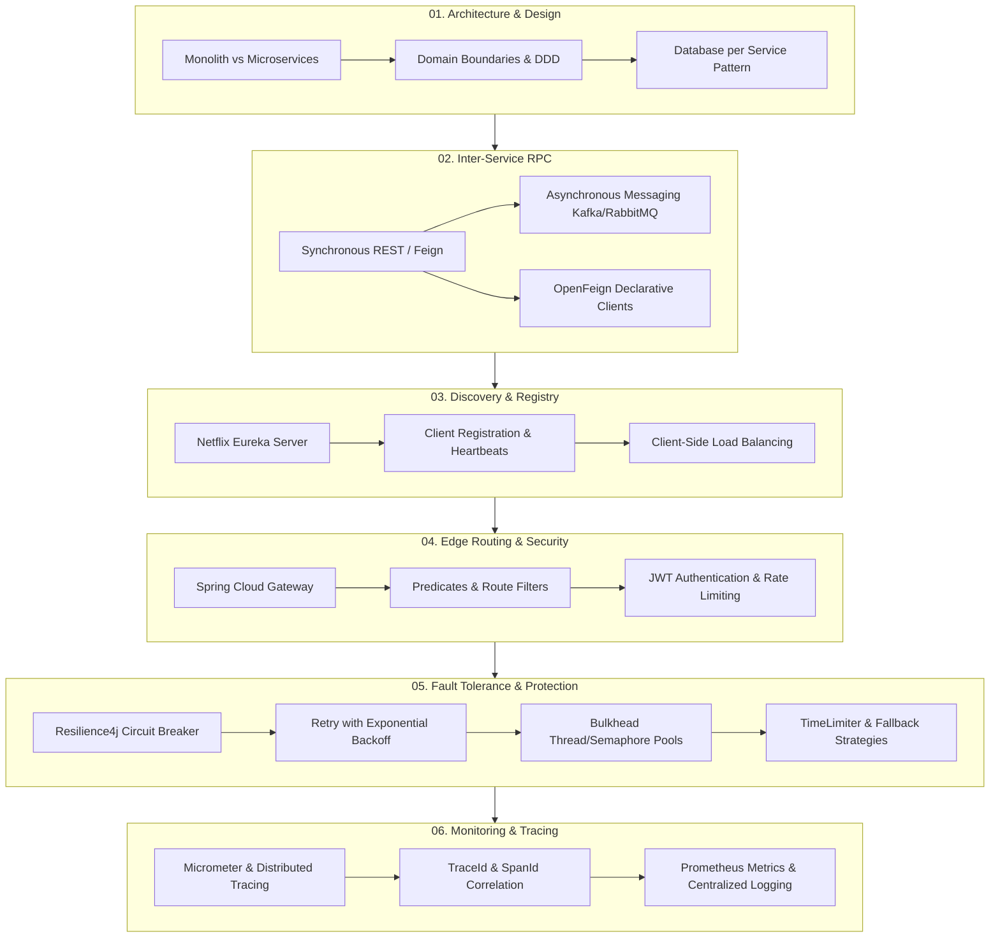

# 🚀 Spring Boot Microservices Notes

> **Comprehensive, Interview-Ready Reference Guide**  
> A practical and architectural master note set covering the complete end-to-end lifecycle of Microservices in the **Java & Spring Boot** ecosystem (Spring Cloud, Eureka, Gateway, Feign, Resilience4j, and Distributed Observability).

---

## 📑 Complete Course & Module Roadmap

---

## 📚 Module Directory

| # | Topic Document | Core Architectural Concepts Covered |
|:---:|:---|:---|
| **01** | [**Microservices Fundamentals**](01-fundamentals.md) | Monolithic pitfalls, Microservices trade-offs, Database-per-service, Service boundaries, Sync vs Async communication |
| **02** | [**Service-to-Service Communication**](02-service-communication.md) | `RestTemplate` vs `RestClient` vs `OpenFeign`, Declarative RPC, Request Interceptors, Error Decoders, Timeouts |
| **03** | [**Service Discovery with Eureka**](03-service-discovery.md) | Client vs Server Discovery, Netflix Eureka Server/Client setup, Heartbeats, Eviction timers, Self-preservation mode, Client-side load balancing |
| **04** | [**Spring Cloud API Gateway**](04-api-gateway.md) | Gateway pattern, Predicates, Route filters (Pre & Post), Dynamic Eureka service routing, Global exception handling, Avoiding business logic in Gateway |
| **05** | [**Resilience & Fault Tolerance**](05-resilience-fault-tolerance.md) | Cascading failure prevention, Resilience4j, Circuit Breaker 3 states (`CLOSED`, `OPEN`, `HALF_OPEN`), Retry + Backoff, Bulkhead isolation, TimeLimiter, Fallbacks |
| **06** | [**Distributed Observability**](06-observability.md) | The 3 Pillars (Logs, Metrics, Traces), `TraceId` & `SpanId` propagation, Spring Boot Actuator, Micrometer, Prometheus, Grafana, OpenTelemetry |

---

## 🛠️ Production Technology Stack

| Layer | Primary Framework / Tool | Alternatives / Secondary Tools |
|---|---|---|
| **Language & Core Framework** | Java 17/21+, Spring Boot 3.x | Kotlin |
| **Declarative HTTP Client** | Spring Cloud OpenFeign | Spring 6 `RestClient`, `WebClient` |
| **Service Discovery & Registry** | Netflix Eureka | HashiCorp Consul, Kubernetes DNS |
| **API Gateway** | Spring Cloud Gateway (Reactive / WebFlux based) | Kong, Envoy, Traefik |
| **Fault Tolerance & Resilience** | Resilience4j | Sentinel, Istio Service Mesh |
| **Asynchronous Event Broker** | Apache Kafka | RabbitMQ, AWS SQS/SNS |
| **Distributed Tracing** | Micrometer Tracing + OpenTelemetry | Zipkin, Jaeger, Grafana Tempo |
| **Metrics & Monitoring** | Spring Boot Actuator + Prometheus | Micrometer Core, Datadog |
| **Dashboards & Visualization** | Grafana | Kibana |

---

## 🎯 Master Interview Quick-Reference Checklist

> [!TIP]
> Before entering an interview for a Backend / Java / Microservices engineering role, ensure you can confidently answer and diagram each of the following:

- [ ] **Monolith vs. Microservices**: Explain decoupling, deployment velocity, and independent scale versus distributed data consistency, latency, and operational overhead.
- [ ] **Database per Service**: Why sharing databases defeats microservice autonomy; how to handle cross-service queries (CQRS, API Composition) and distributed transactions (Saga Pattern).
- [ ] **RestClient vs. OpenFeign**: How declarative proxying works in Feign vs fluent synchronous calls in Spring 6 `RestClient`.
- [ ] **Service Discovery Flow**: Step-by-step lifecycle of instance registration, heartbeat renewals, threshold eviction, self-preservation mode, and client-side load balancing (Spring Cloud LoadBalancer).
- [ ] **API Gateway Architecture**: Difference between Edge routing and Service routing; writing custom Pre/Post filters, JWT validation at the edge, and dynamic discovery routing via `lb://service-name`.
- [ ] **Circuit Breaker State Machine**: Detailed mechanics of `CLOSED` → `OPEN` (failure rate threshold) → `HALF_OPEN` (evaluation window) → `CLOSED`/`OPEN`.
- [ ] **Retry vs. Circuit Breaker**: Why naive retries cause "retry storms" and amplify outages, and why backoff with jitter is mandatory.
- [ ] **Bulkhead Pattern**: Thread-pool vs Semaphore bulkhead isolation to prevent thread starvation across heterogeneous workloads.
- [ ] **Distributed Tracing**: Difference between `TraceId` (unique end-to-end user request ID) and `SpanId` (single hop/work unit ID), and HTTP header propagation (`traceparent`, `b3`).
